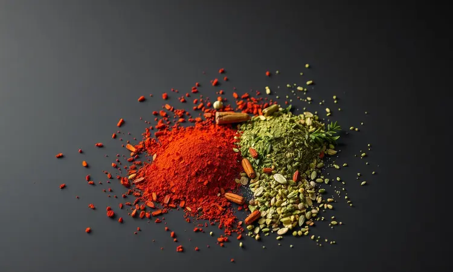

Você já experimentou aquela frustração de abrir a air fryer e encontrar uma carne moída seca, com aspecto de papelão? Aquela que deveria ser suculenta e soltinha para encher seus tacos ou coberturas?

Muitas pessoas acreditam que a fritadeira sem óleo serve apenas para petiscos congelados, mas a verdade é que ela pode ser sua maior aliada no preparo de proteínas rápidas e saudáveis.

Neste guia, você vai descobrir como transformar carne moída em uma experiência culinária que derrete na boca, desde a versão soltinha perfeita para recheios até bolinhos que conquistam até os paladares mais exigentes.

Vou te mostrar não apenas o passo a passo, mas os segredos que transformam preocupação em confiança na cozinha.

<SummaryList products={frontmatter.top_products} />

## Por que fazer Carne Moída na Air Fryer? (Vantagens e Praticidade)

Imagine terminar um dia cansativo e em 15 minutos ter uma carne moída perfeita pronta para o jantar, sem precisar ficar vigiando a panela, sem respingos pela cozinha e com aquele sabor que parece ter levado horas para desenvolver.

É exatamente isso que a air fryer oferece. O cozimento por convecção garante que cada pedacinho de carne receba calor de forma uniforme, criando uma textura que é ao mesmo tempo crocante por fora e incrivelmente suculenta por dentro. E o melhor?

Você usa quase nenhum óleo, transformando aquela refeição que parecia pesada em algo leve e saudável, sem abrir mão do sabor.

### Melhores Modelos de Air Fryer para Cozinhar Carnes

<ProductBox 
  title={frontmatter.top_products[0].title} 
  image={frontmatter.top_products[0].image} 
  link={frontmatter.top_products[0].link} 
/>

A escolha do modelo certo faz toda a diferença entre um resultado mediano e aquele que faz todos na mesa perguntarem 'como você fez isso?'.

Se você cozinha para uma família grande ou adora preparar refeições que rendem para vários dias, modelos como a Philco Air Fryer Oven 12L ou a Oster Forno e Fryer 15L são investimentos que valem cada centavo.

Eles não apenas oferecem espaço generoso, mas vêm com funções como grill e Rotisserie que simulam a textura perfeita de um churrasco.

Para quem busca praticidade no dia a dia sem ocupar metade do balcão, a WAP Air Fryer Barbecue Digital 10L é uma escolha inteligente. Sua potência e espeto rotativo garantem que até frangos inteiros fiquem dourados por igual.

E se você é do tipo que valoriza design tanto quanto funcionalidade, o Oster OFRT780 12L une eficiência com um visual que complementa qualquer cozinha moderna.

O segredo está em escolher com base no seu ritmo de vida: espaço versus praticidade, volume versus versatilidade.

## Utensílios que Facilitam a Vida: Como evitar a sujeira

<ProductBox 
  title={frontmatter.top_products[1].title} 
  image={frontmatter.top_products[1].image} 
  link={frontmatter.top_products[1].link} 
/>

Vamos combinar: ninguém gosta de passar mais tempo limpando do que cozinhando. A boa notícia é que com os utensílios certos, você pode reduzir essa tarefa a quase zero. Comece com uma cesta forrada com papel manteiga próprio para air fryer.

Essa simples folha impede que a carne grude e transforma a limpeza em apenas jogar o papel fora.

Para mexer a carne durante o cozimento sem abrir a tampa toda hora (o que faz perder temperatura), uma pinça de silicone longa é sua melhor amiga. Ela te permite dar aquela mexida necessária sem queimar os dedos ou interromper o processo.

E se você quer elevar ainda mais o nível, invista em formas de silicone específicas para air fryer. Elas são perfeitas para os bolinhos de carne, garantindo que mantenham o formato e não grudem, além de serem lavadas com uma passada de esponja.

## Como fazer Carne Moída Soltinha na Air Fryer (Para Recheios e Tacos)

Chegou a hora da mágica acontecer. Pense naquela carne que se desfaz perfeitamente no garfo, pronta para encher suas tortilhas ou cobrir uma macarronada. O segredo está em três palavras: temperatura, tempo e técnica.

Comece temperando sua carne moída não apenas com sal e pimenta, mas com uma pitada de personalidade. Páprica defumada para um toque barbecue, cominho para aquele sabor mexicano autêntico, orégano para uma versão mais italiana.

O importante é que os temperos sejam incorporados antes de ir para a air fryer.

Agora, o movimento que define tudo: espalhe a carne na cesta em uma camada uniforme, quase como se estivesse preparando um tapete de sabor. Não faça montinhos ou aglomerados. Programe 200°C por 10 minutos.

Na marca dos 5 minutos, abra rapidamente e use sua pinça para dar uma boa mexida, separando os pedaços que possam ter grudado. Esse intervalo é crucial, porque permite que o calor alcance todos os cantos igualmente.

Nos últimos 5 minutos, acontece a transformação: a carne ganha aquelas pontinhas levemente crocantes enquanto mantém toda a suculência por dentro.

Quando o timer tocar, você terá diante de si uma carne moída que é pura versatilidade, pronta para se transformar no que sua criatividade mandar.

## Receita de Bolinho de Carne Moída Suculento na Air Fryer

Se a carne soltinha é a trabalhadora versátil da cozinha, os bolinhos são os artistas que roubam a cena. Eles têm esse poder de transformar uma refeição simples em um momento especial.

A receita começa com uma mistura que equilibra textura e sabor: 500g de carne moída, 1/4 de xícara de farinha de rosca (que age como um abraço, segurando a umidade), 1 ovo (o agente ligante perfeito), cebola picadinha, dois dentes de alho amassados e seus temperos preferidos.

Aqui vai um segredo que faz toda diferença: deixe a mistura descansar por 10 minutos antes de modelar. Esse tempo permite que a farinha de rosca absorva os líquidos, criando uma textura mais homogênea.

Ao modelar, faça bolinhas do tamanho de uma noz e achate levemente com a palma da mão. Não aperte demais, você quer manter uma textura areadinha por dentro.

Na air fryer pré-aquecida a 180°C, distribua os bolinhos com espaço entre eles. 12 a 15 minutos são suficientes para que fiquem dourados por fora enquanto permanecem suculentos por dentro. Vire na metade do tempo para garantir um dourado uniforme.

O resultado são bolinhos com casca crocante que dá aquele contraste perfeito com o interior macio e saboroso.

### Use um Termômetro Culinário para nunca errar o ponto

<ProductBox 
  title={frontmatter.top_products[2].title} 
  image={frontmatter.top_products[2].image} 
  link={frontmatter.top_products[2].link} 
/>

Você já serviu uma refeição com aquela dúvida silenciosa: será que está bem passada? Com um termômetro culinário, essa incerteza desaparece. Mais do que uma ferramenta, ele é sua garantia de segurança e qualidade. Para carne moída, o número mágico é 71,1°C (160°F).

Ao atingir essa temperatura interna, você sabe que eliminou quaisquer riscos enquanto manteve toda a suculência.

Existem opções para todos os bolsos e necessidades. Os digitais de espeto oferecem leitura instantânea e são incrivelmente precisos. Basta inserir a sonda na parte mais grossa do bolinho ou no centro da carne espalhada, evitando tocar no fundo da cesta.

Em segundos, você tem a confirmação de que está servindo não apenas uma refeição deliciosa, mas também perfeitamente segura. É o tipo de investimento que paga a si mesmo na primeira vez que evita o desperdício de uma carne supercozida ou, pior, mal passada.

## 5 Segredos para a Carne não Ressecar na Fritadeira

1. Escolha inteligente da carne: Opte por uma carne com teor de gordura em torno de 20%. Essa gordura derrete durante o cozimento, banhando a carne por dentro e criando naturalmente a suculência que buscamos.

2. O poder da umidade controlada: Antes de levar à air fryer, adicione uma colher de sopa de caldo de legumes ou mesmo água à carne temperada. Esse líquido extra cria um microambiente de vapor durante os primeiros minutos de cozimento, protegendo a carne da desidratação excessiva.

3. Respeite o espaço pessoal: Não sobrecarregue a cesta. Quando a carne está amontoada, ela cozinha no vapor da própria umidade em vez de dourar no ar circulante. O resultado são pedaços cozidos, mas sem aquela textura interessante.

4. A dança do tempo: Carne moída não precisa de longas horas. Em alta temperatura (200°C), 10 a 15 minutos são mais que suficientes. A cada minuto extra além do ponto ideal, você perde um pouco mais de suculência.

5. O descanso final: Assim como um bom bife, a carne moída se beneficia de 2-3 minutos de descanso depois de pronta. Esse tempo permite que os sucos se redistribuam, garantindo que cada garfada seja igualmente saborosa.

## Melhores Temperos para Carne Moída em Altas Temperaturas

A air fryer trabalha com calor intenso e ar em movimento constante, o que exige temperos que não apenas sobrevivam a essas condições, mas que se transformem nela. Temperos secos são seus melhores aliados.

O cominho desenvolve uma profundidade defumada, a páprica doce ganha um toque caramelizado, e a pimenta-do-reino libera seus óleos essenciais de forma mais completa.

Ervas desidratadas como orégano e tomilho resistem bravamente ao calor, diferentemente de suas versões frescas que podem queimar. E aqui está um segredo de chef: adicione uma pitada de açúcar mascavo aos seus temperos secos.

Não o suficiente para ficar doce, mas apenas para ajudar na caramelização e criar aquelas pontinhas douradas irresistíveis.

Para o sal, a técnica é adicionar por etapas. Metade no início, para penetrar na carne, e a outra metade no final do cozimento, para realçar os sabores sem extrair muita umidade. E nunca subestime o poder do alho em pó e da cebola desidratada.

Eles oferecem um sabor concentrado que permeia toda a carne de forma uniforme, algo que suas versões frescas nem sempre conseguem na air fryer.

## Tempo e Temperatura Ideal: Tabela Prática

Considere esta tabela não como regras rígidas, mas como um ponto de partida para sua criatividade:

- **Carne moída soltinha (para recheios):** 200°C por 10-12 minutos, mexendo na metade do tempo

- **Bolinho de carne (tamanho médio):** 180°C por 12-15 minutos, virando na metade

- **Reaquecimento de carne já cozida:** 180°C por 5-8 minutos com uma colher de caldo

- **Teste de ponto perfeito:** Temperatura interna de 71,1°C (use seu termômetro!)

Lembre-se que cada air fryer tem sua personalidade. A primeira vez é sempre um teste. Anote o que funcionou para você, porque seu aparelho, na sua tomada, na sua cozinha, pode ter pequenas variações que fazem grande diferença no resultado final.

## Como Reaquecer Carne Moída na Air Fryer sem perder o sabor

A verdade sobre sobras é que, quando reaquecidas da maneira certa, podem até superar o original. A air fryer é a ferramenta perfeita para essa ressurreição culinária. O segredo está em recriar as condições que fizeram a carne ficar boa da primeira vez.

Pré-aqueça a 180°C por 3 minutos. Enquanto isso, coloque a carne moída fria em uma tigela e adicione uma colher de sopa de caldo de carne, molho de tomate ou mesmo água. Misture bem.

Esse líquido vai se transformar em vapor durante o reaquecimento, reidratando a carne de dentro para fora.

Espalhe em uma camada uniforme na cesta e cubra levemente com papel alumínio (não aperte). Isso cria uma mini-estufa que impede a evaporação excessiva. Cinco minutos são suficientes para aquecer completamente.

Remova o papel alumínio e deixe por mais 1-2 minutos se quiser recuperar algumas pontinhas crocantes. O resultado é uma carne que parece acabada de fazer, mantendo toda a suculência e sabor.

## Perguntas Frequentes (FAQ)

Posso congelar a carne moída já temperada antes de levar à air fryer? Absolutamente. Prepare lotes maiores, tempere, divida em porções e congele. Quando for usar, descongele na geladeira durante o dia e siga o processo normal.

A air fryer é especialmente boa com ingredientes congelados porque o ar quente circula por todos os lados igualmente.

Minha carne sempre gruda na cesta, mesmo com papel manteiga. O que fazer? Dois truques: primeiro, certifique-se que a carne não está muito úmida antes de colocar (seque com papel toalha se necessário).

Segundo, experimente borrifar levemente a cesta com óleo em spray antes de colocar o papel manteiga. Essa dupla camada de proteção é quase infalível.

Como saber se preciso mexer durante o cozimento sem abrir toda hora? A maioria das air fryers modernas tem janela de visualização.

Se a sua não tem, faça um teste mental: se você colocou a carne em camada uniforme, provavelmente precisará mexer apenas uma vez, na metade do tempo total.

Confie no processo e evite abrir frequentemente, pois cada abertura baixa a temperatura interna significativamente.

Posso fazer carne moída com legumes juntos na mesma leva? Pode, mas com estratégia. Legumes como cebola e pimentão liberam muita água. Se quiser incluí-los, pique bem fino e misture com a carne, mas aumente o tempo em 2-3 minutos para evaporar essa umidade extra.

Melhor ainda: refogue os legumes separadamente por 2 minutos antes de misturar, assim eles já começam o processo de caramelização.

## Conclusão

O que começou como um experimento tímido pode se transformar em uma das habilidades mais gratificantes da sua cozinha. Fazer carne moída na air fryer vai além da praticidade de 15 minutos.

É sobre recuperar o prazer de cozinhar sem o estresse da limpeza, sobre servir refeições mais saudáveis sem abrir mão do sabor, sobre transformar ingredientes simples em memórias à mesa.

Lembre-se dos três pilares que garantem sucesso: temperatura precisa, tempo consciente e técnica adequada. Seu termômetro não é um acessório, é sua confiança embalada em aço inox. Os temperos não são apenas sabores, são a personalidade que você dá a cada refeição.

E a air fryer não é apenas um eletrodoméstico, é seu parceiro na criação de momentos que alimentam mais do que o corpo.

Agora é sua vez. Escolha sua receita favorita deste guia, reúna seus ingredintes e dê o primeiro passo. Não espere pelo fim de semana especial. Transforme esta terça-feira comum em uma pequena celebração culinária.

Sua air fryer está esperando, e sua próxima refeição perfeita está a apenas 200°C e 15 minutos de distância.