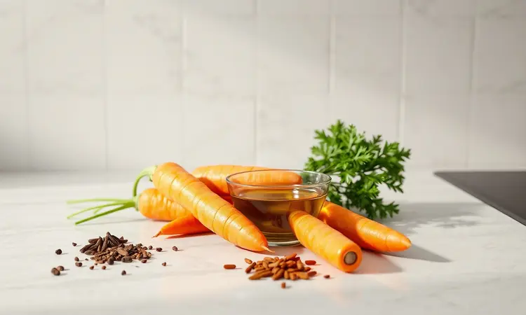
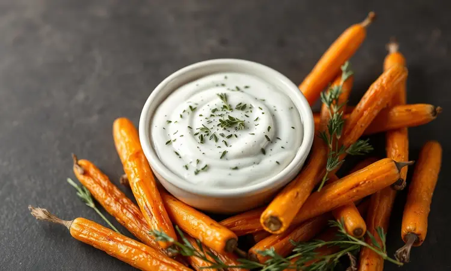
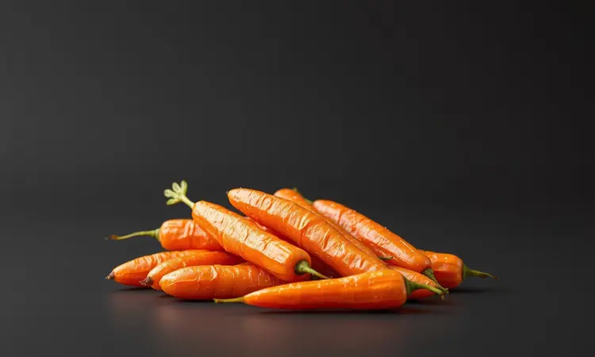

Já tentou preparar cenouras na fritadeira elétrica e elas acabaram saindo murchas ou sem vida? O que parece ser uma tarefa simples esconde uma técnica valiosa para alcançar aquela textura perfeita que todos desejamos: crocante por fora, macia por dentro.

Neste guia, vou transformar sua percepção sobre este humilde legume.

Você descobrirá como a cenoura pode deixar de ser apenas um acompanhamento para se tornar o snack favorito da sua família, com segredos de corte e tempero que elevam qualquer refeição comum ao nível de restaurante, tudo de forma rápida e saudável.

<SummaryList products={frontmatter.top_products} />

## Por que você deve incluir a cenoura na airfryer no seu cardápio?

Imagine transformar um alimento básico em uma experiência que combina nutrição com prazer.

As cenouras preparadas na airfryer mantêm intactos seus benefícios mais preciosos, como o beta-caroteno essencial para saúde ocular e imunidade, enquanto ganham uma caramela dourada que realça seu sabor naturalmente adocicado.

O método sem óleo conserva o que há de melhor nelas e oferece crocância irresistível em tempo recorde, muito mais rápido que assar no forno tradicional. É a combinação perfeita para quem busca praticidade sem abrir mão do sabor ou do cuidado com a saúde.

## Tipos de cortes: Palitos, rodelas ou rústica?

<ProductBox 
  title={frontmatter.top_products[0].title} 
  image={frontmatter.top_products[0].image} 
  link={frontmatter.top_products[0].link} 
/>

Cada corte de cenoura conta uma história diferente em sua airfryer. Os palitos são os parceiros ideais para quem busca equilíbrio: crocantes o suficiente para satisfazer aquela necessidade de textura, mas macios por dentro para uma experiência completa.

Para momentos em que você deseja algo que lembre chips saudáveis, as lascas finas douram de maneira uniforme, criando petiscos irresistíveis que desaparecem em instantes.

Já as rodelas oferecem praticidade quando o tempo é curto, cozinham rápido e funcionam bem em saladas ou como base para outras criações.

A versão rústica, com pedaços mais robustos, demanda um pouco mais de paciência, mas recompensa com presença visual marcante e textura diferenciada.

Independentemente da sua escolha, lembre-se: uniformidade é a chave para garantir que todas as peças fiquem perfeitas ao mesmo tempo.

## Ingredientes básicos para a cenoura perfeita

Tudo começa com cenouras frescas, quanto mais vibrantes melhor. O azeite de oliva não é apenas um meio de cozimento: é o que ajuda a criar aquela casquinha dourada que seus dedos não conseguem resistir.

Sal e pimenta do reino formam a base, mas o verdadeiro potencial está nas especiarias que você escolher. Páprica defumada para um toque sutil de churrasco, cominho para profundidade terrosa, ou alecrim fresco para frescor mediterrâneo.

Estes elementos simples, quando combinados com técnica, transformam o comum em extraordinário.

## Como fazer cenoura na airfryer: Passo a passo detalhado

<ProductBox 
  title={frontmatter.top_products[1].title} 
  image={frontmatter.top_products[1].image} 
  link={frontmatter.top_products[1].link} 
/>

A técnica certa faz toda diferença entre cenouras aceitáveis e memoráveis. Comece pré-aquecendo sua airfryer a 200°C por cinco minutos.

Enquanto isso, corte suas cenouras limpas e descascadas em sua forma preferida, garantindo tamanhos consistentes para cozimento uniforme.

Na tigela, misture as cenouras com azeite suficiente para cobrir levemente cada pedaço. Esta é sua tela em branco: adicione sal, pimenta e seus temperos favoritos, garantindo que cada pedaço receba atenção igual.

Espalhe as cenouras em camada única na cesta da airfryer, sem sobrepor, para permitir que o ar circule livremente.

Asse a 180°C por 15 a 20 minutos, mas não confie apenas no timer. Na metade do tempo, abra a airfryer e mexa suavemente as cenouras. Este simples gesto garante que cada lado receba igual atenção do ar quente, resultando naquele dourado perfeito em toda superfície.

Para pedaços mais grossos, adicione alguns minutos extras até alcançar a maciez desejada.

### 1. Higienização e preparo do legume

A qualidade começa antes mesmo do cozimento. Lave bem suas cenouras sob água corrente, esfregando suavemente para remover qualquer resíduo de terra.

A decisão de descascar fica a seu critério: a casca contém nutrientes valiosos, mas se preferir maior uniformidade textural, remova-a. O corte uniforme que você faz agora é o que determina se todas as peças ficarão prontas simultaneamente.

### 2. A técnica da secagem (O segredo da crocância)

Aqui está o conhecimento que separa amadores de especialistas. Após lavar e cortar suas cenouras, espalhe-as sobre papel toalha e deixe descansar por alguns minutos. Esta pausa permite que a umidade superficial evapore naturalmente.

Você pode acelerar o processo pressionando levemente com outra folha de papel toalha. Cenouras mais secas significam menos vapor durante o cozimento, e menos vapor significa mais crocância. É um tempo bem investido que transforma completamente seu resultado final.

### 3. Marinada rápida e temperos sugeridos

Pense na marinada como um abraço de sabor antes do calor. Em uma tigela, combine azeite de oliva, suco de limão para brilho, alho picado para profundidade e uma pitada generosa de sal.

Adicione suas cenouras preparadas e massageie suavemente para garantir cobertura completa. Quinze a trinta minutos são suficientes para que os sabores penetrem sem comprometer a textura.

Para variações, experimente cominho em pó e páprica doce para notas terrosas, ou orégano fresco para frescor italiano. Cada tempero conversa diferentemente com a doçura natural da cenoura, criando combinações únicas que refletem seu pal pessoal.

### 4. Tempo e temperatura ideal para cada corte

Domine a arte do timing. Para palitos clássicos: 200°C por 15 a 20 minutos entregam crocância perfeita. Rodelas mais finas pedem 180°C por 12 a 15 minutos para evitar queimaduras nas bordas.

Cenouras baby, inteiras ou cortadas ao meio, ficam perfeitas a 200°C por 10 a 12 minutos, mantendo seu charme compacto. Lembre-se que cada airfryer tem sua personalidade: comece com estes tempos como referência e ajuste conforme observa como sua máquina trabalha.

## 3 Variações de sabores para experimentar hoje

Agora que você domina a técnica básica, é hora de explorar territórios mais saborosos. Estas três variações transformam a simples cenoura em convites para diferentes momentos do dia.

### Cenoura com Parmesão e Páscoa Defumada

Para quando você busca sofisticação simples. Após temperar suas cenouras com azeite, sal e pimenta, polvilhe generosamente queijo parmesão ralado e páprica defumada.

O parmesão forma uma crosta dourada e salgada que contrasta perfeitamente com a doçura do legume, enquanto a páprica adiciona uma profundidade defumada que lembra churrasco. O resultado é um snack que parece ter vindo direto de uma trattoria italiana.

### Cenoura Agridoce com Mel e Alecrim

Equilíbrio em forma de petisco. Misture mel líquido e alecrim fresco picado, depois envolva suas cenouras nesta combinação antes de levar à airfryer.

O mel carameliza delicadamente durante o cozimento, criando uma cobertura brilhante e levemente crocante, enquanto o alecrim libera seus óleos essenciais, perfumando cada mordida.

Esta versão funciona maravilhosamente como acompanhamento especial ou até como pequena sobremesa saudável.

### Cenoura Ervas Finas e Alho em Pó

O clássico reinventado. Combine suas ervas finas favoritas (salsinha, cebolinha, manjericão) com alho em pó e azeite para criar uma cobertura vibrante que transforma simples cenouras em um banquete de frescor.

As ervas mantêm sua vitalidade mesmo após o cozimento, oferecendo notas verdes que limpam o paladar, enquanto o alho em pó fornece aquele fundo reconfortante que todos amamos. Perfeito para quando você quer algo familiar, mas com um toque especial.

## Dicas de conservação e como reaquecer sem perder o ponto

<ProductBox 
  title={frontmatter.top_products[2].title} 
  image={frontmatter.top_products[2].image} 
  link={frontmatter.top_products[2].link} 
/>

Se por milagre sobrar alguma cenoura (o que raramente acontece), guarde-as em recipiente hermético na geladeira por até três dias.

Para planejamento mais avançado, congele em porções individuais que podem durar até três meses no freezer, sempre prontas para resgatar quando a vontade bater.

Na hora de reaquecer, sua airfryer é sua melhor aliada. Pré-aqueça a 180°C por dois minutos, depois coloque as cenouras por mais dois a três minutos até recuperarem a temperatura e crocância.

Evite o micro-ondas: ele tende a tornar as cenouras borrachudas, roubando a textura que você trabalhou tanto para alcançar. Se realmente necessário, use-o com uma colher de água para criar vapor e evitar o ressecamento completo.

## Melhores molhos para acompanhar sua cenoura crocante

A cenoura perfeita merece companhias à altura. Hummus clássico oferece cremosidade que complementa a doçura natural. Iogurte grego com ervas frescas traz frescor e leveza que equilibram a crocância.

Para um contraste interessante, experimente mostarda Dijon misturada com um fio de mel: o picante e o doce criam uma dança no paladar. Guacamole caseiro oferece riqueza cremosa que parece feita sob medida para as cenouras.

Cada molho conta uma história diferente, permitindo que você personalize cada experiência.

## Perguntas Frequentes (FAQ)

### Preciso cozinhar a cenoura antes de colocar na airfryer?

Absolutamente não. A beleza deste método está justamente em sua simplicidade. A airfryer é perfeitamente capaz de transformar cenouras cruas em snacks crocantes em uma única etapa.

Pré-cozinhar não apenas adiciona tempo desnecessário ao processo, mas também pode remover nutrientes e alterar a textura final que buscamos.

### Por que minha cenoura ficou murcha?

Dois culpados principais: excesso de umidade e corte irregular. Se suas cenouras não estiverem suficientemente secas antes de entrarem na airfryer, a água superficial criará vapor que as cozinha em vez de assar.

Corte inconsistente significa que pedaços menores ficam prontos (e começam a murchar) enquanto os maiores ainda cozinham. A solução está na secagem completa e atenção à uniformidade dos cortes.

### Posso fazer cenoura baby na airfryer?

Com certeza. As cenouras baby são candidatas perfeitas para a airfryer. Lave bem, tempere levemente e coloque inteiras ou cortadas ao meio, dependendo do tamanho.

Cozinhe a 200°C por 10 a 12 minutos para manter sua forma adorável enquanto desenvolvem crocância externa e maciez interna. São ideais como acompanhamento elegante ou snack individual rápido.

## Conclusão

O que começou como um simples legume transforma-se, através da técnica certa, em um universo de possibilidades gastronômicas.

As cenouras na airfryer representam mais que um método de cozimento: elas simbolizam como atenção aos detalhes pode elevar o comum ao extraordinário.

Você descobriu não apenas temperaturas e tempos, mas um caminho para criar snacks que nutrem tanto o corpo quanto o paladar, tornando o saudável irresistível e o simples sofisticado.

Agora que você possui todo o conhecimento, desde cortes básicos até combinações de sabores avançadas, está pronto para transformar sua próxima porção de cenouras em uma experiência memorável.

Lembre-se: a maior ferramenta na sua cozinha não é a airfryer, mas sua curiosidade para experimentar e ajustar conforme seu gosto pessoal. Qual variação você tentará primeiro?