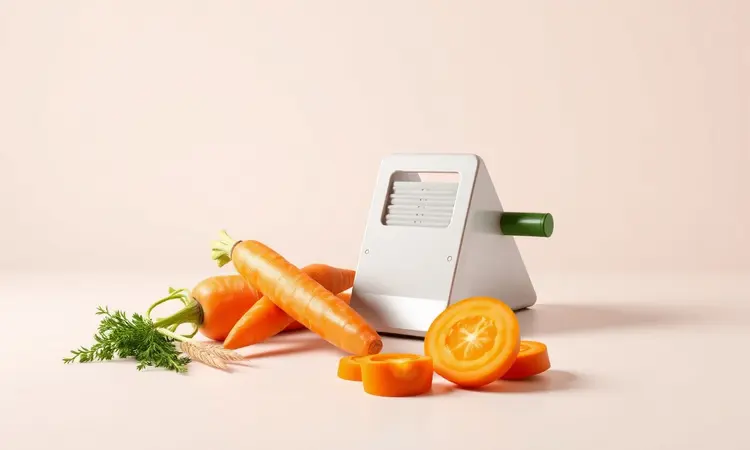
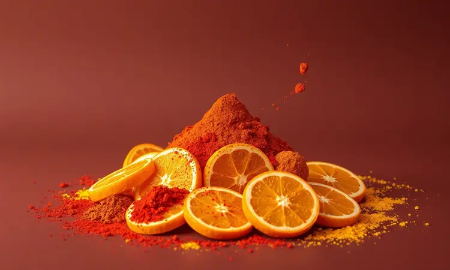
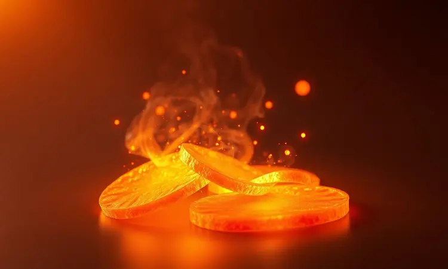

Você já sentiu aquela vontade de comer algo crocante no meio da tarde, mas bateu aquela culpa ao pensar nos salgadinhos industrializados? Imagine trocar essa sensação pela satisfação de criar um snack que nutre seu corpo e sacia seu paladar com doçura natural.

Fazer chips de cenoura em casa é como dominar um truque de mágica na cozinha: transforma um legume simples em petiscos irresistíveis que despertam admiração.

Vou te mostrar como acertar cada passo, desde a escolha da cenoura até o armazenamento que mantém o 'croc' por dias. Ao final, você não terá apenas uma receita, mas uma habilidade que transforma seus lanches em pequenas celebrações saudáveis.

<SummaryList products={frontmatter.top_products} />

## Por que o Chips de Cenoura é o Snack Saudável Perfeito?

Imagine um snack que entrega satisfação crocante enquanto nutre seu corpo. As cenouras trazem essa vitamina A que seus olhos agradecem depois de horas na tela, e as fibras garantem aquela digestão tranquila que evita o desconforto pós-lanche.

O segredo está na doçura natural que surge durante o cozimento, criando um sabor que dispensa açúcares adicionados.

Quando você escolhe prepará-los em casa, está tomando uma decisão consciente: foge do sódio exagerado dos industrializados e assume controle total sobre o que entra no seu corpo. São esses detalhes que transformam um simples lanche em um ato de autocuidado.

## Ingredientes e Utensílios Básicos para Começar

A simplicidade é a beleza dessa receita. Cenouras frescas, azeite de oliva para aquela crocância dourada, sal para realçar o sabor natural e seus temperos favoritos para personalizar a experiência.

Quanto aos utensílios, sua faca mais afiada será sua melhor amiga, ou ainda melhor...

### O Segredo do Corte: Usando uma Mandolina para Fatias Uniformes

<ProductBox 
  title={frontmatter.top_products[0].title} 
  image={frontmatter.top_products[0].image} 
  link={frontmatter.top_products[0].link} 
/>

Esse é o pulo do gato profissional que poucos mencionam. Uma mandolina transforma seu trabalho manual em precisão cirúrgica, garantindo que cada fatia tenha exatamente a mesma espessura. Por que isso importa tanto?

Porque fatias uniformes assam perfeitamente sincronizadas.

Enquanto uma fatia mais grossa ainda está úmida por dentro, outra mais fina já estaria queimando. Com a mandolina, você elimina essa loteria e garante que cada chip atinja o ponto ideal simultaneamente.

Sim, existe uma curva de aprendizado (as lâminas são afiadas e exigem respeito), mas quando você dominar a técnica, verá seus chips ganharem uma apresentação de restaurante que impressiona até os mais exigentes.

## Como Fazer Chips de Cenoura na Airfryer: Passo a Passo Crocante

<ProductBox 
  title={frontmatter.top_products[1].title} 
  image={frontmatter.top_products[1].image} 
  link={frontmatter.top_products[1].link} 
/>

A airfryer é sua aliada para uma crocância mais suave e aerada. Comece com duas cenouras grandes, descascadas e fatiadas com sua técnica preferida (a mandolina fará a diferença aqui).

O próximo passo é crucial: seque cada fatia com papel toalha como se estivesse preparando uma obra de arte. Qualquer umidade residual rouba a crocância.

Numa tigela, misture as fatias com uma colher de azeite e seus temperos escolhidos. Aqueça sua airfryer a 180°C por alguns minutos, depois distribua as fatias em camada única, sem sobreposições.

Asse por 12 a 18 minutos, virando na metade do tempo para aquele dourado uniforme que faz a boca água.

Fique atento: diferentes modelos têm personalidades distintas. Seu primeiro lote será um teste para conhecer sua máquina, mas já prometo que mesmo a versão de teste será muito mais saborosa que qualquer pacote do supermercado.

## Preparo no Forno: Como Assar sem Deixar Murchar

<ProductBox 
  title={frontmatter.top_products[2].title} 
  image={frontmatter.top_products[2].image} 
  link={frontmatter.top_products[2].link} 
/>

O forno tradicional oferece uma crocância mais intensa e profunda, perfeita para quem ama texturas marcantes. O ritual começa igual: fatias finíssimas, bem secas, temperadas com azeite e sal. Pré-aqueça entre 200°C e 220°C (o calor alto é seu aliado contra a murchidão).

Forre sua assadeira com papel manteiga e organize as fatias como soldados em formação, sem nenhum contato entre elas. Essa distância respeitosa garante que o ar quente circule livremente, transformando cada fatia individualmente.

Asse por 15 a 20 minutos, virando na metade para garantir que ambos os lados recebam igual atenção.

Cada forno tem sua personalidade. Alguns são mais intensos, outros mais suaves. Use seu primeiro lote como sonda exploratória e ajuste os tempos conforme necessário. A recompensa será chips com um crocante que ecoa entre os dentes.

## 5 Combinações de Temperos para Variar o Sabor (Do Clássico ao Picante)

Aqui está onde sua criatividade brilha. Para a sessão de cinema em casa, a trindade sagrada: sal, pimenta-do-reino e alho em pó cria um clássico reconfortante. Nos dias de coragem, experimente páprica picante com um toque de limão que desperta os sentidos.

Visite o Mediterrâneo com orégano e tomilho, ou embarque numa viagem exótica com curry em pó. E para surpreender numa reunião de amigos, a combinação doce de açúcar mascavo com canela transforma seu snack em conversa de destaque.

Cada escolha de tempero conta uma história diferente para seu paladar.

## Dicas de Ouro para Garantir a Crocância Profissional

Três princípios separam os amadores dos mestres da crocância. Primeiro: respeito pela uniformidade das fatias. Segundo: paciência para secar completamente cada pedaço. Terceiro: coragem para trabalhar com temperaturas altas.

Seja na airfryer ou no forno, a chave é encontrar o equilíbrio entre tempo e calor. Comece observando, ajustando, aprendendo com cada lote. Sua primeira tentativa pode não ser perfeita, mas sua terceira já terá a confiança de quem domina o processo.

## Como Armazenar Corretamente para Manter o "Croc" por Dias

<ProductBox 
  title={frontmatter.top_products[3].title} 
  image={frontmatter.top_products[3].image} 
  link={frontmatter.top_products[3].link} 
/>

Todo esse cuidado na preparação merece ser preservado. Após esfriar completamente (a paciência é virtude aqui), transfira seus chips para um recipiente de vidro hermético como se estivesse guardando joias. O vidro protege contra umidade sem transferir sabores estranhos.

Armazene em local fresco, longe do calor do fogão ou da umidade da pia. Se por acaso perderem um pouco do vigor, um rápido aquecimento no forno em temperatura baixa as ressuscita em minutos.

Assim, você estende o prazer por vários dias, tendo sempre um snack digno à mão.

## Erros Comuns: Por que meu chips de cenoura ficou mole ou queimado?

Dois fantasmas assombram os iniciantes: a umidade e a impaciência. Fatias mal secadas viram chips murchos que decepcionam. Temperatura muito baixa ou tempo insuficiente deixam o resultado borrachudo.

No extremo oposto, calor excessivo ou distração transformam seu esforço em cinzas em minutos. A solução? Teste pequenos lotes, observe atentamente, anote os tempos que funcionam com seu equipamento. Cada erro é uma lição que te aproxima da maestria.

## Perguntas Frequentes sobre Chips de Legumes (FAQ)

Muitos se perguntam qual método é superior. A verdade é que airfryer e forno oferecem experiências diferentes: a primeira dá crocância mais leve e rápida, o segundo entrega intensidade e sabor mais pronunciado. Não existe melhor, existe o que combina com seu momento.

Quanto à durabilidade, bem armazenados em vidro hermético, seus chips manterão a dignidade por até uma semana. O segredo está no resfriamento completo antes do armazenamento e na ausência de umidade no recipiente.

## Conclusão

Fazer chips de cenoura em casa vai além de seguir uma receita. É recuperar o controle sobre seus lanches, transformando um simples vegetal em momentos de satisfação consciente.

Você começa cortando cenouras e termina dominando uma habilidade que impressiona, nutre e economiza.

Cada lote será único, cada ajuste de tempero contará sua história pessoal. Os erros iniciais são apenas passos no caminho até encontrar seu ponto ideal de crocância.

Quando servir seus chips caseiros e ouvir aquele 'crac' perfeito, entenderá que a verdadeira magia está não apenas no sabor, mas no processo criativo que você agora domina.

Comece hoje com um lote pequeno. Erre, ajuste, acerte. Em poucas tentativas, você terá não apenas um snack saudável, mas uma nova confiança na cozinha que se estende para outras áreas da sua alimentação. A crocância perfeita espera por você - basta dar o primeiro corte.