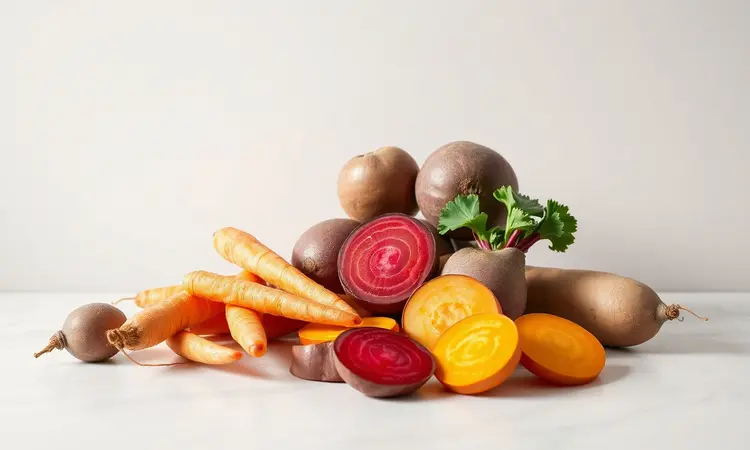
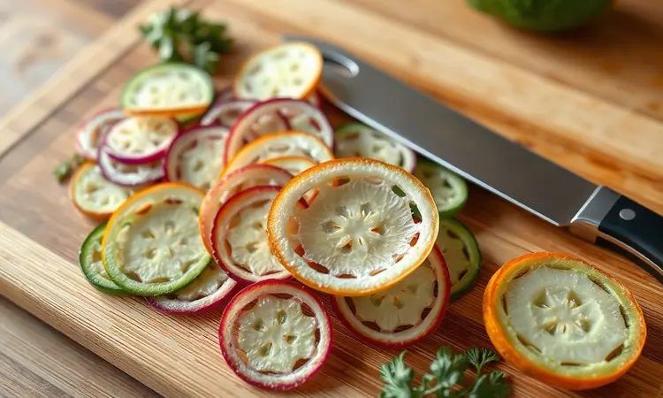
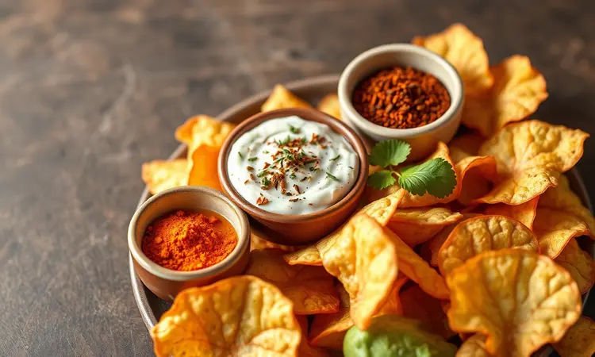
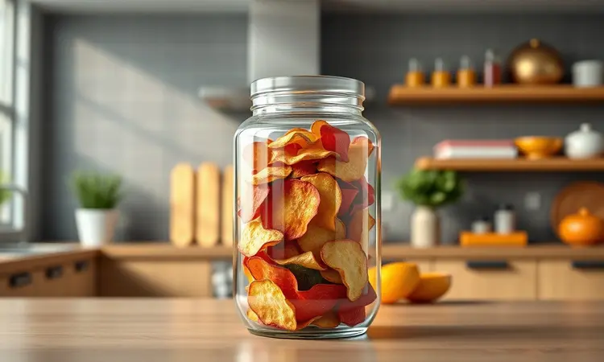

Já aconteceu com você? Compra aquele pacote de chips de vegetais no mercado, esperando um lanche saudável, mas quando lê o rótulo encontra uma lista interminável de conservantes e uma quantidade absurda de sódio.

É frustrante querer manter uma alimentação equilibrada sem abrir mão daquela crocância satisfatória. A boa notícia é que você pode criar essa experiência na sua cozinha, controlando cada ingrediente e gastando muito menos do que imagina.

Neste guia, vou te mostrar como transformar legumes comuns em petiscos irresistíveis que vão te fazer esquecer qualquer versão industrializada. Aprenda desde o corte perfeito até os segredos que mantêm aquele estalido na boca por dias.

<SummaryList products={frontmatter.top_products} />

## Por que os Chips de Vegetais são o Lanche Ideal?

Imagine um lanche que não pesa na consciência. Algo crocante que satisfaz aquela vontade de petiscar, mas que também oferece nutrientes reais. É exatamente isso que os chips caseiros fazem por você.

Eles transformam o ato de comer vegetais numa experiência de prazer, mantendo o sabor e a textura que todo mundo ama, mas sem ingredientes que você não reconhece. A versatilidade é o que mais encanta.

A cor vibrante da beterraba, a doçura suave da batata doce, o frescor da abobrinha. Cada vegetal conta uma história diferente no seu paladar, e você pode escolher qual quer ouvir hoje.

São ideais para quando precisa de energia rápida ou para acompanhar aquele momento relaxante no sofá.

## Quais os Melhores Legumes para Fazer Chips?

A beleza dessa arte está na simplicidade. Você não precisa de ingredientes exóticos. As estrelas do show são aqueles legumes que já estão na sua geladeira ou na feira. A batata doce, com sua doçura natural que dispensa açúcar, sempre faz sucesso.

A beterraba, com seu roxo vibrante, não só impressiona visualmente como oferece um sabor terroso único. A cenoura se transforma em uma crocância alaranjada que mistura doce e salgado perfeitamente. E a abobrinha? Ela vira chips levíssimos que derretem na boca.

Até o brócolis e a couve entram na brincadeira quando desidratados, criando opções cheias de nutrientes. Experimente combinações e descubra qual fala mais alto com seu paladar.

## O Segredo Fundamental: Como Cortar e Secar para Garantir a Crocância

Corte uniforme e fino é onde a mágica começa. É a diferença entre um chip que estala e outro que apenas amolece na boca. Quando cada fatia tem exatamente a mesma espessura, elas assam em harmonia. Nenhuma queima enquanto outra ainda está úmida.

Depois do corte, vem o ritual da secagem. Eliminar a umidade é o que transforma vegetais assados em verdadeiros chips. Seja no forno tradicional ou com a ajuda de um desidratador, esse processo é não negociável.

Imagine cada célula de água evaporando, deixando para trás apenas estrutura e sabor concentrado.

### A Ferramenta Indispensável: Fatiador Mandoline Profissional

<ProductBox 
  title={frontmatter.top_products[0].title} 
  image={frontmatter.top_products[0].image} 
  link={frontmatter.top_products[0].link} 
/>

Tentar cortar tudo à mão pode ser uma lição de frustração. Uma fatia um pouco mais grossa aqui, outra mais fina ali, e o resultado nunca é perfeito. É aí que o mandoline entra como seu melhor amigo na cozinha.

Com lâminas de aço inoxidável que parecem desafiar a física, ele transforma vegetais em fatias tão precisas que parecem ter saído de uma linha de produção.

O ajuste de espessura é tão simples quanto girar um botão, permitindo desde chips finíssimos até cortes julienne para variar o jogo.

A preocupação com segurança é real, e é por isso que a maioria dos modelos vem com protetores de mão que mantêm seus dedos a salvo das lâminas afiadas.

A limpeza pode exigir atenção, especialmente na hora de remover os resíduos grudados, mas é um pequeno preço a pagar pela agilidade que ganha.

Quando você corta um quilo de batata doce em minutos, com cada fatia idêntica à anterior, percebe que já metade do caminho para chips perfeitos está vencida.

## Passo a Passo: Como Fazer Chips de Vegetais na Airfryer

A airfryer entende a urgência da vida moderna. Precisa de lanche rápido e saudável? Ela entrega. O ritual é simples mas exige cuidado. Fatias finas uniformes, um fio de azeite, temperos que falam com você. Na cesta, eles não podem se amontoar.

Precisam de espaço para que o ar quente circule e abrace cada pedacinho. Aos 180°C, a transformação começa. Você vai ouvir um sussurro enquanto a umidade vai embora e depois o som crocante que indica que estão prontos.

Mexer ocasionalmente garante que todos recebam o mesmo carinho do calor.

### Melhores Modelos de Airfryer para Snacks Crocantes

<ProductBox 
  title={frontmatter.top_products[1].title} 
  image={frontmatter.top_products[1].image} 
  link={frontmatter.top_products[1].link} 
/>

Nem todas as airfryers conversam da mesma maneira com os alimentos. Algumas entendem que crocância não é apenas ausência de óleo, mas uma textura que satisfaz.

A linha Philips Walita, com sua tecnologia Rapid Air, cria uma circulação tão eficiente que parece que cada chip recebe atenção individual. O modelo RI9252/91 é um exemplo dessa maestria, embora sua capacidade peça paciência se você cozinha para uma família inteira.

A Oster traz para sua cozinha um visual que combina com a sofisticação que você busca, aliado a uma durabilidade que resiste ao teste do tempo. Com janela para espiar a transformação, ela torna o processo quase meditativo.

São 4 litros que convidam a experimentação, mas podem pedir rodadas extras para alimentar todos.

Para quem busca eficiência sem complicações, a Mondial oferece opções que cabem no orçamento sem abrir mão do desempenho.

Já a Electrolux, com modelos como o Family Efficient, fala a linguagem da praticidade, ideal para quem quer foco total no resultado sem perder tempo com manuais complexos.

O segredo na escolha está em encontrar aquele cujo design do cesto conversa bem com o ar, criando um ambiente onde seus vegetais possam se transformar completamente.

## Como Preparar Chips de Vegetais no Forno Tradicional

O forno tradicional é o professor paciente. Não tem pressa, mas exige atenção aos detalhes. O ritual começa igual: fatias finas e uniformes. Um fio de azeite, sal que realça mas não domina, talvez um toque de alecrim ou páprica defumada.

Espalhados em camada única, eles precisam de espaço para respirar. Aos 180°C, a dança começa. Você vai precisar virá-los na metade do caminho, como se virasse uma página de um livro que está sendo escrito.

O resultado é um chip que carrega a memória do calor lento e constante, uma crocância que parece mais profunda, mais satisfatória.

### Papel Manteiga vs. Tapete de Silicone: Qual o Melhor para Assar?

<ProductBox 
  title={frontmatter.top_products[2].title} 
  image={frontmatter.top_products[2].image} 
  link={frontmatter.top_products[2].link} 
/>

Essa escolha fala sobre como você se relaciona com sua cozinha. O papel manteiga é o amigo prático que sempre está lá quando precisa. Você corta no tamanho exato, forra a assadeira e pronto. Fácil de descartar depois, mas também mais um item na lixeira.

Ele pode deixar a base dos alimentos um pouco menos dourada, mas cumpre sua função com lealdade.

O tapete de silicone é o compromisso de longo prazo. Requer investimento inicial, mas promete anos de companheirismo. Não precisa untar, distribui o calor com generosidade, e limpa com um pano úmido. É ecológico de uma forma que faz sentido no dia a dia.

Alguns assados podem não ganhar a mesma crocância na base, mas para os chips de vegetais, ele se torna um aliado quase perfeito. Escolha com base no que sua rotina pede: conveniência imediata ou parceria duradoura.

## 5 Receitas de Chips que Você Precisa Testar

Essas não são apenas receitas. São convites para explorar sabores que talvez você nunca tenha associado à palavra "chip". Cada uma oferece uma experiência sensorial diferente, provando que saudável pode ser surpreendente.

### Chips de Abobrinha com Parmesão

A abobrinha tem um segredo: quando cortada fininha e assada, ela se transforma num chip quase translúcido, leve como pluma mas com presença.

Adicione parmesão ralado antes de ir ao forno, e o queijo vai derreter e criar pequenas crostas douradas que contrastam com a delicadeza do vegetal. São fibras e vitaminas disfarçadas de pequenas obras de arte crocantes.

### Chips de Batata-Doce Rústica

Deixe a casca. É nela que mora parte da personalidade deste chip. Cada fatia conta a história da terra onde cresceu. Quando assada, a doçura natural da batata doce carameliza levemente nas bordas, criando um contraste perfeito com o sal.

Rico em antioxidantes, este chip é como receber um abraço nutritivo que também satisfaz aquela vontade de algo reconfortante.

### Chips de Cenoura com Páprica e Ervas

A cenoura desidratada concentra sua doçura de uma maneira que surpreende. Agora imagine isso com a páprica sussurrando notas defumadas e picantes no fundo, enquanto ervas como tomilho ou alecrim completam a conversa.

Este é o chip que pede para ser apreciado com atenção, cada mordida revelando camadas de sabor que conversam entre si.

### Chips de Beterraba: Doce e Salgado em um só Snack

A beterraba não pede permissão. Chega com sua cor roxa vibrante que tinge tudo de alegria. Seu sabor terroso adquire notas doces quando assada, criando uma dualidade que fascina o paladar. Salgado na superfície, doce no fundo.

Rico em nutrientes, é um chip que alimenta os olhos antes mesmo de chegar à boca.

### Chips de Banana da Terra: O Acompanhamento Perfeito

Crocantes e com uma textura que lembra mais as batatas tradicionais, mas com personalidade própria. Levemente salgados, têm uma resistência que os torna companheiros ideais para mergulhar em guacamole ou hummus.

São uma ponte entre o familiar e o novo, perfeitos para quem está começando a explorar esse universo.

## Dicas de Temperos e Molhos Saudáveis para Acompanhar

Os temperos são a assinatura pessoal do seu chip. Uma combinação simples de páprica defumada, alho em pó e orégano já transforma qualquer vegetal. Mas que tal experimentar raspa de limão siciliano com pimenta do reino?

Ou cominho com uma pitada de canela para chips de batata doce?

Para mergulhar, o iogurte natural ganha vida nova com suco de limão e ervas frescas picadas. Um molho de tahine misturado com água, limão e um fio de azeite cria uma cremosidade que complementa sem roubar a cena.

Ou mantenha a simplicidade: uma pastinha de abacate amassado com alho e sal. Cada mergulho deve ser uma extensão da experiência, não um disfarce.

## Erros Comuns que Deixam os Chips Murchos (E como evitá-los)

A umidade é o inimigo silencioso. Secar os vegetais com papel toalha antes de temperar pode parecer detalhe, mas é o que separa o crocante do mole. Não é apenas sobre retirar o excesso. É sobre respeito ao processo.

Temperatura baixa transforma vegetais em couve-flor cozida, não em chips. Eles precisam do calor certo para evaporar a água rapidamente, não para suar lentamente. Espalhar em camada única não é sugestão, é mandamento.

Aglomerados criam vapor, e vapor cria umidade, e umidade cria frustração. Mexer na metade do tempo garante que todos os lados recebam igual atenção do calor.

## Como Armazenar Corretamente para Manter o "Crunch"

Você investiu tempo, cuidado, expectativa. Agora quer que esse investimento dure. A chave está em criar um ambiente onde a umidade não ousa entrar. Um recipiente hermético é o cofre que guarda sua conquista.

Vidro é preferível porque não retém odores e permite que você veja o tesouro dentro.

Mantenha longe da luz direta e de fontes de calor. Cada vez que você abre, está renovando o ar dentro. Se notar que perderam um pouco do estalido, uns minutos no forno a baixa temperatura pode reviver a mágica. É sobre respeitar o que criou.

### Potes Herméticos de Vidro para Conservação

<ProductBox 
  title={frontmatter.top_products[3].title} 
  image={frontmatter.top_products[3].image} 
  link={frontmatter.top_products[3].link} 
/>

O vidro não apenas guarda. Ele conta a história do que está dentro. Potes herméticos de vidro são testemunhas transparentes do seu progresso.

A vedação perfeita mantém o ar e a umidade do lado de fora, preservando cada detalhe da textura que você tanto trabalhou para alcançar.

Sim, exigem cuidado ao manusear. Mas o vidro borossilicato usado nos melhores modelos entende de desafios. Vai do freezer ao micro-ondas sem perder a compostura, adaptando-se aos seus ritmos.

Investir neles é investir na crença de que o que você prepara merece ser conservado com dignidade. São sustentáveis não apenas por serem reutilizáveis, mas por celebrarem a ideia de que comida caseira tem valor que transcende o momento do consumo.

## Conclusão

O que começou como busca por uma alternativa aos chips industrializados se transformou em algo maior. Descobrir que você pode criar crocância com suas próprias mãos, escolhendo cada ingrediente que entra, é mais do que economia.

É reconexão com o simples prazer de transformar matéria-prima em algo que alimenta corpo e alma.

Cada vegetal que você fatia fininho e assa até estalar conta uma história de autonomia. Cada tempero que escolhe é sua voz na receita. A airfryer ou o forno são apenas ferramentas.

A verdadeira transformação acontece quando você percebe que lanches saudáveis não são sobre restrição, mas sobre redescoberta de sabores.

Os potes de vidro na sua despensa agora guardam mais do que chips. Guardam a prova de que você pode criar pequenas revoluções na sua própria cozinha.

Quando entregar um pote cheio para um amigo e ouvir aquele "crunch" satisfatório, entenderá que está compartilhando não apenas um lanche, mas uma nova forma de ver o que come.

O convite está feito. Pegue um vegetal, afie sua faca ou seu mandoline, e comece sua própria coleção de estalidos. Sua próxima pausa para lanche nunca mais será a mesma.