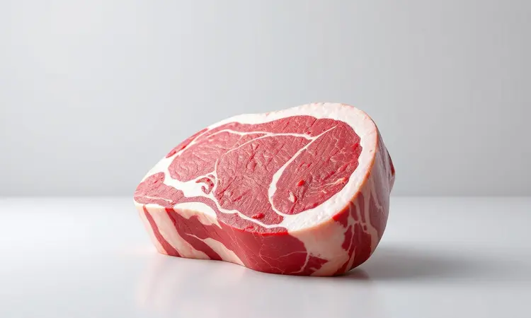
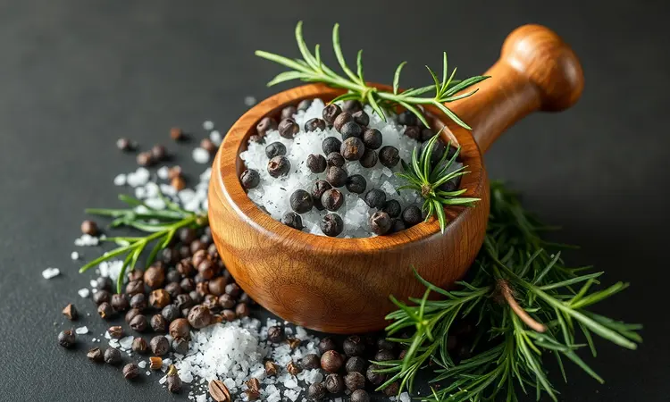
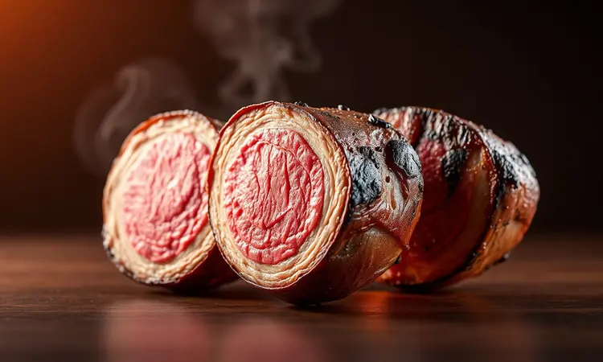
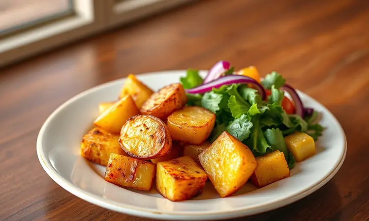

Você adora uma chuleta bem grelhada, mas detesta a fumaça e a sujeira que ela faz no fogão? Muitas pessoas acreditam que preparar carne na airfryer pode deixá-la seca ou sem aquele sabor de churrasco, mas isso é um mito.

Eu prometo que, com as técnicas certas, você conseguirá uma chuleta bovina extremamente suculenta, macia e dourada em poucos minutos.

Neste guia completo, você vai aprender o passo a passo da receita perfeita, os segredos de tempero dos chefs e como dominar o tempo para nunca mais errar o ponto da carne.

<SummaryList products={frontmatter.top_products} />

## Por que fazer Chuleta Bovina na Airfryer?

Imagine terminar o dia com aquela vontade de uma carne suculenta, mas sem disposição para enfrentar a limpeza de uma grelha cheia de gordura. A airfryer oferece essa praticidade com um resultado que impressiona.

A tecnologia de circulação de ar quente envolve a carne por igual, garantindo que cada centímetro da sua chuleta fique dourado e suculento, sem aquelas partes mais queimadas que acontecem no fogão tradicional. O melhor?

Você reduz significativamente o uso de óleo, desfrutando do sabor autêntico da carne com muito menos calorias. A limpeza se transforma em algo simples, com peças que vão direto para a máquina de lavar louças. E o tempo?

Em cerca de 15 minutos você tem uma refeição digna de restaurante. É praticidade que não sacrifica sabor.

## Como escolher a Chuleta perfeita para Grelhar

E agora que você já sabe por que vale a pena usar a airfryer, vamos ao primeiro passo fundamental: escolher a carne certa. Pense na última vez que você comeu uma chuleta e sentiu aquela maciez que quase derrete na boca. Esse momento começa no açougue.

Procure cortes com bom marmoreio, aquela distribuição harmoniosa de gordura entre as fibras musculares. Essa gordura não é apenas sabor, é garantia de suculência durante o cozimento. Observe também a espessura: peças uniformes cozinham de maneira mais previsível.

A cor deve ser um vermelho vibrante, sinal de frescor, e sempre que possível, opte por carnes de fontes confiáveis. Uma boa escolha aqui determina 70% do sucesso do seu prato.

## Receita de Chuleta na Airfryer: Simples, Rápida e Saborosa

A magia acontece quando técnica e ingredientes se encontram. Preparar chuleta na airfryer é sobre simplificar o processo sem abrir mão do resultado gourmet. Você vai ver como é possível transformar alguns ingredientes básicos em uma experiência memorável.

### Ingredientes e Temperos que Realçam o Sabor

O tempero é onde sua personalidade entra na receita. Comece com o básico que nunca falha: sal grosso e pimenta-do-reino moída na hora. Esses dois já garantem um sabor autêntico e marcante.

Para elevar ainda mais, experimente uma marinada com alho picado finamente, cebola ralada e um ramo fresco de alecrim ou tomilho. Uma colher de suco de limão não apenas adiciona um toque cítrico refrescante, como também ajuda a amaciar as fibras da carne. O segredo?

Deixe a carne descansar com esses temperos por pelo menos 30 minutos, idealmente na geladeira, para que os sabores penetrem profundamente.

### Modo de Preparo e Tempo de Cozimento Detalhado

Com sua chuleta bem temperada, chegou a hora da transformação. Preaqueça sua airfryer a 200°C por cerca de 5 minutos. Esse passo parece simples, mas é crucial para garantir que a carne comece a selar imediatamente, trancando os sucos dentro.

Coloque a chuleta na cesta sem sobreposição, permitindo que o ar quente circule livremente por todos os lados. Cozinhe por aproximadamente 12 a 15 minutos, virando cuidadosamente na metade do tempo.

A espessura da carne influencia: peças mais grossas podem precisar de 2 a 3 minutos extras. O verdadeiro segredo vem depois: retire a carne e deixe descansar por 5 minutos antes de cortar.

Essa pausa permite que os sucos se redistribuam, garantindo que cada fatia seja suculenta.

## Tabela de Pontos da Carne: Do Malpassado ao Bem Passado na Airfryer

Dominar o ponto da carne é como aprender a dançar com ela. Cada temperatura revela uma textura e sabor diferente. Use esta referência como seu guia pessoal:

- **Malpassado (50-55ºC)**: O centro mantém uma cor avermelhada vibrante, com textura tão macia que quase não exige mastigação. Perfeito para quem valoriza a suculência máxima.

- **Ao ponto para malpassado (55-60ºC)**: Equilíbrio perfeito entre segurança e prazer. O centro rosa mantém a umidade enquanto as bordas já apresentam aquela crosta dourada que todos amamos.

- **Ao ponto (60-65ºC)**: Para quem prefere um pouco mais de textura sem abrir mão da suculência. Um leve tom rosa no meio indica o ponto ideal.

- **Bem passado (70ºC ou mais)**: Totalmente cozida, com textura firme. Ideal para quem tem preferência por carne mais consistente.

Lembre-se: essas temperaturas são guias. O uso de um termômetro de cozinha transforma essa arte em ciência precisa.

## Melhores Modelos de Airfryer para Preparar Carnes Altas

<ProductBox 
  title={frontmatter.top_products[0].title} 
  image={frontmatter.top_products[0].image} 
  link={frontmatter.top_products[0].link} 
/>

Se você quer resultados consistentes, o equipamento faz diferença. Algo que tenha espaço suficiente para acomodar cortes generosos e potência para selar rapidamente.

A Electrolux Air Fryer Oven EAF90, com seus 12 litros de capacidade, oferece não apenas espaço para preparar chuletas para toda a família, mas também a função rotisserie com espeto giratório, perfeita para quando quiser impressionar convidados com cortes especiais.

Já a WAP Barbecue Digital FW00962 é como ter um churrasqueiro pessoal, com 12 funções específicas para carnes que replicam técnicas de grelhagem profissional.

E para quem busca máxima eficiência, a LIDL Air Fryer Gigante com seus 2150W oferece potência que transforma qualquer chuleta em algo digno de restaurante gourmet em minutos.

Sim, modelos mais robustos ocupam mais espaço na bancada, mas quando você experimenta a facilidade de preparar carnes perfeitas sem fumaça, percebe que vale cada centímetro.

## Por que usar um Termômetro de Carne Digital?

<ProductBox 
  title={frontmatter.top_products[1].title} 
  image={frontmatter.top_products[1].image} 
  link={frontmatter.top_products[1].link} 
/>

Você já cortou uma chuleta aparentemente perfeita só para descobrir que o centro estava mais cozido do que esperava? Um termômetro digital acaba com essas surpresas desagradáveis.

É sua garantia de precisão: você insere a ponta no centro mais espesso da carne e em segundos sabe exatamente o que está acontecendo lá dentro. Essa ferramenta elimina o chute, substituindo-o por certeza.

Mais do que acertar o ponto, um bom termômetro protege sua saúde ao garantir que a carne atinja temperaturas seguras, enquanto evita que ela seque pelo excesso de cozimento.

Modelos com alarme programável avisam quando atingir a temperatura desejada, liberando você para preparar os acompanhamentos. A necessidade de baterias é um detalhe pequeno perto da liberdade de servir carnes perfeitas toda vez.

## 5 Segredos para a Chuleta não ficar Dura ou Seca

Esses insights transformam receitas boas em experiências memoráveis:

1. **Escolha inteligente**: Cortes com marmoreio adequado mantêm a umidade durante o cozimento. A gordura é sua aliada, não sua inimiga.

2. **Paciência no tempero**: Marinadas merecem tempo. Deixe a carne absorver os sabores por horas, idealmente na geladeira. O resultado é profundidade de sabor que impressiona.

3. **Temperatura média**: 180°C a 200°C é a zona ideal. Muito alta queima as bordas antes do centro cozinhar, muito baixa deixa a carne cozinhando em seus próprios sucos por tempo excessivo.

4. **Espaço para respirar**: Nunca sobrecarregue a cesta. O ar quente precisa circular livremente para criar aquela crosta dourada uniforme.

5. **O descanso sagrado**: Esses 5 minutos finais são tão importantes quanto o tempo de cozimento. Eles permitem que as fibras relaxem e redistribuam os sucos.

## Erros Comuns ao Grelhar Carne na Airfryer e Como Evitá-los

Mesmo com as melhores intenções, pequenos deslizes podem comprometer seu resultado. O mais comum? Pular o pré-aquecimento. Essa etapa prepara o equipamento para receber a carne já na temperatura correta, garantindo que ela comece a selar imediatamente.

Outro equívoco é exagerar em marinadas líquidas, que podem respingar e queimar no fundo da airfryer, criando fumaça e sabores desagradáveis.

Amontoar muitas peças na cesta é um convite para resultados desiguais. A carne precisa de espaço para que o ar quente trabalhe seu mágica em todas as superfícies.

E finalmente, não adaptar tempo e temperatura à espessura específica da sua peça é como usar a mesma receita para diferentes cortes. Observe, ajuste e anote para a próxima vez.

## Sugestões de Acompanhamentos para sua Chuleta

Uma chuleta perfeita merece companhias à altura. Batatas rústicas assadas na própria airfryer ganham crocância por fora e cremosidade por dentro quando temperadas com alecrim fresco e lascas de parmesão.

Para equilibrar a riqueza da carne, uma salada de folhas verdes com tomates cereja e um molho leve de mostarda Dijon e mel traz frescor e contraste.

Se preferir legumes, abobrinhas e pimentões em tiras, levemente temperados com azeite e ervas, grelham rapidamente na airfryer enquanto sua chuleta descansa.

Essa combinação não apenas completa visualmente o prato, como oferece diferentes texturas e sabores que conversam harmoniosamente com a protagonista do jantar.

## Perguntas Frequentes (FAQ) sobre Carne na Airfryer

Depois de todo esse guia, algumas dúvidas práticas ainda podem surgir. Vamos esclarecê-las:

Preciso virar a carne na airfryer?
Sim, especialmente em cortes mais espessos. Virar na metade do tempo garante que ambos os lados desenvolvam aquela crosta dourada perfeita.

Posso usar a mesma airfryer para doces e salgados?
Perfeitamente possível, desde que você a limpe bem entre os usos. O aroma de carnes pode transferir-se para alimentos mais delicados.

A carne fica realmente mais saudável?
Consideravelmente. A airfryer requer muito menos óleo que métodos tradicionais de fritura, e a gordura da própria carne escorre para o reservatório inferior.

Posso preparar carne congelada?
Pode, mas adicione 5 a 7 minutos ao tempo de cozimento e certifique-se de que atinja a temperatura interna segura.

Como limpar depois de grelhar carne?
Espere o equipamento esfriar completamente. A maioria das cestas e reservatórios são laváveis na máquina de lavar louças, mas uma limpeza manual com água quente e detergente suave remove resíduos gordurosos com eficiência.

## Conclusão

Preparar chuleta bovina na airfryer deixa de ser uma simples alternativa ao fogão para se tornar uma experiência culinária por direito próprio.

Você conquista não apenas praticidade e limpeza fácil, mas principalmente resultados consistentes: carnes suculentas, macias e perfumadas, com a crosta dourada que todos desejam.

As técnicas que compartilhamos aqui, desde a escolha da carne até o descanso final, transformam o processo em algo previsível e satisfatório.

Essa jornada começa com a decisão de experimentar algo novo e termina com a satisfação de servir um prato que impressiona pela simplicidade e excelência.

Sua próxima chuleta não será apenas mais uma refeição, mas uma demonstração de como a técnica certa, nas mãos certas, pode elevar o cotidiano a algo especial.

Agora é sua vez: escolha sua carne favorita, tempere com confiança e descubra como a airfryer pode se tornar sua melhor aliada na cozinha.