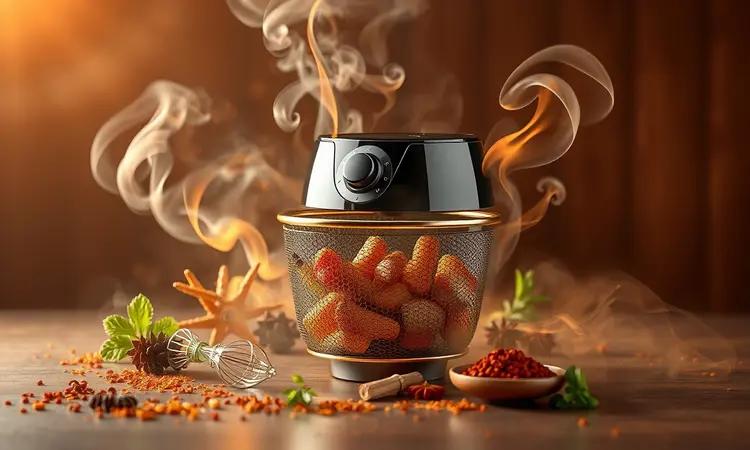
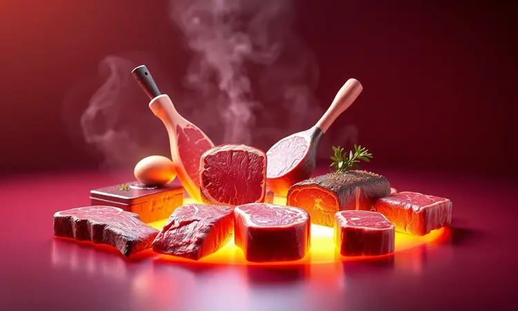
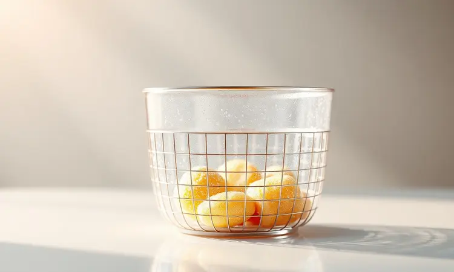

Imagine aquela vontade de um churrasco de domingo, mas a preguiça de acender o carvão ou o espaço limitado do seu apartamento. Ou quem sabe aquele desejo de uma carne suculenta no meio da semana, sem toda a bagunça da churrasqueira tradicional.

A verdade é que sua fritadeira elétrica pode ser a solução que você nem sabia que precisava.

Neste guia, vamos transformar sua relação com a Airfryer. Não se trata apenas de 'fazer churrasco no eletrodoméstico'.

É sobre descobrir como conseguir aquela suculência perfeita, aquela crocância dos acompanhamentos e, o melhor de tudo, aquele sabor defumado que você jurava que só viria da brasa. Prepare-se para reinventar suas refeições.

<SummaryList products={frontmatter.top_products} />

## Por que fazer churrasco na Airfryer? Praticidade e Sabor

A magia começa com a praticidade. Enquanto sua churrasqueira tradicional ainda está aquecendo, sua Airfryer já está pronta para trabalhar. O aquecimento rápido não é apenas uma questão de minutos economizados.

É sobre aquela espontaneidade de decidir que hoje será dia de churrasco às 18h e ter tudo pronto para as 19h.

Mas vamos além do tempo. A circulação de ar intensa e uniforme cria um efeito único. Em vez de apenas assar, ela sela os sucos da carne, mantendo-a úmida por dentro enquanto produz uma superfície irresistivelmente dourada.

O controle preciso de temperatura significa que você elimina aquela loteria de 'será que passou do ponto?'. E sim, você usa menos gordura, resultando em carnes mais leves sem sacrificar o sabor.

O verdadeiro diferencial? Você consegue tudo isso dentro de casa, sem fumaça, sem preocupação com o clima e com uma limpeza que leva minutos em vez de horas.

## O Segredo do Sabor: Como conseguir o efeito defumado na Airfryer

Aqui está o ponto que mais intriga os iniciantes: como conseguir aquele gostinho característico da brasa sem, bem, ter brasa? O segredo está na combinação de técnicas inteligentes.

Mergulhe a carne em marinadas com ingredientes como páprica defumada, molho barbecue com toque de defumado, ou até mesmo um pouco de café moído na mistura, que confere notas terrosas incríveis.

Durante o cozimento, você pode adicionar pequenas lascas de madeira aromática (como maçã ou nogueira) no fundo da cesta. Elas não vão queimar, mas vão liberar aromas que penetram na carne.

Para quem quer ir além, uma gota ou duas de fumaça líquida na marinada faz milagres. O truque final está na temperatura alta inicial, que cria uma 'crosta' na carne, selando os sabores dentro.

O resultado é tão convincente que seus convidados questionarão se você realmente não acendeu a churrasqueira.

## Melhores Carnes para Fazer na Fritadeira Elétrica

A Airfryer é surpreendentemente versátil, mas algumas carnes se destacam. A chave são cortes com alguma gordura intramuscular que mantenha a suculência durante o cozimento por ar quente.

Peito de frango (especialmente com pele), picanha, costela bovina e, claro, as queridinhas linguiças são campeãs de adaptação.

Cada uma tem sua personalidade e exige pequenos ajustes, mas todas compartilham uma característica: saem da Airfryer com uma textura que você não acreditaria ser possível sem grelha ou chama direta.

### Picanha na Airfryer: O Guia para o Ponto Perfeito

Comece com uma peça que tenha uma camada generosa de gordura. Isso não é excesso, é sua garantia de suculência. Tempere generosamente com sal grosso, pressionando bem para que adira, e deixe descansar por 15 minutos fora da geladeira.

Preaqueça sua Airfryer a 200°C. Coloque a picanha com a gordura para cima e programe 10 minutos. Vire e deixe por mais 10 a 12 minutos para um ponto ao molho, ou 15 minutos para mais passada. O truque está em usar a própria gordura que derrete para 'autoregar' a carne.

Ao retirar, nunca pule o passo do descanso. Deixe repousar por 5 a 7 minutos coberta com papel alumínio antes de fatiar. É nesse momento que os sucos se redistribuem, garantindo que cada fatia seja uma experiência derretente.

### Linguiça Toscana Recheada: Crocante e Suculenta

Faça pequenos cortes diagonais na linguiça, sem chegar até o fundo. Isso permite que o calor penetre uniformemente e cria cantinhos que ficam irresistivelmente crocantes. Não é necessário óleo, pois a própria gordura da linguiça faz o trabalho.

Disponha as linguiças sem sobrepor na cesta e leve a 200°C por 8 minutos. Vire cada uma delicadamente e programe mais 7 a 8 minutos. Você saberá que estão prontas quando a pele estiver levemente 'esticada' e com bolhinhas douradas.

O milagre acontece aqui: enquanto o exterior fica com aquela casquinha perfeita de churrasco, o interior permanece suculento e cremoso. Sirva imediatamente, pois esse é um daqueles pratos que pede para ser consumido ainda fumegante.

### Coxinha da Asa (Drumet) com Tempero Especial

Para essas pequenas delícias, a marinada é tudo. Misture iogurte natural (que amacia a carne magicamente), suco de limão, alho amassado, páprica defumada, sal e uma pitada de pimenta caiena.

Deixe as coxinhas mergulhadas nesse banho por pelo menos 2 horas, ou idealmente, de um dia para o outro na geladeira.

Antes de levar à Airfryer, escorra o excesso de marinada e polvilhe com um pouco mais de páprica para cor.

25 minutos a 200°C, virando na metade do tempo, deixarão a pele tão crocante que fará barulho ao morder, enquanto a carne dentro se desprende do osso com facilidade.

## Acompanhamentos Clássicos na Airfryer

E o que seria de um bom churrasco sem seus acompanhamentos? A boa notícia é que a Airfryer transforma o preparo dos clássicos em algo quase mágico.

Batatas ficam crocantes sem ficar encharcadas em óleo, legumes ganham um toque defumado e a farofa fica perfeita e soltinha.

O melhor? Você pode preparar tudo enquanto as carnes descansam, otimizando seu tempo e tendo todos os componentes prontos simultaneamente.

### Pão de Alho Caseiro: Crocante em Minutos

Em uma tigela, amasse 3 dentes de alho com uma pitada de sal até formar uma pasta. Incorpore 100g de manteiga amolecida e um punhado generoso de salsinha picada (a salsinha fresca faz toda a diferença).

Corte o pão em fatias grossas sem separar completamente o fundo, criando um efeito 'livro'.

Espalhe a manteiga de alho entre cada fatia, não apenas na superfície, mas penetrando nas frestas. Envolva o pão inteiro em papel alumínio e leve à Airfryer pré-aquecida a 180°C por 5 minutos.

Retire o papel alumínio e deixe por mais 2 a 3 minutos até que as pontas das fatias fiquem douradas.

O resultado é um pão que vai do crocante exterior ao macio e embebido interior, onde cada mordida libera o aroma do alho. É tão bom que corre o risco de roubar a cena das carnes.

### Queijo Coalho Dourado sem Grudar

O segredo está na temperatura e no pré-aquecimento. Esquente sua Airfryer vazia a 180°C por 3 minutos. Enquanto isso, corte o queijo coalho em fatias de 2cm de espessura - nem muito finas (secam rápido), nem muito grossas (não douram por dentro).

Coloque as fatias na cesta bem aquecida, deixando espaço entre elas. Asse por 5 minutos, vire com cuidado usando uma espátula de silicone (não garfo, para não furar) e deixe por mais 3 a 4 minutos.

Você saberá que está perfeito quando as bordas começarem a dourar levemente e o queijo estiver macio, mas ainda mantendo o formato.

A Airfryer derrete o interior lentamente enquanto cria uma película crocante externa, a combinação exata que faz do queijo coalho uma das maiores alegrias dos churrascos.

## Tabela de Tempo e Temperatura para Churrasco na Airfryer

Considere esta tabela como seu ponto de partida, mas lembre-se que cada Airfryer e cada peça de carne tem suas particularidades. Use sempre um termômetro para carnes vermelhas, buscando 54°C para mal passada, 60°C para ao ponto e 71°C para bem passada.

- **Peito de frango (com osso e pele):** 200°C por 22-25 minutos (vire na metade)

- **Picanha (aproximadamente 800g):** 200°C por 20-22 minutos para ponto ao molho (10+10, virando no meio)

- **Contrafilé (em bifes de 3cm):** 200°C por 8-10 minutos para mal passado

- **Costelinha de porco:** 180°C por 25 minutos + 200°C por 5 minutos finais

- **Linguiça toscana:** 200°C por 15-18 minutos total (virando na metade)

- **Coxinha da asa:** 200°C por 25-28 minutos (virando na metade)

A regra de ouro é sempre pré-aquecer, não sobrecarregar a cesta, e verificar alguns minutos antes do tempo sugerido. Sua Airfryer pode ser mais ou menos eficiente que a média.

## Melhores Modelos de Airfryer para Churrasco (Capacidade e Potência)

<ProductBox 
  title={frontmatter.top_products[0].title} 
  image={frontmatter.top_products[0].image} 
  link={frontmatter.top_products[0].link} 
/>

Se você leva seu churrasco na Airfryer a sério, o modelo faz diferença. Para famílias de 3 a 4 pessoas, procure por capacidade mínima de 5,5 litros. Essa dimensão permite assar uma picanha inteira ou várias porções de diferentes carnes simultaneamente.

A potência ideal varia entre 1700W e 2000W. Mais watts significam menos tempo de pré-aquecimento e capacidade de manter a temperatura alta mesmo com a cesta cheia, crucial para selar as carnes corretamente.

Recursos adicionais que valem o investimento: cesto duplo (para separar carnes e acompanhamentos), função 'grelhar' específica, e display digital com controle preciso de temperatura em incrementos de 5°C.

### WAP Airfry Barbecue: A Fritadeira Específica para Grelhados

<ProductBox 
  title={frontmatter.top_products[1].title} 
  image={frontmatter.top_products[1].image} 
  link={frontmatter.top_products[1].link} 
/>

Este modelo entende a missão. Desenvolvido pensando especificamente em grelhados, ele oferece uma função barbecue com quatro níveis de temperatura que simulam diferentes distâncias da brasa.

Seu sistema de circulação de ar 360° turbinada garante que até o centro da ceste fique igualmente crocante.

O grande diferencial é a tecnologia smokeless inteligente. Ela não apenas reduz a fumaça, mas gerencia a liberação de aromas das carnes gorduras sem criar aquele cheiro que impregna a cozinha por dias.

Com capacidade de 10 litros e potência de 1800W, é uma máquina robusta que aceita espetos giratórios (vendidos separadamente) e vem com grelhas especiais para marcar as carnes. O único ponto de atenção é seu tamanho, que exige um espaço dedicado na bancada.

Mas para quem quer uma experiência de churrasco indoor completa, é como ter uma mini-churrascaria portátil.

### Acessórios Indispensáveis: Termômetro e Pinças

<ProductBox 
  title={frontmatter.top_products[2].title} 
  image={frontmatter.top_products[2].image} 
  link={frontmatter.top_products[2].link} 
/>

Dois acessórios transformam você de cozinheiro para churrasqueiro. O primeiro é um termômetro de leitura instantânea. Parar de adivinhar o ponto da carne é libertador.

Basta inserir a ponta no centro da peça e em segundos você sabe exatamente se precisa de mais dois minutos ou se já está no ponto perfeito.

As pinças longas de silicone na ponta são igualmente essenciais. Elas permitem virar carnes delicadas sem rasgar a superfície selada, manobrar peças quentes com segurança, e retirar alimentos da cesta sem arranhar o revestimento antiaderente.

Não são apenas ferramentas, são extensões das suas mãos que garantem respeito pelo alimento que você está preparando.

## 5 Erros Comuns que deixam a carne seca na Airfryer

1. **Pular a marinada ou o tempero com antecedência:** As carnes precisam de tempo para absorver sabores e reter umidade. Temperar apenas na hora é pedir para ficar seco.

2. **Não pré-aquecer o aparelho:** Colocar carne fria em uma Airfryer fria faz com que ela cozinhe lentamente, perdendo sucos antes de selar. Sempre aguarde o sinal sonoro ou o indicador de pré-aquecimento concluído.

3. **Sobrecarregar a cesta:** Amontoar as carnes cria vapor que impede o douramento. Elas precisam de espaço para que o ar circule livremente, criando aquela superfície crocante que sela os sucos dentro.

4. **Ignorar o ponto real:** Tempos de tabela são orientativos. Carnes mais frias da geladeira, mais espessas, ou com mais gordura exigem ajustes. Use sempre o termômetro e confie mais na textura e cor do que apenas no cronômetro.

5. **Cortar imediatamente após tirar:** A pressa é inimiga da suculência. Quando você retira a carne do calor, os sucos estão concentrados no centro. O descanso de 5 a 10 minutos permite que eles se redistribuam por toda a peça. Pular essa etapa faz com que todos esses líquidos escapem no corte, deixando a carne seca.

## Como Limpar sua Airfryer após o Churrasco de forma Fácil

A limpeza após o churrasco parece assustadora, mas é mais simples do que lavar uma grelha tradicional. Primeiro, aproveite que a sujeira ainda está quente (mas não escaldante). Retire a cesta e a bandeja coletora de gordura.

Encha sua pia com água quente e detergente e deixe essas peças de molho por 10 minutos. Enquanto isso, com um pano úmido e quente, passe suavemente pelo interior da Airfryer. A gordura ainda líquida sairá facilmente.

Para a cesta e bandeja de molho, use uma escova de cerdas macias. Focos mais resistentes podem ser tratados com uma pasta de bicarbonato e água. Enxague bem e seque completamente antes de guardar.

O segredo é nunca deixar para depois. A gordura ressecada é seu verdadeiro inimigo. Uma limpeza rápida enquanto você e seus convidados saboreiam o jantar garante que na próxima vez será tão simples quanto desta.

## Perguntas Frequentes (FAQ)

Posso realmente conseguir sabor defumado sem fumaça? Absolutamente.

A combinação de marinadas com especiarias defumadas (páprica defumada, chipotle em pó), o uso de lascas de madeira aromática durante o cozimento, e a técnica de selagem em alta temperatura criam perfis de sabor complexos que enganam até os paladares mais treinados.

Preciso usar óleo nas carnes? Para cortes com gordura natural (picanha, costela, linguiça), não é necessário. A própria gordura da carne serve como 'óleo natural'.

Para cortes muito magros como filé mignon, uma leve borrifada de azeite ajuda na condução de calor e no douramento.

Como evitar que legumes e acompanhamentos ressequem? Dois segredos: não corte muito pequeno (pedaços maiores mantêm umidade) e pulverize levemente com água antes de levar à Airfryer.

A água cria vapor durante os primeiros minutos, cozinhando o interior, enquanto o ar quente final garante a crocância externa.

Posso fazer tudo de uma vez?
Depende da capacidade. A melhor estratégia é fazer as carnes primeiro (elas precisam descansar mesmo). Enquanto descansam, você prepara os acompanhamentos na mesma Airfryer, já pré-aquecida e com os aromas das carnes ainda presentes.

## Conclusão

O que começou como curiosidade, será que dá mesmo para fazer churrasco na Airfryer?, se transforma em uma descoberta libertadora. Você não está apenas 'cozinhando carne no eletrodoméstico'.

Está dominando uma técnica que devolve espontaneidade aos seus jantares, que transforma dias comuns em pequenas celebrações, e que prova que sabor autêntico não exige equipamentos complexos ou horas de preparo.

Lembre-se que o maior segredo não está na potência da sua Airfryer ou na tabela de temperaturas.

Está na sua coragem de experimentar, de ajustar os tempos conforme conhece seu aparelho, e naquele momento em que você serve a primeira fatia de picanha suculenta e vê a expressão de surpresa ao redor da mesa.

Sua churrasqueira tradicional ainda terá seu lugar nos fins de semana especiais.

Mas a Airfryer conquistou seu espaço como a aliada dos desejos imprevistos, das noites de semana que merecem algo especial, e da prova definitiva que bom churrasco é sobre técnica, não apenas sobre equipamentos.

Agora é sua vez: qual será a primeira peça que você vai transformar?