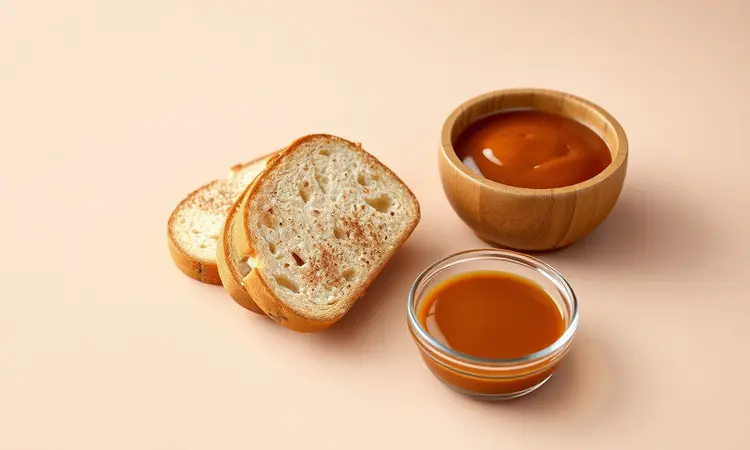
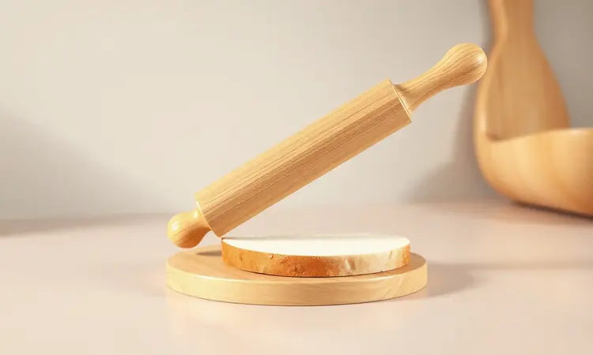
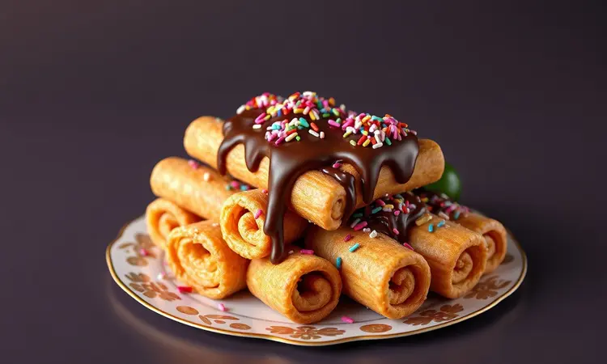
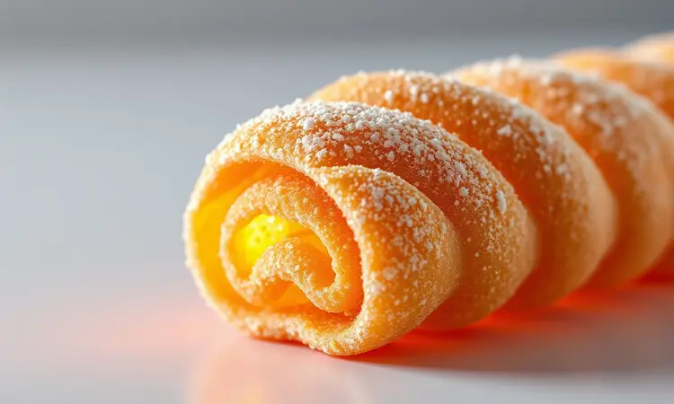

Você adora churros, mas evita fazer em casa por causa da bagunça da fritura ou da ansiedade de não acertar o ponto da massa? Saiba que sua solução está bem aqui, na sua cozinha, usando um ingrediente que você provavelmente tem agora mesmo na despensa.

Neste guia, vamos transformar simples fatias de pão de forma em churros irresistíveis, feitos na airfryer: crocantes por fora, macios por dentro e sem aquele óleo escorrendo.

Prepare-se para redescobrir o prazer de um churro gourmet, feito por você, com menos bagunça e muito mais sabor.

<SummaryList products={frontmatter.top_products} />

## Por que o Churros de Pão de Forma na Airfryer virou Febre?

Imagine conseguir o sabor e a crocância de um churro de feira sem precisar encarar uma panela de óleo quente nem dominar técnicas complexas de massa. Essa é a magia que conquistou tantas pessoas.

A receita aproveita o que você já tem: pão de forma fresco, açúcar e canela. Na airfryer, o calor circulante faz a mágica de dourar e crispar o pão, criando aquela textura que parece ter saído de um carrinho gourmet.

E o melhor: o recheio é só uma questão de suas preferências, permitindo que cada lote seja uma nova experiência. É praticidade que virou tradição caseira.

## Ingredientes Necessários: O que você precisa ter em mãos

A beleza desta receita está em sua simplicidade. Para um lote básico, você vai precisar apenas de pão de forma, manteiga derretida (ou óleo vegetal), açúcar e canela em pó. Isso mesmo: quatro ingredientes para começar sua jornada.

O doce de leite, o chocolate ou qualquer outro recheio entram como protagonistas opcionais, dando o toque pessoal que faz a diferença.

### O Segredo do Pão de Forma Ideal para esta Receita

Escolher o pão certo é o primeiro passo para o sucesso. Pães muito rústicos ou de casca grossa podem dificultar o enrolar e não ficam tão crocantes. O ideal é aquele pão fofinho e fresco, que ao ser amassado sutilmente com um rolo, fica maleável sem rasgar.

Sua textura neutra serve como tela em branco, permitindo que o sabor do açúcar com canela brilhe. Se o pão estiver muito seco, um leve borrifo de água ajuda a dar flexibilidade.

### Recheios Clássicos e Criativos

Aqui começa a diversão. Os recheios clássicos como doce de leite cremoso ou chocolate derretido são garantia de sorrisos. Mas e se hoje você quisesse surpreender?

Uma camada fina de creme de avelã com banana em rodelas, um toque de geleia de frutas vermelhas ou até uma misturinha de cream cheese com mel transformam o simples em extraordinário.

A dica é ser generoso, mas não exagerado: cerca de uma colher de chá por churro já cria aquele fio de sabor que te faz fechar os olhos de prazer.

## Ferramentas Úteis: O que facilita o seu trabalho?

<ProductBox 
  title={frontmatter.top_products[0].title} 
  image={frontmatter.top_products[0].image} 
  link={frontmatter.top_products[0].link} 
/>

Com os seus ingredientes escolhidos, vamos às ferramentas que transformam o processo em algo quase terapêutico.

Um rolo de macarrão (ou mesmo uma garrafa vazia) para amassar o pão levemente, uma faca afiada para cortar tirinhas uniformes e um pincel de silicone para espalhar a manteiga são seus principais aliados. E para o momento mágico?

Um tapete de silicone ou papel manteiga no fundo da airfryer evita grudar e facilita a limpeza depois. Você não precisa de equipamentos profissionais, só do básico que torna a execução suave.

### A Importância do Pincel de Silicone para a Crocância

<ProductBox 
  title={frontmatter.top_products[1].title} 
  image={frontmatter.top_products[1].image} 
  link={frontmatter.top_products[1].link} 
/>

Esse pequeno herói merece atenção especial. Enquanto uma escova tradicional pode soltar cerdas e acumular resíduos, o pincel de silicone espalha a manteiga derretida com precisão, garantindo que cada dobra do pão receba sua camada dourada.

É essa camada que, ao assar, vai caramelizar levemente, criando aquela crocância que estala ao morder. Mais higiênico, mais fácil de limpar e mais eficiente: um investimento que vale cada centavo para quem ama cozinhar com qualidade.

## Passo a Passo Ilustrado: Como preparar o Churros Perfeito

Agora vamos juntar tudo em uma sequência que parece mágica, mas é pura técnica simples. Em menos de 20 minutos, você terá churros prontos para impressionar.

### 1. Preparando a Base: Achatando e Cortando o Pão

Comece passando o rolo levemente sobre cada fatia de pão. Você não quer transformá-lo em uma folha de papel, apenas torná-lo mais fino e maleável. Depois, corte cada fatia em três tiras longitudinais, criando retângulos perfeitos para enrolar.

Esses retângulos vão absorver o sabor e dourar uniformemente, garantindo que cada centímetro esteja tão gostoso quanto o outro.

### 2. Recheando e Enrolando (Técnica para não vazar)

Pegue uma tirinha, espalhe uma fina linha do seu recheio escolhido ao longo de uma das extremidades, deixando uma borda limpa de cerca de 1 cm. Comece a enrolar firmemente, mas com carinho, como se estivesse fazendo um charuto.

Ao chegar ao final, passe um dedinho molhado na borda limpa e pressione para selar. Esse selo com água funciona como cola natural durante o cozimento, mantendo todo o tesouro cremoso bem guardado dentro.

### 3. Finalização com Manteiga, Açúcar e Canela

Este é o ritual que define o sabor tradicional. Logo após retirar os churros dourados da airfryer, enquanto ainda estão quentes e receptivos, pincele-os generosamente com manteiga derretida.

Em seguida, mergulhe-os ou polvilhe sobre eles uma mistura de açúcar e canela (a proporção clássica é 4 partes de açúcar para 1 de canela, mas ajuste ao seu paladar).

O calor faz a manteiga derreter o açúcar, criando uma cobertura brilhante e levemente caramelizada que gruda nos dedos e derrete na boca.

## Tempo e Temperatura na Airfryer: Como não deixar secar demais

<ProductBox 
  title={frontmatter.top_products[2].title} 
  image={frontmatter.top_products[2].image} 
  link={frontmatter.top_products[2].link} 
/>

O segredo do sucesso está em entender que a airfryer é mais gentil que o óleo quente. Pré-aqueça a 180°C por 5 minutos. Isso cria o ambiente ideal para que o exterior doure rapidamente, selando a umidade interna.

Coloque os churros em uma única camada, sem amontoar, e deixe por 8 a 10 minutos, virando na metade do tempo. Fique de olho a partir do minuto 8: você quer um dourado uniforme, não marrom escuro.

Essa temperatura média permite que o calor penetre sem ressecar o pão por dentro, mantendo aquela textura macia que contrasta perfeitamente com a crosta crocante.

## 5 Variações Irresistíveis para Incrementar sua Receita

Uma vez dominada a técnica básica, seu criativo pode voar.

Que tal: 1) A versão salgada gourmet: recheio de requeijão com orégano e finalização com parmesão ralado; 2) O tropical: recheio de doce de leite com coco ralado e cobertura de açúcar com canela; 3) O festivo: mergulhar a ponta do churro em chocolate derretido e granulado colorido; 4) O elegante: usar açúcar de confeiteiro misturado com raspas de limão siciliano; 5) O surpreendente: recheio de geleia de pimenta e cobertura de açúcar mascavo.

Cada variação é uma nova descoberta esperando para acontecer na sua cozinha.

## Dicas de Ouro para uma Crocância de Profissional

Duas coisas separam um bom churro de um churro inesquecível. Primeiro, sempre, sempre pré-aqueça sua airfryer. Esse choque térmico inicial é o que ativa a crocância.

Segundo, trate a manteiga derretida como seu melhor amigo: aplique-a enquanto os churros ainda estão quentes da airfryer. Ela atua como primer para o açúcar com canela, garantindo aderência perfeita e aquele brilho convidativo. Um terceiro segredo bônus?

Sirva imediatamente. A crocância é um momento fugaz que deve ser celebrado na hora.

## Erros Comuns: Por que meu churros ficou murcho ou abriu?

Se seus churros saíram da airfryer murchos, o provável culpado é a modelagem. Enrole com confiança, pressionando bem para tirar bolsas de ar. O ar preso expande com o calor e depois colapsa, deixando o churro flácido.

Se eles abriram durante o cozimento, revisite sua técnica de selagem: aquela borda final precisa estar bem colada. E se não douraram por igual, verifique se não estão muito amontoados na cesta.

O espaço é generoso: cada churro precisa de seu território para que o ar quente circule livremente.

## Acessórios Essenciais para quem AMA Receitas na Airfryer

<ProductBox 
  title={frontmatter.top_products[3].title} 
  image={frontmatter.top_products[3].image} 
  link={frontmatter.top_products[3].link} 
/>

Se você já se apaixonou pela praticidade da airfryer, alguns acessórios vão transformar sua experiência. Uma grelha elevada permite cozinhar duas camadas de uma vez (churros e salgadinhos para a festa, por exemplo).

Formas redondas antiaderentes são ideais para preparar mini tortas doces. Mas o item mais subestimado é o borrifador de óleo, que permite aplicar uma finíssima camada de óleo ou manteiga derretida com controle total, garantindo crocância sem excesso.

Essas pequenas ferramentas expandem infinitamente o que sua airfryer pode fazer por você.

## Perguntas Frequentes (FAQ) sobre Churros de Pão de Forma

1. Posso usar pão integral? Pode, mas o resultado será mais denso e menos crocante. O ideal para começar é o pão branco tradicional.

2. Posso congelar os churros antes de assar? Sim! Modele, coloque em uma assadeira sem encostar e congele. Quando firmes, transfira para um saco. Asse direto do congelador, acrescentando 2-3 minutos ao tempo.

3. E se não tenho pincel de silicone? Use as costas de uma colher para espalhar a manteiga, ou mesmo os dedos (com cuidado). Não será tão uniforme, mas funciona.

4. O recheio precisa estar frio? Não, mas recheios muito quentes podem amolecer o pão e dificultar o enrolar. Temperatura ambiente é perfeita.

## Conclusão

O que começou como um simples desejo por churros sem complicação se transformou em uma habilidade culinária que você carrega para sempre. Este método não é apenas sobre substituir ingredientes; é sobre democratizar um prazer que antes parecia distante.

Com um punhado de itens que você já tem em casa e a técnica passo a passo que acabou de dominar, aqueles churros crocantes e irresistíveis não são mais uma lembrança de feira, mas uma realidade que pode surgir da sua cozinha a qualquer momento.

Cada lote que você fizer vai ganhar sua marca pessoal, seja no recheio secreto, no ponto de crocância ou na apresentação. Então, respire fundo, pegue seu pão de forma e transforme o ordinário em extraordinário.

Sua próxima lembrança feliz está a poucos minutos de distância, e ela começa agora mesmo com você na cozinha.