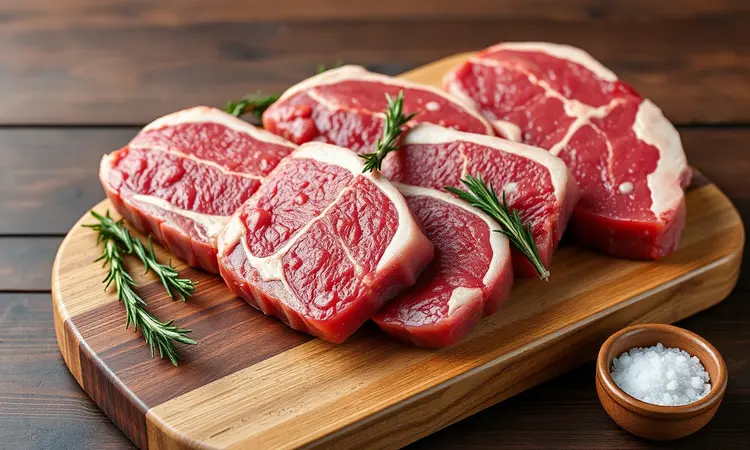
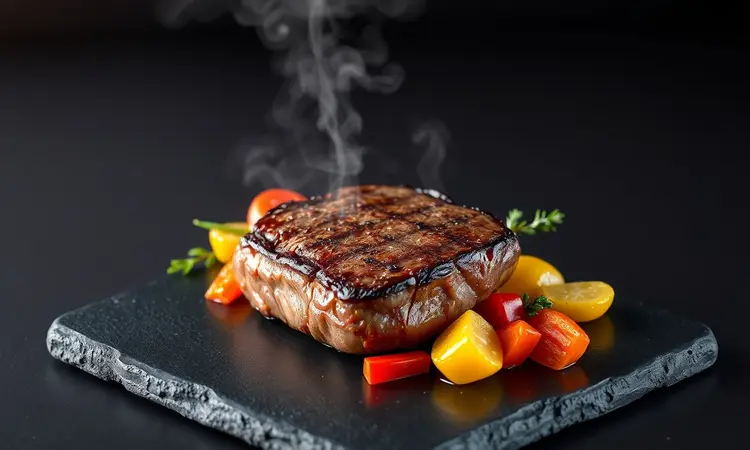
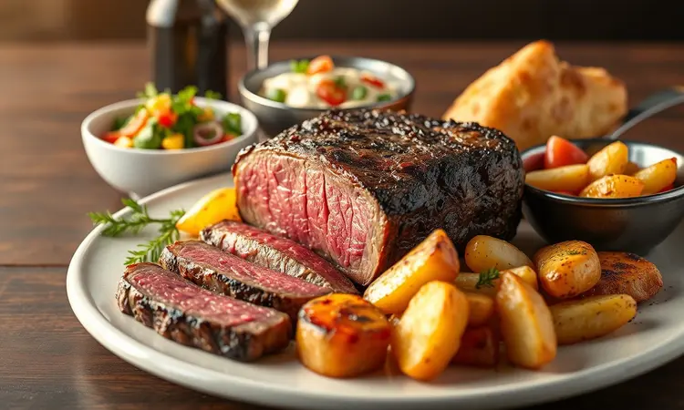

Você tem aquela lembrança do primeiro bife na airfryer? Aquele momento de expectativa, seguido da decepção ao encontrar uma carne mais parecida com sola de sapato do que com uma refeição gourmet.

Eu já passei por isso, e foi justamente frustrando essas experiências que descobri os segredos para transformar o contrafilé na airfryer em uma obra de arte culinária.

Neste guia, vou te levar além das receitas básicas mostrando como cada detalhe, da escolha do corte ao momento de servir, pode fazer diferença entre um bife qualquer e aquele que faz todos na mesa pedirem mais.

<SummaryList products={frontmatter.top_products} />

## Por que preparar contrafilé na airfryer é uma excelente escolha?

Imagine conseguir aquela crosta dourada e crocante que você só encontra em restaurantes caros, mas sem precisar se preocupar com a fumaça da churrasqueira ou com a gordura que respinga pelo fogão.

É exatamente isso que a airfryer oferece: uma tecnologia que circula ar quente de forma inteligente, selando a carne por fora enquanto mantém os sucos naturais presos por dentro. O resultado?

Tempo de preparo que cabe na sua rotina mais corrida, menos bagunça na cozinha e a liberdade de saborear um contrafilé gourmet mesmo em dias de semana.

É a combinação perfeita de praticidade, saúde e sabor que transforma o preparo do bife de um trabalho chato em um momento de prazer genuíno.

## Como escolher o corte de contrafilé ideal para a airfryer

Aquela peça perfeita que você vê no açougue tem segredos que vão além da aparência.

Para encontrar o contrafilé que vai render um bife digno de restaurante na sua airfryer, olhe além do preço e preste atenção em dois detalhes que fazem toda diferença: a gordura entremeada e, claro, a espessura.

### A espessura perfeita para não ressecar

Enquanto muitas pessoas se preocupam apenas com o preço da carne, o verdadeiro segredo está em uma medida tão simples quanto precisa: entre 2,5 e 3 centímetros de espessura. Por quê?

Porque essa é a medida ideal para criar um equilíbrio mágico na airfryer: tempo suficiente para desenvolver aquela crosta dourada tão desejada, mas não tanto a ponto de transformar o interior em algo seco.

É como se a carne tivesse seu próprio sistema de defesa contra o ressecamento, mantendo todos os sucos exatamente onde precisam estar para que cada mordida seja uma experiência que derrete na boca.

## Melhores modelos de Airfryer para grelhar carnes com eficiência

<ProductBox 
  title={frontmatter.top_products[0].title} 
  image={frontmatter.top_products[0].image} 
  link={frontmatter.top_products[0].link} 
/>

Se você está realmente comprometido em transformar sua cozinha em um restaurante particular, a escolha do equipamento certo pode ser tão importante quanto a qualidade da carne.

Imagine, por exemplo, o WAP Air Fryer Barbecue Digital 10L com seu espeto rotativo que simula à perfeição o giro lento das churrasqueiras profissionais, criando uma crosta uniforme em todo o contrafilé enquanto você relaxa sem se preocupar com fumaça.

Já para famílias que transformam as refeições em verdadeiros eventos gastronômicos, a Philco Air Fryer Oven 12L PFR2200P oferece a capacidade de assar acompanhamentos completos enquanto a carne grelha, tudo em um só aparelho.

E se o espaço na sua cozinha permite sonhar mais alto, a Oster Forno e Fryer de 15 litros é como ter um chef profissional à sua disposição, preparando desde legumes grelhados até sobremesas, tudo enquanto seu contrafilé atinge o ponto perfeito.

Escolher entre eles não é uma questão técnica, mas sim de qual experiência culinária você quer criar em casa.

## Temperos infalíveis: do básico ao Dry Rub gourmet

O que transforma um simples bife em uma memória gastronômica? Muitas vezes, são apenas alguns grãos de pimenta e uma pitada de sal na hora certa. Começar com o clássico que nunca falha: sal grosso moído na hora e pimenta do reino fresca.

Esse duo tão simples tem o poder de realçar os sabores naturais da carne sem competir com eles.

Mas se você quer surpreender, imagine criar uma camada crocante de sabor que vai muito além do esperado.

Um dry rub gourmet, feito com açúcar mascavo que carameliza na superfície, páprica defumada que lembra churrascos de infância, alho em pó que penetra nas fibras e um toque pessoal de suas especiarias favoritas.

Deixe essa mistura abraçar a carne por pelo menos 30 minutos antes de levá-la à airfryer esse tempo de espera é o que permite que cada partícula de sabor encontre seu lugar perfeito, garantindo que o primeiro e o último pedaço sejam igualmente memoráveis.

## Receita Passo a Passo: O Contrafilé na Airfryer Perfeito

Agora chegou o momento mágico onde teoria encontra prática. Comece aquecendo sua airfryer a 200°C por 3 a 5 minutos enquanto você dá os toques finais no contrafilé que já está bem temperado.

Coloque a carne cuidadosamente na cesta, garantindo espaço para o ar circular livremente, e deixe a magia acontecer por 15 a 20 minutos, virando na metade do tempo como se estivesse virando as páginas de um livro que você não consegue parar de ler.

### A importância do pré-aquecimento

Aqueles poucos minutos de pré-aquecimento são como acalmar o palco antes de uma grande apresentação.

Eles garantem que, no exato momento em que a carne tocar a superfície aquecida, a circulação de ar já esteja no seu melhor ritmo, selando instantaneamente a superfície e criando uma barreira protetora que mantém os sucos exatamente onde pertencem: dentro do seu bife.

É um detalhe tão simples que muitos ignoram, mas que faz toda diferença entre uma carne que se defende do ressecamento e uma que simplesmente se entrega ao calor.

## Tabela de Tempo e Temperatura para cada Ponto da Carne

Cada preferência de ponto tem seu próprio ritmo e temperatura ideal. Para um mal passado que mantém a suculência quase crua no centro, pense em 8 a 10 minutos a 200°C.

O ponto médio, aquele equilíbrio perfeito entre textura e sabor, pede paciência de 10 a 12 minutos na mesma temperatura. Já o bem passado, que muitos temem que resseque na airfryer, pede entre 12 e 15 minutos com o mesmo calor constante.

Mas aqui está o segredo que transforma essa tabela de meras informações em garantia de sucesso: essas são diretrizes, não mandamentos.

A verdadeira maestria vem de observar, de sentir o aroma que começa a tomar sua cozinha, de aprender a reconhecer visualmente quando a carne está pronta para te surpreender.

## Termômetro de carne: O acessório indispensável para o ponto exato

<ProductBox 
  title={frontmatter.top_products[1].title} 
  image={frontmatter.top_products[1].image} 
  link={frontmatter.top_products[1].link} 
/>

Se fosse para escolher apenas um acessório além da própria airfryer, seria sem dúvida um termômetro digital de carne. Por quê? Porque ele transforma a adivinhação em ciência exata.

Enquanto modelos analógicos têm seu charme nostálgico, um termômetro digital é como ter um assistente pessoal que te sussurra no ouvido exatamente quando seu contrafilé atingiu os 54°C do ponto ideal, garantindo que nem um segundo a mais ou a menos comprometa a textura perfeita que você buscou desde o início.

É o investimento que paga a si mesmo na primeira vez que você serve um bife exatamente como queria, sem aquela dúvida ansiosa enquanto corta a primeira fatia.

## O segredo da suculência: Por que você deve deixar a carne descansar

Retirar o contrafilé da airfryer e sentir a tentação imediata de cortá-lo é um teste de paciência que todo amante de carne enfrenta.

Mas aqui está o que acontece durante aqueles 5 a 10 minutos de espera: os sucos que fugiram para as extremidades durante o cozimento começam uma jornada lenta e deliberada de volta ao centro da carne, redistribuindo-se de forma uniforme.

É como se o bife estivesse se preparando internamente para sua grande apresentação.

Cortar antes desse momento é como abrir um presente antes de terminar de embrulhá-lo: você perde parte da surpresa, do encanto e, principalmente, da suculência que transforma uma refeição em uma experiência.

## Erros comuns que deixam o bife duro e como evitá-los

Quantas vezes você já ouviu que o segredo do bife macio está em marinadas complicadas ou técnicas impossíveis? A verdade é que a maioria dos problemas vem de erros simples que qualquer um pode corrigir.

Cortar a carne ainda fumegante, por exemplo, é como abrir as comportas e deixar todos os sucos valiosos escorrerem para o prato em vez de ficarem na carne.

Temperar apenas minutos antes do cozimento é outro equívoco comum, o sal precisa de tempo para trabalhar suas fibras. E cortar contra o sentido das fibras? Esse é o detalhe que separa um bife que exige esforço para mastigar de um que quase se desfaz sozinho na boca.

São ajustes pequenos no processo que geram diferenças enormes no resultado final.

## Pinças de cozinha ideais para não furar a carne

<ProductBox 
  title={frontmatter.top_products[2].title} 
  image={frontmatter.top_products[2].image} 
  link={frontmatter.top_products[2].link} 
/>

Enquanto muitas pessoas usam qualquer garfo ou espátula para virar a carne, existe um detalhe que os chefs profissionais entendem profundamente: cada furo é uma porta de saída para a suculência.

Por isso, as pinças com pontas de silicone ou nylon não são apenas um acessório, são uma ferramenta de preservação.

Elas permitem que você vire, ajuste e sirva seu contrafilé sem criar aqueles pequenos orifícios que parecem insignificantes até você perceber que é por ali que os sucos mais valiosos decidem escapar.

É a diferença entre manipular a carne com cuidado cirúrgico e tratá-la como mais um ingrediente na panela.

## Acompanhamentos deliciosos para servir com seu bife

Um contrafilé perfeito merece companhias à altura. Pense em um purê de batatas tão cremoso que parece abraçar o bife a cada garfada, ou em legumes grelhados que mantêm uma crocância que contrasta perfeitamente com a maciez da carne.

Uma salada de rúcula com tomates cereja oferece o frescor que limpa o palato entre uma mordida e outra, enquanto um arroz à grega bem feito traz aquele conforto que lembra refeições especiais de família.

Cada acompanhamento não é apenas um complemento, é parte de uma sinfonia de sabores e texturas onde o contrafilé é a estrela principal, mas nunca sozinho no palco.

## Perguntas Frequentes (FAQ)

É normal se perguntar se marinar realmente faz diferença ou se aqueles minutos extras de descanso valem a espera.

A resposta para ambas está na experiência: marinar não é obrigatório, mas é o que transforma um bom bife em um bife inesquecível, permitindo que os sabores penetrem profundamente nas fibras.

Sobre o tempo de descanso, pense nesses minutos como o intervalo entre a preparação e a degustação, onde a carne termina de se preparar para você sem sua intervenção.

E quanto ao tempo de cozimento? Sim, 10 a 15 minutos é um bom ponto de partida, mas seu verdadeiro guia será aprender a confiar em seus sentidos e, quando possível, na precisão de um termômetro.

## Conclusão

Dominar o contrafilé na airfryer é muito mais do que seguir uma receita: é aprender a conversar com a carne, a entender como cada detalhe, da espessura do corte aos minutos de descanso, contribui para criar uma experiência que vai além do prato.

É sobre transformar o ato de cozinhar em um ritual de cuidado, onde a praticidade da airfryer se une ao respeito pelos ingredientes.

Agora você tem não apenas as informações, mas o entendimento do porquê cada passo importa.

A escolha do corte com a espessura perfeita, os temperos que contam histórias, o pré-aquecimento que prepara o palco, o termômetro que transforma incerteza em confiança e, finalmente, a paciência de esperar que a carne se prepare para ser apreciada.

Tudo isso converge para aquela fatia perfeita que prova que a sofisticação não está na complexidade, mas na atenção aos detalhes que realmente importam. O próximo passo é simples: escolha seu corte favorito, aqueça sua airfryer e comece sua própria jornada gastronômica.

O sabor do sucesso está a apenas alguns ajustes de distância.