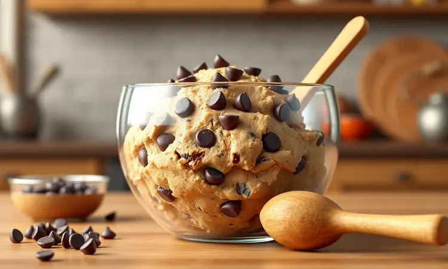
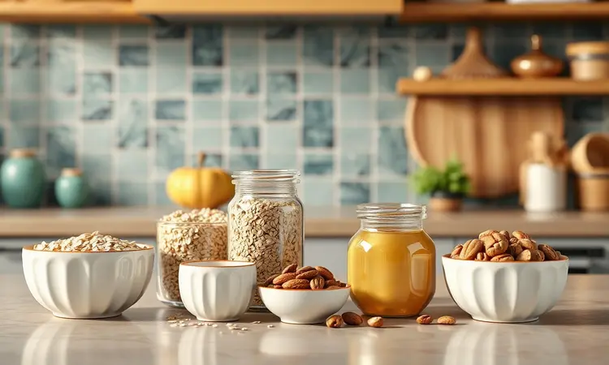
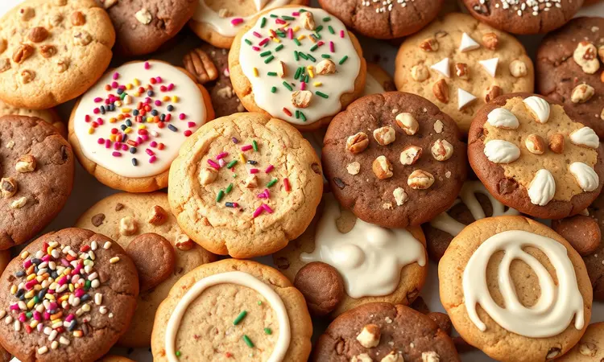

Já sentiu aquela vontade irresistível de comer um cookie quentinho, mas desistiu só de pensar em ter que preaquecer o forno convencional por 20 minutos? Você não está sozinho.

A boa notícia é que a sua fritadeira sem óleo é a ferramenta secreta para preparar cookies perfeitos, crocantes por fora e macios por dentro, em uma fração do tempo.

Neste guia definitivo, vou te mostrar não apenas a receita básica, mas todos os truques de temperatura e tempo que os chefs usam para garantir que seus cookies na air fryer nunca fiquem duros ou crus no meio. Prepare-se para elevar o nível do seu lanche da tarde.

<SummaryList products={frontmatter.top_products} />

## Por que Fazer Cookie na Air Fryer é um Caminho sem Volta?

<ProductBox 
  title={frontmatter.top_products[0].title} 
  image={frontmatter.top_products[0].image} 
  link={frontmatter.top_products[0].link} 
/>

Imagine a cena: aquela vontade repentina de algo doce, e em menos de 10 minutos você está mordendo um cookie recém-saído da air fryer, ainda quentinho. É essa velocidade mágica que transforma completamente sua relação com a cozinha.

Enquanto um forno convencional leva tempo para pré-aquecer, sua air fryer está pronta quase instantaneamente, tornando os momentos de desejo incontrolável por doces imediatamente realizáveis.

E a textura? Ah, a textura é onde a mágica realmente acontece. A circulação rápida do ar quente cria uma casquinha crocante que se quebra perfeitamente, revelando um interior macio e chewy, quase como um abraço aconchegante.

É exatamente o que você procura em um cookie perfeito, mas sem a necessidade de horas de espera ou montanhas de gordura.

Claro, alguns tipos de cookies requerem atenção especial, mas com as orientações certas, sua air fryer se torna a melhor amiga dos momentos doces.

## Utensílios Necessários: O que Você Precisa Além da Fritadeira

<ProductBox 
  title={frontmatter.top_products[1].title} 
  image={frontmatter.top_products[1].image} 
  link={frontmatter.top_products[1].link} 
/>

Antes de mergulhar nas delícias, vamos conversar sobre os companheiros de jornada que vão tornar tudo mais fácil. Você não precisa de uma cozinha profissional, apenas alguns aliados estratégicos.

Comece com as tigelas para misturar seus ingredientes com amor. As formas são sua próxima escolha importante: pequenas ramequins de cerâmica ou vidro funcionam como berços perfeitos para cada cookie.

Se preferir algo mais simples, até forminhas de empada podem fazer o trabalho com charme.

Agora, seu protetor secreto: o papel manteiga ou papel perfurado. Ele evita que seus cookies fiquem grudados, garantindo que cada um saia perfeito da cesta.

Uma espátula ou colher será sua extensão criativa para modelar a massa, e um borrifador de óleo pode dar aquele toque suave que facilita a remoção.

Se sua air fryer permitir, uma grelha pode ser uma adição interessante para otimizar espaço quando a demanda por cookies aumenta (e vai aumentar).

## A Melhor Receita de Cookie na Air Fryer (Passo a Passo)

Aqui está onde a brincadeira fica séria, ou melhor, deliciosa. Vamos à receita que vai conquistar seu coração e seu paladar.

### Lista de Ingredientes Selecionados

<ProductBox 
  title={frontmatter.top_products[2].title} 
  image={frontmatter.top_products[2].image} 
  link={frontmatter.top_products[2].link} 
/>

Vamos começar pelos personagens principais desta história doce. A manteiga (com ou sem sal, conforme sua preferência) traz aquele sabor reconfortante que todos amamos.

Para a doçura perfeita, combine açúcar mascavo e branco em um abraço que cria textura e profundidade de sabor.

O ovo unifica tudo com sua magia ligante, enquanto o extrato de baunilha sussurra seu aroma inconfundível pela cozinha. A farinha de trigo forma a base sólida, realçada pelo toque sutil do fermento em pó que dá o leve crescimento.

E então, as estrelas: suas gotas de chocolate favoritas, castanhas crocantes ou passas doces. Eles são a personalidade única de cada cookie.

### Modo de Preparo Detalhado: Do Mix à Cesta

Em uma tigela, misture seus ingredientes secos como se estivesse preparando um pó mágico. Em outra, bata a manteiga com os açúcares até criarem um creme fofo que parece uma nuvem doce. Adicione o ovo e a essência de baunilha, incorporando suas almas à mistura.

Agora, a cerimônia de união: misture os ingredientes secos aos molhados até formar uma massa que pede para ser abraçada. É aqui que você adiciona suas gotas de chocolate ou nozes, escondendo tesouros em cada porção.

Modele bolinhas com as mãos, sentindo a massa promissora. Distribua na cesta da air fryer forrada com seu papel manteiga, dando espaço generoso para que cada cookie possa expandir seus horizontes.

Em cerca de 8 a 10 minutos a 180°C, você terá dourado perfeito nas bordas e maciez convidativa no centro.

## O Segredo da Textura: Tempo e Temperatura Ideais

<ProductBox 
  title={frontmatter.top_products[3].title} 
  image={frontmatter.top_products[3].image} 
  link={frontmatter.top_products[3].link} 
/>

Aqui mora o segredo que transforma boa massa em cookies lendários. Pense na temperatura entre 160°C e 180°C como a zona de conforto dourada, onde a mágica acontece. Os 8 a 15 minutos de cozimento são seu intervalo para a transformação completa.

Cada air fryer tem sua personalidade, e seus cookies também. Por isso, confie em seus olhos: quando as bordas começam a dourar e o centro ainda mantém aquela promessa de maciez, é hora da grande revelação.

O pré-aquecimento breve é como aquecer os aplausos antes do espetáculo.

## Dicas de Especialista para o Cookie Perfeito

<ProductBox 
  title={frontmatter.top_products[4].title} 
  image={frontmatter.top_products[4].image} 
  link={frontmatter.top_products[4].link} 
/>

Batendo bem a manteiga com os açúcares, você cria a base aerada que torna cada mordida leve. A essência de baunilha não é apenas ingrediente, é a assinatura aromática que anuncia algo especial.

Ao misturar os ingredientes secos, faça-o com cuidado, mantendo a textura prometida. O pré-aquecimento de 3 minutos a 180°C prepara o palco. Seu papel manteiga não é apenas proteção, é a garantia de sucesso.

Ao modelar as bolinhas, pense em dar a cada uma seu espaço pessoal para respirar e crescer. Se notar dourar muito rápido, ajuste sutilmente a temperatura, sua air fryer está apenas conversando sobre suas preferências.

### Como evitar que o cookie espallhe demais ou fique seco

O segredo está no equilíbrio preciso. Seguir as medidas de gordura não é apenas precisão, é respeito à receita. Adicione líquidos com parcimônia, cada gota conta na textura final.

Aqui está uma das dicas mais valiosas: após formar suas bolinhas, dê a elas 30 minutos de descanso na geladeira. Não é apenas espera, é tempo para a massa firmar sua identidade, impedindo que se espalhe demais durante o cozimento.

E o momento de retirada é sagrado: quando as bordas sussurram dourado e o centro ainda mantém sua promessa de maciez, é hora de celebrar.

## Substituições Inteligentes: Sem Açúcar Mascavo ou Sem Ovos?

A vida acontece, e nem sempre temos todos os ingredientes à mão. Felizmente, a criatividade na cozinha é infinita.

Se o açúcar mascavo foi esquecido, o açúcar comum pode abraçar seu papel. Se optar pelo mel, lembre-se que ele traz sua própria personalidade doce e umidade, ajustando então outras quantidades líquidas.

Para substituir ovos, uma banana amassada não apenas mantém a estrutura, como adiciona um sutil toque frutado que surpreende agradavelmente. O purê de maçã funciona como outro candidato encantador.

## Variações Deliciosas para Testar Hoje Mesmo

Sua jornada com cookies não precisa parar no clássico. A air fryer é seu playground doce.

Para os amantes de texturas, o cookie de chocolate com nozes oferece crocância dentro da maciez. Um toque cítrico? O cookie de limão refresca o paladar com sua alegria ácida.

Os flocos de coco ralado transportam você para praias tropicais, enquanto o clássico cookie de aveia e passas traz o conforto da tradição reinventado. Cada variação é uma nova história para contar.

## Como Armazenar e Reaquecer para Manter o Sabor de Novo

<ProductBox 
  title={frontmatter.top_products[5].title} 
  image={frontmatter.top_products[5].image} 
  link={frontmatter.top_products[5].link} 
/>

Cookies são feitos para serem apreciados, não apenas no momento quente, mas também nos dias seguintes. O segredo do armazenamento começa com a paciência: deixe-os esfriar completamente, permitindo que encontrem seu equilíbrio perfeito.

Recipientes herméticos ou sacos plásticos com fecho se tornam seus cofres de tesouros. Se empilhar, papel manteiga entre as camadas mantém a individualidade de cada cookie. Temperatura ambiente é seu lar ideal, a geladeira pode alterar sua personalidade.

Quando a saudade do calor bater, sua air fryer está novamente ao seu serviço. Em temperatura moderada de 150°C a 175°C, apenas 2 a 3 minutos revivem a experiência original. Em camada única, cada cookie recebe atenção personalizada.

## Perguntas Frequentes (FAQ) sobre Cookies na Air Fryer

Naturalmente, surgem dúvidas nesta jornada doce. A temperatura realmente varia entre 160°C e 180°C, encontrando o ponto perfeito para seu aparelho e preferência. Os 8 a 12 minutos são uma janela que permite ajustes conforme a espessura da sua massa.

O espaço entre os cookies não é apenas recomendação técnica, é respeito ao crescimento individual de cada um. Para aquela maciez característica, retirar um pouco antes do tempo máximo permite que firmem fora do calor, mantendo o interior perfeito.

Cada receita é uma conversa entre você, seus ingredientes e sua air fryer. O que começa como seguimento de instruções transforma-se em diálogo criativo.

## Conclusão

Fazer cookies na air fryer é mais do que uma alternativa rápida, é uma experiência que resgata a magia da cozinha em minutos.

Do primeiro aroma que invade sua casa ao momento em que você parte aquela casquinha dourada para revelar o interior macio, cada etapa é um convite à satisfação imediata.

Você descobriu que a temperatura precisa entre 160°C e 180°C não é apenas número, é o segredo da textura perfeita. Aprendeu que os 8 a 12 minutos de cozimento são tempo suficiente para criar memórias enquanto o doce se forma.

E principalmente, entendeu que cada air fryer tem sua voz, e ouvi-la é parte da aventura.

Das receitas clássicas às variações criativas, do armazenamento cuidadoso ao reaquecimento que revive a experiência original, você agora possui o conhecimento para transformar momentos de desejo em realidade doce.

Sua próxima sessão de cookies não será apenas sobre assar biscoitos, será sobre criar pequenos momentos de felicidade que cabem na palma da mão e no coração. Qual será a primeira variação que você vai experimentar hoje?