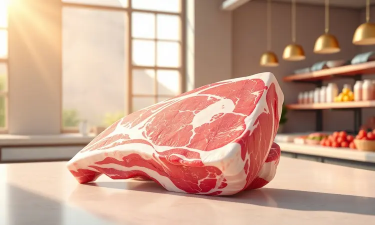
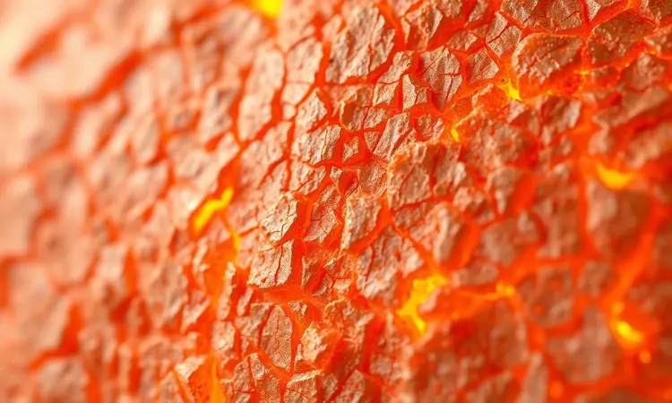
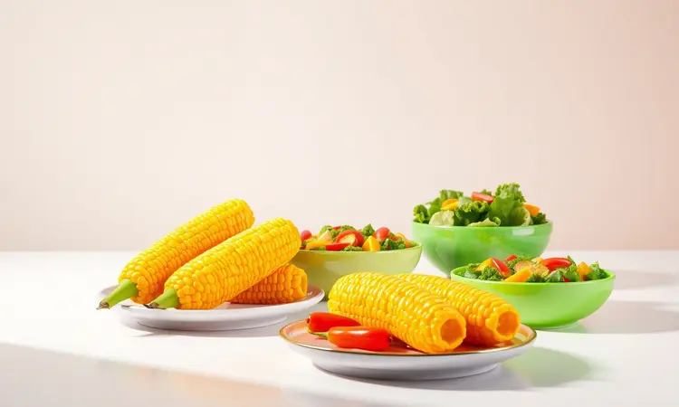

Você já convidou amigos para almoçar e sentiu aquele frio na barriga imaginando se a costelinha de porco ficaria seca ou dura? Aquele momento em que todos estão à mesa esperando por uma carne suculenta que se solta do osso... Se você já passou por isso, hoje tudo muda.

A sua airfryer não é apenas um eletrodoméstico, é o atalho secreto para costelinhas perfeitas sem precisar de anos de experiência ou uma churrasqueira profissional.

Vou te mostrar como transformar o medo em confiança, revelando desde como escolher a peça certa até o truque do papel alumínio que garante maciez absoluta.

<SummaryList products={frontmatter.top_products} />

## Por que preparar costelinha de porco na Airfryer?

Imagine abrir a airfryer e encontrar uma costelinha com aquela casca dourada e crocante, mas que ao primeiro toque do garfo revela uma carne tão macia que quase se desmancha.

Isso não é mágica, é o resultado do ar quente circulando uniformemente, cozinhando a gordura por dentro enquanto cria a textura perfeita por fora. O melhor?

Você usa praticamente zero óleo, o que significa que pode saborear cada pedaço sem aquela sensação de peso depois. E o tempo? Em cerca de 30 minutos você tem um prato digno de restaurante pronto, enquanto a limpeza se resume a tirar o cesto e lavar.

É a receita ideal para quem quer impressionar sem passar horas na cozinha ou lidar com a bagunça do forno tradicional.

## Como escolher a melhor peça de costelinha no mercado

A jornada para uma costelinha perfeita começa muito antes da airfryer, no açougue ou no mercado. Procure por cortes com uma generosa camada de gordura entremeada, essa gordura não é excesso, é o segredo da suculência.

Quando o calor chega, ela derrete lentamente, banhando a carne por dentro. Observe a cor: um rosa vivo indica frescor, enquanto textura firme ao toque sugere qualidade. Se possível, converse com o açougueiro sobre a origem da carne.

Animais criados com cuidado não só são uma escolha mais ética, como frequentemente resultam em sabores mais ricos e complexos. Pense nisso como escolher os ingredientes para uma pintura: quanto melhor a tinta, mais impressionante será a obra final.

## A Airfryer ideal para grandes cortes de carne

<ProductBox 
  title={frontmatter.top_products[0].title} 
  image={frontmatter.top_products[0].image} 
  link={frontmatter.top_products[0].link} 
/>

Preparar costelinhas inteiras ou outras peças grandes requer espaço. Modelos em formato de forno, como a Philips Walita AI551/08 ou a Philco PFR2200P com 12 litros, oferecem a amplitude necessária para que o ar circule livremente ao redor da carne.

Essas airfryers vêm com funções pré-programadas que eliminam adivinhações, você simplesmente seleciona "carne" e ajusta o tempo.

Embora ocupem mais espaço na bancada, essa desvantagem desaparece quando você consegue preparar porções generosas de uma só vez, perfeito para almoços de família ou encontros com amigos.

Antes de começar, lembre-se de pré-aquecer por alguns minutos: esse simples passo garante que o cozimento comece imediatamente, selando os sucos desde o primeiro instante.

## Ingredientes e temperos para uma marinada inesquecível

A transformação de uma simples costelinha em uma experiência memorável acontece na marinada. Combine alho picado e cebola para a base aromática, molho de soja para profundidade salgada, e mel ou açúcar mascavo para criar aquela caramelização dourada.

Ervas como alecrim e tomilho trazem notas terrosas, enquanto pimenta-do-reino e páprica acrescentam calor sutil. O elemento secreto? Suco de limão ou vinagre.

Esses ácidos suaves trabalham como amaciadores naturais, abrindo caminho para que todos os sabores penetrem profundamente. Deixe a carne repousar nesse banho aromático por pelo menos duas horas, ou melhor ainda, durante a noite na geladeira.

Essa paciência será recompensada com cada mordida.

## Passo a passo: Receita de Costelinha de Porco na Airfryer

Com a peça escolhida e marinada, o processo é surpreendentemente simples. Pré-aqueça sua airfryer a 200°C por 5 minutos. Enquanto isso, retire as costelinhas da marinada e seque levemente com papel toalha, essa etapa ajuda a formar uma crosta melhor.

Disponha as peças em uma única camada na cesta, garantindo espaço entre elas para a circulação do ar. Cozinhe por 25 a 30 minutos, virando cuidadosamente na metade do tempo.

Esse movimento garante que todos os lados recebam o calor uniformemente, criando uma douradura perfeita em 360 graus.

### Preparação e limpeza da peça

Antes de qualquer tempero, dê atenção à limpeza da costelinha. Lave rapidamente em água corrente para remover resíduos superficiais, então seque completamente com papel toalha. A umidade na superfície é inimiga da crocância.

Para resultados ainda mais impressionantes, considere remover a fina membrana prateada do lado ossudo. Use uma faca afiada para levantar uma pontinha, segure com uma toalha de papel para melhor aderência, e puxe suavemente.

Essa membrana, quando deixada, pode endurecer durante o cozimento e impedir que os temperos alcancem a carne completamente.

### O segredo do papel alumínio para a suculência máxima

<ProductBox 
  title={frontmatter.top_products[1].title} 
  image={frontmatter.top_products[1].image} 
  link={frontmatter.top_products[1].link} 
/>

Este é o truque que separa as costelinhas boas das excepcionais. Após os primeiros 15 minutos na airfryer, retire rapidamente a cesta e envolva cada peça em papel alumínio, com o lado brilhante voltado para dentro.

Esse envelope cria um microclima úmido onde a carne cozinha no próprio vapor, tornando-se incrivelmente macia. Devolva à airfryer por mais 15 minutos, depois remova o alumínio e finalize por 5-10 minutos sem proteção. O resultado?

Uma textura que lembra o lento cozimento de horas, mas alcançada em fração do tempo, com interior suculento que contrasta deliciosamente com a crosta final crocante.

### Tempo e temperatura: O ajuste fino para não secar

Cada airfryer e cada peça de carne têm sua personalidade. Comece com 180°C por 25 minutos como base, mas fique atento aos sinais. Se após 20 minutos você já vê uma douradura profunda, reduza para 160°C pelos minutos restantes.

A gordura deve derreter lentamente, não queimar rapidamente. A espessura da costelinha é sua principal guia: cortes mais finos podem precisar de menos tempo, enquanto peças mais robustas se beneficiam de temperatura ligeiramente mais baixa por período mais longo.

Confie em seus olhos e nariz mais do que no timer cego.

## Como saber se a costelinha está no ponto certo?

<ProductBox 
  title={frontmatter.top_products[2].title} 
  image={frontmatter.top_products[2].image} 
  link={frontmatter.top_products[2].link} 
/>

A costelinha perfeita fala com você através de todos os sentidos. Visualmente, deve apresentar uma cor dourada caramelizada, não marrom escura.

Ao toque, a superfície deve ceder levemente sob pressão, mas oferecer resistência, sinal de que o interior mantém sua estrutura. O teste clássico: insira um garfo próximo ao osso e torça suavemente. Se a carne começa a se desprender facilmente, está no ponto.

Para precisão científica, um termômetro de cozinha inserido na parte mais espessa deve marcar 63°C. Lembre-se que a carne continua cozinhando um pouco após sair do calor, então retire quando estiver alguns graus abaixo do ideal.

## Variações de cobertura: Barbecue, Mel e Mostarda ou Limão e Ervas

<ProductBox 
  title={frontmatter.top_products[3].title} 
  image={frontmatter.top_products[3].image} 
  link={frontmatter.top_products[3].link} 
/>

Por que se limitar a um único sabor quando você pode criar diferentes experiências? Para os amantes do clássico, unir molho barbecue com uma colher de mel e mostarda dijon cria um equilíbrio perfeito entre doçura fumada e picância elegante.

Aplique nos últimos 5 minutos de cozimento para criar uma camada brilhante e levemente caramelizada. Prefere algo mais fresco? Misture suco de limão, azeite de oliva extra virgem, tomilho e alecrim picados.

Essa marinada cítrica não apenas amacia a carne, como deixa um aroma herbáceo que lembra cozinha mediterrânea. A beleza está na experimentação: faça metade da receita com uma cobertura, metade com outra, e descubra sua preferência pessoal.

## Ferramentas úteis para facilitar o preparo

<ProductBox 
  title={frontmatter.top_products[4].title} 
  image={frontmatter.top_products[4].image} 
  link={frontmatter.top_products[4].link} 
/>

Embora a airfryer seja completa por si só, alguns acessórios transformam o preparo de alegre para prazeroso. Um spray borrifador com óleo permite aplicar uma névoa fina e uniforme, suficiente para a crocância sem excessos.

Formas de silicone que se encaixam no cesto facilitam tremendamente a limpeza depois, a gordura não gruda, basta passar uma esponja. O verdadeiro salva-vidas? Um termômetro de cozinha instantâneo.

Ele elimina todas as dúvidas sobre o ponto da carne, dando a confiança de quem cozinha há décadas. Esses investimentos pequenos pagam-se em resultados consistentes e tranquilidade a cada preparo.

## Dicas extras para a crosta perfeita (Pururuca opcional)

Aquela casca que estala ao cortar e derrete na boca começa com paciência. Após marinar, deixe as costelinhas descansarem descobertas na geladeira por 1-2 horas. Esse período resseca levemente a superfície, criando a base ideal para a crosta se formar.

Durante o cozimento, evite abrir a airfryer frequentemente, cada abertura libera calor e umidade, inimigos da textura crocante. Para os audaciosos que desejam pururuca, nos últimos 3-4 minutos aumente a temperatura para 210°C e observe atentamente.

A pele borbulhará e ficará transparente antes de criar aquelas bolhas douradas características. É preciso atenção, mas o resultado é irresistível.

## Acompanhamentos que combinam perfeitamente com porco

A costelinha é a estrela, mas seu brilho aumenta com a companhia certa. Farofas crocantes, seja de bacon ou com ervas finas, oferecem contraste de textura que complementa a maciez da carne.

Para cortar a riqueza, uma salada de repolho roxo com cenoura ralada e vinagrete leve traz frescor necessário.

Purês cremosos de batata baroa ou mandioquinha acariciam o paladar entre uma mordida e outra, enquanto legumes assados na própria airfryer (após a carne, na mesma gordura saborosa) criam uma refeição completa sem esforço extra.

Pense em harmonia, não em competição: cada elemento deve realçar, nunca ofuscar.

## Erros comuns ao fazer costelinha na Airfryer e como evitá-los

O caminho para a perfeição passa por conhecer os desvios mais comuns. Primeiro, não subestime o poder do espaço: amontoar as costelinhas na cesta cria vapor em excesso, resultando em carne cozida no vapor em vez de assada. Trabalhe em lotes se necessário.

Segundo, temperar apenas superficialmente é convite para sabores planos. Use as mãos para massagear a marinada em cada fenda, entre os ossos, garantindo penetração total. Terceiro, a tentação de abrir constantemente para verificar o progresso.

Cada abertura reduz a temperatura drasticamente, alongando o tempo de cozimento e prejudicando a crosta. Confie no processo e use uma lanterna se precisar espiar pela janela.

## Perguntas frequentes (FAQ)

### Posso colocar a costelinha congelada direto na Airfryer?

Tecnicamente sim, mas os resultados raramente serão os mesmos. O congelamento forma cristais de gelo que rompem as fibras da carne, liberando muita água durante o cozimento.

Essa umidade extra impede a formação da crosta dourada e pode deixar a textura menos interessante. Se realmente necessário, aumente o tempo em 40-50% e espere uma carne mais cozida no vapor do que assada.

A paciência de descongelar lentamente na geladeira (nunca em temperatura ambiente) é recompensada com controle total sobre o resultado final.

### Quanto tempo leva em média para assar 1kg de costelinha?

Para um quilo de costelinha com espessura média, conte com 30-35 minutos a 180°C, virando na metade do tempo. O verdadeiro indicador não é o peso bruto, mas a espessura das peças individuais.

Costelinhas mais finas podem estar prontas em 25 minutos, enquanto cortes mais grossos podem precisar de 40. Comece com o tempo padrão, mas desenvolva o olho clínico: observe a retração da carne dos ossos, a formação de bolhas na gordura e, claro, use o teste do garfo.

Com prática, você saberá pelo cheiro e aparência exatamente quando está perfeita.

## Conclusão

Preparar costelinha de porco na airfryer deixa de ser uma simples receita e torna-se uma experiência de confiança culinária.

Desde a escolha consciente no açougue até o momento em que você serve aquela carne que se desfaz ao toque do garfo, cada etapa é uma oportunidade de criar algo memorável.

A beleza deste método está na sua acessibilidade: não requer equipamentos caros, não gera bagunça e entrega resultados consistentes que impressionam tanto em um jantar íntimo quanto em uma reunião de família.

Mais do que seguir instruções, você está desenvolvendo um instinto para temperaturas, texturas e sabores.

A próxima vez que pensar em costelinha, em vez de imaginar carne seca ou horas na cozinha, visualize aquela casca dourada, o interior suculento e a satisfação de ter criado algo extraordinário com suas próprias mãos.

Experimente hoje mesmo e descubra por que sua airfryer pode ser o segredo melhor guardado da sua cozinha.