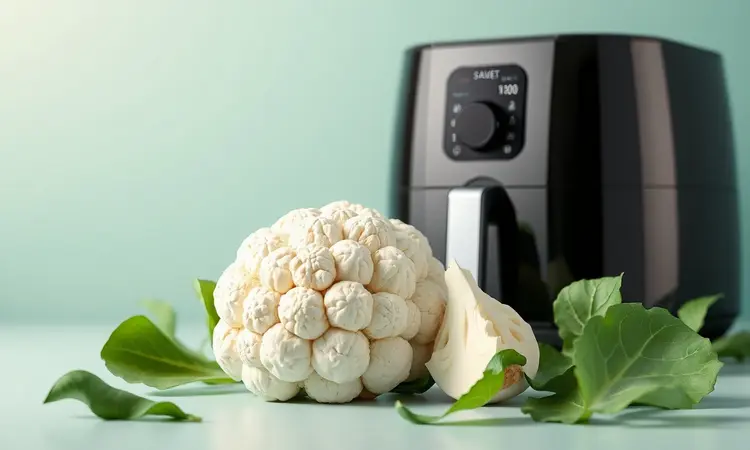
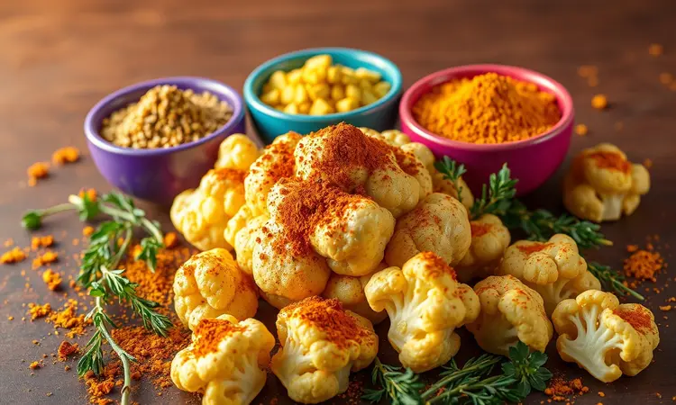
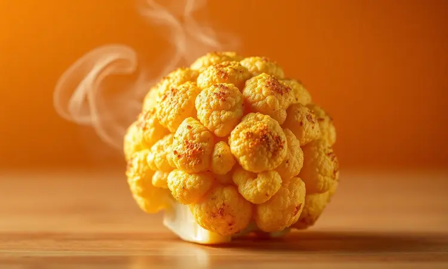
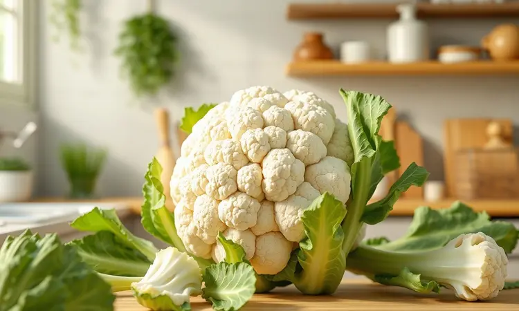

Já tentou fazer couve-flor assada e terminou com algo que parecia mais uma almofada murcha do que um acompanhamento crocante? Essa frustração acaba hoje.

Preparar couve-flor na air fryer é mais do que uma técnica culinária, é a liberdade de transformar esse vegetal humilde em um verdadeiro petisco gourmet.

Você imagina abrir o cesto e encontrar pedaços perfeitamente dourados, com aquele aroma que invade a cozinha e promete uma experiência que vai muito além do 'saudável'?

É exatamente isso que você vai descobrir aqui, desde o segredo da temperatura até os temperos que elevam o sabor a outro patamar.

<SummaryList products={frontmatter.top_products} />

## Por que fazer Couve-Flor na Air Fryer?

Pense na última vez que você se viu debatendo entre o saudável e o saboroso. A air fryer acaba com esse dilema. O calor circulante não apenas substitui a fritura tradicional, como oferece algo mágico: a crocância que você ama com a leveza que seu corpo agradece.

A couve-flor, rica em fibras e nutrientes, se torna a estrela principal, mas não aquela estrela modesta. Ela ganha textura, cor e personalidade. Em poucos minutos, você tem um acompanhamento que não parece 'dieta', mas sim uma escolha inteligente e prazerosa.

A praticidade salva seu tempo, enquanto o sabor conquista seu paladar.

## Pode colocar a couve-flor crua na Air Fryer ou precisa cozinhar antes?

Essa dúvida tira muitas pessoas do jogo antes mesmo de começar. A resposta traz um alívio: você pode colocar a couve-flor crua diretamente na air fryer. Simples assim. Não há necessidade de pré-cozinhar, ferver ou passar por qualquer processo extra.

A máquina foi projetada para transformar o cru em algo perfeito, desde que você siga dois passos simples: cortar em floretes uniformes (o tamanho certo garante que todos fiquem prontos ao mesmo tempo) e temperar bem.

Imagine a praticidade de ir direto ao ponto, sem panela extra, sem água escorrendo, apenas o vegetal e seus temperos favoritos rumo à crocância.

## Receita Passo a Passo: Couve-Flor Crocante e Dourada

Corte a couve-flor em floretes do tamanho de uma mordida perfeita. Em uma tigela, misture-os com uma colher de azeite, sal e pimenta a gosto. A mágica está na distribuição: cada pedacinho precisa estar levemente brilhante, não encharcado.

Aqueça sua air fryer a 200°C e espalhe os floretes em uma camada única. Quinze minutos depois, com uma meia virada no meio do caminho, você terá pedaços dourados por fora e macios por dentro, prontos para serem devorados ainda quentes.

### Ingredientes Essenciais para o Sucesso

Comece com uma couve-flor fresca e firme, aquela que parece resistente ao toque. O azeite de oliva é seu maior aliado, responsável por aquela douradura que faz os olhos brilharem. Para o sabor, construa sua base com sal, pimenta do reino moída na hora e alho em pó.

A páprica doce acrescenta cor e profundidade. Ervas como orégano ou tomilho secos funcionam como o perfume do prato. A medida certa? Uma colher de sopa de azeite é suficiente para cobrir toda a couve-flor sem deixá-la pesada.

### Utensílios que facilitam o preparo

Uma boa faca de chef transforma o corte em um momento prático, garantindo pedaços iguais que cozinham uniformemente. Use uma tigela grande para a mistura, dando espaço para você mexer sem fazer bagunça.

O pincel de silicone merece destaque: ele aplica o azeite com precisão cirúrgica, sem desperdício, garantindo cobertura homogênea. Tenha um pegador de silicone à mão para retirar os floretes quentes sem riscos.

Esses itens não são luxo, são atalhos para resultados consistentes.

### A melhor Fritadeira Sem Óleo (Air Fryer) para vegetais

<ProductBox 
  title={frontmatter.top_products[0].title} 
  image={frontmatter.top_products[0].image} 
  link={frontmatter.top_products[0].link} 
/>

Quando o assunto é vegetais crocantes, alguns modelos se destacam. A Oster oferece fritadeiras digitais com funções pré-programadas que praticamente pensam por você.

A Mondial impressiona com capacidade generosa e tecnologia Dualzone para quem gosta de multitarefas na cozinha. A Philips Walita, pioneira com sua tecnologia Rapid Air, promete e entrega resultados rápidos com aquele crocante característico.

São investimentos que se pagam em praticidade e na qualidade do que chega à sua mesa.

### Pincel de Silicone para temperar

<ProductBox 
  title={frontmatter.top_products[1].title} 
  image={frontmatter.top_products[1].image} 
  link={frontmatter.top_products[1].link} 
/>

Esqueça dedos engordurados ou colheres que não distribuem direito. O pincel de silicone é como ter um pincel de artista na cozinha. Ele espalha marinadas, azeites e molhos com uma uniformidade que faz diferença visual e de sabor.

Resistente a altas temperaturas, não solta cerdas e a limpeza é tão simples quanto passar na água com sabão. Não absorve odores, então seu curry não vai conversar com o alho do próximo uso.

A durabilidade compensa qualquer diferença de preço em relação às versões tradicionais.

## Como Temperar: 3 Variações Irresistíveis

Você já domina o básico. Agora, que tal transformar a couve-flor em três experiências completamente diferentes? Cada uma dessas variações conta uma história de sabor.

### 1. Clássica com Parmesão e Ervas Finas

Depois de misturar os floretes com azeite, sal e pimenta, acrescente uma generosa porção de parmesão ralado e uma pitada de orégano seco. O queijo derrete levemente, criando pontinhos dourados e crocantes que grudam na couve-flor. As ervas finas perfumam cada pedaço.

É a combinação que nunca falha, elegante o suficiente para um jantar especial, mas tão fácil que funciona em um dia de semana qualquer.

### 2. Versão Buffalo Spicy (Estilo Americano)

Prepare os floretes na air fryer até ficarem macios. Enquanto isso, derreta manteiga e misture com molho de pimenta no ponto exato entre ardido e saboroso. Envolva a couve-flor nesse abraço picante e retorne à air fryer por alguns minutos.

O resultado são pedaços que lembram asas de frango buffalo, mas com a leveza vegetal. Perfeito para assistir a um jogo ou quando a vontade de algo intenso bater.

### 3. Opção Vegana com Curry e Cúrcuma

Em uma tigela, crie sua mistura dourada: azeite, curry em pó, cúrcuma e um toque de sal. Adicione os floretes e misture até que cada um esteja pintado de amarelo-laranja.

Na air fryer, essa combição ganha vida, com a cúrcuma oferecendo seu sabor terreo e benefícios anti-inflamatórios. Parece exótico, mas é incrivelmente reconfortante.

## O Segredo da Crocância: Tempo e Temperatura Ideal

Aqui está a fórmula que transforma bom em extraordinário: 200°C por 15 a 20 minutos, com uma mexa cuidadosa no meio do tempo. Por que funciona? O calor alto cria rapidamente uma casca externa crocante, enquanto o interior continua cozinhando suavemente.

Quando você mexe na metade, garante que todos os lados recebam igual atenção, evitando aqueles cantinhos mais claros. O resultado é consistência: cada floret igualmente dourado, igualmente estalante.

### Por que usar um Borrifador de Azeite faz a diferença?

<ProductBox 
  title={frontmatter.top_products[2].title} 
  image={frontmatter.top_products[2].image} 
  link={frontmatter.top_products[2].link} 
/>

O borrifador é o controle remoto da crocância. Ao invés de derramar azeite e torcer para que se espalhe, você aplica uma névoa fina e uniforme sobre todos os floretes. Isso significa menos óleo (e menos calorias) sem sacrificar a textura.

A crocância fica distribuída como um véu dourado, não em manchas oleosas. Escolha um borrifador manual recarregável para evitar aditivos e ter controle total sobre o que está saindo.

## Erros Comuns ao Preparar Couve-Flor na Air Fryer (e como evitá-los)

O maior inimigo da crocância é a umidade. Lave a couve-flor, mas seque cada floret com cuidado, usando uma toalha de papel ou pano limpo. Água residual cria vapor, e vapor é o oposto de crocante. Outro erro é o tempero tímido.

A couve-flor absorve sabores, então seja generoso com seus condimentos. Finalmente, resista à tentação de encher a cesta. Floretes sobrepostos cozinham no vapor uns dos outros, criando um ambiente úmido. Cozinhe em camada única, mesmo que tenha que fazer em duas levas.

A paciência é recompensada com textura perfeita.

## Dica de Sustentabilidade: O que fazer com as folhas e talos?

As folhas e talos que normalmente vão para o lixo guardam segredos deliciosos. Pique as folhas finamente e refogue com alho e azeite para um acompanhamento surpreendentemente saboroso. Os talos mais grossos podem ir para o caldo ou sopa, liberando nutrientes e sabor.

Em saladas, as folhas jovens adicionam crocância e uma cor verde vibrante. É economia inteligente e respeito ao alimento, transformando 'sobras' em protagonistas.

## Informações Nutricionais e Benefícios da Couve-Flor

Cem gramas de couve-flor representam apenas 25 calorias, mas carregam uma explosão nutricional. Rica em vitamina C, fortalece seu sistema imunológico. A vitamina K cuida da saúde óssea. As fibras promovem saciedade e digestão tranquila.

Os antioxidantes combatem o estresse oxidativo no corpo. Quando preparada na air fryer com pouco azeite, você mantém esses benefícios intactos enquanto adiciona o prazer da textura. É o equilíbrio perfeito entre comer bem e se deliciar.

## Perguntas Frequentes (FAQ)

'Quanto tempo realmente leva?' Entre 15 e 20 minutos a 200°C, mas confie nos seus olhos: procure a cor dourada uniforme. 'Posso congelar?' Melhor consumir fresca, pois a textura crocante se perde no congelamento.

'E se não tiver azeite?' Óleo de coco ou abacate em spray funcionam, mas o azeite dá o melhor sabor. 'Preciso virar mesmo?' Sim, essa mexa é o segredo para a uniformidade que faz toda a diferença.

## Conclusão

A couve-flor na air fryer não é apenas mais uma receita saudável. É uma revelação: que comer bem pode ser fácil, rápido e profundamente satisfatório.

É descobrir que um vegetal simples pode se transformar em petisco, acompanhamento gourmet ou até prato principal, dependendo da sua criatividade com os temperos. É sobre recuperar o prazer na cozinha sem complicações, sem sujeira e sem culpa.

Os floretes dourados que saem da air fryer contam uma história de possibilidades, de tempo bem aproveitado, de sabor que surpreende. Eles convidam você a experimentar, a ajustar, a fazer do seu jeito. Comece com o básico, depois ouse nas variações.

Deixe que essa simplicidade crocante transforme não apenas suas refeições, mas sua relação com o ato de cozinhar. Sua próxima leva está esperando.