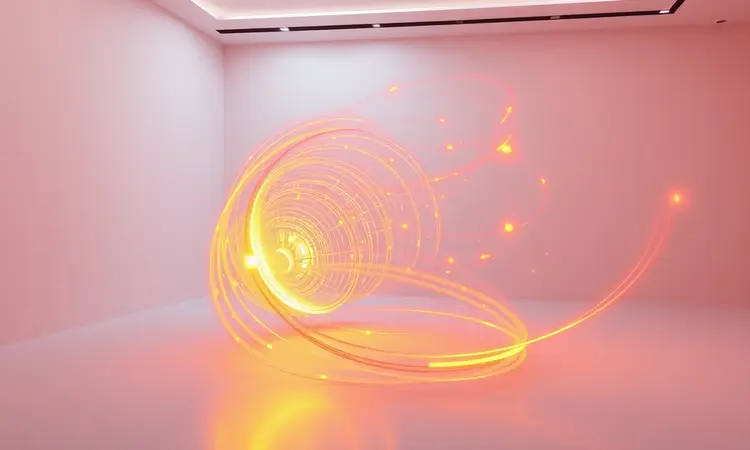
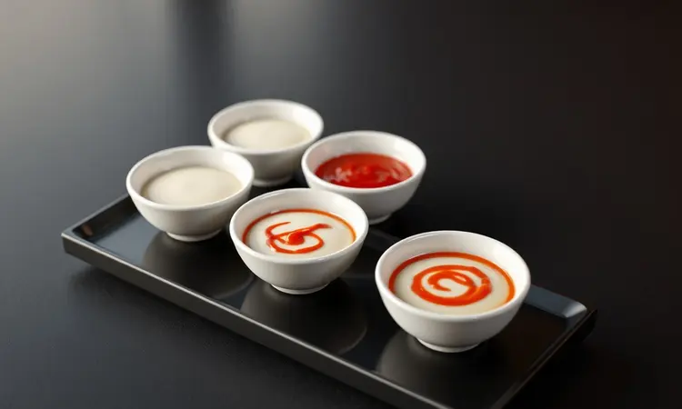

Já tentou fazer coxinha da asa na Air Fryer e o resultado foi um frango pálido ou, pior, seco demais? Se você concorda que nada supera a combinação de uma pele crocante com uma carne soltando do osso, este guia foi feito para você.

Prometo que, ao final desta leitura, você dominará a técnica definitiva para transformar esse corte simples em um banquete de happy hour.

Vamos explorar desde o tempero secreto com mostarda até o tempo exato de cozimento, garantindo que você nunca mais erre o ponto do frango na sua fritadeira elétrica.

<SummaryList products={frontmatter.top_products} />

## Por que a Air Fryer é o melhor método para coxinhas da asa?

Imagine conseguir aquele dourado perfeito e a suculência que faz o caldo escorrer, tudo usando apenas uma colher de óleo. É exatamente isso que a Air Fryer entrega.

A circulação intensa de ar quente age como uma espécie de 'forno turbo', selando rapidamente os sucos da carne enquanto derrete a gordura natural das asas, que escorre pela cesta. O resultado?

Crocância de fritura com a consciência leve de quem está fazendo uma escolha mais inteligente. E o melhor: praticamente não há louça para lavar depois. Para quem valoriza sabor e praticidade no dia a dia, essa combinação é imbatível.

## Receita de Coxinha da Asa na Air Fryer (Passo a Passo)

Vamos direto ao que importa: transformar asas simples em verdadeiras estrelas do happy hour. O segredo está em três pilares: marinada generosa, temperatura alta e paciência estratégica.

### Ingredientes para o tempero clássico e suculento

Para criar a base de sabor que vai penetrar até o osso, você precisará de:

*   **Sal e pimenta-do-reino** a gosto (o sal realça, a pimenta desperta)

*   **Alho** picado ou em pó (o coração aromático da receita)

*   **Suco de limão** (para amaciar a carne e dar aquele toque cítrico refrescante)

*   **Ervas** como orégano ou salsinha picada (frescor que faz diferença)

*   **Um fio de azeite** (só para ajudar os temperos a grudarem e iniciarem o processo de douramento)

É com essa combinação simples, mas poderosa, que você começa a construir memórias gustativas.

### Modo de preparo: Do marinado à fritadeira

Aqui está onde a mágica acontece. Em uma tigela, misture todos os ingredientes com as coxinhas da asa já lavadas e muito bem secas com papel toalha (esse é um passo não negociável para a crocância).

Massageie bem, garantindo que cada peça esteja completamente coberta pela marinada. Deixe descansar por pelo menos 30 minutos, mas se tiver tempo, deixe na geladeira por 2 horas. Essa paciência inicial é o que transforma um frango bom em um frango inesquecível.

Pré-aqueça sua Air Fryer a 200°C por 3 a 5 minutos. Dispor as asas na cesta em uma única camada, sem amontoar. O ar precisa circular livremente para criar a crocância uniforme que você deseja.

Asse por 25 a 30 minutos, mas aqui vem o truque mestre: na marca dos 12 ou 15 minutos, vire cada coxinha com cuidado. Esse simples gesto garante que todos os lados recebam a mesma carga de calor dourado.

Ao final, você terá asas com a pele estaladiça por fora e a carne tão macia por dentro que quase se desprende do osso sozinha.

## Variações de Tempero: Da Mostarda ao Estilo Rita Lobo

Dominada a base clássica, é hora de brincar e personalizar. Que tal uma versão com mostarda dijon e mel? A mostarda dá profundidade e um leve ardor, enquanto o mel carameliza na pele, criando uma camada crocante e levemente adocicada divine.

Para um toque inspirado em Rita Lobo, pense em ervas frescas como alecrim e tomilho, amassadas com alho e azeite, criando uma pasta perfumada que gruda perfeitamente no frango.

Se seu paladar pede uma viagem, uma marinada com molho de soja, gengibre ralado e um toque de mel traz um sabor umami e oriental que surpreende. O universo de sabores é vasto, e a Air Fryer é sua aliada para explorá-los todos com a mesma crocância garantida.

## Tempo e Temperatura: O guia definitivo para diferentes texturas

A ciência por trás da crocância perfeita é precisa. Os 200°C são a temperatura ideal porque são altos o suficiente para selar rapidamente os sucos (evitando que o frango fique seco) e baixos o suficiente para cozinhar a carne por completo sem queimar a pele.

Os 25 a 30 minutos são a janela de tempo mágica. Mas atenção: isso pode variar. Coxinhas menores ou em menor quantidade podem ficar prontas mais rápido. O verdadeiro sinalizador não é o relógio, mas sim seus sentidos.

Procure um dourado uniforme e aquele aroma irresistível que toma conta da cozinha. Virar na metade do tempo continua sendo a regra de ouro para um resultado impecável em 360 graus.

## 5 Segredos para garantir a pele crocante por fora e suculenta por dentro

1.  **Marinada com antecedência:** Dê tempo para o sabor viajar. Deixe o frango descansando com os temperos por pelo menos 30 minutos, de preferência na geladeira.

2.  **Seca total:** Após lavar, seque cada coxinha agressivamente com papel toalha. A água é inimiga da crocância.

3.  **Espaço é luxo:** Nunca sobrecarregue a cesta. O ar quente precisa circular livremente entre as peças para cozinhar e dourar uniformemente.

4.  **O poder da virada:** Não subestime o ato de virar as asas na metade do cozimento. É o que garante que todos os lados tenham a mesma textura perfeita.

5.  **Um fio de óleo, só um:** Mesmo na Air Fryer, uma leve pincelada de azeite ajuda na condução de calor e no início do processo de douramento, sem tornar o prato gorduroso.

## Erros Comuns: O que evita que seu frango fique perfeito

O maior inimigo da coxinha crocante é a umidade. Colocar o frango ainda molhado na Air Fryer é pedir para ele cozinhar no vapor, não dourar. Outro deslize comum é a ansiedade de lotar a cesta.

Amontoar as asas cria um microclima úmido que impede a circulação de ar e resulta em algumas peças cozidas, outras nem tanto.

Por fim, não confie apenas no timer. Cada aparelho tem sua personalidade. Use os 25-30 minutos como guia, mas confie nos seus olhos e no aroma. Se parecem douradas e cheiram irresistíveis, provavelmente estão prontas.

## Melhores Modelos de Air Fryer para Receitas com Frango

<ProductBox 
  title={frontmatter.top_products[0].title} 
  image={frontmatter.top_products[0].image} 
  link={frontmatter.top_products[0].link} 
/>

Para quem leva a sério a missão do frango crocante, o modelo da Air Fryer faz diferença. A Philips Walita RI9252/91 é uma campeã pela tecnologia Rapid Air que distribui calor de forma extremamente uniforme, garantindo que cada coxinha saia igualmente dourada.

Famílias maiores ou quem adora receber amigos podem se encantar pela capacidade generosa da Philco Air Fryer Oven PFR2200P ou da versátil Electrolux EAF9 Oven Rita Lobo, que funciona como um forno multifunções.

Se o espaço na bancada é limitado, modelos compactos como a Mondial AFN-40-FR são totalmente capazes de entregar coxinhas crocantes e suculentas. A escolha se resume a quantas pessoas você costuma alimentar e quantas funções extras deseja.

### Utensílios essenciais para manipular o frango com segurança

<ProductBox 
  title={frontmatter.top_products[1].title} 
  image={frontmatter.top_products[1].image} 
  link={frontmatter.top_products[1].link} 
/>

Enquanto suas asas marinam, é o momento de pensar na segurança. Ter uma tábua de corte dedicada a carnes cruas (de preferência de polietileno, mais fácil de sanitizar) evita a contaminação cruzada com outros alimentos.

Luvas descartáveis podem parecer um exagero, mas são uma barreira prática entre suas mãos e os sucos da marinada.

### Termômetro de cozinha: O segredo dos chefs para o ponto ideal

<ProductBox 
  title={frontmatter.top_products[2].title} 
  image={frontmatter.top_products[2].image} 
  link={frontmatter.top_products[2].link} 
/>

Para eliminar qualquer dúvida e alcançar a precisão de um restaurante, invista em um termômetro de cozinha digital. Ele é o atalho para a perfeição: basta espetar na parte mais grossa da asa (sem tocar no osso) e esperar o mostrador marcar 74°C.

Nessa temperatura, você tem a garantia científica de que a carne está perfeitamente cozida, segura e no ápice da suculência. É o fim das tentativas e erros.

## Sugestões de Acompanhamentos e Molhos para Happy Hour

Uma coxinha da asa perfeita merece um cenário à altura. Para um happy hour equilibrado, ofereça palitos de cenoura e pepino gelados, que refrescam o paladar entre uma mordida e outra.

Chips de batata-doce assados na própria Air Fryer complementam a crocância com um toque levemente adocicado.

Nos molhos, a diversão continua. Um molho de iogurte com ervas finas (endro, cebolinha) é fresco e leve. O barbecue clássico traz a doçura defumada que casa perfeitamente com o frango.

Para os corajosos, um molho de pimenta e mel oferece a combinação arrebatadora de ardido e doce. Sirva em potinhos separados e deixe cada convidado montar sua própria experiência.

## Perguntas Frequentes (FAQ) sobre Coxinha da Asa na Fritadeira

Preciso usar óleo? Quase não. A gordura natural do frango e um fio de azeite na marinada são suficientes. O excesso de óleo pode criar fumça e impedir o douramento.

Posso congelar as asas já temperadas? Perfeitamente! É uma ótima tática de *meal prep*. Coloque as asas com a marinada em um saco freezer e leve ao congelador. Descongele na geladeira na véspera.

Como saber se está no ponto sem termômetro? A pele deve estar firme e bem dourada. Se furar a carne na parte mais grossa, os sucos devem sair claros, sem vestígios rosados.

Por que virar na metade do tempo? A Air Fryer aquece principalmente por cima. Virar garante que o lado de baixo também receba calor direto, resultando em uma crocância uniforme em toda a superfície.

## Conclusão

Transformar simples coxinhas da asa em um banquete memorável não é sobre ter equipamentos caros ou técnicas secretas inacessíveis.

É sobre entender a lógica por trás do processo: respeito ao tempo da marinada, cuidado na secagem, atenção à distribuição do calor e, acima de tudo, a coragem de experimentar novos sabores.

A Air Fryer é a ferramenta que democratiza essa qualidade, entregando crocância de restaurante com uma facilidade que cabe na rotina mais corrida.

Agora que você tem o guia completo, desde a escolha do tempero até o momento exato de servir, é hora de aquecer o aparelho, chamar os amigos e transformar sua próxima happy hour em uma celebração do sabor que todos vão querer repetir. Mãos à obra e bom apetite!