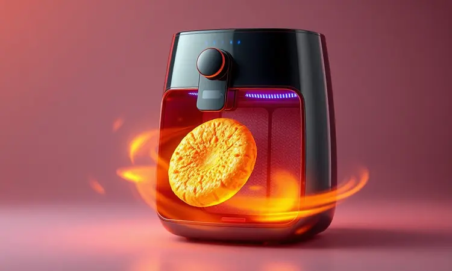
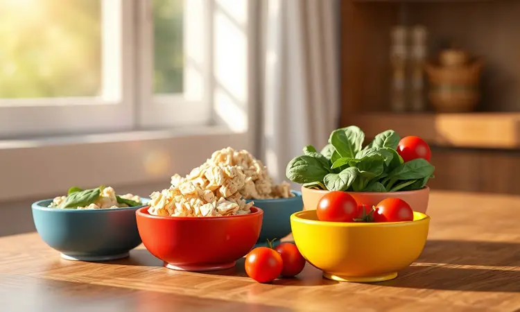
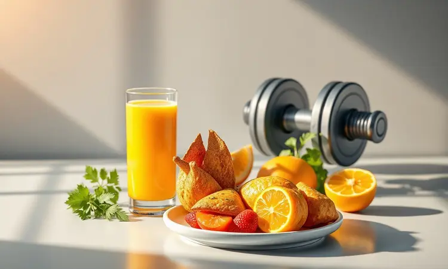

Você já imaginou transformar três ingredientes básicos em um lanche que parece ter saído daquela lanchonete gourmet, mas sem culpa e em apenas 10 minutos?

É exatamente isso que a crepioca na airfryer oferece: crocância profissional sem sujeira na cozinha e sem complicação. Vou te guiar por todos os segredos para você dominar essa técnica que vai revolucionar seus lanches fitness.

<SummaryList products={frontmatter.top_products} />

## Por que trocar a frigideira pela Airfryer no preparo da crepioca?

Imagine preparar sua crepioca sem precisar ficar vigiando, virando ou limpando respingos de óleo pela bancada. Com a airfryer, você programa o tempo e esquece.

O ar circulante envolve cada pedacinho da massa de forma uniforme, criando aquela crocância dourada por fora enquanto mantém o interior macio. Sem óleo excessivo, sem adivinhações sobre o ponto certo.

Você simplesmente coloca, programa e quando o apito toca, encontra uma crepioca perfeita. A limpeza? A maioria das cestas vai direto para a máquina de lavar louça. Mais tempo saboreando, menos tempo limpando.

## Ingredientes essenciais para a massa perfeita

A beleza está na simplicidade. Em uma tigela, você precisará apenas de:

- **1 ovo grande:** sua fonte de proteína e o 'cola' que dá estrutura

- **1 colher de sopa bem cheia de goma de tapioca:** a base que se transforma em crep crocante

- **Uma pitada generosa de criatividade:** sal, pimenta, queijo ralado, ervas finas...

É dessa combinação minimalista que nasce a magia. O ovo traz nutrientes e firmeza, a tapioca oferece a textura única, e seus temperos dão personalidade. Você está literalmente a dois minutos de mistura do início de um lanche que vai surpreender.

## Passo a Passo: Como fazer Crepioca na Airfryer em 10 minutos

Misture todos os ingredientes até obter uma consistência homogênea (não se preocupe com bolinhas de tapioca, elas se dissolvem no calor). Despeje em uma forma que caiba na sua airfryer, espalhando uniformemente. Programe 180°C por 8 a 10 minutos.

A mágica acontece sozinha.

### Preparo da massa e o ponto ideal

A consistência que você busca é similar a uma massa de panqueca: fluida o suficiente para se espalhar, mas não tão líquida que escorra. Se sua mistura parecer muito grossa, uma gota de água resolve. Se estiver muito fina, mais uma pitada de tapioca.

Deixe descansar por um ou dois minutos enquanto preaquece a airfryer - esse breve intervalo permite que a tapioca absorva a umidade, garantindo uniformidade.

Quando despejar na forma, pense em criar uma camada fina e uniforme: é o segredo para que toda a superfície fique igualmente crocante.

### Tempo e temperatura: O ajuste para não queimar

Cada airfryer tem sua personalidade, mas 180°C é sua temperatura de ouro. Comece com 8 minutos e observe. Você quer bordas levemente douradas e o centro firme.

Se precisar, adicione mais um ou dois minutos, mas fique atento aos últimos 60 segundos - é quando a transformação final acontece. Se sua airfryer tende a ser mais agressiva, 170°C por 10 minutos pode funcionar melhor.

Aprendendo essa relação tempo/temperatura, você nunca mais terá surpresas desagradáveis.

## Acessórios que facilitam o preparo e evitam a sujeira

<ProductBox 
  title={frontmatter.top_products[1].title} 
  image={frontmatter.top_products[1].image} 
  link={frontmatter.top_products[1].link} 
/>

O investimento em uma forma de silicone própria para airfryer muda completamente o jogo. A massa não gruda, a remoção é instantânea e a limpeza leva segundos.

Se ainda não tem uma, o papel manteiga perfurado é seu melhor amigo - ele permite que o ar circule enquanto protege sua cesta. Tigelas pequenas com bico (ou até mesmo um pote com tampa, para misturar agitando) aceleram ainda mais o processo.

São detalhes que transformam o preparo de uma tarefa em um ritual prazeroso.

### Uso de Papel Manteiga Perfurado para máxima crocância

<ProductBox 
  title={frontmatter.top_products[2].title} 
  image={frontmatter.top_products[2].image} 
  link={frontmatter.top_products[2].link} 
/>

Enquanto o papel manteiga comum pode reter umidade, o perfurado age como uma rede que deixa o ar quente trabalhar em todas as direções. O resultado? Crocância uniforme em toda a superfície, sem pontos moles.

Corte um círculo um pouco menor que sua cesta, faça alguns furos extras se quiser, e posicione antes de despejar a massa. Quando terminar, basta descartar o papel - sua airfryer continua limpa como nova. É um truque simples com impacto gigante na textura final.

## Dicas de Ouro: Como deixar a crepioca com textura de salgadinho

Quer aquele 'crunch' satisfatório que lembra seu salgadinho favorito? Adicione uma colher de queijo ralado à massa. Não só pelo sabor, mas porque o queijo derrete e forma uma rede crocante irresistível.

Pré-aquecer a airfryer por 3 minutos antes de colocar a massa é outro segredo: o choque térmico inicial cria uma camada externa imediatamente crocante. E atenção à espessura - muito grossa, fica borrachuda; muito fina, quebra fácil.

Encontre seu ponto ideal e anote para sempre.

## 5 Variações de Recheios Proteicos e Saudáveis

Agora que você domina a base, a diversão realmente começa. Tente:

1. **Frango-espinafre:** frango desfiado, espinafre refogado e uma pitada de noz-moscada

2. **Atum-cremoso:** atum sólido com abacate amassado e cebolinha

3. **Mediterrâneo:** tomate seco, ricota e manjericão fresco

4. **Brasileiríssimo:** carne moída temperada com pimentão e cebola

5. **Energia pura:** ovos mexidos com brócolis picadinho

Cada uma dessas combinações transforma sua crepioca em uma refeição completa, balanceando proteínas, gorduras boas e vegetais. É onde a receita básica se torna sua tela em branco para criar.

## Erros comuns que deixam sua crepioca borrachuda

A frustração de abrir a airfryer e encontrar uma massa emborrachada geralmente vem de três equívocos:

- **Água em excesso na mistura:** A tapioca precisa de líquido, mas em equilíbrio. Se sua massa escorre facilmente, adicione mais tapioca.

- **Sem descanso:** Aqueles dois minutos de paciência enquanto a airfryer preaquece fazem a tapioca hidratar uniformemente.

- **Temperatura muito alta:** 190°C ou mais cozinham rápido por fora, mas deixam o interior cru e úmido.

Corrigindo esses pontos, você elimina para sempre o fantasma da crepioca borrachuda.

## Tabela Nutricional: Calorias e benefícios para quem treina

Uma crepioca básica (ovo + tapioca + temperos) gira em torno de 150 calorias, com aproximadamente 10g de proteína e 15g de carboidratos de absorção gradual. Para quem treina, isso significa energia sustentada sem picos de insulina, e proteína para reparo muscular.

Ao adicionar queijo, você aumenta as proteínas; com vegetais, as fibras. É a combinação perfeita: saciedade prolongada, nutrição de qualidade e versatilidade infinita. Seu corpo agradece depois do treino.

## Perguntas Frequentes (FAQ)

É a mesma coisa que tapioca? Não exatamente. Enquanto a tapioca tradicional é apenas a goma hidratada, a crepioca incorpora ovo, ganhando em proteína e estrutura.

Posso fazer sem ovo? Pode, mas a textura e nutrição mudam completamente. Para versões veganas, experimente linhaça hidratada ou purê de banana.

Congela bem? Sim! Depois de pronta e fria, armazene entre folhas de papel manteiga no congelador. Para consumir, 5 minutos na airfryer a 180°C.

Minha airfryer é pequena, funciona? Perfeitamente. Apenas ajuste a quantidade para não transbordar e mexa na metade do tempo se necessário.

## Conclusão

Dominar a crepioca na airfryer é conquistar mais do que uma receita - é ganhar autonomia na cozinha saudável. Em 10 minutos, você transforma ingredientes simples em um lanche que nutre, satisfaz e surpreende.

Crocância sem óleo excessivo, versatilidade sem complicação, sabor sem culpa. Cada vez que o apito da sua airfryer anunciar uma crepioca perfeita, você não estará apenas saciando a fome, mas celebrando uma habilidade que simplifica sua rotina e eleva sua alimentação.

Agora é sua vez: escolha sua variação favorita, ajuste os temperos ao seu paladar e descubra como algo tão simples pode ser tão transformador. Sua próxima crepioca perfeita está a apenas uma mistura de distância.