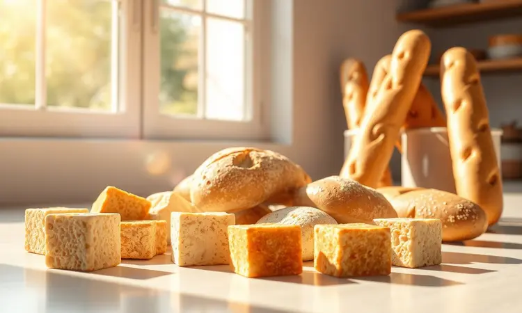
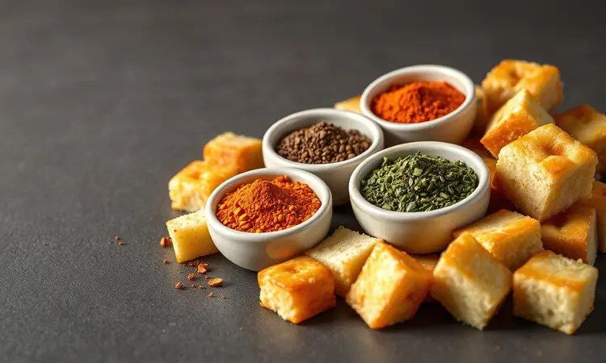
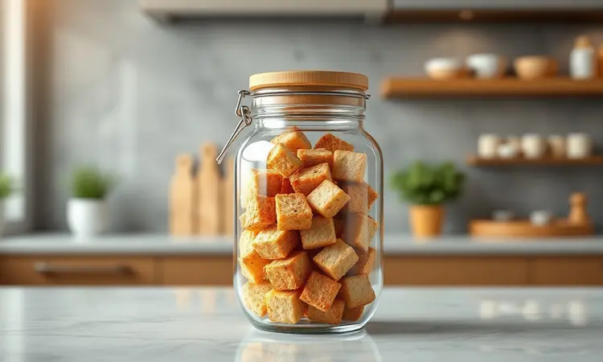

Você já sentiu que faltava aquele 'toque de mestre' na sua salada ou sopa favorita? Os croutons são o acompanhamento ideal para elevar qualquer prato, mas nem sempre temos tempo para vigiar o forno.

A boa notícia é que fazer croutons na airfryer é a solução definitiva, mais rápida, mais uniforme e incrivelmente crocante. Neste guia, você vai aprender o passo a passo completo, desde a escolha do pão até os segredos de tempero que vão transformar suas refeições.

<SummaryList products={frontmatter.top_products} />

## Por que Fazer Croutons na Airfryer é Melhor que no Forno?

Imagine sair do trabalho cansado e ainda ter que esperar o forno aquecer por 15 minutos só para fazer alguns croutons. Com a airfryer, esse ritual fica para trás. O aparelho aquece quase instantaneamente, como se soubesse da sua urgência por algo crocante.

E aqui está a mágica: a circulação intensa de ar quente envolve cada pedacinho de pão individualmente, criando uma crosta dourada e perfeita por fora enquanto mantém uma suave resistência por dentro.

É a diferença entre algo feito com pressa e algo feito com cuidado, mas em tempo recorde.

A economia de energia é apenas um bônus. O verdadeiro presente é ver seus croutons prontos enquanto você ainda procura o azeite na despensa.

## Qual o Melhor Tipo de Pão para Fazer Croutons?

Pense na crocância perfeita. Aquele som ao morder que faz você fechar os olhos de prazer. Essa experiência começa com o pão certo. O francês ou a ciabatta são campeões indiscutíveis, com sua crosta firme que transforma cada cubo em uma pequena obra de arte crocante.

Mas não subestime os pães mais densos, como o integral. Eles trazem personalidade, um sabor terroso que conversa perfeitamente com temperos mediterrâneos.

### Posso Usar Pão Amanhecido ou 'Velho'?

Aqui está um segredo que transforma economia em sofisticação: o pão que perdeu sua maciez para o café da manhã ganha nova vida como a estrela da sua salada.

A textura mais seca funciona como uma esponja perfeita para absorver azeite e temperos, intensificando cada sabor de forma que o pão fresco nunca conseguiria.

É a beleza da cozinha inteligente: transformar o que parecia destino certo para o lixo em petiscos dourados que fazem seus convidados perguntarem qual é o seu segredo.

## Receita de Croutons na Airfryer: Passo a Passo Básico

Corte o pão em cubos generosos, como presentes pequenos que você está embalando para si mesmo. Regue com azeite suficiente para fazer cada pedaço brilhar prometendo sabor, acrescente seus temperos favoritos e misture com as mãos, sentindo a textura.

Agora, a parte mágica: 180°C por 5 a 7 minutos na airfryer, interrompendo na metade para dar uma sacudida amorosa.

Esse é o tempo ideal para preparar um café enquanto sua cozinha se enche do aroma que antecipa o prazer.

### Ingredientes Essenciais

Os protagonistas dessa história são simples mas poderosos. Comece com seu pão escolhido. O azeite não é apenas gordura, é o veículo que carrega sabor e cria a textura dourada que buscamos. Os temperos? Eles são a personalidade da sua criação.

Alho em pó sussurra tradição, páprica traz calor discreto, queijo ralado promete sedução salgada. Escolha os que falam com sua memória gustativa.

### Tempo e Temperatura Ideal para a Crocância Perfeita

180°C é a temperatura do equilíbrio: quente o suficiente para criar cor sem pressa para queimar, paciente como um cozinheiro experiente.

Os 5 a 10 minutos de espera dependem do tamanho dos seus cubos e da quantidade, mas sempre com uma pausa no meio para garantir que cada lado receba igual atenção.

É como assistir a transformação acontecer: de pão simples a pequenas joias crocantes.

## 5 Variações de Temperos para Inovar no Sabor

Por que se limitar ao óbvio quando você pode criar assinaturas? 

1. O clássico mediterrâneo: alho em pó com ervas finas te transporta para um jantar à beira-mar

2. A ousadia picante: páprica e pimenta-do-reino para quem gosta de emoção no paladar

3. A elegância italiana: queijo parmesão ralado dançando com orégano

4. A surpresa doce: canela e açúcar mascavo criam um contraste inesperado

5. A refrescância cítrica: limão e tomilho para dias quentes que pedem leveza

Cada combinação conta uma história diferente sobre quem você é como cozinheiro.

## Melhores Modelos de Airfryer para Receitas Rápidas

<ProductBox 
  title={frontmatter.top_products[0].title} 
  image={frontmatter.top_products[0].image} 
  link={frontmatter.top_products[0].link} 
/>

Assim como um bom par de tênis para correr ou canetas especiais para escrever, a airfryer certa torna o processo não apenas eficiente, mas prazeroso. 

A Mondial oferece espaço generoso (4L) em formato compacto, perfeita para cozinhas que precisam de versatilidade sem ocupar todo o balcão. 

A Philips Walita com sua tecnologia Rapid Air é a opção para quem busca resultados consistentemente crocantes, como se tivesse um assistente profissional na cozinha.

A Oster impressiona com funções pré-programadas que praticamente adivinham o que você precisa, enquanto a Electrolux combina desempenho robusto com a elegância de quem sabe o que está fazendo.

Escolher entre elas é encontrar a parceira que se adapta ao ritmo da sua vida na cozinha.

## Dicas de Ouro para Evitar que os Croutons Queimem

O segredo está nos detalhes que parecem pequenos mas fazem toda diferença. Cubos uniformes garantem que nenhum pedaço fique para trás, queimando enquanto os outros ainda estão pálidos. 

Não sobrecarregue a cesta; pense nisso como dar espaço pessoal para cada crouton desenvolver seu caráter. A temperatura de 180°C já mencionada é sua aliada, mas ficar atento e sacudir na metade do tempo é o cuidado que transforma bom em excepcional.

## Como Armazenar e Manter os Croutons Crocantes por Dias

A tristeza de croutons moles é evitável com um simples ritual. Um pote hermético à temperatura ambiente se torna o santuário onde sua crocância é preservada. A umidade é o inimigo silencioso, mas facilmente derrotado com esse cuidado básico.

E se, por acaso, perderem um pouco do vigor? Dois minutos na airfryer e eles renascem, frescos como no primeiro dia.

### O Segredo do Pote de Vidro e a Umidade

Há algo quase terapêutico em armazenar croutons em pote de vidro. Você pode ver a promessa da crocância através das paredes transparentes, como joias em uma vitrine.

O vidro forma uma barreira perfeita contra a umidade ambiente, enquanto permite que você controle visualmente seu estopo de pequenas delícias.

É o mesmo princípio das avós com seus biscoitos enlatados, mas com a estética moderna de quem entende que beleza também se come.

## Sugestões de Acompanhamento Além da Salada Caesar

Os croutons são artistas versáteis que brilham em vários palcos. Imagine-os mergulhando em uma sopa cremosa de abóbora, adicionando contraste textural que faz cada colherada ser uma experiência completa.

Espalhados sobre um gratinado, criam uma cobertura crocante que faz o queijo derretido ainda mais indulgente. Em saladas de grão-de-bico ou quinoa, são os pontos de interesse que quebram a monotonia.

E para momentos simples? A combinação com hummus ou patês transforma um lanche rápido em uma pausa gourmet.

## FAQ: Perguntas Frequentes sobre Croutons na Fritadeira Elétrica

Posso usar pão fresco ou precisa estar duro?
Ambos funcionam, mas o pão um pouco mais velho absorve melhor os temperos, transformando necessidade em virtude.

Qual temperatura não falha?
180°C é o ponto ideal que dora sem queimar, como o equilíbrio perfeito entre pressa e cuidado.

Preciso mexer durante o processo?
A sacudida na metade do tempo é como virar um disco de vinil no meio, garante que ambos os lados tenham sua vez de brilhar.

Quais temperos realmente fazem diferença?
Os que falam com suas memórias gustativas, mas não subestime o poder do simples sal e do azeite de qualidade.

## Conclusão

Fazer croutons na airfryer vai além de uma técnica culinária rápida. É a reconquista de um prazer simples que parecia perdido na correria do dia a dia.

É transformar economia em sofisticação, pão amanhecido em pequenas joias douradas, minutos de espera em antecipação aromática.

Cada etapa, desde a escolha do pão até o clique final da airfryer, é um ato de cuidado pessoal disfarçado de preparo culinário.

Os croutons que saem dali não são apenas acompanhamentos, são testemunhas de que mesmo nos dias mais corridos, podemos reservar momentos para criar algo extraordinário a partir do ordinário.

Hoje, quando sentir que falta aquele toque especial na sua refeição, lembre-se: a transformação está a 180°C e 5 minutos de distância. Sua airfryer aguarda para provar que o sabor caseiro nunca precisou de horas, apenas da intenção certa.