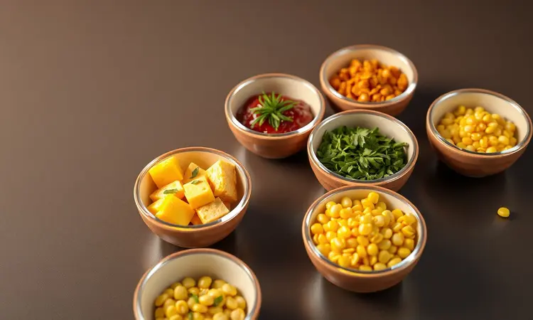

Você adora um cuscuz quentinho, mas não tem uma cuscuzeira em casa? Ou talvez só queira mais praticidade no seu dia a dia? Há uma solução que parece mágica: fazer cuscuz na airfryer.

É para quem busca agilidade sem abrir mão do sabor e da textura tradicional da receita da avó. Muitos tentam, mas acabam com uma massa seca ou mal cozida.

Neste guia, você vai aprender o passo a passo definitivo, desde a hidratação correta do flocão até os truques de mestre para garantir que ele saia leve e fofinho em poucos minutos. Prepare-se para transformar sua rotina com esta receita que é pura conveniência.

<SummaryList products={frontmatter.top_products} />

## Por que Preparar Cuscuz na Airfryer é a Revolução da Cozinha Prática

Essa técnica é uma verdadeira revolução porque transforma um ritual que antes demandava equipamento específico em algo tão simples quanto programar um timer.

Você já pensou em ter um cuscuz fofinho e saboroso pronto em questão de minutos, sem precisar de uma cuscuzeira tradicional? A Airfryer utiliza circulação de ar quente intensa, o que significa que cada grão recebe calor de forma uniforme.

O resultado é um cozimento perfeito que mantém a umidade no interior enquanto forma aquela textura que você ama. Menos óleo do que métodos tradicionais, e um tempo que se encaixa na sua rotina mais corrida.

É a maneira mais inteligente de levar esse prato afetivo para sua mesa sem complicação.

## Utensílios Necessários: Qual Recipiente Usar na Airfryer?

Aqui vai um segredo que poucos contam: o recipiente certo faz toda a diferença. Você precisa de algo que suporte alta temperatura e se ajuste bem à cesta para permitir que o ar circule livremente. Formas de silicone são ótimas porque são flexíveis e antiaderentes.

Já as de metal resistente também funcionam muito bem, desde que tenham o tamanho adequado.

### Conjunto de Ramekins de Porcelana Resistente

<ProductBox 
  title={frontmatter.top_products[0].title} 
  image={frontmatter.top_products[0].image} 
  link={frontmatter.top_products[0].link} 
/>

Para um toque especial, experimente usar ramekins de porcelana resistente. Eles são perfeitos para porções individuais, transformando o cuscuz em uma apresentação elegante para jantares ou café da manhã em família.

Muitos modelos suportam fornos e micro-ondas sem problemas, e o melhor: são facilmente laváveis. Como não são porosos, não absorvem odores nem manchas, mantendo-se sempre como novos.

É uma combinação de praticidade com aquele toque clássico que faz a diferença na hora de servir.

## Ingredientes Essenciais para a Massa Perfeita

A simplicidade é o segredo. Você precisa de flocos de milho ou farinha de milho, que são a alma do prato. A água morna não é apenas um líquido, é o que garante a hidratação correta dos flocos, transformando-os na massa ideal.

O sal realça cada sabor, e um fio de óleo ou manteiga dá aquele toque especial na textura. Se quiser ir além, ervas frescas como salsa ou manjericão, temperos como alho em pó ou até uma pitada de cúrcuma podem levar seu cuscuz para outro nível de sabor e aroma.

## O Segredo da Hidratação: Como Evitar que o Cuscuz Fique Seco na Airfryer

Esse é o ponto que define o sucesso ou fracasso: a hidratação. Imagine que o flocão de milho precisa de tempo para 'acordar' e absorver a umidade. Comece molhando com água morna e deixe descansar por pelo menos 10 a 15 minutos. É neste momento que a magia acontece.

Para um sabor ainda mais especial, adicione sal ou seus temperos favoritos já na água. A proporção ideal é geralmente uma parte de farinha para uma parte de líquido.

Respeitar essa medida é o que garante que seu cuscuz sairá perfeito e delicioso, nunca com aquela textura seca que frustra qualquer tentativa.

## Passo a Passo: Como Fazer Cuscuz na Airfryer (Sem Erros)

Vamos ao que interessa, o processo que transforma ingredientes simples em uma refeição completa. Comece hidratando a farinha de milho em água morna por cerca de 10 minutos, até perceber que absorveu o líquido e ficou macia.

Tempere a gosto com sal, ervas ou qualquer ingrediente que desejar. Coloque a mistura em um recipiente que caiba confortavelmente na Airfryer, pressionando levemente para que fique compacto, mas sem exageros. Programe para 180°C por aproximadamente 10 a 15 minutos.

Aqui vai um conselho precioso: não abra a Airfryer durante o cozimento. Deixe que o vapor trabalhe por você. Depois, é só soltar com um garfo e servir imediatamente.

## Tempo e Temperatura Ideal para um Cozimento Uniforme

Essa combinação é a chave para a perfeição. Recomendo sempre pré-aquecer a airfryer a 180°C. Quando estiver quente, coloque o cuscuz e deixe cozinhar por 10 a 15 minutos.

Na metade do tempo, você pode dar uma rápida verificada e, se necessário, soltar levemente com um garfo para evitar que fique muito compacto.

Essa prática simples garante que o vapor circule adequadamente por todos os lados, resultando em um cuscuz leve, arejado e uniformemente cozido. Seguindo essas orientações, você terá um resultado digno de restaurante todas as vezes.

## Variações Deliciosas: Cuscuz Recheado, Doce e Farofas

O cuscuz é uma tela em branco para sua criatividade. Para os amantes de recheios, experimente adicionar legumes salteados, carne desfiada ou frango desfiado diretamente na mistura antes de cozinhar.

Se seu paladar pede algo doce, transforme-o em sobremesa com leite de coco e açúcar mascavo. E as farofas feitas com cuscuz? São uma revelação para acompanhar peixes, carnes ou mesmo uma feijoada.

Cada variação permite que esse prato tão tradicional se adapte ao seu momento, seja um café da manhã reforçado, um almoço rápido ou um jantar especial.

## O que Fazer com Flocão de Milho? Além do Cuscuz Tradicional

O flocão de milho é um daqueles ingredientes que surpreende pela versatilidade. Além do cuscuz que você já domina, pode transformá-lo em uma polenta cremosa para acompanhar molhos, em mingau reconfortante para as manhãs frias, ou até em bolos e tortas salgadas.

É um convite para explorar sua criatividade na cozinha sem limites.

### Airfryer Mondial Family 4 Litros para Receitas Rápidas

<ProductBox 
  title={frontmatter.top_products[1].title} 
  image={frontmatter.top_products[1].image} 
  link={frontmatter.top_products[1].link} 
/>

Se você está pensando em investir em uma airfryer que acompanhe sua nova paixão culinária, a Mondial Family de 4 litros é uma excelente companheira.

Com capacidade generosa para preparar refeições para toda a família, ela permite cozinhar de forma mais saudável com pouco ou nenhum óleo. O cesto quadrado maximiza o espaço e garante que cada alimento receba calor uniformemente.

O controle de temperatura vai até 200°C, e o timer com desligamento automático traz tranquilidade durante o uso. A limpeza é facilitada pelo revestimento antiaderente, e sua versatilidade impressiona: vai desde frituras saudáveis até assados e sobremesas.

Se você busca um eletrodoméstico que realmente ajude a variar suas receitas diárias, essa airfryer pode ser a adição perfeita para sua cozinha.

## Erros Comuns ao Fazer Cuscuz na Airfryer e Como Evitá-los

Todo aprendizado tem seus tropeços, mas você pode evitá-los. O erro mais comum é exagerar na água, que resulta em um cuscuz empapado. Lembre-se da proporção mágica: 1:1. Outro deslize frequente é pular o tempo de descanso da mistura.

Esses minutos são cruciais para que o grão absorva bem a umidade e fique fofinho. E nunca se esqueça de pré-aquecer a Airfryer.

Este passo garante uma distribuição uniforme do calor desde o primeiro minuto, ajudando a formar aquela crosta deliciosa por fora enquanto mantém o interior macio e úmido.

## Perguntas Frequentes (FAQ)

Algumas dúvidas sempre surgem, e é natural. Sobre a quantidade de água, mantenha a proporção de 1:1, mas ajuste conforme a umidade do ar do seu dia.

O tempo de cozimento pode variar um pouco dependendo da potência do seu aparelho, então comece com 10 minutos e verifique. O pré-aquecimento não é obrigatório, mas é um hábito que garante resultados mais consistentes.

Quanto aos temperos e ingredientes adicionais, este é seu território de criação. Sinta-se completamente livre para inovar e fazer do cuscuz uma extensão do seu paladar.

## Conclusão

Fazer cuscuz na airfryer não é apenas uma alternativa prática, é uma redescoberta de um clássico brasileiro através de uma lente moderna.

Esta técnica transforma o que antes era um ritual que demandava equipamento específico e atenção constante em um processo simples, rápido e surpreendentemente consistente.

Você ganha não apenas minutos preciosos na sua rotina, mas também a confiança de que terá um resultado perfeito todas as vezes. O cuscuz que sai da airfryer mantém toda a afetividade do prato tradicional com a conveniência que a vida contemporânea exige.

É a prova de que inovação e tradição podem caminhar juntas na cozinha, criando experiências que alimentam tanto o corpo quanto a memória afetiva. Que tal experimentar hoje mesmo e transformar seu próximo café da manhã em um momento especial com muito menos trabalho?