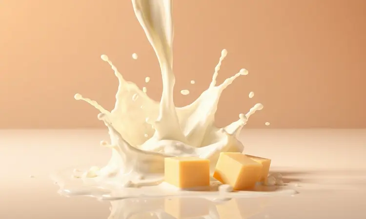
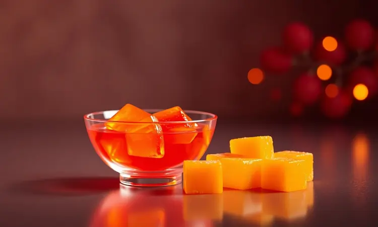
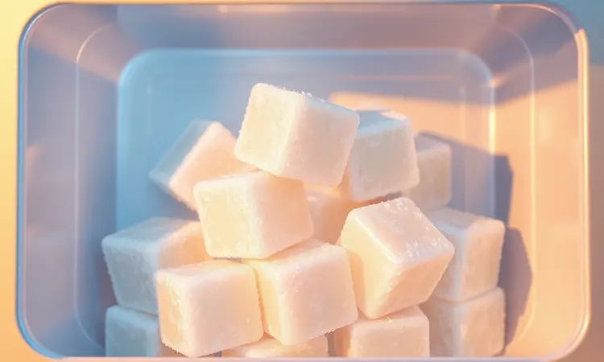

Imagine reunir os amigos e servir aquele petisco irresistível, crocante por fora, macio por dentro, com aquele ar de profissionalismo que faz todo mundo perguntar: 'Onde você aprendeu a fazer isso?' A melhor parte: você não precisou fritar nada.

A airfryer é a grande aliada dessa mágica, oferecendo não apenas praticidade, mas um resultado mais leve e saudável. Prepare-se para dominar a arte do dadinho perfeito, aquele que rouba a cena em qualquer happy hour e deixa impressões duradouras.

<SummaryList products={frontmatter.top_products} />

## Por que o Dadinho de Tapioca na Airfryer é o petisco perfeito?

Crocância que estala na boca. Um interior que derrete como um abraço. Essa é a promessa de um dadinho de tapioca bem feito. Quando você leva essa receita tradicional para a airfryer, ganha muito mais do que uma fritura sem óleo; ganha controle.

Cada cubinho sai uniforme, sequinho, sem aquele toque gorduroso que fica nos dedos. Para o dono da festa, significa menos bagunça, menos cheiro na cozinha e a segurança de que todas as porções ficaram igualmente douradas e crocantes.

É aquele petisco que parece sofisticado, mas é de uma praticidade que transforma qualquer dia comum em uma pequena celebração.

## O segredo do sucesso: Tapioca Granulada vs. Goma de Tapioca

Aqui está uma decisão que define a personalidade do seu petisco: você quer aquela crocância audível que faz barulho ao ser mordida, ou prefere uma experiência mais delicada, com um miolo quase cremoso?

Para a primeira opção, aposte na tapioca granulada, também conhecida como flocão. Seus pequenos grãos absorvem o líquido e formam uma massa coesa que, na airfryer, cria uma casquinha irresistível.

Já a goma de tapioca, com sua textura lisa e maleável, resulta em dadinhos com um interior particularmente macio e sedoso. Não existe escolha errada, apenas diferentes caminhos para o deleite.

## Ingredientes Essenciais para a Receita Clássica

A simplicidade é o segredo dos melhores pratos.

Para começar sua jornada rumo ao dadinho perfeito, você precisa de: tapioca granulada de boa qualidade, queijo coalho (aquele que derrete e fica grudento na medida certa), leite para unir tudo e sal para acentuar os sabores. Parece pouco, mas essa combinação é mágica.

### Tapioca Granulada de Qualidade

<ProductBox 
  title={frontmatter.top_products[0].title} 
  image={frontmatter.top_products[0].image} 
  link={frontmatter.top_products[0].link} 
/>

A base de tudo está na escolha certa da matéria-prima. Não se trata apenas de 'qualquer tapioca', mas de buscar aquela com grãos uniformes e uma cor pura. Marcas consolidadas oferecem essa consistência.

Ao abrir o pacote, você deve sentir aquele aroma neutro e característico. E aqui vai um detalhe precioso: reserve o leite quente para hidratá-la. Esse calor ajuda os grãos a absorverem o líquido de forma homogênea, criando uma massa perfeita para modelar.

### Queijo Coalho Tradicional

<ProductBox 
  title={frontmatter.top_products[1].title} 
  image={frontmatter.top_products[1].image} 
  link={frontmatter.top_products[1].link} 
/>

O queijo coalho não é apenas um ingrediente, é a alma do sabor. Escolha um com textura firme ao toque, mas que se desfaça facilmente ao ser ralado.

Ele vai derreter dentro do dadinho, criando aqueles fios característicos e uma riqueza de sabor que contrasta maravilhosamente com a crocância da tapioca.

Se encontrar, opte por marcas com boa procedência: a qualidade do leite se traduz diretamente na profundidade do gosto final.

## Passo a Passo: Preparando a massa e o descanso necessário

Aqui está onde muitos pegam atalhos e perdem o ponto. Em um recipiente, misture a tapioca granulada e o queijo coalho ralado. Vá adicionando o leite bem quente aos poucos, mexendo com uma espátula até observar uma textura úmida e homogênea.

Agora, a etapa mais ignorada (e mais crucial): o descanso.

Deixe a mistura repousar por pelo menos 30 minutos, coberta. Nesse tempo, a tapioca realiza seu trabalho silencioso, absorvendo todo o líquido e amolecendo uniformemente. É esse momento de paciência que garante que sua massa não fique quebradiça depois.

Passado esse tempo, você terá uma massa maleável, perfeita para moldar.

Transfira para uma forma forrada com papel manteiga, pressionando bem para eliminar bolhas de ar. Leve à geladeira por 2 horas, não menos. Essa friagem vai firmar a massa, transformando-a em um bloco que você cortará com precisão de cirurgião.

## Como cortar os dadinhos de forma uniforme

Com a massa firme e gelada, chegou a hora da geometria culinária. Retire o bloco da forma sobre uma tábua. Usando uma faca longa e bem afiada (e levemente molhada para não grudar), corte primeiro tiras retas de cerca de 2,5 cm de largura.

Em seguida, gire as tiras e faça cortes transversais na mesma medida. Você criará cubos quase perfeitos.

Por que tamanha precisão? Na airfryer, pedaços iguais cozinham no mesmo ritmo. Um cubo menor queimaria enquanto outro maior ficaria cru por dentro. Essa atenção ao detalhe é o que separa o amador do mestre do petisco.

## Configurando a Airfryer: Tempo e Temperatura para a crocância máxima

Pré-aqueça sua airfryer a 200°C por 3 minutos. Esse passo é fundamental para criar o 'choque térmico' que sela a superfície dos dadinhos instantaneamente.

Arrume os cubos na cesta, deixando um espaço generoso entre eles para que o ar quente circule livremente, envolvendo cada pedacinho.

Programe para 12 minutos. Na marca dos 6 minutos, abra a gaveta e vire cada dadinho com cuidado. Você verá que já estarão com uma cor dourada linda de um lado. Essa virada garante que a crocância seja 360 graus.

Fique atento nos últimos minutos; o ponto ideal é um dourado uniforme e profundo.

### Melhores Modelos de Airfryer para Petiscos

<ProductBox 
  title={frontmatter.top_products[2].title} 
  image={frontmatter.top_products[2].image} 
  link={frontmatter.top_products[2].link} 
/>

Qualquer airfryer cumpre o papel, mas algumas tornam o processo mais prazeroso. Modelos com cesta mais ampla permitem preparar uma quantidade maior de uma só vez, perfeito para festas.

Já aquelas com potência acima de 1500W garantem que o calor seja intenso e rápido, fator crucial para a crocância. Independente do modelo, o truque é conhecer o seu equipamento: algumas podem exigir 1 ou 2 minutos a mais ou a menos.

Faça um teste com uma pequena leva primeiro.

## Dicas de Ouro: Como evitar que os dadinhos grudem na cesta

Nada mais frustrante do que abrir a airfryer e metade do seu trabalho ficar colado na grade. Para evitar esse desastre, prepare a cesta: um leve borrifo de óleo (especialmente nas áreas onde os dadinhos vão repousar) cria uma barreira antiaderente quase infalível.

Outra dica secreta: não coloque os cubos com a massa ainda fria direto do freezer; deixe-a atingir a temperatura ambiente primeiro. A diferença térmica muito abrupta pode fazer com que eles 'grudem' na superfície metálica no primeiro contato.

## Acompanhamentos Irresistíveis: Molhos que elevam o sabor

Os dadinhos são estrelas por si só, mas um bom molho pode transformá-los em uma constelação de sabores. A acidez de um molho de iogurte com ervas corta a riqueza do queijo. Um chutney de manga agridoce abre um contraste inesperado.

Para os amantes do picante, uma maionese temperada com pimenta dedo-de-moça ou até um molho de pimenta mais encorpado fazem a festa.

### Geleia de Pimenta Gourmet

<ProductBox 
  title={frontmatter.top_products[3].title} 
  image={frontmatter.top_products[3].image} 
  link={frontmatter.top_products[3].link} 
/>

Se quiser realmente impressionar, sirva com uma geleia de pimenta artesanal. O doce da geleia e o ligeiro ardor da pimenta realizam uma dança perfeita com o sabor terroso da tapioca e o salgado do queijo.

É aquele toque gourmet que faz os convidados pensarem que você pediu o petisco de um restaurante chique.

## Como congelar e armazenar seus dadinhos para facilitar o dia a dia

A vida é corrida, e ter um petisco de primeira linha congelado é um superpoder culinário. Depois de cortar os cubos (antes de assar), arrume-os lado a lado em uma bandeja e leve ao congelador por 2 horas.

Esse congelamento rápido e individual ('flash freeze') evita que eles grudem uns nos outros. Depois, transfira para um saco ou pote hermético.

Assim, sempre que surgir uma visita inesperada ou aquela vontade de um lanche especial, basta pegar a quantidade desejada e levá-la direto à airfryer pré-aquecida, adicionando apenas 1 ou 2 minutos ao tempo de cozimento.

## Variações Criativas: Dadinho com Bacon ou Ervas Finas

Domineu o clássico? Hora de brincar. Para um sabor defumado irresistível, adicione bacon picado bem fininho e levemente frito à massa. A gordura do bacon se integra e torna o dadinho ainda mais suculento.

Para um caminho mais fresco e aromático, misture ervas finas picadas, como cebolinha, salsinha ou até um pouco de alecrim. Cada mordida trará uma camada extra de perfume. Essas variações mostram a versatilidade da receita e deixam sua assinatura pessoal no prato.

## Perguntas Frequentes (FAQ) sobre Dadinho de Tapioca

Posso usar queijo parmesão ao invés do coalho? Pode, mas o resultado será diferente. O parmesão é mais seco e salgado, então seu dadinho terá uma textura mais densa e um sabor mais marcante.

Para compensar a falta da 'elasticidade' do coalho, adicione um fio de azeite à massa.

E se não tiver leite? O leite ajuda na união e traz maciez, mas não é absolutamente essencial. Você pode substituir por água morna, ficará um pouco menos cremoso por dentro, mas ainda assim delicioso.

Por que meus dadinhos ficam duros? Provavelmente excesso de cozimento ou temperatura muito alta. A airfryer é eficiente; às vezes 200°C por 10 minutos são suficientes. Fique de olho.

Posso fazer sem queijo para uma versão vegana? Sim! Substitua o queijo coalho por levedura nutricional (para o sabor 'queijoso') e adicione um pouco de amido de milho para ajudar na liga.

## Conclusão

Fazer dadinho de tapioca na airfryer vai muito além de seguir uma receita. É sobre recuperar a confiança na sua própria cozinha, sobre descobrir que você pode criar momentos especiais sem complicação.

É sobre servir algo com as próprias mãos e ver no rosto das pessoas aquele prazer genuíno. Cada etapa, desde a escolha da tapioca até o momento em que você tira da cesta aqueles cubinhos dourados e perfeitos, é um passo em uma jornada culinária recompensadora.

Agora você tem não apenas um petisco, mas uma história para contar. A próxima rodada de aplausos será sua.