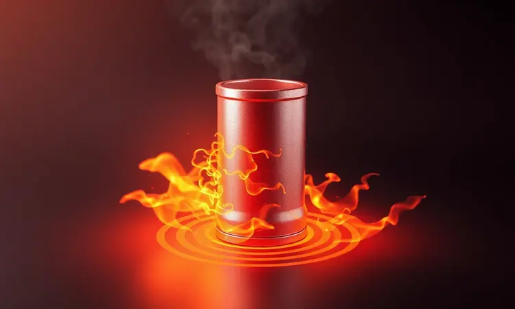
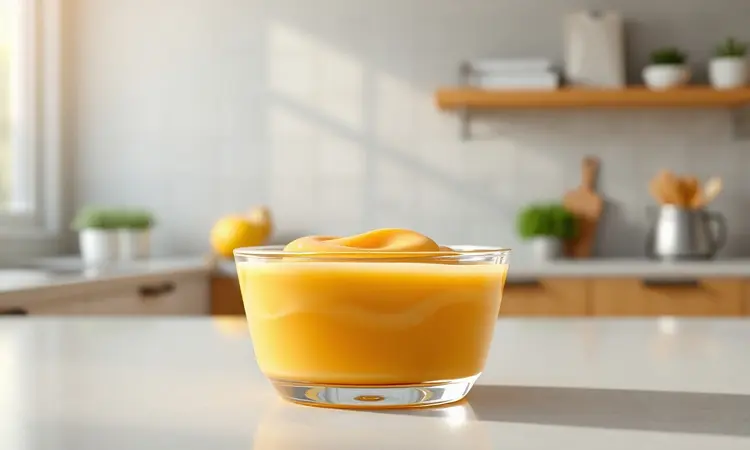
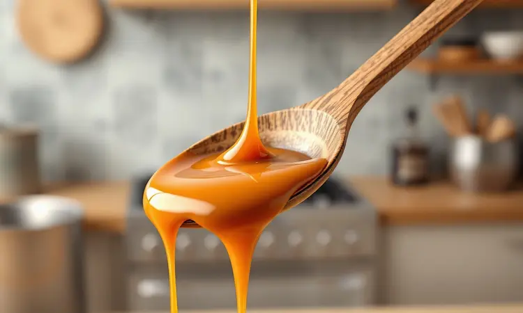

Você já viu aquele vídeo viral que promete o doce de leite mais fácil do mundo usando apenas uma lata e sua fritadeira sem óleo? Parece um truque de mágica na cozinha, certo?

Mas a verdade é que o que começa como uma curiosidade inocente pode terminar como sua airfryer danificada e sua cozinha transformada em um cenário de acidente.

A boa notícia é que sim, dá para preparar esse doce amado com seu aparelho favorito. O segredo está no "como".

Neste guia, vamos destrinchar por que o método da lata fechada é um erro perigoso, mostrar os bastidores físicos do risco e, o mais importante, ensinar a fórmula correta para você desfrutar desse sabor sem colocar nada em perigo.

Vamos começar pelo que realmente importa: sua segurança.

<SummaryList products={frontmatter.top_products} />

## Afinal, pode fazer doce de leite na airfryer?

Sim, você pode fazer doce de leite na sua airfryer. A resposta não é apenas afirmativa, é um convite para descobrir uma forma prática e gostosa de preparar esse clássico. O processo envolve um detalhe crucial que muitos ignoram na empolgação: o recipiente adequado.

Não se trata apenas de jogar a lata lá dentro e esperar. Imagine transformar seu leite condensado nesse doce cremoso que parece abraçar a colher, mas para isso você precisa de um pote que suporte o calor intenso e circular do aparelho.

A mágica acontece quando você respeita o espaço necessário, enchê-lo demais é praticamente um convite para o doce formar bolhas e escapar, criando uma bagunça pegajosa que nenhuma airfryer merece.

O verdadeiro segredo está na paciência e no olhar atento. Monitorar o tempo não é apenas uma recomendação, é a garantia de que você terminará com um doce de leite dourado e perfeito, sem surpresas indesejadas.

## O perigo real: Por que a lata de leite condensado explode na fritadeira?

Agora vamos falar sobre o que muitos vídeos não mostram. Aquela lata aparentemente inofensiva contém uma física perigosa que pode transformar sua airfryer em uma cena de filme de ação.

Essa explosão não acontece por acidente. É uma consequência inevitável quando o vapor do leite condensado fica preso, sem ter para onde escapar. Conforme o calor envolve a lata, a pressão interna aumenta até o ponto em que o metal não consegue mais conter essa força.

O resultado você já pode imaginar: jatos de doce quente, latas deformadas e, claro, o susto de quem esperava apenas uma sobremesa.

Pense nisso como um cano com as duas extremidades fechadas sendo aquecido. Não tem como não terminar mal.

### A física por trás do risco: Pressão interna vs. Calor seco

O que acontece dentro da lata é uma aula prática de física doméstica. O calor seco da airfryer, que normalmente é seu aliado para batatas crocantes, torna-se o vilão quando encontra um recipiente selado.

Quando você aquece o leite condensado, a água presente na mistura começa a sofrer uma transformação silenciosa: torna-se vapor. Esse vapor precisa de espaço para se expandir, mas dentro da lata vedada ele está confinado.

Cada segundo de aquecimento aumenta a pressão, criando um ambiente parecido com uma panela de pressão minúscula, só que sem nenhuma válvula de segurança.

Agora considere que a maioria das latas não foi projetada para esse tipo de estresse térmico. As emendas, normalmente soldadas, se tornam pontos fracos. A pressão busca o caminho mais fácil, e quando encontra esse caminho, a liberação é abrupta e violenta.

A solução? Recipientes que permitam que o vapor tenha uma saída, ou melhor ainda, que não cubram completamente o conteúdo.

Assim, você mantém o controle da situação, cozinha com segurança e evita transformar sua cozinha em um laboratório de física com resultados explosivos.

## 3 motivos cruciais para nunca colocar latas fechadas na Airfryer

Se você ainda está considerando tentar o método da lata fechada, deixe-me apresentar três argumentos que vão fazer você repensar essa ideia.

Primeiro, falamos sobre a pressão, mas o problema não para aí. O aquecimento irregular é outro risco real. Enquanto uma parte do doce queima no fundo da lata, outra permanece fria.

Você não só corre o risco de uma explosão, como também pode acabar com uma mistura de pontos queimados e frios, arruinando o sabor e a textura.

Segundo ponto: o material. As latas de leite condensado têm um revestimento interno projetado para proteger o conteúdo. Quando submetido a altas temperaturas, esse revestimento pode se decompor ou liberar componentes que você definitivamente não quer no seu doce.

Estamos falando de saúde, não apenas de sabor.

Finalmente, e isso talvez seja o mais prático, pense no seu aparelho. Uma lata explodindo dentro da airfryer não é apenas um susto. É uma limpeza interminável de doce grudado em cada cantinho, nas grades, no ventilador.

Você pode danificar seriamente o mecanismo de circulação de ar, comprometendo o funcionamento futuro.

Então, antes de ver qualquer vídeo e achar que é uma ideia genial, lembre-se: existem formas seguras de conseguir o mesmo resultado, e nenhuma delas envolve transformar sua airfryer em roleta-russa culinária.

## Como a explosão pode danificar permanentemente sua Airfryer

<ProductBox 
  title={frontmatter.top_products[0].title} 
  image={frontmatter.top_products[0].image} 
  link={frontmatter.top_products[0].link} 
/>

Vamos além do susto e da bagunça. Uma explosão dentro do seu aparelho pode causar danos que alteram como ele funciona para sempre.

Imagine o doce quente e pegajoso sendo projetado em todas as direções. Chega nas grades, entra pelo ventilador, gruda nos elementos de aquecimento. Esse resíduo, quando resfria e solidifica, cria bloqueios que impedem a circulação adequada do ar. O resultado?

O calor começa a se acumular em pontos específicos.

Esse superaquecimento localizado é um problema silencioso. Pode derreter componentes plásticos internos, comprometer fiações e, nas situações mais graves, danificar circuitos eletrônicos que controlam temperatura e tempo.

Sua airfryer pode começar a desligar sozinha, aquecer de forma irregular ou, pior, apresentar falhas de segurança.

É importante mencionar que, embora falhas de fabricação existam, o uso inadequado é o principal responsável por danos permanentes.

Colocar recipientes fechados sob alta temperatura não é apenas arriscado (é como desafiar as leis da física na sua cozinha), mas também anula qualquer garantia que seu aparelho possa ter.

A manutenção preventiva começa com o uso correto. Manter seu aparelho limpo não é apenas uma questão de higiene, mas de sobrevivência do equipamento.

Cada sessão de uso adequado prolonga a vida útil da sua airfryer, garantindo que ela continue sendo sua aliada na cozinha por muito mais tempo.

## O Método Seguro: Como fazer doce de leite na airfryer sem riscos

Agora que você já conhece os perigos, vamos ao que interessa: como fazer certo. A boa notícia é que o método seguro é simples, prático e resulta em um doce de leite que vai fazer você esquecer qualquer versão de lata.

O segredo está em dois elementos: o recipiente e a paciência. Você precisa de algo que possa ir ao forno, pense em formas de alumínio, potes de vidro específicos para calor ou ramequins.

O objetivo é usar algo que permita que o vapor escape, evitando o acúmulo de pressão.

Quanto à paciência, entenda que a airfryer trabalha com calor intenso e circulante. Temperaturas baixas são suas amigas aqui. Você não quer cozinhar rápido, quer cozinhar bem.

Assim como um bom doce de leite tradicional leva horas em fogo baixo, na airfryer você precisa respeitar o ritmo do aparelho.

Vamos transformar essa teoria em prática.

### Passo a passo: Doce de leite no Ramekin (Método testado)

<ProductBox 
  title={frontmatter.top_products[1].title} 
  image={frontmatter.top_products[1].image} 
  link={frontmatter.top_products[1].link} 
/>

Prepare quatro ramequins untando-os com manteiga e polvilhando com farinha de trigo. Enquanto isso, derreta 50g de manteiga em uma tigela e misture com 200g de doce de leite e 1/4 de xícara de açúcar.

Você vai perceber como os ingredientes se unem criando uma base sedosa.

Adicione dois ovos, um de cada vez, mexendo bem após cada adição. Essa incorporação gradual é o que garante a cremosidade final. Peneire 2 colheres de sopa de farinha e acrescente uma pitada de sal, mexendo com cuidado para manter a leveza da massa.

Enquanto você prepara a massa, pré-aqueça sua airfryer a 140°C. Esse passo é crucial. Deixar o aparelho atingir a temperatura ideal antes de colocar os ramequins garante um cozimento uniforme desde o primeiro minuto.

Divida a massa entre os ramequins, mas deixe cerca de 1cm na borda. Esse espaço é fundamental para que o doce cresça sem transbordar. Asse por 15 minutos e verifique se as bordas estão firmes enquanto o centro permanece levemente mole.

Ao retirar, deixe descansar por 5 minutos, esse tempo permite que a estrutura se estabilize, garantindo que cada colherada mantenha a textura perfeita. Lembre-se: cada airfryer tem sua personalidade.

Fique atento ao seu aparelho, pois pequenas variações de potência podem alterar o tempo necessário.

## Melhores alternativas para um doce de leite caseiro perfeito

Se, depois de entender todos os riscos, você prefere métodos mais tradicionais, existem alternativas maravilhosas que mantêm o sabor caseiro sem o perigo.

Uma das técnicas mais amadas é o cozimento em banho-maria por algumas horas, aquela paciência de vó que transforma o leite condensado em ouro líquido.

Outra opção é começar do zero: leite, açúcar e uma pitada de bicarbonato trabalhando em fogo baixo até atingir aquele ponto que gruda no fundo da panela.

Mas entre todas as alternativas, uma se destaca pela combinação perfeita de segurança, praticidade e resultado.

### Método tradicional na Panela de Pressão: O mais seguro e eficaz

<ProductBox 
  title={frontmatter.top_products[2].title} 
  image={frontmatter.top_products[2].image} 
  link={frontmatter.top_products[2].link} 
/>

A panela de pressão é a escolha clássica por uma razão simples: ela foi literalmente projetada para lidar com pressão e vapor. Ao contrário da lata na airfryer, aqui você tem uma válvula de segurança que controla exatamente o que você quer controlar.

O processo é quase terapêutico em sua simplicidade. Pegue suas latas de leite condensado (retirando os rótulos para evitar entupimentos), coloque-as dentro da panela e cubra com água suficiente.

O tempo de cozimento cria uma escala de sabores: 15 minutos para um doce mais claro e fluido, 40 minutos para aquele âmbar escuro e consistente que parece caramelo líquido.

O momento mais importante acontece depois que desliga o fogo. Deixar a pressão sair naturalmente não é apenas uma precaução contra queimaduras, é o segredo para um cozimento perfeito até o final.

A pressão residual continua trabalhando mesmo com o fogo desligado, garantindo que cada molécula de açúcar tenha seu momento de transformação.

Sim, pode não ter a complexidade de algumas receitas mais elaboradas, mas entrega exatamente o que promete: aquele sabor caseiro que parece um abraço da avó em forma de doce.

### Receita rápida de Doce de Leite no Micro-ondas

<ProductBox 
  title={frontmatter.top_products[3].title} 
  image={frontmatter.top_products[3].image} 
  link={frontmatter.top_products[3].link} 
/>

Para aqueles momentos em que a vontade bate forte e o tempo é curto, o micro-ondas aparece como um salvador. Comece com metade de uma lata de leite condensado em um recipiente alto de vidro adequado para micro-ondas.

Aqueça em potência máxima por 3 minutos. Quando você retirar, pode se assustar, o leite parece ter talhado, formando grumos estranhos. Mas respire fundo e mexa bem. Essa mistura é mágica: os grumos se dissolvem, revelando uma base cremosa pronta para a próxima etapa.

Retorne ao micro-ondas por mais 1 minuto e repita esse ciclo de mistura e aquecimento. Em geral, entre 5 e 7 minutos no total você atinge o ponto perfeito.

A escolha do recipiente é estratégica: vidro alto evita que o doce transborde durante o processo e oferece segurança frente às altas temperaturas. Se por acaso seu doce ficar mais firme do que o desejado, adicione um pouco de leite quente e aqueça por mais 30 segundos.

É a adaptabilidade que torna essa receita tão especial.

Essa técnica é ideal para quando você precisa de uma solução rápida, mas não quer abrir mão do sabor caseiro.

## Dicas de especialista para não errar o ponto do doce

Independentemente do método escolhido, o ponto perfeito do doce de leite é uma combinação de observação e intuição. Na airfryer, comece sempre em temperatura baixa, pense em 120°C como seu ponto de partida.

Essa paciência inicial evita que o açúcar queime antes mesmo de começar a transformação.

Mexa frequentemente, a cada 10 ou 15 minutos. Não é apenas para garantir uniformidade, é para você conhecer a textura conforme ela se desenvolve. Você sente na colher quando a consistência muda de líquida para cremosa, quando o peso do doce se torna mais evidente.

O ponto ideal é pessoal, mas existem sinais universais. A cor deve ser um caramelo vibrante, não escuro demais. Para testar, pegue uma colher e deixe o doce escorregar de volta ao recipiente.

Se formar um fio que se mantém por instantes antes de se desfazer, você chegou lá.

Essa verificação não é apenas técnica. É o momento em que você, cozinheiro, estabelece um diálogo com sua criação, ajustando conforme seu palpe pessoal. É assim que receitas se tornam suas.

## Perguntas Frequentes (FAQ)

### Posso usar pote de vidro na airfryer para fazer o doce?

Sim, você pode usar pote de vidro, mas com um cuidado específico: nem todo vidro é igual. Procure potes rotulados como resistentes ao calor, como os de borosilicato. Eles foram feitos para suportar as mudanças bruscas de temperatura sem trincar.

Dois detalhes importantes: o pote deve ser alto o suficiente para acomodar a expansão do doce durante o cozimento, e você nunca deve enchê-lo até a borda. Deixe pelo menos dois dedos de espaço livre, essa folga é sua garantia contra transbordamentos inesperados.

### Quanto tempo leva para o doce de leite ficar pronto com segurança?

Na airfryer, o tempo varia entre 30 e 50 minutos, dependendo da quantidade e da temperatura escolhida. Após os primeiros 30 minutos, verifique a cada 10 minutos. Você está procurando por uma transformação gradual da cor e da textura.

Cada modelo de airfryer tem sua personalidade térmica. Conhecer o seu aparelho é parte do processo. Se você está começando, opte por intervalos de verificação mais curtos até entender como seu equipamento se comporta com essa receita específica.

## Conclusão

Preparar doce de leite na sua cozinha é mais do que seguir uma receita. É um ato de amor que merece ser celebrado com segurança e consciência. Ao longo deste guio, você descobriu que o método da lata fechada na airfryer não é apenas arriscado, é desnecessário.

Existem caminhos seguros que levam ao mesmo destino delicioso.

A física nos ensina que pressão sem escape resulta em explosão, mas a culinária nos mostra que paciência e atenção transformam ingredientes simples em memórias afetivas.

Cada escolha de recipiente, cada verificação de ponto, cada ajuste de temperatura é um passo em direção não apenas ao doce perfeito, mas à confiança de que sua cozinha permanece um espaço de criação segura.

Agora você tem nas mãos não apenas técnicas, mas o entendimento do porquê elas funcionam. Isso transforma você de seguidor de receitas em criador de experiências. Então, pegue seu recipiente adequado, ajuste sua airfryer para a temperatura correta e comece essa jornada.

O doce de leite perfeito não está em atalhos perigosos, está na combinação de conhecimento, cuidado e, claro, um pouco de doçura.