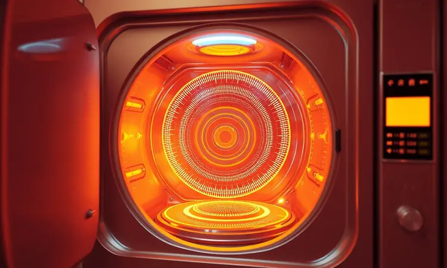
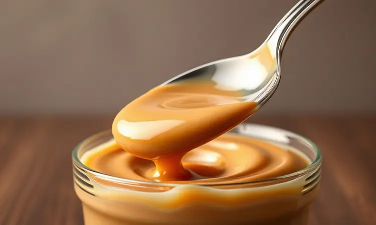

Imagine usar aquela praticidade que já conquistou seu coração para criar algo que normalmente leva horas na panela.

A proposta é tentadora, mas antes de se animar com a ideia, você precisa entender os riscos reais: preparar doce de leite na airfryer exige conhecimento específico, ou pode transformar sua cozinha em um cenário de perigo.

A ameaça silenciosa está no método tradicional da lata fechada, que sob o calor concentrado dessa pequena maravilha tecnológica, acumula pressão como uma panela de pressão em miniatura. O resultado pode ser catastrófico.

Mas aqui está a revelação que vai mudar sua visão sobre isso: existe um caminho seguro, um passo a passo que transforma risco em delícia. Continue lendo para dominar uma técnica que substitui o perigo pela praticidade pura.

<SummaryList products={frontmatter.top_products} />

## Afinal, pode fazer doce de leite na airfryer?

Sim, você pode transformar sua airfryer na fábrica do doce de leite perfeito, mas o segredo está no 'como'. A diferença entre um resultado cremoso e um desastre pode estar em detalhes que parecem insignificantes à primeira vista.

Essa ferramenta de cozimento rápido se torna uma aliada poderosa quando usada com inteligência, caramelizando o leite condensado de forma controlada e entregando aquela textura que você só encontra em sobremesas de restaurante.

O verdadeiro pulo do gato está em abandonar o método arriscado das latas e abraçar recipientes que conversam com a física da sua airfryer. Você não está apenas fazendo um doce, está criando experiência culinária segura.

## O perigo da lata: Por que o método tradicional pode causar explosões?

<ProductBox 
  title={frontmatter.top_products[0].title} 
  image={frontmatter.top_products[0].image} 
  link={frontmatter.top_products[0].link} 
/>

Aqui está o cenário que você precisa visualizar: uma lata de leite condensado, selada, entra no ambiente intenso da sua airfryer. O calor começa a aquecer o líquido dentro, que se expande. O ar preso também se aquece.

A pressão interna sobe, e as paredes da lata se tornam uma prisão para forças que querem escapar.

Essa dinâmica transforma um simples recipiente em uma pequena bomba.

Uma imperfeição microscópica no metal, um selo levemente comprometido, ou simplesmente tempo demais de exposição ao calor, podem ser o gatilho para uma explosão que espalha conteúdo quente e fragmentos metálicos pela sua cozinha.

### Como o calor e a pressão interna agem dentro da fritadeira

Agora, entenda por que a airfryer potencializa esse risco: ela cria um ambiente de calor extremamente concentrado e circulante.

Diferente de uma panela com água, onde o calor se distribui gradualmente, o ar superaquecido da airfryer ataca a lata por todos os lados ao mesmo tempo. A circulação forçada não dá trégua, acelerando o processo de aumento de pressão interna.

É essa combinação implacável que torna o método da lata fechada especialmente perigoso neste aparelho. A mesma tecnologia que deixa seu frango crocante em minutos, pode transformar uma lata em um projeto perigoso em questão de segundos.

Mas não desanime. Conhecendo o inimigo, você pode dominá-lo com a técnica correta.

## O método seguro: Doce de leite na airfryer sem riscos

A beleza da solução está na sua simplicidade: você só precisa mudar o recipiente. Troque a lata selada por um refratário adequado, e transforma risco em resultado previsível. Neste método, o doce de leite respira, o vapor escapa, e a pressão nunca se acumula.

Você mantém todo o sabor, toda a cremosidade, mas elimina o susto.

Funciona assim: o leite condensado vai para um recipiente aberto que suporta altas temperaturas. Na airfryer, ele cozinha lentamente, perdendo água e concentrando açúcares naturalmente.

Você assiste à transformação acontecer, pode mexer, verificar o ponto, e tem controle total sobre o processo.

### Utensílios necessários: A importância do refratário de vidro correto

<ProductBox 
  title={frontmatter.top_products[1].title} 
  image={frontmatter.top_products[1].image} 
  link={frontmatter.top_products[1].link} 
/>

Seu refratário não é apenas um recipiente, é seu escudo de confiança. Procure por vidro temperado ou borossilicato, materiais que enfrentam mudanças bruscas de temperatura sem estilhaçar.

Aquele pote que você usa no forno convencional provavelmente fará o mesmo trabalho na airfryer, mas sempre confira a indicação do fabricante.

Prefira modelos mais baixos e largos, que permitem a mágica da circulação de ar acontecer livremente. Recipientes muito altos bloqueiam o fluxo que torna a airfryer tão eficiente, criando zonas de cozimento desigual.

E nunca, jamais, coloque um refratário gelado direto na airfryer quente. A diferença térmica abrupta é um teste desnecessário para o material.

### Passo a passo: Temperatura e tempo para o ponto de colher

Aqui começa o ritual que transforma leite condensado em ouro líquido. Ajuste sua airfryer para 160°C e reserve 30 a 40 minutos do seu tempo. Despeje o leite condensado em seu refratário seguro e inicie o ciclo.

A cada 10 minutos, faça uma pausa para mexer. Não é apenas uma etapa técnica, é o momento mágico onde você sente a transformação acontecer. No início, o líquido é fino e claro. Aos poucos, engrossa, escurece, ganha corpo.

Essa pausa também impede que grude nas bordas, garantindo uniformidade.

Quando o tempo terminar, você terá diante de si um doce cremoso, mas ainda líquido o suficiente para escorrer da colher lentamente. É o ponto perfeito para cobrir bolos, rechear doces, ou simplesmente saborear com uma colher.

### A função do papel alumínio no cozimento uniforme

<ProductBox 
  title={frontmatter.top_products[2].title} 
  image={frontmatter.top_products[2].image} 
  link={frontmatter.top_products[2].link} 
/>

O papel alumínio se torna seu aliado silencioso na busca pela perfeição. Quando você cobre parcialmente o refratário (nunca totalmente), cria uma microatmosfera que retém umidade sem bloquear completamente a circulação de ar vital da sua airfryer.

Pense nele como um dosador de evaporação: permite que a água escape na velocidade certa, impedindo que a superfície seque e forme aquela crosta indesejada que pode queimar.

Só tome cuidado para que o papel não toque a resistência, e nunca cubra totalmente, ou você anula o princípio de cozimento que faz a airfryer funcionar.

## Dicas de especialista para uma textura aveludada e sem grumos

Os chefs guardam segredos que transformam o bom no extraordinário. O primeiro deles? Comece com leite condensado de qualidade. Parece óbvio, mas a diferença na cremosidade final é como noite e dia.

Durante o cozimento, o movimento constante da colher não é apenas para evitar grudar, é para romper a formação inicial de grumos antes que eles se estabeleçam. Se, ao final, perceber algum grumo teimoso, passe o doce por uma peneira fina enquanto ainda está quente.

Esse passo extra de 30 segundos garante uma sedosidade que derrete na boca.

Outro segredo pouco contado: uma pitada de bicarbonato de sódio (cuidado, apenas uma pitada) ajuda a prevenir a cristalização do açúcar, mantendo a textura sempre suave, mesmo depois de dias na geladeira.

## Erros comuns que você deve evitar ao preparar doces na Airfryer

O maior erro é tratar sua airfryer como um forno comum em miniatura. Ela tem personalidade própria.

Lotar a cesta com doce de leite em várias formas ao mesmo tempo parece eficiente, mas bloqueia a circulação de ar, criando zonas frias e quentes que estragam a consistência uniforme.

Não pular o pré-aquecimento é outra regra de ouro. Colocar o refratário em uma airfryer fria faz com que ele cozinhe em temperatura crescente, alterando todo o tempo calculado. E quanto ao papel manteiga?

Ele é seu amigo, mas nunca o coloque solto, ou o fluxo de ar pode levá-lo direto à resistência.

O monitoramento constante é sua maior arma. A airfryer cozinha rápido, e diferenças de minutos podem mudar do 'perfeito' para o 'queimado'. Fique por perto, especialmente nos últimos 10 minutos.

## Receita Bônus: Rabanada Recheada com Doce de Leite na Airfryer

Agora que você domina o doce de leite perfeito, que tal transformá-lo na estrela de uma sobremesa que vai impressionar qualquer visita?

A rabanada na airfryer consegue aquele equilíbrio mágico: crocante por fora, macia por dentro, sem o excesso de óleo que deixa aquela sensação pesada.

Recheie fatias generosas de pão com seu doce de leite caseiro, passe na mistura de leite e ovo, e deixe a airfryer fazer sua mágica de douração uniforme. O resultado é tão leve que você pode até se enganar pensando que está comendo algo saudável.

### Ingredientes e montagem para um resultado crocante

Para essa versão que parece saída de uma confeitaria fina, você precisará do seu doce de leite caseiro já pronto, pão de forma com miolo firme, ovos, leite, canela e açúcar para finalizar.

Monte como um sanduíche doce: duas fatias de pão com uma camada generosa de doce de leite no meio. Passe delicadamente na mistura de ovo e leite (sem encharcar), e distribua na cesta da airfryer sem amontoar.

A temperatura ideal fica em 180°C por 8 a 10 minutos, virando na metade do tempo. Quando saírem, ainda quentinhas, passe na mistura de açúcar e canela. A crocância perfeita, o recheio cremoso, e zero culpa pelo excesso de óleo.

## Perguntas Frequentes (FAQ)

### Quanto tempo dura o doce de leite caseiro feito na airfryer?

Seu doce de leite caseiro mantém toda sua sedosidade por até duas semanas, desde que você o guarde com carinho. O segredo está no armazenamento: um pote hermético é sua melhor apólice de seguro contra ressecamento e absorção de odores da geladeira.

Na geladeira, ele fica mais firme, perfeito para recheios. Se preferir a textura mais cremosa, deixe em temperatura ambiente por alguns minutos antes de servir. Qualquer alteração de cor ou odor é um sinal claro de que já cumpriu sua missão deliciosa.

### Posso usar leite condensado de caixinha?

Sim, a caixinha é uma opção perfeitamente viável, e para muitos, até mais prática. A diferença principal está na textura inicial: o leite condensado em caixa tende a ser ligeiramente mais líquido, o que pode encurtar em alguns minutos seu tempo total de cozimento.

O sabor final, porém, é praticamente idêntico. Apenas fique atento para não exceder o tempo, pois como parte da água já evaporou no processo de embalagem, ele pode atingir o ponto desejado um pouco mais rápido.

Comece verificando aos 25 minutos em vez dos 30, e ajuste conforme perceber a transformação.

## Conclusão

Você começou esta leitura com a dúvida sobre um método rápido para um clássico que normalmente exige paciência, e descobriu que a airfryer pode sim ser sua aliada, desde que você respeite suas regras.

O perigo da lata selada se transformou em conhecimento, e a técnica segura agora está em suas mãos.

Mais do que uma receita, você adquiriu o entendimento de como o calor e a pressão trabalham dentro desse aparelho fascinante, e como usar esse conhecimento para criar não apenas segurança, mas também excelência.

O refratário certo, o tempo preciso, o ritual das mexidas, todos esses detalhes se unem para entregar aquele doce de leite que parece feito por uma avó experiente, mas com a praticidade moderna que seu ritmo de vida exige.

A próxima vez que a vontade de um doce caseiro bater, você não precisará mais hesitar. Pegue seu leite condensado, escolha o refratário de confiança, e deixe sua airfryer transformar ingredientes simples em uma experiência que vai muito além do paladar.

É a conquista da autonomia culinária, a certeza de que você pode criar momentos doces sem depender de horas na cozinha ou correr riscos desnecessários. Sua airfryer acaba de ganhar uma nova e deliciosa função.