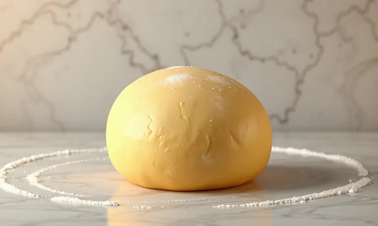
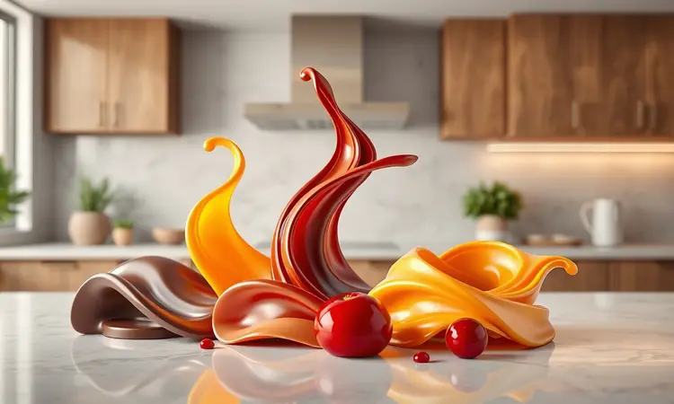
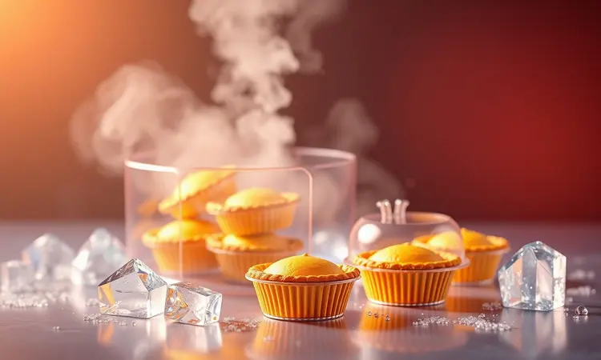

Você já sentiu aquela vontade de comer um doce especial, mas desistiu só de pensar em pré-aquecer o forno e esperar uma eternidade? Você não está sozinho.

A boa notícia é que a empadinha doce na air fryer é a solução perfeita para quem busca praticidade sem abrir mão daquela textura que derrete na boca.

Neste guia, eu vou te mostrar como preparar a empadinha de leite condensado mais rápida da sua vida e ainda compartilhar segredos para variar os recheios e garantir uma massa sempre crocante. Prepare sua fritadeira e venha conferir!

<SummaryList products={frontmatter.top_products} />

## Por que Fazer Empadinha Doce na Air Fryer?

Imagine ter um doce fresquinho em menos de 20 minutos, sem o aquecimento lento do forno e com aquele interior macio que te transporta para a infância. É isso que a air fryer entrega.

A velocidade do ar quente circulante garante aquela casquinha dourada que estala ao morder, enquanto o miolo permanece úmido e suave.

E pense na vantagem de não precisar aquecer todo o forno só para meia dúzia de empadinhas, economizando energia e mantendo sua cozinha mais agradável.

A praticidade vai além. Você quase não usa óleo e pode simplesmente tirar a cesta para servir, transformando a limpeza em uma tarefa de segundos. Sim, aquela bagunça que você tanto evita finalmente tem uma solução inteligente.

## A Melhor Massa para Empadinha Doce (Massa Podre Suave)

O segredo para aquela sensação de derreter na boca está na escolha da massa. A massa podre suave é como um abraço caloroso para seu recheio.

Ela exige pouco esforço, pede apenas manteiga bem gelada para garantir a crocância sem endurecer, e aceita qualquer doce que você imagine.

A mistura não precisa de malabarismos, apenas cuidado para não trabalhar demais e perder a leveza que faz a diferença entre uma empadinha boa e uma inesquecível.

## Receita Passo a Passo: Empadinha de Leite Condensado na Air Fryer

Agora que você entendeu a magia da massa, vamos juntar tudo. É um processo tão simples que você vai se perguntar por que não começou antes. Primeiro, prepare aquela massa podre que conversamos, depois recheie com aquele leite condensado cremoso e molde com carinho.

O resultado? Doçura dourada em tempo recorde.

### Ingredientes Necessários para a Massa e Recheio

Para a massa que vai conquistar seu paladar:

- 500g de farinha de trigo

- 200g de manteiga bem gelada

- 1 ovo

- 100g de açúcar

- Uma pitada de sal

Para o recheio que derrete corações:

- Leite condensado (tradicional)

- E se quiser surpreender: goiabada em pedaços, uma colher de Nutella ou doce de leite caseiro

### Modo de Preparo Detalhado

Vamos criar memórias com apenas alguns gestos. Comece com a farinha e a manteiga gelada, esfarelando com as pontas dos dedos até formar uma farofa. Incorpore o açúcar e o ovo, misturando apenas o necessário.

Deixe a massa descansar na geladeira por 15 minutos, tempo suficiente para você preparar o recheio.

Abra pequenas porções em círculos finos, coloque uma colher de chá do seu recheio preferido no centro, e dobre com cuidado, selando as bordas com os dedos. Sim, é tão fácil quanto parece.

## Tempo e Temperatura Ideal para Não Queimar

Aqui está a chave para o sucesso sem sustos. Pré-aqueça sua air fryer a 180°C por 5 minutos. Disposit aquele calor esperando por suas delícias.

As empadinhas vão precisar de 15 a 20 minutos, tempo suficiente para você preparar um café ou organizar um ambiente para degustar.

Fique atento ao primeiro lote, pois cada aparelho tem sua personalidade. Se dourar rápido demais, diminua para 170°C. A ideia é evitar aquela ansiedade de abrir a tampa a cada minuto, confiando que o resultado será perfeito.

## Utensílios Indispensáveis: As Melhores Forminhas para Air Fryer

<ProductBox 
  title={frontmatter.top_products[0].title} 
  image={frontmatter.top_products[0].image} 
  link={frontmatter.top_products[0].link} 
/>

Com o tempo certo definido, vamos pensar nas ferramentas que vão elevar sua experiência. Essas pequenas ajudantes fazem toda diferença.

As forminhas de silicone são suas aliadas permanentes. Elas deslizam o doce para fora sem esforço, são fáceis de limpar e resistentes a altas temperaturas. Imagine não precisar untar nem raspar restos grudados.

Para dias ainda mais práticos, as forminhas descartáveis de papel permitem que você faça lote após lote sem parar para limpar. Apenas solte na mesa e todos podem pegar a sua sem se preocupar com pratos extras.

### Melhores Modelos de Air Fryer para Doces e Salgados

<ProductBox 
  title={frontmatter.top_products[1].title} 
  image={frontmatter.top_products[1].image} 
  link={frontmatter.top_products[1].link} 
/>

Se você está pensando em investir em uma companheira de cozinha versátil, algumas opções se destacam.

O Philips Walita RI9252/91 é o clássico que nunca decepciona. Com 1400W de potência e controle preciso de temperatura, ele é confiável para todo tipo de receita, dos doces mais delicados aos salgados mais crocantes.

Quem tem mais espaço e gosta de preparar várias coisas ao mesmo tempo pode se apaixonar pela Electrolux Air Fryer Oven EAF90. São 12 litros que transformam seu jantar em uma experiência completa, funcionando como forno, fritadeira e até desidratador.

Para um custo-benefício inteligente, a Britânia BFR50 entrega simplicidade e eficiência. Ela prova que você não precisa gastar fortunas para ter doçura em seu dia.

## Variações Irresistíveis: Nutella, Doce de Leite e Goiabada

Agora que você domina o básico, que tal brincar com sabores? A Nutella transforma cada mordida em um momento de indulgência. O doce de leite traz aconchego e tradição. A goiabada, especialmente combinada com queijo, cria um contraste que faz os olhos fecharem de prazer.

Essas variações não são apenas diferentes recheios, são histórias distintas que você pode contar a cada lote. Por que não fazer algumas de cada e deixar que cada pessoa encontre seu preferido?

## 5 Dicas de Especialista para uma Empadinha Perfeita

Vamos elevar seu resultado com segredos simples:

1. Massa gelada é amiga da crocância. Deixe-a descansar na geladeira antes de trabalhar.

2. Menos é mais no recheio. Uma colher de chá mantém tudo no lugar e evite vazamentos.

3. Pincele com gema antes de assar para aquele brilho dourado que convida.

4. Pré-aquecer é ritual obrigatório. Aqueça por 5 minutos antes de colocar as empadinhas.

5. Paciência durante o cozimento. Evite abrir a air fryer para manter a temperatura estável.

Essas pequenas atenções transformam uma receita boa em uma memória afetiva.

## Erros Comuns: Por que minha empadinha ficou crua ou vazou?

Se suas primeiras tentativas não saíram como o esperado, vamos entender o que pode ter acontecido. Se a massa ficou crua, provavelmente o tempo ou temperatura estavam abaixo do ideal. Cada aparelho tem sua personalidade, então ajuste conforme necessário.

Recheio vazando? Isso geralmente acontece quando as bordas não estão bem seladas ou quando o recheio excede o espaço. Pressione com cuidado as bordas e lembre-se que o recheio expande um pouco durante o cozimento.

Esses pequenos aprendizados são parte do processo. Cada lote te aproxima da empadinha perfeita.

## Como Armazenar e Congelar suas Empadinhas

A melhor parte? Você pode preparar em quantidade e ter doçura sempre disponível. Após assar, deixe esfriar completamente antes de armazenar. Em um recipiente hermético, elas mantêm a textura por até 3 dias à temperatura ambiente.

Para congelar, acomode as empadinhas já resfriadas em um saco de congelação, tentando remover o máximo de ar possível. Assim elas ficam perfeitas por até 3 meses.

Na hora de comer, basta retirar do congelador e aquecer na air fryer por alguns minutos. É como ter um pedacinho de carinho sempre à mão.

## Perguntas Frequentes sobre Doces na Air Fryer (FAQ)

Muitas dúvidas surgem quando começamos essa aventura. Sim, os doces ficam tão bons quanto no forno, muitas vezes até mais crocantes por fora. O tempo é realmente menor, e a praticidade transforma a experiência.

A chave está em conhecer seu aparelho e fazer pequenos ajustes. Cada receita é uma oportunidade de descoberta, e a air fryer abre portas para criatividade na cozinha que você talvez nem imaginasse.

## Conclusão

Ao final dessa jornada, você não apenas aprendeu a fazer empadinhas, mas descobriu uma maneira de trazer doçura para sua rotina sem complicações. A air fryer se transformou de um eletrodoméstico em uma aliada para criar momentos especiais.

Lembre-se: cada passo, desde a escolha da massa até o pincelar final da gema, é um ato de carinho consigo mesmo ou com quem você compartilha.

As variações de recheio são convites para explorar sua criatividade, e as dicas de armazenamento garantem que esse prazer possa se repetir sempre que surgir o desejo.

Hoje você aprendeu que praticidade e sabor podem caminhar juntos, que doçura não precisa de horas de preparo, e que pequenas atenções criam grandes memórias. Agora é sua vez de vestir o avental e transformar ingredientes simples em sorrisos.

Qual será a primeira variação que você vai experimentar?