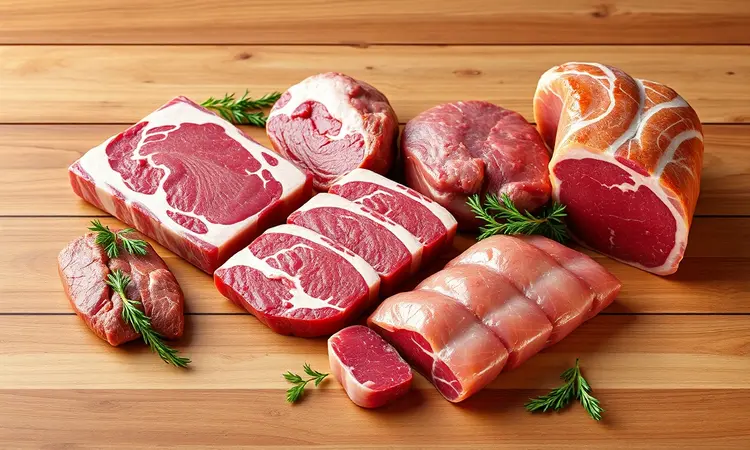
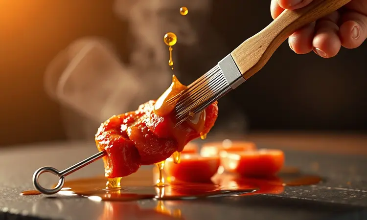
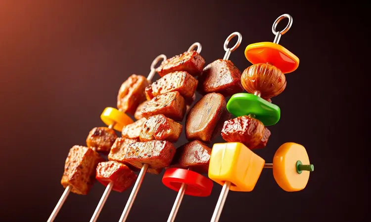

Você adora aquele sabor defumado de um bom churrasco, mas a simples ideia de lidar com brasas, fumaça e aquela inevitável faxina posterior te faz desistir?

Ou talvez more em apartamento e sinta falta de opções práticas para trazer a alegria do grelhado para dentro de casa?

Descobrir o espetinho na Airfryer é como encontrar um atalho mágico: carne suculenta, dourada perfeita e pronta em minutos, sem a bagunça da brasa nem as limitações do espaço.

Neste guia, vamos além da receita: revelamos os segredos que transformam um simples petisco em um jantar memorável, com a garantia de que cada mordida será inesquecível, mantendo a carne irresistivelmente macia.

<SummaryList products={frontmatter.top_products} />

## Por que fazer espetinho na Airfryer é a melhor opção para o dia a dia?

Imagine terminar um dia cansativo e, em apenas 20 minutos, ter um churrasco pronto sobre a mesa. Essa é a promessa que a Airfryer entrega com maestria.

A praticidade é a estrela principal: tempo de preparo que se mede em minutos, não em horas, libertando você para curtir a companhia dos amigos em vez de ficar vigiando chamas.

A economia de óleo não é apenas uma vantagem para a saúde: resulta em uma carne grelhada, não frita, onde você sente o sabor real dos ingredientes. A limpeza, aquela parte que todo mundo adia, se torna uma tarefa de cinco minutos com as partes removíveis.

E a diversidade é infinita: hoje é carne bovina clássica, amanhã frango exótico, depois um banquete vegetariano colorido. A Airfryer não substitui o ritual tradicional do churrasco: ela reinventa ele para a sua realidade, entregando sabor e praticidade na medida certa.

## Qual a melhor Airfryer para fazer churrasco em casa?

<ProductBox 
  title={frontmatter.top_products[0].title} 
  image={frontmatter.top_products[0].image} 
  link={frontmatter.top_products[0].link} 
/>

Com a decisão tomada, surge a escolha estratégica: qual aparelho realmente se entrega à missão do churrasco? Modelos específicos se destacam por entender essa necessidade.

A WAP Air Fryer Barbecue Digital 12 em 1 é uma fortaleza culinária: seus 10 litros de capacidade são ideais para receber a família toda, os 1800W de potência garantem que o calor seja rápido e uniforme, seu espeto rotativo proporciona aquela cena cinematográfica dos ingredientes girando e dourando por igual, e a tecnologia Smokeless é uma benção para apartamentos, minimizando a fumaça.

A Oster 12L 3 em 1 também acompanha uma potência robusta de 1800W e traz na caixa um espeto rotisserie sério, pronto para aves inteiras.

Alternativas versáteis como a Philco Air Fryer Oven 12L e a Electrolux Air Fryer Oven EAF90 expandem o leque, permitindo assar, desidratar e fritar, além do grelhado.

O sabor da brasa terá seu lugar no coração, mas a conveniência dessas air fryers cria um novo capítulo na sua relação com o churrasco caseiro.

## Quais as melhores carnes para espetinho na Airfryer?

A genialidade do espetinho está na convergência perfeita entre sabor e rapidez. Peito de frango, picanha e linguiça são os campeões de sucesso: ficam suculentos e atingem o ponto ideal no tempo exato que a Airfryer demanda.

### Cortes macios: Alcatra, Contrafilé e Maminha

Se você busca uma experiência onde a faca praticamente desliza pela carne, esses três cortes são o seu tesouro. A alcatra é a artista versátil, abraçando desde um tempero simples de sal grosso até marinadas complexas, sempre entregando sabor consistente.

O contrafilé é a explosão de suculência: sua gordura bem distribuída se transforma em suco a cada mordida, carregando um gosto robusto que satisfaz qualquer paladar exigente. Já a maminha traz aquele sabor marcante e uma textura que parece derreter na boca.

Investir um tempo extra na marinação desses cortes é o passaporte para outro nível gastronômico, elevando um simples espetinho a um prato digno de celebração.

### O toque de gordura: Carne com Bacon ou Panceta

Há um segredo para a suculência que nunca falha: envolver a carne em uma capa de bacon ou panceta.

Durante o cozimento, a gordura não apenas sela a carne, mantendo os sucos preciosos no interior: ela também se incorpora, criando um sabor defumado profundo e uma crocância irresistível por fora.

A mágica funciona ainda melhor com cortes que sabem dançar com essa gordura, como a picanha ou a maminha: o resultado é um equilíbrio perfeito de sabores onde a riqueza da carne brilha com a intensidade do bacon.

## Preparando os utensílios: O segredo do espeto de madeira na Airfryer

<ProductBox 
  title={frontmatter.top_products[1].title} 
  image={frontmatter.top_products[1].image} 
  link={frontmatter.top_products[1].link} 
/>

Com a carne pronta e temperada, o detalhe que pode transformar o sabor está na sua escolha de espetos. Os de madeira trazem aquele toque rústico e autêntico, mas exigem um cuidado simples e fundamental: mergulhe-os em água por pelo menos 30 minutos antes do uso.

Este banho impede que queimem dentro da Airfryer e permite que a madeira libere seus aromas sutis durante o cozimento, de forma gradual. Para quem prioriza a praticidade no dia a dia, kits de espetos em aço inox oferecem durabilidade eterna e limpeza instantânea.

A escolha final é sobre a experiência que você quer ter: se a alma do churrasco está no charme rústico e no sabor sutil, a madeira é o caminho; se agilidade e facilidade são prioridades, a inox será sua melhor aliada.

## Dicas de Ouro para um Churrasco Perfeito (Sem Ressecar!)

O medo de ressecar a carne é o único obstáculo entre você e o churrasco perfeito na Airfryer.

Para derrotá-lo, comece com o básico imbatível: selecione cortes com gordura natural (ela é sua amiga), capriche no tempero e, acima de tudo, tire a carne da geladeira com antecedência para que atinja a temperatura ambiente.

Esta simples etapa faz toda a diferença para uma cocção uniforme e suculenta.

### O controle da temperatura interna da carne

<ProductBox 
  title={frontmatter.top_products[2].title} 
  image={frontmatter.top_products[2].image} 
  link={frontmatter.top_products[2].link} 
/>

Você no comando do ponto exato da carne: essa é a precisão que um termômetro de carne te oferece. A faixa de temperatura ideal na Airfryer gira entre 180°C e 200°C, suficiente para criar um exterior dourado e crocante enquanto preserva a umidade interior.

Esteja você preparando um suculento contrafilé ou uma fraldinha saborosa, a regra de ouro é o fluxo de ar: não sobrecarregue o cesto, vire os pedaços na metade do tempo e evite abrir a tampa com frequência.

Marinadas que contêm açúcar merecem atenção redobrada na temperatura, pois caramelizam mais rápido. Com o termômetro na mão, você deixa de adivinhar e passa a garantir.

### Selagem e suculência: A importância do azeite ou manteiga aromatizada

<ProductBox 
  title={frontmatter.top_products[3].title} 
  image={frontmatter.top_products[3].image} 
  link={frontmatter.top_products[3].link} 
/>

A chave para trancar todos os sucos dentro da carne se chama selagem, e ela conquista um toque de sofisticação com o uso correto de azeite ou manteiga aromatizada.

A crosta dourada que se forma durante a selagem age como uma armadura protetora, impedindo que a umidade escape e concentrando o sabor. O azeite extravirgem, rico em propriedades antioxidantes, é um clássico seguro.

Para um sabor ainda mais profundo, a manteiga aromatizada com ervas frescas como alecrim e tomilho é uma revelação. Uma dica profissional: para elevar o ponto de fumaça da manteiga e evitar que queime, misture-a com um fio de azeite.

O resultado é uma camada de sabor que transforma a carne em um prato memorável.

## Receita de Espetinho de Carne Clássico na Airfryer: Passo a Passo

Para colocar toda a teoria em prática, nada melhor que um clássico atemporal. Corte a carne em cubos generosos, tempere com a paixão que só você conhece e monte seus espetos.

Na Airfryer pré-aquecida a 200°C, 15 a 20 minutos são suficientes para transformar esses simples ingredientes em uma refeição dourada, perfumada e pronta para conquistar.

### Ingredientes e tempero especial para churrasco

Seleção é tudo. Escolha cortes de qualidade, como peito de frango, carne bovina em cubos ou suína. A uniformidade no corte é sua garantia de que tudo ficará pronto ao mesmo tempo.

Para o tempero especial que evoca a alma do churrasco, uma base de alho picado fresco, sal grosso, pimenta-do-reino moída na hora e um bouquet de ervas finas (salsa, cebolinha) funciona como um encantamento saboroso.

Uma boa marinação de algumas horas ou até durante a noite torna esse sabor parte da carne. Sem tempo? Um tempero vigoroso na hora, intercalando os cubos com rodelas de cebola e pimentão, também entrega resultados incríveis.

### Modo de preparo e montagem dos cubos

Comece transformando a carne em cubos de aproximadamente 2 a 3 cm, um tamanho que garante cozimento perfeito. Em uma tigela, una os cubos ao seu tempero especial e um fio generoso de azeite, massageando para que o sabor penetre.

A montagem dos espetos é onde a criatividade brilha: intercale os cubos de carne com quadrados coloridos de pimentão, cebola roxa e até pedaços de abacaxi para um contraste doce.

Use os espetos de sua preferência (lembre-se do banho para os de madeira) e deixe essa obra-prima descansar por pelo menos 30 minutos antes de seguir para o calor.

## Tempo e Temperatura: Acerte o ponto (Malpassado a Bem Passado)

Você gosta da carne quase dançando no prato (malpassada), no ponto exato do suco rosado (ao ponto) ou completamente firme (bem passada)? A Airfryer respeita sua preferência. Para um suculento malpassado, programe 180°C por 8 a 10 minutos, virando os espetos na metade.

Para o ponto ideal da maioria, a mesma temperatura por 12 a 15 minutos entrega dourado por fora e rosado por dentro. Se sua paixão é o bem passado, suba para 200°C e reserve 15 a 20 minutos, sempre verificando a textura com um garfo.

A regra é monitorar, não apenas marcar o tempo: a carne te dirá quando está pronta.

## Variações Criativas para Diversificar o Cardápio

A beleza do espetinho na Airfryer está na sua capacidade infinita de reinvenção. Um dia você pode explorar a delicadeza dos frutos do mar, no seguinte brincar com combinações inusitadas de queijos e temperos exóticos.

É a sua cozinha se transformando em um laboratório de sabores.

### Espetinho de Frango com Mostarda e Mel

Doce e picante em uma dança perfeita. Esta receita começa marinando cubos de peito de frango em uma mistura sedutora de mostarda Dijon, mel puro, azeite, sal e pimenta.

O mel carameliza na Airfryer, criando uma camada brilhante e levemente crocante, enquanto a mostarda aporta profundidade e personalidade. É a combinação perfeita para impressionar com um esforço mínimo.

### Kafta na Airfryer: Praticidade e Sabor Árabe

Transporte-se para as ruas de Beirute sem sair de casa. Misture carne moída (bovina ou de cordeiro) com uma sinfonia de especiarias: cominho moído, coentro fresco picado, cebola ralada e hortelã. Modele a massa em formato alongado nos espetos e leve à Airfryer.

O resultado é um exterior crocante e perfumado que envolve um interior incrivelmente macio e saboroso, tudo com uma fração do óleo usado no método tradicional da chapa.

### Opções Vegetarianas: Queijo Coalho e Legumes Grelhados

<ProductBox 
  title={frontmatter.top_products[4].title} 
  image={frontmatter.top_products[4].image} 
  link={frontmatter.top_products[4].link} 
/>

Uma celebração de cores e texturas que conquista todos. Corte o queijo coalho firme e uma seleção de legumes (abobrinha, pimentões coloridos, cebola pérola) em tamanhos similares. Tempere com azeite, sal, pimenta e ervas.

Dica: se o queijo estiver muito macio, uma rápida passagem pelo congelado (cerca de 1 hora) garante a firmeza perfeita para o espeto.

Na Airfryer entre 160°C e 180°C, em 10 a 17 minutos, os legumes ficam macios e caramelizados e o queijo ganha uma casquinha dourada com o interior cremoso e irresistível. Sirva com um molho de pimenta ou geleia de pimenta para o contraste perfeito.

## Melhores Acompanhamentos para seu Espetinho

<ProductBox 
  title={frontmatter.top_products[5].title} 
  image={frontmatter.top_products[5].image} 
  link={frontmatter.top_products[5].link} 
/>

Um grande espetinho merece uma grande companhia. A clássica farofa, crocante e saborosa, é a base que absorve todo o suco da carne. O vinagrete fresco, com seu tomate, cebola e pimentão picados, corta a gordura e revitaliza o paladar.

Para um toque cremoso e reconfortante, uma salada de maionese bem temperada nunca falha. Em busca do lado saudável? Legumes grelhados como abobrinha e berinjela, ou até rodelas de abacaxi grelhado que caramelizam, são escolhas espetaculares.

E claro, o pão de alho, quentinho e com a manteiga perfumada, é a unanimidade que fecha o banquete com chave de ouro. Personalize sua farofa com bacon, ovos cozidos ou passas, transformando cada refeição em uma experiência única.

## Conclusão

Fazer espetinho na Airfryer é muito mais do que uma alternativa prática ao churrasco tradicional: é uma reinvenção inteligente de como trazer sabor, alegria e conveniência para o seu dia a dia.

Dominando os cortes certos, os temperos que falam à sua alma e o controle preciso de tempo e temperatura, você conquista a liberdade de criar refeições memoráveis em minutos, sem a bagunça ou as limitações da brasa.

Das carnes suculentas às combinações vegetarianas vibrantes, o universo de possibilidades é tão vasto quanto a sua criatividade.

Agora é sua vez: escolha sua receita favorita, reúne as pessoas que você ama e deixe a Airfryer provar que o melhor churrasco pode acontecer a qualquer momento, bem na sua cozinha. Bom apetite e boas descobertas!