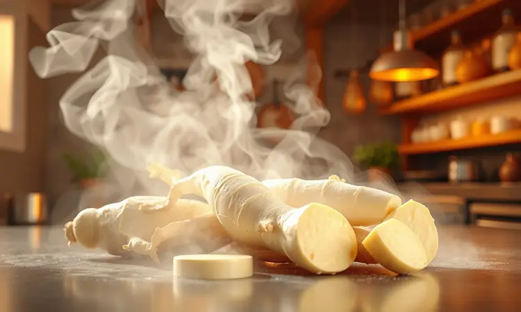
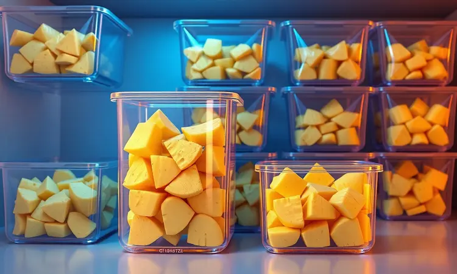

Você já viveu aquela situação frustrante? Abre a air fryer com expectativa de encontrar mandioca crocante estilo boteco, mas descobre pedaços duros e secos que mais parecem tacos de madeira. A decepção é real, mas eu te entendo completamente.

Já passei por isso até descobrir que o problema nunca foi a air fryer, e sim alguns detalhes no preparo que fazem toda diferença entre sucesso e frustração.

Neste guia, vou compartilhar com você não apenas passos técnicos, mas todo o processo que transformou minha relação com a cozinha. Desde como escolher a raiz certa até truques que deixarão seus convidados perguntando: "Como você fez isso sem óleo?".

Prepare-se para dominar essa receita e descobrir como uma simples mandioca pode se tornar o centro das atenções na sua próxima reunião de família.

<SummaryList products={frontmatter.top_products} />

## Mandioca na Air Fryer: Por que substituir a fritura convencional?

Imagine poder saborear aquele crocante característico das melhores tascas, mas sem a sensação pesada depois de comer.

A magia da air fryer está justamente nesse equilíbrio: ela usa ar superaquecido para criar uma casquinha irresistível, enquanto reduz em até 70% o óleo que você consumiria na fritura tradicional.

O resultado é mais do que um prato saudável. É a liberdade de comer sem culpa, de servir para crianças sem preocupação e de repetir o prato sempre que a vontade bater. A textura que você ama se mantém, mas a experiência se transforma completamente.

## Como Escolher a Mandioca Ideal: Diferenças entre Aipim e Macaxeira

Vamos começar pelo básico que faz toda diferença. Quando você está diante daquela prateleira no mercado, parece tudo igual, mas existem dois mundos diferentes.

O aipim (ou mandioca doce) tem um segredo: sua textura naturalmente mais macia se transforma naquela combinação perfeita entre exterior crocante e interior cremoso que todos amamos.

Já a macaxeira (mandioca brava) tem personalidade forte e é ideal para quem prefere um sabor mais marcante e fibroso.

Minha dica prática? Pressione levemente a casca. Se ceder um pouco sem estar mole, você encontrou a peça perfeita. Evite aquelas com manchas escuras ou brotos, pois isso indica que começou a fermentar e pode ficar amarga.

## O Segredo da Crocância: Por que você deve pré-cozinhar a mandioca?

Aqui está o momento revelação que mudou tudo para mim. Colocar a mandioca crua direto na air fryer é como tentar assar uma batata inteira sem furar: o exterior queima enquanto o interior fica duro.

O pré-cozimento funciona como um preparador emocional.

Quando você cozinha a mandioca por 15 minutos na panela de pressão (ou 25 minutos na panela comum), está fazendo algo mágico: amolecendo a estrutura interna para que, quando o ar quente da air fryer chegar, encontre um terreno preparado para criar aquela crocância uniforme.

É a diferença entre um pedaço que parece industrial e aquele que tem alma de comida caseira. E tem bônus: esse processo também elimina parte do amido, evitando aquela sensação pesada que às vezes a mandioca deixa.

## Receita de Mandioca Frita na Air Fryer: Passo a Passo Completo

Vamos à prática! Separe cerca de 500g de mandioca descascada e cortada em pedaços de 4cm. Cozinhe por 15 minutos na panela de pressão com água até cobrir e uma colher de sopa de sal.

Enquanto isso, prepare sua transformação de sabor: em uma tigela, misture 2 colheres de sopa de azeite, 1 colher de chá de alho em pó, 1 colher de chá de páprica defumada e sal a gosto.

Esqueça os temperos básicos, essa combinação vai criar camadas de sabor que surpreendem.

Escorra bem a mandioca cozida (esse é o passo mais crítico para a crocância) e misture com o tempero até que todos os pedaços estejam uniformemente revestidos.

Pré-aqueça sua air fryer a 200°C por 3 minutos. Espalhe a mandioca em uma única camada no cesto (sem sobrepor) e programe 20 minutos. Na metade do tempo, abra, mexa delicadamente e volte.

Quando abrir no final, encontrará pedaços dourados que farão seu estômago roncar só de olhar.

## Melhores Modelos de Air Fryer para Resultados Profissionais

<ProductBox 
  title={frontmatter.top_products[0].title} 
  image={frontmatter.top_products[0].image} 
  link={frontmatter.top_products[0].link} 
/>

Agora, vamos falar sobre o instrumento que fará essa magia acontecer. Não é sobre qual é a "melhor" no mercado, mas sobre qual se conecta com seu estilo de vida.

Se sua rotina é corrida e você precisa de praticidade acima de tudo, modelos como a Philips Walita com tecnologia Rapid Air oferecem consistência impressionante.

Ela quase "pensa" por você, distribuindo o calor de forma tão uniforme que dificilmente algum pedaço fica para trás.

Para famílias maiores ou quem adora receber amigos, as opções oven-style da Oster são um playground culinário. Você pode preparar mandioca em uma bandeja enquanto assa frango em outra, tudo ao mesmo tempo.

Sim, ocupam mais espaço, mas a versatilidade compensa cada centímetro.

E se limpeza rápida é sua prioridade, as linhas da Britânia e Philco com cestos antiaderentes são sua melhor amiga. Basta passar uma esponja suave e pronto.

## Variações Irresistíveis: Mandioca com Alho, Ervas e Parmesão

Por que parar no básico quando podemos criar experiências? A mandioca temperada é apenas o começo da jornada.

Para um toque que lembra aquelas tascas tradicionais, refogue 4 dentes de alho picados no azeite antes de misturar com a mandioca. O calor suave transforma o alho cru em um aroma que invade toda a casa.

Quer impressionar? Após retirar a mandioca da air fryer, enquanto ainda está quente, polvilhe parmesão ralado fino. O calor residual derrete levemente o queijo, criando uma camada crocante que se desfaz na boca.

E para os dias em que o humor pede sofisticação, adicione alecrim fresco picado ao tempero. O contraste entre a rusticidade da mandioca e a nobreza das ervas transforma um simples acompanhamento em conversa de jantar.

## Como Fazer Farofa e Farinha de Mandioca na Air Fryer

Aqui está onde a versatilidade brilha. Aquela mandioca que sobrou do almoço pode renascer de formas surpreendentes.

Para uma farofa que fará história, pique finamente a mandioca cozida e resfriada. Em uma tigela, misture com cebola roxa picada, cheiro-verde e um toque generoso de manteiga derretida. Espalhe na air fryer a 180°C por 12 minutos, mexendo a cada 4 minutos.

O resultado é uma crocância que desafia qualquer farofa convencional.

A farinha caseira é um projeto para quem ama o processo tanto quanto o resultado. Depois de secar bem a mandioca cozida na air fryer (200°C por 30 minutos, mexendo frequentemente), triture no processador até obter a textura desejada.

A satisfação de usar sua própria farinha no próximo bolo é indescritível.

## Melhores Processadores para Fazer sua Própria Farinha em Casa

<ProductBox 
  title={frontmatter.top_products[1].title} 
  image={frontmatter.top_products[1].image} 
  link={frontmatter.top_products[1].link} 
/>

Falando em farinha caseira, o equipamento certo transforma trabalho em prazer. Se você é do tipo que gosta de envolvimento manual, moedores como o Moedor de Café Manual em Inox oferecem uma conexão quase terapêutica com o processo.

Cada giro da manivela é um passo rumo ao resultado final.

Para quem prefere eficiência, processadores como o Philips Walita PowerChop, com seus 1000W de potência, são como ter um assistente na cozinha. Ele não apenas moe para sua farinha, como também prepara patês, pães e até massas frescas.

O segredo está em entender seu ritmo. Processadores com menos potência (700W) são perfeitos para uso esporádico, enquanto os mais robustos atendem quem realmente abraçou a filosofia "faça você mesmo".

## 5 Dicas de Especialista para uma Mandioca Estilo Boteco

1. O resfriamento estratégico: após cozinhar, espalhe a mandioca em uma travessa por 10 minutos. Esse tempo permite que o excesso de umidade evapore naturalmente, criando a base perfeita para a crocância.

2. Azeite com inteligência: use um borrifador para aplicar o azeite. Assim você cobre uniformemente sem encharcar, que é o que causa aquele efeito borrachudo.

3. O toque final do sal: salgue novamente após a air fryer, enquanto ainda está quente. O calor abre os poros da casca crocante, permitindo que o sal penetre de forma mais intensa.

4. Espaço para respirar: nunca encha demais o cesto. O ar quente precisa circular livremente entre os pedaços para trabalhar sua magia.

5. O teste do garfo: na dúvida, perfure um pedaço. Se o garfo entra e sai sem resistência, mas o exterior está firme, você atingiu a perfeição.

## Como Armazenar e Congelar a Mandioca para Fritar Depois

A vida moderna pede praticidade, e aqui está como ter mandioca perfeita mesmo nos dias mais corridos. Depois de cozinhar e esfriar completamente, seque cada pedaço com papel toalha.

Esse passo parece simples, mas é o que impede a formação de cristais de gelo que estragam a textura.

Distribua em porções individuais em sacos de congelamento, retire todo o ar possível (um canudinho ajuda nisso) e congele planos. Quando a vontade bater, basta colocar direto na air fryer pré-aquecida a 200°C por 15 minutos.

A praticidade de comida fresca sem o trabalho diário.

## Erros Comuns que Deixam a Mandioca Dura ou Borrachuda

Vamos falar sobre os fantasmas que assombram muitas air fryers. O maior deles é o excesso de umidade. Quando você não seca bem após o cozimento, a água cria uma barreira de vapor que impede o douramento.

Outro vilão silencioso é a temperatura muito baixa. Abaixo de 180°C, a mandioca "suda" em vez de dourar, resultando naquela textura borrachuda que ninguém merece.

E o terceiro erro é a ansiedade. Abrir a air fryer a cada 5 minutos para verificar interrompe o fluxo de ar quente e resfria o ambiente interno. Confie no processo e espere pelo menos 10 minutos entre uma verificação e outra.

## Perguntas Frequentes sobre Mandioca na Air Fryer (FAQ)

"Mas fica realmente crocante sem óleo?" Essa é a pergunta que recebo sempre. A resposta vai além do sim: fica crocante de um jeito diferente.

Enquanto a fritura convencional cria uma crosta gordurosa, a air fryer desenvolve uma casquinha mais leve que realça o sabor natural da mandioca.

"Preciso virar mesmo?" Absolutamente. A movimentação na metade do tempo garante que todos os lados recebam a mesma atenção do ar quente. É como assar no forno, mas com resultados em metade do tempo.

"E se eu não tiver panela de pressão?" A panela comum funciona perfeitamente, apenas aumente o tempo para 25 minutos. O importante é testar com o garfo antes de prosseguir.

## Conclusão

Quando comecei essa jornada com a mandioca na air fryer, buscava apenas um acompanhamento mais saudável.

O que descobri foi muito mais profundo: uma forma de reconectar com o prazer de cozinhar, de surpreender a mim mesma e aos que amo, e de transformar um ingrediente simples em experiências memoráveis.

Cada pedaço dourado que sai da sua air fryer carrega mais que sabor. Carrega a confiança de que você dominou uma técnica, a satisfação de servir algo feito com suas mãos e a liberdade de criar variações que expressam seu estilo único na cozinha.

Agora é sua vez. Escolha sua mandioca com carinho, siga esses passos com atenção aos detalhes e prepare-se para o momento em que você abrirá a air fryer e encontrará não apenas um prato, mas a confirmação de que a cozinha é, sim, um lugar de magia acessível a todos.

Quando experimentar a primeira mordida daquela crocância perfeita, me conta: valeu cada minuto do processo?