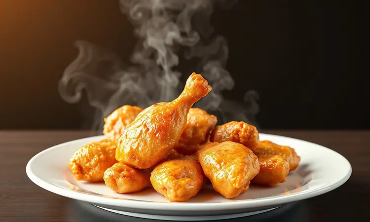
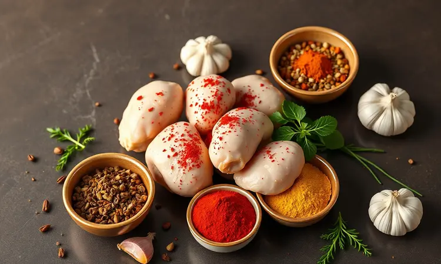
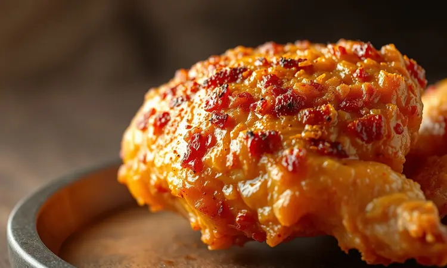
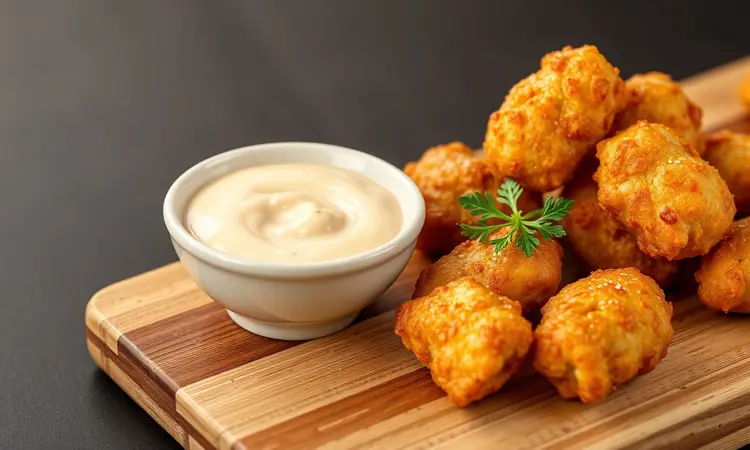

Imagine aquela tarde de sábado quando a vontade de comer um frango à passarinho crocante surge, mas o pensamento de limpar o óleo espalhado, aquele cheiro que invade cada cantinho da casa por horas e a preocupação com a saúde fazem você hesitar.

Essa sensação, que tantos conhecem, foi completamente transformada pela Air Fryer.

Não é apenas uma promessa, é uma realidade que você pode conquistar hoje: um petisco que mantém toda a crocância dos melhores restaurantes, a suculência que faz a família pedir mais, e a praticidade que libera você do trabalho pesado.

Este guia vai revelar não apenas o passo a passo técnico, mas os detalhes emocionais que transformam uma simples receita em uma experiência culinária memorável, com os truques que garantem resultados dignos de chef.

<SummaryList products={frontmatter.top_products} />

## Por que fazer frango à passarinho na Air Fryer é a melhor escolha?

Você já parou para pensar no ritual da fritura tradicional? O óleo que esquenta, o cuidado constante para não deixar queimar, a limpeza que parece nunca terminar. A Air Fryer elimina essa carga física e emocional, entregando algo ainda mais especial: o controle.

Cada pedacinho de frango recebe calor uniforme, criando aquela casquinha dourada que você ama sem o excesso de óleo que pesa na consciência. E a praticidade?

É como ter um assistente culinário que trabalha enquanto você relaxa, preparando porções perfeitas mesmo quando o tempo parece fugir. O resultado não é apenas "mais saudável" - é uma celebração do sabor sem os pesos tradicionais.

## Escolhendo a Air Fryer Ideal para Petiscos Crocantes

<ProductBox 
  title={frontmatter.top_products[0].title} 
  image={frontmatter.top_products[0].image} 
  link={frontmatter.top_products[0].link} 
/>

Antes de mergulhar nos ingredientes, vamos conversar sobre o equipamento que será seu parceiro nesta jornada. A escolha não é sobre especificações técnicas, mas sobre como cada modelo conversa com seu estilo de vida.

Marcas como Oster e Philips Walita ganharam o coração dos apaixonados por petiscos porque entendem essa busca pela crocância perfeita. O modelo Oster OFRT520, por exemplo, é famoso por criar uma casquinha que parece saída de um restaurante especializado.

A Philips Walita, com sua tecnologia Rapid Air, distribui o calor como um maestro, garantindo que cada pedaço seja tratado com igual importância.

Se sua cozinha é compacta, não se preocupe: existem opções que respeitam seu espaço enquanto entregam performance.

E se você adora reunir amigos, uma capacidade maior pode ser seu melhor investimento, transformando uma simples sessão de petiscos em um evento gastronômico. O painel digital ou analógico? Pense na experiência: você quer precisão milimétrica ou a simplicidade intuitiva?

Essa escolha define como você vai interagir com seu novo aliado culinário.

## Ingredientes Necessários: O Segredo está no Tempero

O que transforma pedaços simples de frango em uma experiência que faz os olhos brilhar? A conversa entre os ingredientes. Coxinhas da asa ou peito cortado em pequenas porções são sua base, mas o verdadeiro protagonista é o tempero.

Não pense em "sal e pimenta" como elementos técnicos: imagine o alho picado entregando seu aroma, o limão abraçando cada pedaço, e ervas como alecrim ou tomilho murmurando sabores ancestrais.

Esta marinada não é apenas um passo no processo, é um momento zen onde você infunde amor no alimento.

Para a crocância final, uma leve camada de farinha de trigo ou amido de milho cria o abraço perfeito: protege a suculência interna enquanto prepara a casquinha dourada.

Esta combinação, quando respeitada com um tempo adequado de marinada (aqueles minutos onde a magia acontece silenciosamente), resulta não em "frango", mas em memórias gustativas.

## Passo a Passo: Como Preparar o Frango à Passarinho Perfeito

Comece honrando o ritual da marinada: deixe os temperos conversar com o frango, criando uma conexão de sabor. Enquanto isso acontece, pré-aqueça sua Air Fryer - esse simples passo é como acalmar o instrumento antes do concerto, garantindo que tudo comece no ponto ideal.

Quando tudo está harmonizado, arrume os pedaços com cuidado na cesta, respeitando o espaço que cada um precisa para receber seu banho de calor.

Programe 200°C por aproximadamente 25 minutos, e na metade do tempo, vire cada pedaço com atenção: este movimento garante que a crocância seja uma serenata uniforme, não um acorde isolado.

### O truque da temperatura: Quando aumentar para dourar?

A temperatura na Air Fryer é como dirigir em uma viagem: você começa com cuidado, garantindo que tudo esteja seguro, e então acelera para chegar ao destino perfeito.

Inicie entre 180°C e 200°C, permitindo que o calor penetre gentilmente, cuidando da suculência interna sem criar ansiedade. Após 15 a 20 minutos, quando o frango já está confortável em seu cozimento, aumente para 220°C por 5 a 10 minutos.

Este momento final é o climax: a casquinha se transforma em dourado perfeito, a crocância atinge seu ápice, e você alcança aquela textura que faz os dedos procurar o próximo pedaço antes mesmo de terminar o primeiro.

Cada Air Fryer tem sua personalidade, então observe e ajuste - esta é a dança entre você e sua máquina.

## 3 Segredos para uma Crocância Extra (Sem Excesso de Farinha)

Primeiro, entenda a marinada não como obrigação, mas como cerimônia. O suco de limão não apenas amolece, ele acorda sabores; o alho e especiarias são convidados que elevam a experiência.

Segundo, pense na crocância como um vestido elegante, não uma capa pesada: uma leve camada de amido de milho cria textura sem sufocar.

Por último, o pré-aquecimento é seu momento de concentração - selar rapidamente o frango mantém a suculência interna protegida, enquanto a casquinha externa se prepara para sua apresentação final.

## Acessórios que Facilitam o Preparo e a Limpeza

<ProductBox 
  title={frontmatter.top_products[1].title} 
  image={frontmatter.top_products[1].image} 
  link={frontmatter.top_products[1].link} 
/>

Os acessórios da Air Fryer são como amigos que aparecem para ajudar numa tarefa difícil. Formas de silicone ou metal não apenas facilitam a remoção dos alimentos, elas transformam o processo em algo quase elegante, evitando aquela frustração de alimentos grudados.

Grelhas e espetos garantem que cada pedaço de carne receba atenção igual, como um anfitrião distribuindo cuidados. Protetores descartáveis são o mimo que permite que você foque no prazer da comida, não na preocupação da limpeza.

E o borrifador de óleo? Ele é o guardião da medida perfeita: aplica a quantidade exata que garante crocância sem exageros, como um somelier que sabe a dose ideal.

Quando escolher seus companheiros, verifique a compatibilidade - esta conexão garante que todos trabalhem em harmonia, criando uma experiência fluida.

## Erros Comuns: Por que seu frango fica seco ou pálido?

Imagine preparar seu frango com expectativa, mas ao abrir a Air Fryer encontrar pedaços pálidos ou ressecados.

O primeiro suspeito costuma ser a marinada ignorada: sem esse momento de infusão, a carne perde sua umidade natural durante o cozimento, como uma planta sem água.

O segundo erro é a relação imprecisa com tempo e temperatura: muito calor ou tempo excessivo cria uma casca dourada que esconde um interior desidratado, uma farsa visual. E o terceiro, quase sempre esquecido: sobrecarregar a cesta.

Quando os pedaços estão apertados, o ar não circula com liberdade, e alguns ficam tímidos enquanto outros tentam dominar. Respeite o espaço, e cada pedaço receberá sua chance de brilhar.

## Sugestões de Acompanhamentos e Molhos Especiais

O frango à passarinho crocante é um protagonista que ama bons coadjuvantes. Uma salada fresca com rúcula, tomate-cereja e cebola roxa traz o contraponto de frescor, como uma brisa após o calor.

Arroz branco ou farofa bem temperada são os amigos clássicos que sempre agradam, criando familiaridade. Mas os molhos são os verdadeiros transformadores: um alho cremoso que abraça cada pedaço, um chimichurri que vibra com ervas, ou um picante que desafia os sentidos.

Cada combinação cria uma nova narrativa para sua experiência.

## FAQ: Dúvidas Frequentes sobre Frango na Air Fryer

Quando o frango à passarinho na Air Fryer entra na sua rotina, algumas perguntas naturais surgem. A marinada precisa de quanto tempo?

Entre 30 minutos e 2 horas, dependendo da profundidade que você quer no sabor - é como escolher entre um mergulho rápido ou uma imersão profunda. Qual temperatura oferece resultados mais confiantes?

Entre 180°C e 200°C geralmente cria o equilíbrio perfeito entre cozimento interno e crocância externa. E por que não sobrecarregar a cesta? Porque cada pedaço merece seu espaço para respirar e transformar, como artistas em um palco que precisam de luz individual.

## Conclusão

O frango à passarinho na Air Fryer não é apenas uma alternativa à fritura tradicional, é uma reinvenção da experiência.

Você troca a sujeira do óleo pelo controle preciso, o cheiro invasivo pela expectativa aromática, e a preocupação com saúde pela celebração do sabor inteligente.

Cada passo - desde a escolha do equipamento que conversa com seu estilo, a cerimônia da marinada que infunde amor, o ritual do pré-aquecimento que prepara o ambiente, até o momento final onde a temperatura cria a douração perfeita - transforma você de consumidor em criador.

Os erros se tornam aprendizados, os acessórios são aliados, e os acompanhamentos ampliam a festa. Agora você não apenas "faz frango", você cria memórias gustativas que reunirão pessoas, gerarão conversas e estabelecerão tradições.

Sua Air Fryer está esperando para começar essa transformação com você.