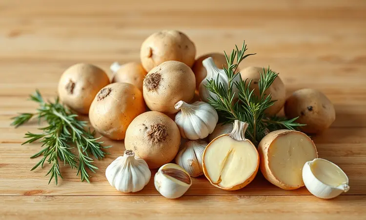
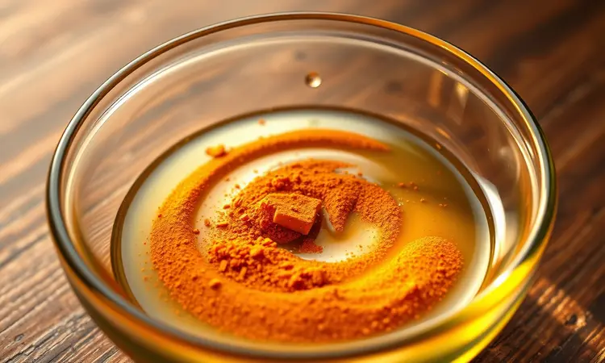
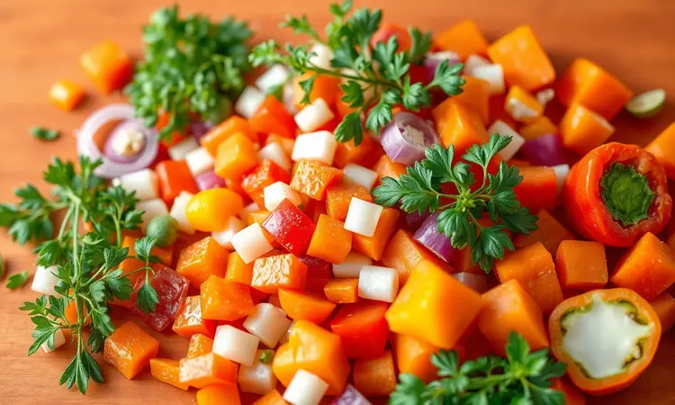

Você já passou pela frustração de tentar assar frango e batatas juntos e acabar com um ingrediente seco enquanto o outro ainda está cru?

Muitos acreditam que a Airfryer serve apenas para petiscos rápidos, mas ela é a ferramenta definitiva para uma refeição completa e saudável.

Neste guia, prometo revelar o método exato para preparar frango com batata na fritadeira sem óleo, garantindo suculência interna e aquela crocância irresistível por fora. Você vai aprender desde o corte ideal até o tempero secreto que faz toda a diferença no sabor.

<SummaryList products={frontmatter.top_products} />

## Por que fazer frango com batata na Airfryer é a melhor escolha?

Imagine ter aquela crocância que só as frituras proporcionam, mas sem o peso da gordura ou a culpa depois da refeição. É exatamente isso que a Airfryer oferece.

Seu segredo está naquele vento quente inteligente que circula por toda a cesta, envolvendo cada pedaço de frango e batata num abraço térmico que cozinha por igual.

O melhor? Enquanto tudo fica dourado e crocante lá dentro, você tem tempo livre para fazer outras coisas. É como ter um assistente culinário que cuida dos detalhes enquanto você aproveita a família ou simplesmente relaxa.

Para quem tem uma rotina corrida mas não abre mão de uma refeição saborosa, essa combinação é quase mágica.

## Ingredientes essenciais para o Frango Perfeito

Vamos ao básico que nunca falha: peito ou coxa de frango (falaremos sobre a melhor escolha em seguida), batatas cortadas em cubos, alho, sal, pimenta e aquele fio de azeite que vai transformar tudo.

São ingredientes simples, mas quando combinados com a técnica certa, criam algo extraordinário.

### O melhor corte: Sobrecoxa, Coxa ou Peito?

Cada corte tem sua personalidade na Airfryer. A sobrecoxa é a artista mais dramática, mais suculenta e generosa, com uma camada de gordura que derrete lentamente e banha a carne em sabor durante todo o cozimento.

Sua textura final é tão tenra que quase se desfaz no garfo.

Já a coxa é sua opção confiável, fácil de manejar e com aquela carne mais escura que naturalmente retém mais umidade. Se você busca praticidade sem comprometer o sabor, ela é sua aliada.

O peito, por sua vez, pede um pouco mais de cuidado. Por ser mais magro, ele precisa de um olhar atento para não secar. Mas com o tempo certo e um bom marinado, também entrega resultados incríveis.

Para quem está começando, porém, recomendo experimentar primeiro com sobrecoxa ou coxa, elas são mais indulgentes.

## Passo a Passo: Como preparar frango e batatas juntos sem erro

Comece dando aquele carinho inicial ao seu frango. Marinar por pelo menos 30 minutos (ou até de um dia para o outro) permite que os temperos penetrem profundamente, criando camadas de sabor. Enquanto isso, cuide das batatas.

### O segredo do corte das batatas para assarem no tempo certo

Pense nas suas batatas como uma equipe que precisa trabalhar em sincronia. Corte todas em cubinhos gêmeos, com cerca de 1 a 2 cm.

Esse tamanho uniforme garante que ninguém fique para trás, todos atingem aquele ponto perfeito de maciez interna e crocância externa ao mesmo tempo.

Quando colocar na Airfryer, distribua tudo de forma que cada pedaço tenha seu espaço para respirar. Aquele pré-aquecimento de 3 a 5 minutos faz toda diferença, como dar um aquecimento ao palco antes do show começar.

Ajuste entre 180°C e 200°C por 25 a 30 minutos, mas aqui está o segredo: dê uma sacudida na cesta na metade do tempo. Isso garante que cada lado receba atenção igual.

## O melhor modelo de Airfryer para famílias

<ProductBox 
  title={frontmatter.top_products[0].title} 
  image={frontmatter.top_products[0].image} 
  link={frontmatter.top_products[0].link} 
/>

Se você está cozinhando para mais do que uma ou duas pessoas, o tamanho importa. E muito. Uma Airfryer com menos de 5 litros pode significar fazer várias rodadas quando o ideal é servir tudo de uma vez, ainda quentinho.

Para famílias grandes, a Mondial AFO-12L com seus 12 litros é quase um forno compacto. Ela não só acomoda porções generosas como oferece versatilidade com diferentes funções de cocção.

O Electrolux EAF9 Oven também brilha nesse cenário. Com 5 funções em um só aparelho e capacidade parecida, ele simplifica a rotina na cozinha, permitindo que você experimente além do básico.

Já o Philips Walita Série 1000 XL, com 6,2 litros, é a escolha de quem prioriza eficiência e cozimento uniforme acima de tudo. Sim, pode ser um investimento maior inicialmente, mas seu sistema de circulação de ar é considerado um dos mais precisos do mercado.

Antes de decidir, meça o espaço na sua bancada e pense nas refeições que mais prepara. Um modelo maior pode parecer exagerado, mas quando você consegue assar frango e batatas para todos de uma só vez, o alívio no dia a dia é palpável.

## Tempero Especial: O segredo da cor dourada e sabor intenso

Aqui está onde a magia realmente acontece. Crie sua mistura principal com sal, pimenta do reino, alho em pó e, o ingrediente estrela: páprica.

Essa especiaria não só empresta um tom dourado vibrante como traz um sabor levemente adocicado que complementa o frango de forma brilhante.

Para aplicar, use um pincel de silicone. Não é apenas mais higiênico que usar as mãos, como distribui o azeite e os temperos com delicadeza uniforme, garantindo que cada milímetro fique perfumado e pronto para crocar.

Adicione ervas frescas no final, como alecrim ou tomilho. Elas liberam seus aromas nos últimos minutos, criando uma camada perfumada que faz todos perguntarem o segredo.

## 5 Dicas de Ouro para Batatas Crocantes e Frango Macio

1. **Irmandade no corte:** Batatas do mesmo tamanho assam juntas, criando harmonia no prato.

2. **Paciência no marinado:** Dê tempo para o frango absorver os sabores, quanto mais, melhor.

3. **Amor ao espaço:** Não sobrecarregue a cesta, o ar precisa circular livremente.

4. **Aquecimento carinhoso:** Esses 3 a 5 minutos iniciais fazem toda diferença na textura final.

5. **Toque de azeite:** A quantidade certa (não excessiva) cria a crocância sem deixar oleoso.

## Erros comuns que você deve evitar na Fritadeira Sem Óleo

Pular o pré-aquecimento é como começar uma viagem sem calibrar os pneus. A Airfryer precisa atingir sua temperatura ideal antes de receber os alimentos para garantir cozimento uniforme desde o primeiro minuto.

Outro equívoco comum é encher a cesta até a borda. Quando os alimentos estão amontoados, criam barreiras para a circulação do ar quente, resultando em pedaços mal cozidos ao lado de outros quase queimados. Pense em dar espaço para cada ingrediente respirar.

Com a ausência de óleo em quantidade, os temperos se tornam ainda mais importantes. Não tenha medo de ser generoso com especiarias, pois elas serão sua principal fonte de sabor. Por fim, conheça sua máquina.

Cada modelo tem sua personalidade, então ajuste tempos e temperaturas conforme for se familiarizando.

## Variações: Adicionando legumes e ervas frescas

Que tal transformar seu prato em uma explosão de cores e nutrientes? Cenouras em rodelas, abobrinhas em meia-lua e pimentões em tiras não só adicionam vibrância visual como trazem texturas complementares.

Corte todos no mesmo tamanho aproximado das batatas para que a jornada no calor seja igual para todos.

As ervas são o perfume final. Alecrim para um toque terroso, tomilho para um aroma mais suave, ou salsinha para frescor imediato. Adicione-as nos últimos 5 minutos de cozimento para preservar seus óleos essenciais e aroma.

## Acessórios que facilitam a limpeza após o preparo

<ProductBox 
  title={frontmatter.top_products[2].title} 
  image={frontmatter.top_products[2].image} 
  link={frontmatter.top_products[2].link} 
/>

Ninguém gosta da parte da limpeza, mas com as ferramentas certas, ela se torna rápida e eficiente. Após o uso, enquanto a Airfryer ainda está morna (não quente), passe um pano úmido para remover os resíduos mais soltos.

Para a gordura mais teimosa, use um desengordurante específico para antiaderentes. Produtos como o "Limpa Air Fryer" são formulados para dissolver resíduos sem danificar o revestimento precioso da sua máquina.

Na hora de esfregar, opte por esponjas macias da linha Scotch-Brite ou similares. Elas removem a sujeira sem riscar. Evite abrasivos a todo custo, pois uma vez danificado o antiaderente, a experiência de cozimento nunca mais será a mesma.

Embora algumas partes sejam laváveis na máquina de lavar louça, a limpeza manual gentil prolonga significativamente a vida do revestimento. Pense nesses minutos extras como um investimento na longevidade do seu eletrodoméstico favorito.

## Perguntas Frequentes (FAQ)

### Preciso pré-aquecer a Airfryer?

Pense no pré-aquecimento como aquecer o forno antes de assar um bolo. Não é absolutamente obrigatório, especialmente para porções pequenas ou quando a pressa fala mais alto.

No entanto, esses 3 a 5 minutos iniciais fazem uma diferença notável: assegura que os alimentos comecem a cozinhar imediatamente na temperatura ideal, resultando em crocância mais uniforme e menor tempo total de preparo.

Para carnes e batatas, onde a textura é crucial, essa etapa simples se paga em qualidade final.

### Posso usar batata doce no lugar da inglesa?

Absolutamente sim, e você vai se surpreender com o resultado. A batata doce traz uma doçura natural que contrasta lindamente com o sabor salgado do frango, além de uma textura cremosa que derrete na boca.

Rica em fibras, vitaminas e antioxidantes, ela transforma sua refeição em uma opção ainda mais nutritiva.

Apenas fique atento: como cozinha um pouco mais rápido que a batata inglesa, vale verificar alguns minutos antes do tempo previsto. O ponto ideal é quando as bordas começam a caramelizar levemente, sinal de que os açúcares naturais estão trabalhando a seu favor.

## Conclusão

O que parece ser apenas mais uma receita se revela, na verdade, uma mudança de perspectiva sobre como preparar refeições no dia a dia.

A combinação de frango com batata na Airfryer vai além da praticidade, se transforma em um ritual que respeita seu tempo sem abrir mão do prazer à mesa.

Você descobre que é possível ter crocância sem culpa, sabor intenso sem complicação, e uma refeição completa que sai da cozinha em minutos, não horas.

Cada etapa, desde a escolha do corte até o toque final das ervas, se torna parte de uma experiência culinária que alimenta tanto o corpo quanto a satisfação de criar algo delicioso com suas próprias mãos.

Essa receita não é apenas sobre frango e batatas, é sobre recuperar o prazer de cozinhar em meio à correria, sobre servir não apenas comida, mas momentos de conexão.

Da próxima vez que pensar no jantar, lembre-se que você tem nas mãos a ferramenta para transformar ingredientes simples em uma refeição memorável. Quer tentar hoje?