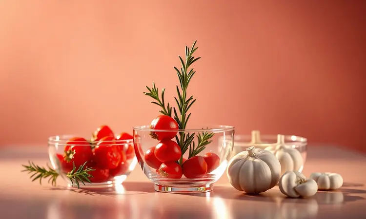
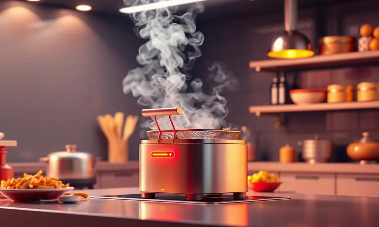

Você já preparou um frango na airfryer e ele acabou ficando seco ou com a pele murcha? É uma frustração comum, mas o erro geralmente está em pequenos detalhes do preparo.

Neste guia definitivo, eu vou te ensinar o passo a passo exato para garantir um frango suculento por dentro e irresistivelmente crocante por fora.

Você vai descobrir os melhores temperos, os tempos corretos para cada corte e dicas profissionais que vão transformar sua forma de usar a fritadeira elétrica.

<SummaryList products={frontmatter.top_products} />

## Por que a Airfryer é a Melhor Forma de Preparar Frango?

Imagine poder ter um frango crocante como se fosse frito, mas usando apenas uma pequena quantidade de óleo. A airfryer faz isso possível através do seu sistema de ar quente circulante, que envelopa cada pedaço de comida com calor constante.

Isso significa cozimento uniforme sem aquelas partes que ficam mais queimadas enquanto outras estão ainda cruas. O resultado? Uma carne que mantém toda sua suculência natural enquanto desenvolve aquela crosta dourada que todo mundo ama.

Você não precisa ser um chef para conseguir isso. A versatilidad também está no tempero, permitindo que você explore desde receitas tradicionais até combinações mais criativas, tudo com a facilidade de um botão.

## Utensílios que Facilitam sua Vida na Cozinha

Quando o objetivo é um frango perfeito, alguns equipamentos específicos podem ser seus maiores aliados. Não estamos falando apenas de utensílios genéricos, mas de ferramentas que realmente otimizam cada etapa do processo na airfryer.

### Escolhendo a Melhor Fritadeira Elétrica para sua Necessidade

<ProductBox 
  title={frontmatter.top_products[0].title} 
  image={frontmatter.top_products[0].image} 
  link={frontmatter.top_products[0].link} 
/>

Pense na sua rotina. Para famílias maiores, modelos como a Mondial Mega Family AFN-80 oferecem 8 litros de capacidade e 1900W de potência, espaço suficiente para preparar um frango inteiro ou várias peças simultaneamente sem precisar cozinhar em lotes.

Se você cozinha em menor escala, a Philips Walita Essential com 4,6 litros é uma opção compacta que não sacrifica eficiência.

Para quem quer ainda mais versatilidade, a Mondial AFO-12 de 12 litros e 2000W combina funções de air fryer com forno, perfeita para quando você quer variar entre assados e fritos. A escolha vai além da capacidade.

Considerar o espaço que o aparelho ocupará na sua cozinha e como ele se integra ao seu fluxo de preparo de refeições faz toda diferença na experiência prática.

### Acessórios Indispensáveis: Pulverizadores e Formas

<ProductBox 
  title={frontmatter.top_products[1].title} 
  image={frontmatter.top_products[1].image} 
  link={frontmatter.top_products[1].link} 
/>

Um pulverizador de óleo é o que transforma "usar pouco óleo" em "usar óleo de forma inteligente". Ele permite aplicar uma camada uniforme e mínima sobre o frango, garantindo aquela crocância perfeita sem deixar a carne seca.

Você pode escolher entre modelos de vidro ou elétricos conforme sua preferência. As formas para airfryer, especialmente as de silicone reutilizáveis, são outro investimento que vale cada centavo.

Facilitam a limpeza e são ideais para preparar acompanhamentos que complementam seu frango, como bolos ou tortas. Atenção apenas ao tamanho, formas muito grandes podem não caber no cesto.

Para muffins ou pequenos acompanhamentos, formas de papel são práticas, mas use sempre dentro de uma forma resistente para evitar que voem com a circulação do ar. Esses detalhes elevam suas receitas de simples preparos para experiências culinárias completas.

## O Segredo do Tempero: Como Marinar para Obter Máximo Sabor

A marinada não é apenas um passo na receita, é o ritual que transforma um simples frango em uma experiência gourmet.

Quando você deixa a carne absorvendo suco de limão, alho picado e suas ervas favoritas por algumas horas, cria uma profundidade de sabor que penetra até o centro. Essa prática equilibra acidez e aroma, fazendo cada mordida revelar nuances diferentes.

O tempo mínimo é 30 minutos, mas quando você consegue planejar e marinar durante a noite, o resultado é outro nível. Escolher temperos que você realmente aprecia personaliza o prato completamente, tornando-o seu.

## Tabela de Tempos e Temperaturas por Corte de Frango

Aquela precisão que garante paz na hora de servir. Saber o tempo e temperatura exatos para cada corte elimina o risco de ficar cru ou borrachudo.

### Peito de Frango: O Truque para Não Deixar Secar

O desafio aqui é manter a suculência enquanto alcança a crocância externa. Marinar com ingredientes como iogurte, suco de limão ou azeite cria uma barreira de humidade que protege a carne durante o cozimento.

Temperatura mais baixa por períodos mais longos permite que o peito cozinhe uniformemente sem secar. Imagine abrir sua airfryer depois de 20 minutos a 200°C e encontrar um peito perfeito, pronto para ser cortado sem perder seus sucos.

### Coxas e Sobrecoxas: Como Conseguir a Pele Perfeita

Aquela sensação quando você tira uma coxa com pele tão crocante que parece churrasco. Comece secando bem a carne com papel toalha, eliminando a umidade superficial que impede a crocância. Tempere a gosto, aplique uma leve camada de azeite e nunca sobrecarregue a cesta.

Cozinhar em lotes se necessário garante que cada peça receba circulação de ar ideal. Em temperatura alta por 25 a 30 minutos, virando na metade do tempo, você obtém uniformidade que transforma qualquer coxa em destaque.

### Frango Inteiro na Airfryer: Passo a Passo e Cuidados

Um frango inteiro perfeito na airfryer é possível com planejamento. Temperar e marinar por algumas horas antes prepara a carne para o cozimento extenso. Pré-aquecer a 180°C e ajustar o tempo conforme o tamanho, geralmente cerca de 1 hora.

Virar na metade do tempo garante que todos os lados recebam calor igual. Verificar a temperatura interna atingindo 75°C é sua garantia de segurança e qualidade. O resultado? Um frango que impressiona em qualquer ocasião.

## Como Fazer Frango na Airfryer: O Método Infalível

Este é seu plano seguro para qualquer dia. Escolha peças com pele para garantir crocância máxima. Tempere com sal, pimenta e suas ervas favoritas, deixando marinar por pelo menos 30 minutos para absorção completa.

Pré-aqueça a 200°C e coloque o frango em uma única camada na cesta. Espaço suficiente significa circulação perfeita do ar quente. Cozinhe por 25 a 30 minutos, virando na metade do tempo. A crosta dourada que se forma mantém a suculência interior intacta.

## Dicas de Especialista para um Resultado Profissional

Temperar bem é o primeiro passo, mas o espaço entre os pedaços na cesta é o segredo invisível. Quando cada pedaço tem seu próprio espaço, o ar quente circula livremente, cozinhando uniformemente e criando aquela crocância perfeita em toda superfície.

### Pode usar papel alumínio ou papel manteiga?

<ProductBox 
  title={frontmatter.top_products[2].title} 
  image={frontmatter.top_products[2].image} 
  link={frontmatter.top_products[2].link} 
/>

Sim, mas com cuidado. O papel alumínio pode evitar que alimentos delicados grudem e facilitar a limpeza, mas nunca deve entrar em contato direto com o elemento de aquecimento devido ao risco de incêndio. Mantenha-o bem fixado, evitando que fique solto e se desloque.

O papel manteiga também pode ser usado, mas precisa ser colocado de maneira que não bloqueie a circulação do ar quente. Usar pesos com alimentos ajuda, mas muitos fabricantes desaconselham uso prolongado devido ao risco de queimar em altas temperaturas.

Uma alternativa mais segura são tapetes de silicone reutilizáveis, que oferecem solução prática e duradoura sem os riscos associados aos papéis.

### O que fazer para o frango não grudar no cesto?

Pré-aquecer o aparelho cria uma superfície menos propensa a grudar. Aplicar uma fina camada de azeite no cesto antes de colocar a carne, seja com spray ou pincel, forma uma barreira.

Não superlotar o cesto permite que o ar quente circule adequadamente, resultando em cozimento uniforme e evitando que os pedaços se aglutinem. Marinar o frango antes também ajuda a manter humidade suficiente para melhorar a aderência.

## 5 Erros Comuns que Deixam o Frango Borrachudo ou Cru

Primeiro, esquecer a marinada significa perder a oportunidade de manter a carne suculenta. Exagerar na temperatura cria um exterior queimado enquanto o interior permanece cru. Não pré-aquecer a airfryer afeta o cozimento uniforme desde o início.

Sobrecarregar a cesta limita a circulação do ar quente, resultando em partes mal cozidas. Finalmente, não deixar o frango descansar após cozinhar permite que os sucos escapem, dando uma textura menos desejável.

## Sugestões de Acompanhamentos para Frango Assado

Arroz com brócolis adiciona cor e nutrientes enquanto complementa a suculência do frango. Batatas rústicas assadas na mesma airfryer ficam crocantes por fora e macias por dentro, criando contraste perfeito.

Uma salada de folhas verdes com molho leve equilibra a refeição. Legumes grelhados trazem textura e um toque saudável. Essas combinações transformam seu frango assado em um banquete completo.

## Perguntas Frequentes (FAQ)

### Posso colocar frango congelado direto na airfryer?

Sim, mas o tempo de cozimento será maior. Ajuste a temperatura e monitore a cocção para garantir que o frango alcance temperatura interna segura. Temperar antes de congelar ou adicionar temperos durante o cozimento garante sabor mais intenso e suculento.

### Como limpar a gordura da airfryer sem esforço?

<ProductBox 
  title={frontmatter.top_products[3].title} 
  image={frontmatter.top_products[3].image} 
  link={frontmatter.top_products[3].link} 
/>

Mergulhe o cesto em água quente com algumas gotas de detergente neutro por 10 minutos antes de esfregar suavemente. Para gordura mais grudenta, uma solução de vinagre branco e bicarbonato de sódio efervescente desincrusta resíduos difíceis.

Desengordurantes específicos para superfícies antiaderentes são outra opção, sempre verificando compatibilidade. Esperar a airfryer esfriar completamente antes de limpar evita acidentes. Usar papel vegetal no fundo do cesto previne acúmulo de sujeira.

## Conclusão

Preparar frango na airfryer não é apenas sobre seguir uma receita, é sobre entender como cada pequeno detalhe transforma o resultado final.

Desde escolher a marinada que dará profundidade ao sabor até conhecer os tempos exatos que garantem suculência sem risco de ficar cru, você está construindo uma habilidade que vai além do equipamento.

A crocância perfeita, a pele que se destaca, a carne que mantém seus sucos. Essas são as marcas de um frango bem preparado. Com as dicas deste guia, você não apenas evitará os erros comuns, mas dominará um método que traz consistência e qualidade a cada preparo.

Transforme sua airfryer não apenas em um aparelho de cozinha, mas em sua aliada para criar experiências gastronômicas que impressionam tanto no dia a dia quanto em ocasiões especiales.

Comece hoje, experimente as técnicas e descubra o frango perfeito que você pode fazer.