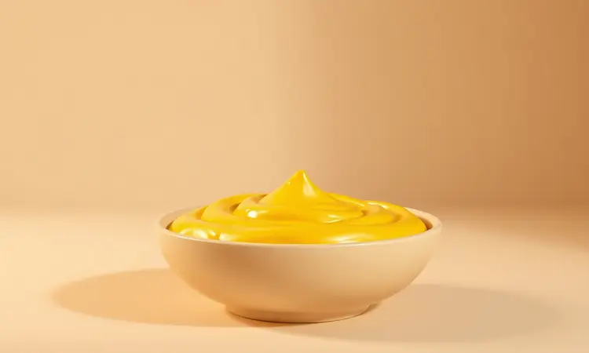
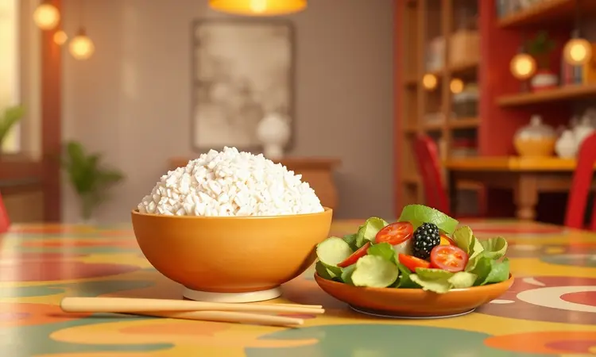

Você adora a cremosidade do fricassê de frango, mas sua paciência com o forno convencional já se esgotou há muito tempo?

Aquele medo de ressecar a comida na fritadeira elétrica desaparece quando você descobre o segredo: com a técnica certa, seu prato sai mais suculento e crocante do que você imaginava possível, pronto em praticamente metade do tempo.

Neste guia, compartilho a receita definitiva que vai do truque do desfiado relâmpago até a escolha do refratário perfeito, garantindo segurança e sabor em cada garfada.

<SummaryList products={frontmatter.top_products} />

## Por que preparar o Fricassê de Frango na Airfryer é uma escolha inteligente?

Imagine ter sua refeição favorita pronta enquanto ainda está arrumando a mesa. A airfryer transforma essa visão em realidade, oferecendo uma cozinha mais saudável com significativamente menos óleo, resultando em pratos leves mas nunca sem graça.

O tempo de preparo se encolhe diante da sua rotina corrida, enquanto a textura perfeita, aquela combinação de cremosidade reconfortante e crocância satisfatória, se torna alcançável com a simplicidade de um botão.

Você mantém todo o sabor da receita tradicional, mas ganha a praticidade que sua vida moderna exige.

## Ingredientes: O que você precisa para um resultado profissional

Comece com 500g de peito de frango, quantidade suficiente para alimentar uma família sem aquela preocupação de 'será que vai dar?' durante a refeição. Adicione uma cebola picada, dois dentes de alho amassados e uma lata de milho verde.

O segredo da cremosidade está em uma caixinha de creme de leite e uma xícara de queijo muçarela ralado, que garantem sabor e textura em perfeito equilíbrio. Finalize com sal, pimenta do reino e salsinha a gosto.

Simples assim, mas com resultados que vão impressionar até os paladares mais exigentes.

## Passo a Passo: Do Liquidificador à Airfryer

Bata no liquidificador o creme de leite com o milho até obter uma mistura suave. Agora, combine esse creme aveludado com o frango pré cozido. Leve à airfryer e aguarde até que aquele dourado perfeito apareça.

Parece mágica porque é quase isso, o trabalho duro fica por conta do seu eletrodoméstico favorito.

### Preparando o frango: Dicas para um desfiado perfeito e rápido

O segredo começa antes mesmo da airfryer. Cozinhe o frango em água com alho e cebola até que esteja tão macio que praticamente se desmanche. Deixe esfriar alguns minutos, apenas o suficiente para não queimar os dedos.

Agora vem o truque: use dois garfos cruzados para um desfiado tradicional ou, para economia máxima de tempo, coloque os pedaços ainda mornos na batedeira com o gancho e acione em velocidade baixa. O resultado?

Um desfiado uniforme que se mistura perfeitamente ao creme, garantindo que cada porção tenha exatamente a mesma qualidade.

### O Segredo do Creme de Milho Aveludado

É aqui que a receita ganha personalidade. Utilize milho em conserva ou fresco, batido no liquidificador com um pouco de leite até a textura lembrar cetim. Adicione temperos como sal e pimenta, junto com um toque de manteiga ou creme de leite extra.

Essa preparação não apenas enriquece o sabor, mas cria uma consistência que envolve o frango em abraço cremoso, transformando cada garfada em experiência sensorial completa.

### Montagem e Finalização com Batata Palha

Com a base pronta, chegou a hora da transformação final. Coloque uma porção generosa do fricassê em um refratário fundo, observando como o creme envolve delicadamente o frango desfiado.

Agora, a cereja do bolo: uma camada generosa de batata palha por cima, criando aquele contraste perfeito entre crocância exterior e suculência interior.

Sirva imediatamente, ainda quente, e observe como essa combinação aparentemente simples se torna o centro das atenções em qualquer almoço familiar ou encontro com amigos.

## Melhores modelos de Airfryer para receitas gratinadas

<ProductBox 
  title={frontmatter.top_products[0].title} 
  image={frontmatter.top_products[0].image} 
  link={frontmatter.top_products[0].link} 
/>

Para quem leva suas receitas gratinadas a sério, a escolha do modelo faz toda diferença. Os modelos Air Fryer Oven lideram com vantagem, funcionando como pequenos fornos elétricos cheios de versatilidade.

A Electrolux Air Fryer Oven EAF90 oferece 12 litros de capacidade e funções especializadas, incluindo a opção 'gratinar' que entende exatamente o que seu fricassê precisa.

O Mondial AFON 12L conversa com você através de painel digital e 10 funções predefinidas, perfeito para quem valoriza praticidade na rotina. E para cozinheiros que não aceitam limites, o Oster Multiplu traz 25 litros de liberdade criativa.

Sim, eles ocupam espaço, mas devolvem em versatilidade o que pedem em balcão.

## Qual recipiente usar? Guia de segurança para refratários na Airfryer

<ProductBox 
  title={frontmatter.top_products[1].title} 
  image={frontmatter.top_products[1].image} 
  link={frontmatter.top_products[1].link} 
/>

Segurança primeiro, sempre. Escolha refratários que conversem com altas temperaturas: vidro temperado, cerâmica ou porcelana são seus melhores amigos.

Verifique se o recipiente realmente foi feito para forno e aguenta tranquilamente temperaturas acima de 200°C, aquela crosta dourada dos sonhos. A medida real do sucesso? A airfryer precisa respirar.

Garanta que o recipiente caiba confortavelmente na cesta, permitindo a circulação de ar que cozinha uniformemente cada centímetro do seu prato.

Recipientes mais altos podem criar desafios para a crocância ideal. Para lasanhas e bolos, funcionam maravilhas, mas quando o objetivo é aquele dourado perfeito em frango a passarinho, considere formas de metal ou silicone que abraçam o calor com mais eficiência.

## Dicas de Ouro para o seu Fricassê não ficar seco

Mantenha a suculência começando pelo caldo. Cozinhe o frango em caldo de galinha caseiro ou adicione temperos aromáticos à água. Ingredientes como creme de leite ou requeijão não são opcionais, são guardiões da umidade que garantem cremosidade duradoura.

Salsinha fresca ou ervilhas dão toque especial enquanto contribuem para a textura perfeita. O maior erro? Confiar demais no cronômetro.

Observe sua airfryer, aprenda seus sinais, e retire o prato no exato momento em que o dourado diz 'estou pronto' mas a umidade ainda sussurra 'estou suculento'.

## Sugestões de Acompanhamentos: O que servir com Fricassê?

Seu fricassê merece companhia à altura. Arroz branco mantém a tradição, oferecendo leveza que equilibra a cremosidade. Purê de batatas amplifica o conforto, criando dueto de texturas que aquece até a alma.

Para contraste refrescante, saladas de folhas com tomate e cebola cortam a riqueza com precisão cirúrgica. E para os momentos que pedem indulgência, batatas fritas ou assadas oferecem crocância que brinca perfeitamente com a suavidade do molho.

A refeição se transforma em experiência completa, cada elemento conversando harmoniosamente com os outros.

## Como armazenar, congelar e reaquecer sobras corretamente

O bom cozinheiro nunca desperdiça. Deixe o fricassê esfriar à temperatura ambiente antes de transferi-lo para recipiente hermético, protegendo textura e sabor como tesouros que são.

Para congelar, escolha recipientes adequados e considere porções individuais, facilitando descongelamentos futuros.

Na hora de reaquecer, o micro ondas ou forno tradicional são aliados, mas trate seu prato com carinho: temperaturas altas transformam suculência em lembrança.

Na geladeira, suas sobras mantêm a magia por até três dias; no congelador, três meses de possibilidade sempre à mão para quando a correria bater à porta.

## Conclusão

O fricassê de frango na airfryer representa mais do que uma receita, simboliza a reconciliação entre tradição e praticidade. Você mantém todo o sabor da versão tradicional enquanto ganha horas preciosas no seu dia.

A airfryer não apenas cozinha, compreende os segredos da cremosidade e crocância, entregando resultados consistentes que impressionam.

E aquelas dúvidas que sempre surgem? Sim, o frango pode ir cru direto para a airfryer, cozinhando eficientemente em cerca de 25 a 30 minutos.

A cremosidade extra vem com um toque de requeijão ou creme de leite adicional no final, ajuste simples que transforma bom em excepcional.

Esta receita prova que tecnologia e tradição podem dançar juntas na sua cozinha. A próxima vez que a saudade do fricassê da vovó bater, lembre se que sua airfryer está pronta para ajudar, entregando não apenas um prato, mas memórias atualizadas para a realidade moderna.

Coloque o avental, escolha seu refratário favorito, e deixe a airfryer mostrar como a conveniência nunca esteve tão saborosa.