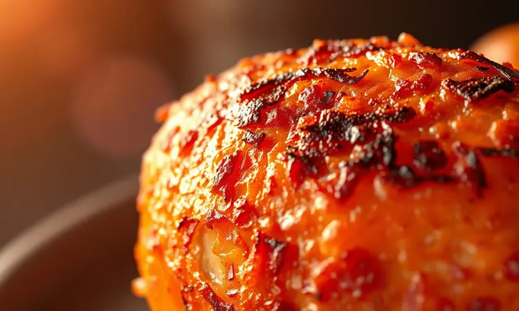

Você já tentou fazer galeto em casa e acabou com uma carne seca ou uma pele sem graça? Ter um galeto assado perfeito, digno das melhores galeterias, é o desejo de quem busca uma refeição prática e saborosa.

Neste guia definitivo, prometemos revelar as técnicas exatas para dominar a sua fritadeira sem óleo e entregar um frango irresistível. Você aprenderá desde a escolha da ave até a marinada secreta e o tempo preciso de cocção para nunca mais errar o ponto.

<SummaryList products={frontmatter.top_products} />

## O que diferencia o galeto do frango comum?

O que torna essa jovem ave, abatida com apenas 28 dias, tão especial? A resposta está na combinação perfeita entre maciez e sabor.

Enquanto o frango comum pode precisar de truques para ficar suculento, o galeto já nasce com essa vantagem: sua carne é naturalmente mais tenra, com proporções generosas que rendem mais refeição e menos osso.

Mas o verdadeiro segredo está no paladar delicado, que aceita temperos sem perder sua identidade. É como ter um ingrediente premium que se transforma facilmente no prato principal de qualquer ocasião.

## Por que usar a Air Fryer para assar galeto?

Imagine conseguir aquela pele dourada e crocante que parece saída de um restaurante, mas sem a bagunça do óleo e sem aquela ansiedade de virar constantemente. A Air Fryer faz exatamente isso.

Sua tecnologia de circulação de ar quente envolve o galeto uniformemente, criando uma casca perfeita enquanto mantém o interior úmido e suculento.

Você não só economiza tempo (até 30% mais rápido que o forno tradicional), como ganha paz de espírito: sem respingos, sem cheiro impregnado, apenas o resultado desejado de forma quase mágica.

## Como escolher o galeto ideal para o tamanho da sua fritadeira

Aqui está um detalhe que muitos ignoram até colocar o galeto na cesta e perceber que não fecha direito. A regra é simples: seu galeto precisa de espaço para respirar.

Quando muito apertado, o ar quente não circula adequadamente, criando pontos mal cozidos e outros ressecados. Meça o diâmetro interno da sua Air Fryer e escolha uma ave que deixe pelo menos 2 centímetros de folga nas laterais.

Essa simples precaução é a diferença entre um galeto uniformemente dourado e uma decepção culinária.

### Melhores modelos de Air Fryer para aves inteiras

<ProductBox 
  title={frontmatter.top_products[0].title} 
  image={frontmatter.top_products[0].image} 
  link={frontmatter.top_products[0].link} 
/>

Se você realmente leva a sério a missão de assar galetos inteiros, vale investir em modelos com capacidade generosa. Pense em uma Oster Oven Fryer OFRT780 com seus 12 litros e dois andares, perfeita para quem quer assar o galeto junto com os acompanhamentos.

A Philco Oven PFR2200P oferece a mesma capacidade com controles intuitivos que tornam o processo quase automático.

Para os entusiastas da praticidade, a Britânia Oven BFR2100 traz 9 programas pré-definidos que eliminam adivinhações. Já a Electrolux Air Fryer Oven EAF90 combina capacidade com versatilidade em 10 funções diferentes.

E para quem realmente não quer limitações, o Neuhaus XXL com 25 litros comporta até aves maiores, transformando qualquer refeição em um banquete. O importante é entender que espaço não é luxo, é necessidade para resultados consistentes.

## A Marinada Perfeita: Ingredientes para um sabor profundo

A marinada é onde a mágica realmente acontece. Não se trata apenas de molhar a carne, mas de impregnar cada fibra com personalidade.

Comece com a tríade clássica: alho picado que promete aroma, suco de limão que amacia naturalmente, e azeite de oliva que carrega todos os sabores para dentro.

Agora adicione personalidade: alecrim fresco para notas terrosas, tomilho para sofisticação, ou até uma colher de mostarda dijon para complexidade.

O segredo está no tempo. Duas horas são o mínimo, mas uma noite inteira na geladeira transforma o galeto em algo completamente diferente. É como dar ao tempero a oportunidade de fazer amizade com a carne, criando uma harmonia que você sente a cada mordida.

## Receita de Galeto na Air Fryer: Passo a Passo Completo

Chegou a hora de transformar teoria em prática. Com sua ave marinada e sua Air Fryer aquecida, você está a poucos passos de criar uma memória gastronômica.

O processo é tão simples quanto gratificante: temperatura controlada, tempo preciso, e o resultado é sempre um galeto com pele que estala ao cortar e carne que suga ao garfo.

### Preparo inicial e limpeza da ave

Antes de qualquer tempero, dedique alguns minutos à preparação fundamental. Retire cuidadosamente as vísceras, lave sob água corrente, e depois seque meticulosamente com papel toalha. Essa última etapa é crucial: água é inimiga da crocância.

Uma pele seca é uma pele que vai dourar uniformemente, criando aquela textura de pururuca que define um bom galeto.

### Utensílios necessários para facilitar o preparo

<ProductBox 
  title={frontmatter.top_products[1].title} 
  image={frontmatter.top_products[1].image} 
  link={frontmatter.top_products[1].link} 
/>

Alguns instrumentos podem transformar uma tarefa em um ritual prazeroso. Uma tesoura de cozinha robusta ajuda a "espalmar" o galeto, garantindo cozimento uniforme.

Tigelas para misturar temperos, recipientes herméticos para marinar, e papel manteiga perfurado para evitar que a pele grude na cesta.

Se sua Air Fryer vier com espeto giratório, use-o: ele simula o movimento de um churrasqueiro profissional, garantindo que cada centímetro receba calor igualmente.

### Tempo e Temperatura: O guia definitivo para não ressecar

Essa é a equação sagrada: 200°C por 30-40 minutos, dependendo do tamanho. Pré-aqueça sempre (5 minutos fazem diferença), posicione a pele para cima, e vire na metade do tempo. A pele para cima no início cria a crocância, virar depois distribui os sucos.

É uma dança de calor e tempo que, quando executada corretamente, resulta em perfeição consistente.

### Como usar o termômetro de carne para atingir a perfeição

<ProductBox 
  title={frontmatter.top_products[2].title} 
  image={frontmatter.top_products[2].image} 
  link={frontmatter.top_products[2].link} 
/>

Elimine as adivinhações. Um termômetro digital de inserção é seu aliado contra o ressecamento. Insira a sonda na parte mais grossa da coxa, evitando o osso.

Quando marcar 75°C, seu galeto está pronto: suficientemente cozido para segurança, suficientemente preciso para suculência máxima. Alguns modelos modernos conectam ao smartphone, permitindo monitorar remotamente.

Não é tecnologia por tecnologia, é tranquilidade garantida.

## 5 Dicas de Especialista para uma pele extra crocante (estilo pururuca)

Essas técnicas separam os amadores dos verdadeiros mestres do galeto:

1. Secagem meticulosa antes e depois da marinada

2. Sal grosso aplicado generosamente na pele uma hora antes

3. Espaço generoso na cesta para circulação de ar 360 graus

4. Primeiros 10 minutos a 200°C para selar, depois reduza para 180°C

5. Últimos 3 minutos em temperatura máxima para o "crunch" final

Cada passo parece simples, mas juntos criam uma textura que estala ao toque do garfo, entregando não apenas sabor, mas experiência sensorial completa.

## Erros comuns ao assar galeto na Air Fryer e como evitá-los

Vamos antecipar os tropeços antes que aconteçam. O maior erro? Impaciência com a marinada. Temperar na pressa resulta em sabor superficial. Segundo: ignorar o pré-aquecimento, que é como começar uma corrida com o motor frio.

Terceiro: sobrecarregar a cesta, sufocando a circulação de ar. Quarto: não usar termômetro, confiando apenas no olhômetro. Cada um desses deslizes tem correção simples, mas conhecê-los antecipadamente transforma tentativa em certeza.

## Sugestões de Acompanhamentos: Monte seu cardápio de galeteria

Um galeto perfeito merece companhias à altura. Pense em contrastes: a crocância da pele pede a cremosidade de um purê de batata com nata. A suculência da carne combina com a acidez de uma salada verde com vinagrete balsâmico.

Legumes assados na própria Air Fryer enquanto o galeto descansa criam harmonia de sabores. Arroz à grega com sua mistura de especiarias completa o quadro. O segredo está em equilibrar texturas e intensidades, criando um prato que é mais que soma de partes.

## Dicas de limpeza e manutenção da sua Air Fryer após o uso

O cuidado com sua ferramenta garante que ela sempre retribua com resultados perfeitos. Espere esfriar naturalmente, nunca mergulhe componentes quentes em água fria.

Partes removíveis vão à lava-louças, mas uma esponja macia com água quente e detergente resolve a maioria dos resíduos. Atenção especial à grelha inferior, onde gorduras tendem a acumular. Limpeza imediata após o uso previne incrustações e mantém o desempenho como novo.

## Perguntas Frequentes (FAQ)

Preciso mesmo marinar por tanto tempo?
Absolutamente. O tempo permite que os sabores penetrem além da superfície, transformando o sabor de dentro para fora.

Posso congelar o galeto já temperado?
Sim, e é uma excelente estratégia de meal prep. Congele na marinada e descongele na geladeira quando for usar.

E se minha Air Fryer for pequena?
Corte o galeto em partes. O sabor permanece, e o cozimento pode até ser mais rápido e uniforme.

Preciso adicionar óleo?
A pele do galeto já tem gordura natural. Para crocância extra, um fio de azeite na pele basta.

## Conclusão

Dominar o galeto na Air Fryer é mais que seguir uma receita: é abraçar um processo que combina técnica simples com resultados extraordinários.

Desde a escolha cuidadosa da ave até o momento em que você corta aquela pele que estala perfeitamente, cada etapa é uma oportunidade de criar algo memorável.

A beleza deste método está na sua confiabilidade: uma vez que você entende a dinâmica entre temperatura, tempo e espaço, reproduzir a perfeição torna-se rotina.

Lembre-se que o verdadeiro segredo não está apenas nos minutos no aparelho, mas no cuidado prévio. A marinada paciente, a secagem meticulosa, o tempero generoso - são esses detalhes que transformam proteína em experiência gastronômica.

Sua Air Fryer é a ferramenta, mas sua atenção é o ingrediente mágico.

Agora é sua vez. Escolha seu galeto, reserve tempo para o preparo, e prepare-se para surpreender a si mesmo e a quem compartilhar sua mesa. Porque comida feita com técnica e carinho sempre conta uma história melhor. Bom apetite!