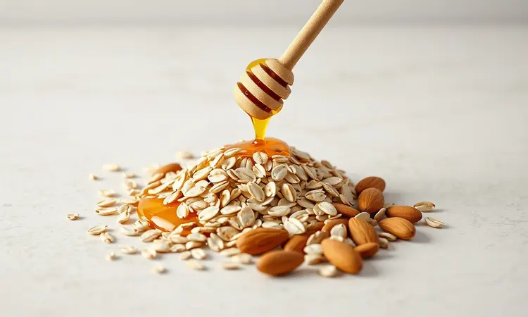
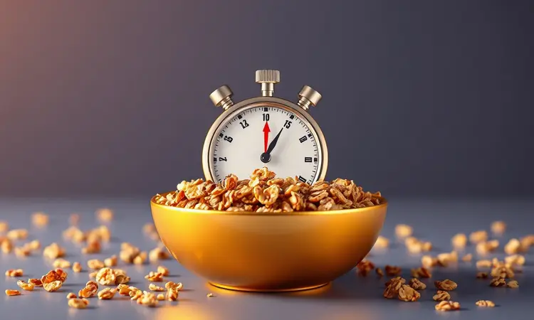
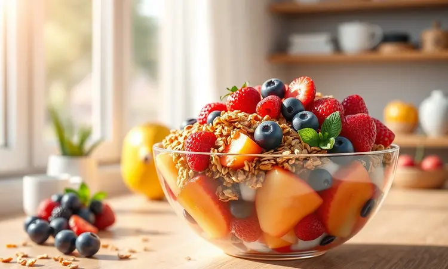

Você já abriu uma granola comprada no supermercado e sentiu aquele desânimo? Ou excessivamente doce, ou perdendo a crocância antes mesmo da segunda xícara de café.

A boa notícia é que existe um caminho mais artesanal, econômico e surpreendentemente rápido: fazer sua própria granola na air fryer.

Neste guia, você vai dominar a técnica que promete transformar seu café da manhã em um ritual de sabor e nutrição, aprendendo desde os segredos dos chefs até como personalizar cada detalhe ao seu paladar.

<SummaryList products={frontmatter.top_products} />

## Por que fazer Granola na Air Fryer é melhor que no forno tradicional?

Imagine não precisar mais esperar o forno pré-aquecer por 15 minutos ou vigiar constantemente para que uma borda não queime enquanto o centro permanece úmido. A air fryer entrega essa praticidade.

Seu aquecimento quase instantâneo significa granola crocante em minutos, uma economia clara de energia e tédio na cozinha.

Mas a verdadeira magia está na circulação do ar quente: ela envolve cada floco de aveia e pedacinho de castanha com calor uniforme, garantindo que tudo fique perfeito ao mesmo tempo.

E como ela funciona com pouquíssimo óleo, você ganha não só em textura, mas em uma opção genuinamente mais leve e saudável.

## A Fórmula Base da Granola Perfeita: Equilíbrio entre Sabor e Nutrição

A receita de sucesso começa entendendo que granola não é apenas um mix de ingredientes, é uma experiência sensorial equilibrada. A base é a aveia em flocos, sua fonte de fibra que promete te saciar até o almoço.

As sementes, como chia ou linhaça, são seus potes secretos de nutrientes, adicionando ômega-3 e proteínas quase sem você perceber. A doçura? Ela vem das frutas secas, como damascos ou uvas-passas, que trazem vitaminas naturais e um caramelo suave.

Um fio de mel ou xarope de bordo une essa família, enquanto canela ou noz-moscada acrescentam profundidade aromática. E para o contraste final, as castanhas e nozes oferecem aquele crocante que faz você fechar os olhos de satisfação.

Você é o maestro desta orquestra: ajuste as proporções e crie a sinfonia perfeita para o seu paladar.

## Utensílios Indispensáveis para o Preparo e Conservação

Para orquestrar essa criação, você precisa dos instrumentos certos. Uma tigela grande é seu palco de mistura, onde a magia começa a ganhar forma. Uma espátula de silicone será sua varinha de condão, ajudando a distribuir os ingredientes com cuidado.

E o final feliz depende dos potes herméticos, os guardiões que vão preservar cada pedacinho crocante.

### Fritadeira Elétrica (Air Fryer) de Alta Performance

<ProductBox 
  title={frontmatter.top_products[0].title} 
  image={frontmatter.top_products[0].image} 
  link={frontmatter.top_products[0].link} 
/>

Seu aliado principal nessa missão é a própria air fryer. Modelos com potência acima de 1400W são como atalhos na cozinha, entregando cozimento rápido e resultados consistentes. Escolha uma capacidade (de 5 a 12 litros) que converse com o tamanho da sua família.

Tecnologias como a RapidAir são suas asseguradoras contra frustrações, garantindo que o calor chegue igualmente a todos os cantos da cesta. E a versatilidade é um bônus: muitas vão além de fritar, oferecendo funções para grelhar e até desidratar.

Ela pode não assinar um peru de Natal, mas para trazer crocância diária à sua vida com mínimo de óleo, é um investimento que se paga em praticidade e saúde.

### Potes de Vidro Herméticos para Máxima Crocância

<ProductBox 
  title={frontmatter.top_products[1].title} 
  image={frontmatter.top_products[1].image} 
  link={frontmatter.top_products[1].link} 
/>

Todo o carinho do preparo merece ser preservado, e é aqui que os potes de vidro herméticos entram como heróis. Sua vedação perfeita cria uma barreira contra o maior inimigo da crocância: a umidade do ar. O resultado?

Sua granola de segunda-feira mantém a textura perfeita até sexta, como se tivesse saído da air fryer na mesma hora. São resistentes a odores, fáceis de limpar e uma escolha sustentável para sua despensa.

Sim, são um pouco mais pesados que o plástico, mas a experiência de abrir o pote e ouvir aquele *crack* crocante a cada manhã não tem preço.

### Tapete de Silicone ou Papel Manteiga para Air Fryer

<ProductBox 
  title={frontmatter.top_products[2].title} 
  image={frontmatter.top_products[2].image} 
  link={frontmatter.top_products[2].link} 
/>

A decisão aqui fala sobre o tipo de cozinheiro que você é. O tapete de silicone é para quem pensa a longo prazo: reutilizável, fácil de limpar e um escudo infalível contra grudes. Ele pede apenas um pouco de atenção para não interferir demais na circulação do ar.

Já o papel manteiga é o convidado prático: você coloca, usa e descarta, perfeito para os dias de correria, mas gerando mais resíduos. Se sua filosofia abraça a sustentabilidade, o tapete de silicone se torna um companheiro por anos.

Para experimentos ou urgências, o papel manteiga resolve. Ambos cumprem a missão de proteger sua criação.

## Passo a Passo: Como fazer Granola na Air Fryer em 15 minutos

Agora, mãos à obra. Em uma tigela, abrace a aveia com as sementes, castanhas picadas e um toque de canela. Adicione o mel ou xarope, mexendo até que todos os ingredientes ganhem um brilho dourado e se tornem uma só família.

Pré-aqueça sua air fryer a 160°C, a temperatura ideal para tostar sem queimar. Espalhe a mistura em uma camada única na cesta, como um tapete dourado.

Cozinhe por 10 a 15 minutos, mas dê uma mexidinha amigável a cada 5 minutos, garantindo que todos recebam calor igualmente. O segredo está nesse cuidado intermitente. Deixe esfriar completamente, esse momento de paciência é quando a crocância se firma.

Por fim, deposite sua obra-prima em um pote hermético. Em menos de meia hora, você tem café da manhã para a semana toda.

## 5 Dicas de Especialista para a Granola não Queimar

Evitar a queimadura é uma arte de atenção simples. Primeiro, respeite o espaço: uma camada fina e uniforme na cesta é non-negotiable, permite que o ar circule livremente.

Segundo, comece conservador: 140°C a 160°C e tempos curtos de 5 a 10 minutos são sua zona segura, você sempre pode adicionar mais tempo depois. Terceiro, a regra do 'mexer frequentemente' é sua melhor amiga, ela redistribui o calor e te dá controle total.

Quarto, ingredientes úmidos como mel são amigos, mas vigilantes, eles caramelizam rápido. Quinto, um pitada de sal ou especiarias em pó não só eleva o sabor, mas também não alteram o ponto de cozimento, permitindo ajustes criativos sem risco.

## Variações Saudáveis: Versões Low Carb, Vegana e Sem Açúcar

Esta receita é um convite à personalização. Para um dia low carb, substitua a aveia por um blend poderoso de sementes como chia, linhaça e girassol, que oferecem fibra e saciedade sem os carboidratos.

Na versão vegana, o néctar de agave ou o melado de cana assumem o papel do mel, enquanto tâmaras ou figos trazem uma doçura profundamente frutal. Quer evitar açúcares por completo?

As especiarias são suas aliadas: canela, gengibre em pó e baunilha criam camadas de sabor tão complexas que você nem sente falta do doce.

Cada variação serve a um propósito diferente, mas todas compartilham o mesmo resultado: uma granola que se alinha perfeitamente ao estilo de vida que você escolheu.

## Como e por quanto tempo armazenar sua Granola Caseira

Todo esse cuidado no preparo merece um final digno. Depois de pronta, dê a ela o presente da paciência: deixe esfriar completamente antes de armazenar. Qualquer calor residual cria vapor, e vapor é o beijo da morte para a crocância.

Seu cofre ideal é um pote de vidro hermético, guardado em um local seco e escuro. Assim protegida, sua granola será sua companheira crocante por até duas semanas. Se a ideia é um estoque estratégico, o freezer a preserva em estado de graça por até três meses.

E se um dia ela parecer um pouco menos vibrante? Uma rápida passada de 2-3 minutos na air fryer a trará de volta à vida, como nova.

## Ideias Criativas para usar sua Granola (Além do Iogurte)

Limitar a granola ao iogurte é como ter um piano de cauda e tocar apenas uma tecla. Que tal uma textura surpresa? Incorpore uma colher na massa de muffins ou panquecas antes de assar, eles ganharão pontos crocantes inesperados.

Polvilhe sobre uma salada de folhas verdes com queijo de cabra, criando um contraste sublime entre o cremoso, o amargo e o crocante adoçado. Transforme maçãs ou peras assadas em sobremesa gourmet com uma generosa cobertura ainda quente do forno.

Ou bata rapidamente no liquidificador com suas frutas favoritas para um smoothie que mastiga bem. Cada uso é uma nova descoberta, uma forma de trazer alegria e nutrição para outros momentos do seu dia.

## FAQ: Perguntas Frequentes sobre Granola na Air Fryer

Algumas dúvidas sempre aparecem, e é normal. Vamos esclarecê-las como se estivéssemos tomando um café juntos.

### Qual o melhor tipo de aveia para usar?

Pense na textura que você deseja. A aveia em flocos grossos é a protagonista da crocância, mantendo sua estrutura orgulhosa durante o cozimento e oferecendo aquele mordida satisfatória.

A aveia em flocos finos tem seu charme, criando uma base mais 'compacta' e absorvendo bem os sabores, mas pode resultar numa textura menos definida. Meu conselho?

Use os flocos grossos como estrela principal e, se quiser, adicione uma pequena quantidade de flocos finos para ajudar a unir a mistura. É o equilíbrio perfeito.

### Por que minha granola saiu murcha?

Ah, a temida granola murcha. Geralmente, três suspeitos estão envolvidos. O primeiro é um cozimento tímido: temperatura muito baixa ou tempo insuficiente não criam a caramelização necessária para a crocância.

O segundo é o excesso de 'molho': muito mel ou óleo deixa tudo encharcado, sem chance de secar e crispar. O terceiro é a ansiedade: armazenar ainda quente cria condensação dentro do pote. A solução?

Pré-aqueça bem, meça os líquidos com parcimônia e, o mais importante, deixe esfriar completamente, espalhada em uma assadeira, antes de guardar.

### Quando devo adicionar as frutas secas ou gotas de chocolate?

Timing é tudo aqui, pois são ingredientes delicados. As frutas secas (uvas-passas, damasco, cranberry) são adições pós-forno. Jogue-as por cima da granola ainda quente, logo que você tirar da air fryer.

O calor residual é suficiente para amaciá-las levemente e integrar os sabores, sem correr o risco de transformá-las em pedrinhas carbonizadas. Já as gotas de chocolate ou pedaços de chocolate picado são para os últimos 2-3 minutos de cozimento.

Assim, elas derretem só o suficiente para criar fios saborosos que grudam na granola, mas não viram uma poça. É a diferença entre uma mistura e uma experiência.

## Conclusão

Fazer granola na air fryer vai muito além de uma simples receita. É recuperar o controle sobre o que você come, transformando ingredientes básicos em algo pessoal e cheio de significado.

É a garantia de acordar para um café da manhã que respeita seu paladar e suas escolhas nutricionais, com uma crocância que produtos industrializados só prometem em comerciais.

É a praticidade de um processo que cabe nos intervalos da vida corrida, mas que entrega resultados de chef. Mais do que economia e saúde, essa técnica oferece autonomia. Comece hoje.

Misture sua primeira fornada, sinta o aroma de canela e aveia tostada tomando conta da cozinha, e descubra como um pequeno ritual caseiro pode tornar suas manhãs significativamente mais saborosas e cheias de energia.

Sua próxima xícara de café já está esperando por essa companhia perfeita.