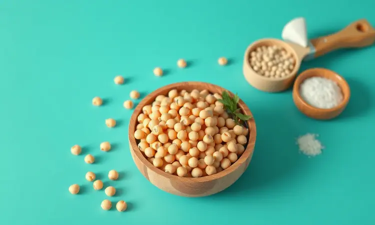
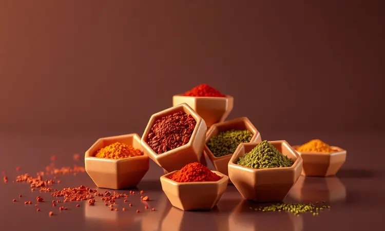
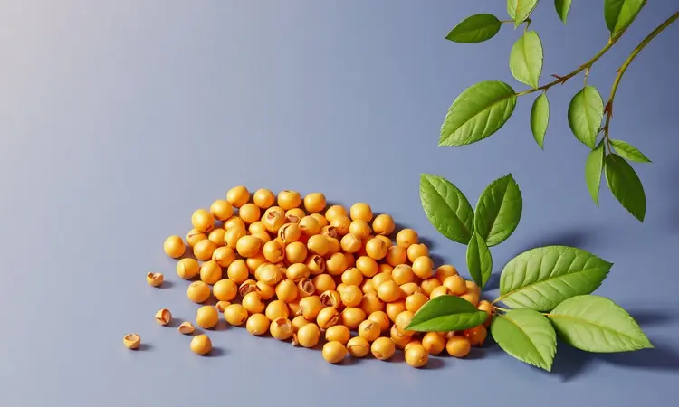

Aquela sensação de decepção quando você investe tempo em fazer um snack saudável e ele sai murcho, farinhento ou queimado é familiar demais. Você busca uma alternativa aos salgadinhos industrializados, mas o resultado não tem aquela crocância que faz valer a pena.

A boa notícia é que existe um caminho muito mais simples e confiável para conquistar a perfeição. A tecnologia da fritadeira sem óleo pode transformar grão-de-bico comum em pequenas joias crocantes que vão fazer você esquecer qualquer tentativa anterior.

Neste guia, você descobrirá não apenas os passos técnicos, mas os segredos emocionais por trás de cada etapa - desde escolher os grãos certos até técnicas de armazenamento que chefs profissionais guardam a sete chaves.

<SummaryList products={frontmatter.top_products} />

## Por que o snack de grão-de-bico na airfryer é o petisco perfeito?

Imagine abrir um pote com pequenas pedras douradas que estalam perfeitamente a cada mordida, oferecendo aquela satisfação sensorial que normalmente só encontramos em snacks menos saudáveis. Esse é o poder do grão-de-bico na airfryer.

Mais do que uma alternativa nutritiva, ele se torna uma experiência que combina proteínas e fibras essenciais com a crocância que seu paladar busca. A magia acontece sem óleo, reduzindo calorias enquanto preserva tudo o que torna um snack viciante.

A simplicidade do preparo libera você para focar no que realmente importa: criar combinações de sabores que conversam com seu humor do dia.

Seja um tempero mediterrâneo para um dia ensolarado ou algo picante para animar a tarde, cada fornada se transforma em uma nova descoberta.

## Equipamentos e Ingredientes: O que você precisa para começar

<ProductBox 
  title={frontmatter.top_products[0].title} 
  image={frontmatter.top_products[0].image} 
  link={frontmatter.top_products[0].link} 
/>

A jornada para a crocância perfeita começa com poucos elementos essenciais. A estrela indiscutível é sua airfryer, que fará o trabalho pesado de transformar grãos macios em tesouros dourados.

Quanto aos ingredientes, tudo começa com grão-de-bico cozido - você pode optar pela praticidade da lata ou pelo controle total do preparo caseiro. Aqui está o primeiro segredo: independente da origem, a drenagem completa é não negociável.

Um azeite de qualidade servirá como seu veículo para distribuir sabores, enquanto temperos como sal, páprica e alho em pó formam sua base criativa.

Lembre-se que airfryers variam em potência, então mantenha-se atento ao comportamento do seu modelo específico durante todo o processo.

## Passo a passo: Como fazer grão-de-bico crocante na airfryer

Agora que você tem todos os elementos em mãos, vamos à transformação. Comece com grão-de-bico já cozido e macio. A etapa mais crucial que muitos pulam? A secagem absoluta.

Após drenar completamente, espalhe os grãos sobre uma toalha limpa ou papel toalha, garantindo que cada um esteja sequinho ao toque. Essa preparação não é apenas técnica - é o que separa um snack farinhento daquela crocância que realmente estala.

Com os grãos perfeitamente secos, tempere-os generosamente. Use suas mãos para massagear os temperos, garantindo que cada grão esteja uniformemente revestido. Pré-aqueça sua airfryer a 200°C e espalhe os grãos em uma única camada na cesta, sem sobrecarregar.

Cozinhe por 15 a 20 minutos, mexendo cuidadosamente na metade do tempo para garantir que todos os lados recebam igual atenção do calor. Você saberá que está no ponto certo quando o aroma torrado encher sua cozinha e os grãos apresentarem uma cor dourada uniforme.

### O Segredo da Crocância: A importância da secagem absoluta

Por que tanta ênfase na secagem? A resposta está na física da crocância perfeita. Qualquer resíduo de umidade preso dentro ou ao redor dos grãos cria vapor durante o cozimento, resultando naquela textura farinhenta que arruína a experiência.

Quando os grãos estão completamente secos, o calor da airfryer age diretamente sobre as proteínas e carboidratos, criando uma crosta dourada que encapsula o interior macio.

Além do benefício textural, a secagem eficiente permite que os temperos adiram melhor à superfície, elevando cada mordida a um novo patamar de sabor. É a diferença entre um snack aceitável e aquele que faz você fechar os olhos para saborear cada detalhe.

## 5 Combinações de temperos irresistíveis para seu snack

A verdadeira magia acontece quando você transforma a base crocante em uma tela para sua criatividade culinária. Cada combinação de temperos cria uma experiência única:

1. **Clássico reconfortante**: Sal marinho, pimenta-do-reino moída na hora e alho em pó - simples, mas sempre eficaz

2. **Mediterrâneo ensolarado**: Azeite extra virgem, orégano fresco e raspas de limão siciliano

3. **Aventura picante**: Pimenta caiena, cominho tostado e páprica defumada para acender os sentidos

4. **Doce surpreendente**: Canela em pó, açúcar mascavo e uma pitada estratégica de sal marinho

5. **Indulgência cremosa**: Queijo parmesão ralado fino, cebola em pó e pimenta-do-reino branca

Experimente misturar os temperos diretamente com o azeite antes de adicionar aos grãos - essa emulsão caseira garante uma distribuição uniforme que transforma cada mordida.

## Dicas de ouro para não errar no ponto (Tempo e Temperatura)

Domine a ciência do ponto perfeito com estas orientações. Comece sempre pré-aquecendo sua airfryer a 180°C - esse passo inicial garante que os grãos comecem a dourar imediatamente, selando a superfície.

Durante os 15 a 20 minutos de cozimento, a mexida na metade do tempo não é uma sugestão, mas uma regra sagrada. Ela redistribui o calor e previve pontos queimados enquanto outros permanecem crus.

Se sua airfryer tende a ser mais agressiva, reduza para 170°C e adicione alguns minutos. Aprenda a ler os sinais: o aroma torrado intensifica quando estão quase prontos, e a cor passa de amarelo claro para um dourado profundo. O teste final?

Deixe esfriar por dois minutos antes da primeira mordida - esse breve descanso permite que a crocância se estabilize, revelando seu verdadeiro caráter.

## Como armazenar para manter a crocância por até 7 dias

<ProductBox 
  title={frontmatter.top_products[1].title} 
  image={frontmatter.top_products[1].image} 
  link={frontmatter.top_products[1].link} 
/>

A beleza desse snack vai além do momento do preparo. Com a técnica certa de armazenamento, você pode desfrutar da crocância perfeita durante toda a semana.

O segredo está em um recipiente hermético mantido em temperatura ambiente, longe de fontes de umidade como pias ou fogão. Esse ambiente controlado preserva a textura que você trabalhou tanto para conseguir.

Para durabilidade ideal, prepare porções que serão consumidas em 3 a 5 dias - nesse período, a crocância permanece praticamente intacta.

Se pensar em estender ainda mais, o congelamento é uma opção, mas com um aviso: a textura após descongelamento nunca será exatamente a mesma da fornada fresca.

Para minimizar a diferença, descongele na geladeira por algumas horas e depois dê um rápido aquecimento na airfryer por 2-3 minutos. Essa etapa final revive parte da magia original.

## Benefícios nutricionais do grão-de-bico como petisco fit

Além de satisfazer seus desejos por crocância, cada mordida traz um pacote completo de nutrição inteligente. As proteínas vegetais oferecem construção muscular sustentável sem os componentes inflamatórios de algumas fontes animais.

As fibras trabalham silenciosamente para promover saciedade duradoura, ajudando você a navegar entre refeições principais sem aqueles picos de fome incontroláveis.

Os benefícios continuam com vitaminas e minerais essenciais: o folato apoia sua energia celular, enquanto o ferro vegetal (absorvido melhor com uma fonte de vitamina C) mantém sua vitalidade.

O resultado é um snack que nutre tanto seu corpo quanto seu paladar, eliminando aquele conflito interno entre escolhas saudáveis e prazerosas.

## Erros comuns que deixam o grão-de-bico murcho e como evitá-los

Aprendemos tanto com os erros quanto com os acertos. Um dos equívocos mais frequentes envolve o preparo inicial dos grãos crus.

Se optar pela versão seca, o molho por 8 horas não é luxo, mas necessidade - esse tempo permite que cada grão absorva água uniformemente, garantindo cozimento homogêneo posterior.

Outra armadilha é a pressa na secagem. Passar rapidamente um papel toalha não é suficiente. Reserve alguns minutos para espalhar os grãos em uma única camada e deixe que o ar faça parte do trabalho.

A sobrecarga da cesta da airfryer merece menção especial: quando os grãos estão amontoados, criam vapor entre si, resultando no temido efeito 'meio cozido, meio murcho'. Trabalhe em lotes menores - a paciência extra será recompensada com consistência perfeita.

## Perguntas Frequentes (FAQ) sobre Snack de Grão-de-Bico na Airfryer

Preciso pré-cozinhar o grão-de-bico antes da airfryer? Absolutamente. A airfryer não cozinha grãos crus, apenas transforma grãos já macios em versões crocantes. Pense nela como a etapa final de texturização, não como método de cozimento primário.

Quais temperos funcionam melhor? Sua imaginação é o limite, mas comece com bases sólidas: sal para realçar, ácidos (limão, vinagre) para brilho, ervas para complexidade e especiarias para personalidade.

A combinação mediterrânea com orégano e limão é um excelente ponto de partida.

Como saber quando está pronto? Use todos os seus sentidos. Visão: dourado uniforme, não marrom escuro. Olfato: aroma de nozes tostadas, não queimado. Audição: um sutil estalar quando você mexe a cesta. Tato: firme ao toque, não duro como pedra.

O tempo sugerido de 15-20 minutos a 200°C é seu guia, não sua sentença.

## Conclusão

Transformar grão-de-bico comum em pequenas joias crocantes na airfryer vai além de seguir uma receira - é dominar uma arte que combina técnica precisa com criatividade pessoal.

Cada etapa, desde a secagem meticulosa até a escolha dos temperos, contribui para criar não apenas um snack, mas uma experiência sensorial que redefine o que significa comer de forma saudável e prazerosa.

A crocância perfeita que estala na boca, o equilíbrio de sabores que dança no paladar, e a conveniência de ter seu próprio petisco gourmet pronto para qualquer momento do dia - esses são os presentes que essa técnica simples oferece.

Agora você possui não apenas as instruções, mas o entendimento profundo de por que cada passo importa.

Quando sua cozinha se encher com o aroma de grão-de-bico dourando e você ouvir aquele estalar satisfatório ao mexer a cesta, saberá que conquistou mais do que um lanche. Conquistou a confiança para transformar ingredientes humildes em pequenas celebrações diárias.

Que sua próxima fornada seja apenas o início de muitas descobertas deliciosas.