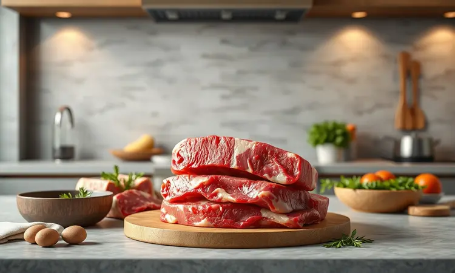

Você adora saborear um hambúrguer artesanal caprichado, mas odeia a fumaça e a sujeira de gordura que ficam na cozinha após fritar a carne? Eu entendo perfeitamente a sua frustração.

A boa notícia é que você pode preparar um lanche digno de chef usando apenas a sua fritadeira elétrica.

Neste guia definitivo, eu vou te ensinar o passo a passo completo para dominar o hambúrguer na air fryer: desde a escolha do blend de carne ideal até a tabela exata de tempo para o ponto perfeito.

Prepare-se para descobrir os segredos que garantem uma carne dourada por fora e incrivelmente suculenta por dentro, sem complicação.

<SummaryList products={frontmatter.top_products} />

## Por que preparar hambúrguer na Air Fryer é a melhor opção?

Imagine conseguir aquele hambúrguer crocante por fora e suculento por dentro, sem precisar lidar com óleo espirrando pela cozinha ou com aquela fumaça que impregna o ambiente. Essa é a magia da air fryer.

Ela circula ar quente em alta velocidade, criando aquela casquinha dourada que todo mundo ama, mas usando apenas uma colher de sopa de óleo ou menos. O resultado? Um hambúrguer que parece ter saído da churrasqueira, mas sem todo o trabalho e sujeira.

Além da praticidade, pense na economia de tempo. Enquanto seus hambúrgueres cozinham sozinhos, você pode preparar os acompanhamentos ou simplesmente relaxar. E a limpeza? A maioria das cestas vai direto para a lava-louças.

É como ter um assistente pessoal na cozinha que entende exatamente o que você quer: sabor sem complicação.

## O segredo do blend: As melhores carnes para Air Fryer

Aqui está um segredo que transforma um bom hambúrguer em algo memorável: a combinação certa de carnes. Pense na experiência sensorial que você quer criar.

Para aquela suculência que faz você fechar os olhos de satisfação, experimente misturar peito (com sua gordura entremeada que mantém tudo úmido) com acém (que traz aquele sabor robusto e marcante).

Se você busca algo ainda mais especial, uma combinação de picanha com fraldinha oferece uma maciez que quase derrete na boca. O importante é usar carnes frescas, moídas na hora sempre que possível.

Essa frescor faz toda diferença entre um hambúrguer comum e aquele que seus convidados vão lembrar por semanas.

## Melhores modelos de Air Fryer para grelhar carnes

<ProductBox 
  title={frontmatter.top_products[0].title} 
  image={frontmatter.top_products[0].image} 
  link={frontmatter.top_products[0].link} 
/>

Com tantas opções no mercado, como escolher a air fryer certa para suas aventuras gastronômicas? Alguns modelos realmente se destacam quando o assunto é carne.

A WAP Air Fryer Barbecue Digital tem uma função específica que simula o sabor do churrasco, perfeita para quem quer aquele gostinho defumado sem sair de casa.

Sua tecnologia "Smokeless" significa que você pode grelhar sem transformar sua cozinha em uma cortina de fumaça.

Para quem quer versatilidade, a Air Fryer Oven e Grill Arno Expert 9 em 1 oferece nove funções diferentes em um só aparelho. Já a Philips Walita Série 3000 Grill Edition é aquela opção confiável que entrega excelentes resultados sem complicar o orçamento.

Sim, nenhuma air fryer vai replicar exatamente o sabor de uma churrasqueira tradicional a carvão. Mas para a praticidade do dia a dia, quando você quer um hambúrguer gourmet em minutos sem sujar metade da cozinha, elas são investimentos que realmente valem cada centavo.

## Utensílios indispensáveis: Do modelador ao termômetro culinário

<ProductBox 
  title={frontmatter.top_products[1].title} 
  image={frontmatter.top_products[1].image} 
  link={frontmatter.top_products[1].link} 
/>

Agora que você já sabe sobre as carnes e o equipamento, vamos aos acessórios que transformam o preparo de uma tarefa em um ritual prazeroso. Comece com um modelador de hambúrguer.

Ele garante que todas as suas porções tenham a mesma espessura, o que significa cozimento uniforme sempre. Nada daquele desespero de um lado queimar enquanto o outro ainda está cru.

O verdadeiro herói discreto? O termômetro de carne. Ele elimina as adivinhações.

Em vez de cortar o hambúrguer para ver se está pronto (e deixar todos os sucos escaparem), você simplesmente insere a ponta e tem a certeza de que atingiu a temperatura perfeita para sua segurança e preferência.

Um borrifador de óleo também faz milagres. Com ele, você consegue aquela cobertura leve e uniforme que cria a crocância sem exagerar na gordura. E para facilitar ainda mais a limpeza, considere formas de silicone reutilizáveis.

Elas mantêm a gordura contida e fazem com que a cesta praticamente se limpe sozinha.

## Passo a passo: Como fazer hambúrguer artesanal na Air Fryer

Vamos à prática! Primeiro, molde sua carne temperada no tamanho desejado. Se você tem um modelador, ótimo. Se não, use as mãos, mas lembre-se de fazer uma pequena depressão no centro com o polegar. Isso evita que o hambúrguer inche no meio durante o cozimento.

Pré-aqueça sua air fryer a 200°C por cerca de 3 minutos. Coloque os hambúrgueres na cesta, deixando espaço entre eles para o ar circular. Aqui está o segredo do tempo perfeito:

### Guia de Tempo e Temperatura para o Ponto Perfeito

Para um hambúrguer de aproximadamente 2cm de espessura, 10 minutos a 180°C geralmente resultam num ponto ao seu gosto (aquele centro ainda rosado e suculento). Prefere bem passado? Adicione mais 3 a 5 minutos.

A mágica acontece na metade do tempo: vire cuidadosamente cada hambúrguer com uma espátula. Você verá aquela crosta dourada já se formando.

E aqui vai uma dica profissional: na última virada, adicione uma fatia de queijo. Nos minutos finais, ele derreterá perfeitamente, criando aquela cobertura cremosa que todos amam.

## 5 Dicas de Ouro para o Hambúrguer não Ressecar

1. Escolha carnes com pelo menos 20% de gordura. Pode parecer contra-intuitivo pensar em gordura quando queremos saúde, mas na air fryer, essa gordura se transforma em suculência, não em excesso de óleo.

2. Nunca, jamais pressione o hambúrguer durante o cozimento. Vejo muitas pessoas fazendo isso, como se quisessem acelerar o processo. Tudo o que você consegue é espremer para fora os sucos que tornam a carne deliciosa.

3. Tempere na hora. Salgar a carne muito antes do cozimento pode começar a puxar a umidade para fora. Misture seus temperos, molde e vá direto para a air fryer.

4. Adicione umidade inteligente. Uma colher de cebola ralada (escorrida) ou mesmo um pouco de molho barbecue misturado à carne faz maravilhas.

5. Deixe descansar. Assim que retirar da air fryer, coloque os hambúrgueres em uma tábua ou prato e espere 2-3 minutos. Esse tempo permite que os sucos, que foram para as bordas durante o cozimento, se redistribuam por toda a carne.

## Como preparar hambúrguer congelado na Air Fryer do jeito certo

Chegou em casa depois de um dia cansativo e só quer algo rápido e gostoso? Hambúrgueres congelados na air fryer são sua salvação. Pré-aqueça a 180°C por 5 minutos. Coloque os hambúrgueres congelados diretamente na cesta, sem descongelar antes.

A beleza da air fryer é que ela lida perfeitamente com isso.

Cozinhe por 12 a 18 minutos (dependendo da espessura), virando na metade do tempo. A dica para o queijo perfeito? Adicione nos últimos 2 minutos. Em tempo recorde, você terá um lanche crocante por fora, quentinho por dentro, sem precisar esperar pelo descongelamento.

## Acompanhamentos clássicos: Batata rústica e cebola caramelizada

Um hambúrguer incrível merece acompanhamentos à altura. Enquanto seus hambúrgueres cozinham, você pode preparar batatas rústicas na própria air fryer.

Corte batatas em fatias grossas, misture com azeite, sal, pimenta e alecrim, e asse a 200°C por 15-20 minutos, mexendo na metade do tempo. Você terá batatas crocantes por fora e macias por dentro, perfeitas para mergulhar no ketchup.

E a cebola caramelizada? Faça em uma panela enquanto tudo cozinha. Fatie uma cebola grande, refogue em fogo baixo com uma colher de manteiga e uma pitada de açúcar.

Em 15-20 minutos, você terá cebolas doces, macias e douradas que elevam qualquer hambúrguer a outro patamar.

## Acessórios para facilitar a limpeza pós-preparo

<ProductBox 
  title={frontmatter.top_products[2].title} 
  image={frontmatter.top_products[2].image} 
  link={frontmatter.top_products[2].link} 
/>

Vamos falar da parte que ninguém gosta, mas que pode ser surpreendentemente simples. As formas de silicone reutilizáveis são seus melhores amigos. Elas contêm a gordura, então quando você retira o hambúrguer, a cesta está praticamente limpa.

Sim, há um investimento inicial, mas pense em quantas vezes você não precisará esfregar aquela gordura grudada.

Para quem prefere opções descartáveis, os papéis de cozimento antiaderente funcionam bem, mas geram mais lixo. Independentemente da escolha, um spray borrifador de óleo em vez de derramar direto da garrafa reduz drasticamente o acúmulo de gordura.

Para a limpeza final, uma esponja macia e um pano de microfibra resolvem tudo em minutos. O segredo é limpar enquanto ainda está morno (não quente), quando os resíduos saem quase por si só.

## Perguntas Frequentes (FAQ) sobre Hambúrguer na Fritadeira

Posso usar carne congelada diretamente?
Sim! A air fryer lida muito bem com alimentos congelados. Apenas adicione 3-5 minutos extras ao tempo normal e vire na metade do processo.

Qual temperatura e tempo são ideais?
Para hambúrgueres frescos de 2cm, comece com 180°C por 10 minutos, virando na metade. Ajuste conforme seu gosto pessoal e a espessura da carne.

Como evito que fiquem ressecados?
Escolha carnes com gordura (20% é perfeito), não pressione durante o cozimento, e sempre deixe descansar por alguns minutos após retirar da air fryer.

Preciso deixar espaço entre os hambúrgueres?
Absolutamente. O ar precisa circular para cozinhar uniformemente. Se estiverem muito juntos, cozinham como se fossem um único hambúrguer grande.

## Conclusão

Dominar o hambúrguer na air fryer é como descobrir um superpoder culinário que você nem sabia que tinha.

Em menos de 20 minutos, você transforma carne moída em um banquete digno de restaurante gourmet, sem a bagunça, a fumaça ou o trabalho que normalmente acompanham um hambúrguer artesanal.

Desde a escolha do blend perfeito até aquela cebola caramelizada que derrete na boca, cada etapa se torna parte de um ritual satisfatório que entrega muito mais do que apenas um lanche.

Lembre-se: o verdadeiro segredo não está apenas nos minutos ou graus, mas na compreensão de como a air fryer trabalha para você. Ela não é apenas um eletrodoméstico, é seu parceiro na cozinha, transformando ingredientes simples em experiências memoráveis.

Então, da próxima vez que a vontade de um hambúrguer perfeito surgir, você saberá exatamente o que fazer. Sua air fryer está esperando para mostrar do que é capaz. O que você vai preparar hoje?