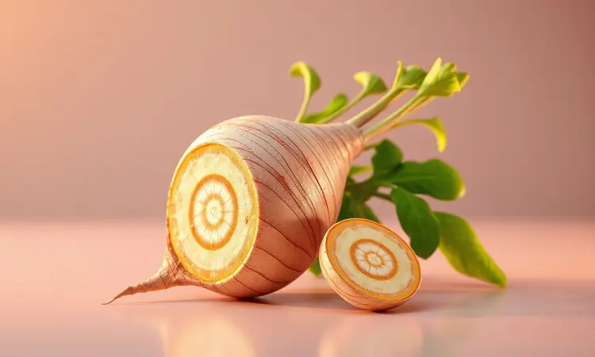
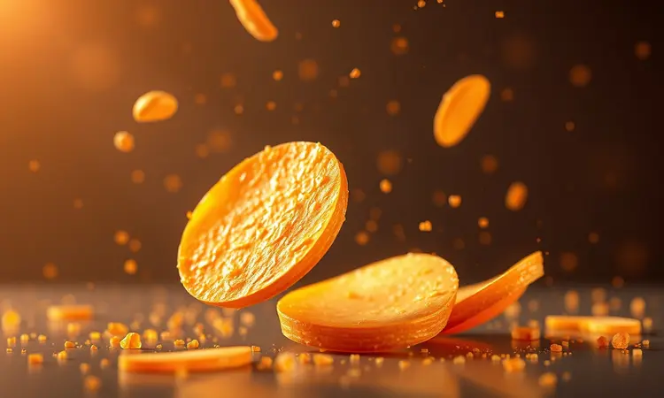
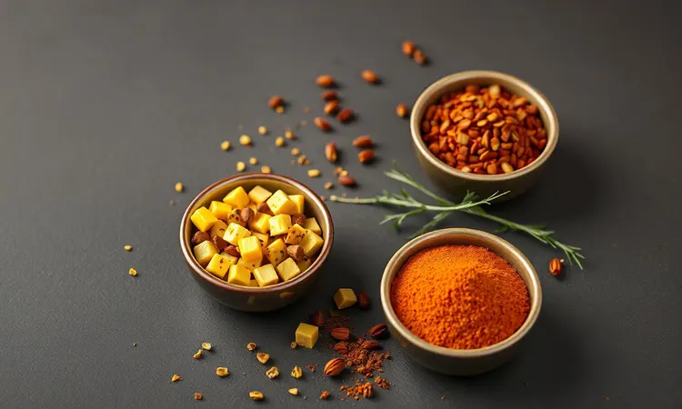
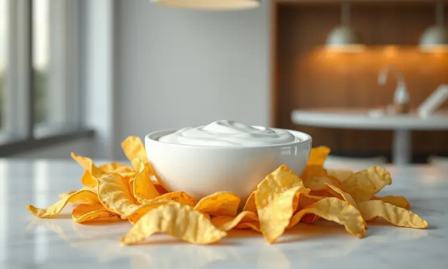

Já tentou fazer chips de vegetais em casa e eles acabaram ficando murchos ou queimados? Se você busca uma alternativa saudável à batata frita tradicional, descobrirá que o inhame é a escolha perfeita, mas exige técnica.

Imagine abrir sua airfryer e encontrar não aquela decepção pastosa, mas sim uma montanha de chips dourados e crocantes, tão perfeitos que rivalizam com os de restaurante.

Este guia vai transformar sua relação com os lanches saudáveis, revelando todos os segredos para conquistar aquela crocância profissional que parece reservada apenas para chefs.

Do corte ideal à escolha dos temperos, preparamos o passo a passo que elimina o erro e entrega o sucesso.

<SummaryList products={frontmatter.top_products} />

## Por que trocar a batata frita por chips de inhame?

Trocar a batata frita tradicional por chips de inhame vai além de uma simples substituição. É sobre trocar a culpa por prazer, o peso por leveza.

Enquanto você mastiga os chips de inhame, sente a crocância perfeita, mas sem aquela sensação pesada de gordura que costuma acompanhar as batatas fritas.

A textura é tão satisfatória que você pode saborear cada mordida sem pensar naquela promessa quebrada de "só mais um".

### Benefícios nutricionais do inhame para a saúde

O que realmente importa quando você escolhe um lanche? É aquele momento em que, depois de comer, sente que fez algo bom pelo seu corpo, não apenas saciou uma vontade. O inhame entrega exatamente isso.

Suas fibras trabalham silenciosamente para promover saciedade, fazendo com que você coma menos sem nem perceber.

As vitaminas do complexo B são o combustível para seu dia, enquanto o potássio e magnésio cuidam dos seus músculos, especialmente após aquela sessão de exercícios que você finalmente conseguiu encaixar na agenda. E os antioxidantes?

Eles são seu escudo invisível contra o cansaço do dia a dia, ajudando seu corpo a se recuperar enquanto você saboreia algo realmente gostoso.

## Inhame ou Cará: Qual o melhor para fazer chips?

A escolha entre inhame e cará é como decidir entre dois amigos igualmente especiais, cada um com sua personalidade única.

O inhame é aquele amigo acolhedor: cremoso, de sabor suave, que resulta em chips com uma crocância externa perfeita e um interior que lembra o conforto de casa.

Já o cará é o amigo aventureiro: mais firme, com um toque adocicado surpreendente, entregando chips com uma textura definida e crocante do início ao fim. Qual escolher? Depende do que seu paladar pede hoje.

A beleza está em experimentar ambos e descobrir qual se torna seu companheiro preferido para os momentos de petisco.

## O segredo da espessura: Por que usar um mandoline?

<ProductBox 
  title={frontmatter.top_products[0].title} 
  image={frontmatter.top_products[0].image} 
  link={frontmatter.top_products[0].link} 
/>

Você já notou como alguns chips ficam perfeitos enquanto outros queimam ou ficam crus? O culpado quase sempre é a espessura irregular. É aqui que a mandoline se transforma em sua aliada secreta.

Ela não é apenas um utensílio, mas a garantia de que cada fatia de inhame receberá exatamente a mesma quantidade de calor, no mesmo tempo. Imagine não precisar ficar virando as fatias individualmente, preocupado com aquelas que estão dourando mais rápido.

Com cortes precisos e uniformes, a mandoline elimina o acaso e entrega previsibilidade, transformando sua experiência de um jogo de adivinhação em uma ciência exata.

Sim, pode levar um ou dois usos para se acostumar, mas quando você domina essa ferramenta, percebe que o tempo investido vale cada segundo de crocância perfeita.

## Receita de Chips de Inhame na Airfryer: Passo a Passo

Agora que você já escolheu seu inhame e entendeu a importância do corte perfeito, vamos transformar teoria em crocância. Este não é apenas mais um passo a passo, mas seu mapa do tesouro para os chips mais crocantes que sua cozinha já produziu.

### Ingredientes necessários

A simplicidade é o primeiro segredo. Você precisará apenas de inhames frescos e firmes (aqueles que não cedem ao toque), azeite de oliva para aquele brilho dourado que promete crocância, e temperos que falam com seu paladar.

Sal e pimenta são os clássicos que nunca falham, mas deixe espaço para a criatividade: páprica defumada para um sabor intenso, alecrim fresco para um aroma que invade a cozinha, ou até uma pitada de limão em pó para um toque refrescante.

Menos é mais quando cada ingrediente é escolhido com intenção.

### Modo de preparo detalhado na Airfryer

<ProductBox 
  title={frontmatter.top_products[1].title} 
  image={frontmatter.top_products[1].image} 
  link={frontmatter.top_products[1].link} 
/>

Descasque 2 a 3 inhames pequenos e, usando sua mandoline, fatie em rodelas de aproximadamente 3 mm de espessura. Esta medida não é aleatória: é a espessura que permite crocância sem queimar.

Lave as fatias em água corrente e, se quiser um truque profissional, deixe-as de molho em água gelada por 5 minutos. Isso remove o excesso de amido que poderia roubar a crocância. O passo mais crítico vem agora: seque cada fatia minuciosamente com um pano limpo.

A água residual é o inimigo número um da crocância.

Pré-aqueça sua airfryer a 180°C. Enquanto isso, misture as fatias bem secas com azeite e seus temperos escolhidos. A quantidade de azeite deve ser suficiente apenas para cobrir levemente cada fatia, não para encharcá-las.

Distribua as rodelas em uma única camada na cesta, sem sobreposição. É tentador colocar mais para aproveitar o espaço, mas resistir garante que cada chip receba a circulação de ar quente que precisa.

Asse por 15 a 20 minutos, mas não marque apenas o tempo. Na metade do processo, abra a airfryer e mexa suavemente os chips. Este movimento garante que todos dourem igualmente.

Nos últimos minutos, fique de olho: quando atingirem um dourado uniforme e emitirem aquele som crocante ao serem movidos, estão perfeitos. Consuma imediatamente para experimentar a crocância no seu auge.

## 5 Dicas de Especialista para garantir a crocância máxima

1. **A secagem é sagrada:** Após lavar as fatias, seque-as como se sua crocância dependesse disso. Porque depende. Use papel toalha e pressione suavemente para remover toda a umidade superficial.

2. **Azeite, não banho:** Pense no azeite como um verniz, não um molho. Apenas o suficiente para criar uma fina camada que ajudará na doração sem tornar os chips oleosos.

3. **Respeite o espaço pessoal:** Colocar as fatias em uma única camada sem se tocarem é como dar a cada chip seu próprio quarto de hotel. Todos recebem ar quente igualmente e douram ao mesmo tempo.

4. **Mexa com amor, não com pressa:** Na metade do tempo, abra a airfryer e mova os chips com uma espátula ou pinça. Não agite violentamente, apenas reposicione para áreas que possam não estar recebendo calor direto.

5. **Conheça sua máquina:** Cada airfryer tem sua personalidade. Anote os tempos e temperaturas que funcionaram melhor com a sua, criando seu próprio manual pessoal de crocância.

## Variações de temperos: Do Lemon Pepper ao Páprica Defumada

Os chips de inhame são sua tela em branco na cozinha. O Lemon Pepper traz aquele frescor cítrico que corta a riqueza e deixa o paladar limpo para a próxima mordida. Imagine o verão em forma de tempero.

A páprica defumada, por outro lado, é a elegância noturna: profunda, complexa, com nuances que lembram churrasco em família. Para algo clássico mas nunca comum, misture alho em pó com um pouco de alecrim seco.

O segredo está em começar com menos e ajustar conforme prova. Lembre-se: você pode sempre adicionar, mas nunca retirar.

## Como fazer chips de inhame no forno (Alternativa)

Nem sempre temos uma airfryer disponível, mas a crocância não precisa ser sacrificada. O forno convencional pode ser seu aliado com alguns ajustes. Pré-aqueça a 180°C enquanto prepara as fatias de inhame seguindo as mesmas regras de espessura e secagem.

Forre uma assadeira com papel manteiga e distribua as fatias sem se sobreporem. O papel não é apenas para evitar grudar, mas para criar uma superfície que ajuda na evaporação uniforme da umidade. Asse por 20 a 30 minutos, mas inicie a vigilância a partir dos 15 minutos.

Vire cada fatia cuidadosamente na metade do tempo. O ponto ideal é quando as bordas começam a enrolar levemente e todo o chip adquire uma cor dourada uniforme.

## Armazenamento e Conservação: Como manter o 'croc' por dias

<ProductBox 
  title={frontmatter.top_products[2].title} 
  image={frontmatter.top_products[2].image} 
  link={frontmatter.top_products[2].link} 
/>

A verdadeira magia dos chips de inhame acontece quando saem da airfryer, mas com técnicas adequadas você pode prolongar esse momento. Se por milagre sobrar algum, espere esfriar completamente antes de armazenar. O vapor residual é um assassino silencioso da crocância.

Use um recipiente hermético de vidro ou plástico com tampa que realmente vede, não apenas cubra. Coloque uma camada de papel toalha no fundo do recipiente e outra sobre os chips para absorver qualquer umidade residual que tente aparecer.

Mesmo com todos esses cuidados, consuma em até dois dias para manter a experiência próxima do ideal. Para reaquecer, use a airfryer por 2-3 minutos em temperatura baixa (150°C).

O micro-ondas pode parecer tentador, mas transformará sua conquista crocante em algo que lembra borracha.

## Sugestões de acompanhamentos e molhos saudáveis

Os chips de inhame merecem companhias que complementem sua personalidade sem dominá-la. Um guacamole fresco com bastante limão e coentro corta a riqueza do inhame com frescor. Para algo cremoso mas leve, misture iogurte natural com endro picado e um fio de azeite.

Se busca calor, um molho de pimenta caseiro com tomates assados oferece complexidade sem ser agressivo. E para transformar o lanche em refeição, sirva os chips ao lado de uma salada de folhas jovens com tomates cereja e uma vinagreta de mostarda.

O contraste de texturas entre o crocante dos chips e a frescura da salada cria uma experiência completa que alimenta corpo e alma.

## Perguntas Frequentes (FAQ)

### Precisa cozinhar o inhame antes de levar à Airfryer?

Absolutamente não. O inhame cru contém a quantidade perfeita de umidade para transformar-se durante o processo.

Quando você leva as fatias cruas à airfryer, a água interna evapora gradualmente, criando aquela textura crocante por fora enquanto mantém uma sugestão de maciez interna que diferencia os chips de inhame de qualquer outro.

Pré-cozinhar elimina essa mágica e pode resultar em chips muito secos ou sem personalidade. Confie no processo: o calor direto da airfryer é exatamente o que o inhame cru precisa para revelar seu melhor eu crocante.

### Por que meu chips de inhame ficou amargo?

O amargor é o sinal de que seu inhame estava conversando, mas ninguém escutou. Inhames muito velhos ou que começaram a brotar desenvolvem compostos defensivos que resultam nesse sabor.

A solução está na seleção: escolha inhames firmes, com casca lisa e sem pontos moles ou brotos. E não subestime o poder do sal: uma pitada generosa imediatamente após sair da airfryer não apenas realça o sabor, mas também ajuda a equilibrar qualquer amargor residual.

Se o problema persistir, experimente variedades diferentes de inhame, pois algumas são naturalmente mais doces que outras.

### Quantos dias posso armazenar os chips de inhame?

Em condições ideais, seus chips podem manter uma crocância aceitável por até três dias. O segredo está no armazenamento: completamente frios, em recipiente hermético com papel toalha absorvente, em local fresco e seco.

Entenda que cada dia representa um pouco menos daquela crocância perfeita do momento em que saíram da airfryer. Por isso, mesmo sabendo que podem durar, procure consumi-los nos primeiros dois dias para honrar o trabalho que investiu em criá-los.

Para reaquecer, evite o micro-ondas a todo custo. Dois a três minutos na airfryer em temperatura baixa (150°C) devolvem muito da textura original sem queimar.

## Conclusão

Transformar inhames simples em chips crocantes na airfryer é mais do que uma receita, é uma pequena revolução na cozinha. É a prova de que lanches saudáveis não precisam ser castigo, mas sim celebração.

Cada detalhe, da escolha do tubérculo ao corte preciso, do tempero adequado ao armazenamento inteligente, contribui para aquela jornada que começa com a dúvida "será que vai dar certo?" e termina com o barulho satisfatório de crocância perfeita entre os dentes.

Lembre-se que o inhame perdoa erros, a airfryer simplifica processos, e sua criatividade dita o sabor. Agora que você tem todas as ferramentas, desde o conhecimento técnico até os segredos emocionais de cada etapa, sua única tarefa é experimentar.

Corte, tempere, asse e descubra que o lanche saudável dos seus sonhos não está na prateleira do supermercado, mas esperando ser criado na sua própria cozinha. O próximo passo é seu: qual sabor vai tentar primeiro?