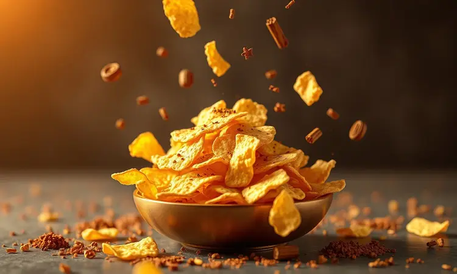

Você provavelmente faz parte do grupo que torce o nariz para o jiló, certo? Mas e se eu te dissesse que existe uma forma de prepará-lo que elimina completamente o amargor e o transforma em uma pasta árabe sofisticada e deliciosa?

Neste guia, você vai aprender a receita definitiva de babaganuche de jiló na Air Fryer, inspirada nas melhores técnicas da gastronomia funcional.

Prepare-se para descobrir um acompanhamento saudável, prático e surpreendente que vai conquistar até o paladar de quem jurou nunca comer jiló.

<SummaryList products={frontmatter.top_products} />

## O que é Babaganuche e por que a versão de jiló é surpreendente?

Imagine mergulhar seu pão sírio em uma pasta cremosa que combina o sabor defumado da berinjela assada com a cremosidade do tahine, tudo finalizado com o toque cítrico do limão.

Esta é a experiência original do babaganuche, um clássico do Oriente Médio que geralmente acompanha refeições como aperitivo.

Agora, substitua a berinjela pelo jiló e você terá uma revolução de sabor: aquele amargor característico que tanto assusta as pessoas se transforma, quando assado na Air Fryer, em um toque único e sofisticado.

Esta adaptação não apenas traz novidade à receita tradicional, mas também oferece uma alternativa rica em fibras e nutrientes, perfeita para quem busca diversificar o cardápio sem abrir mão do sabor.

## Benefícios do Jiló: Por que você deve dar uma chance a este legume?

Se você ainda mantém resistência contra o jiló por causa daquela memória de amargor, está perdendo um verdadeiro tesouro nutricional.

Pense no jiló como aquele amigo inicialmente difícil de lidar, mas que no fundo tem um coração de ouro: ele é repleto de fibras que fazem seu sistema digestivo agradecer, promove sensação de saciedade que ajuda no controle de peso, e vem carregado de antioxidantes que atuam como pequenos guerreiros protegendo sua pele e fortalecendo sua imunidade.

E o melhor? Tudo isso com tão poucas calorias que você pode saborear sem culpa. Esta é a sua oportunidade de reconciliar-se com esse legume e descobrir como ele pode transformar sua alimentação em algo tanto nutritivo quanto prazeroso.

## O Segredo Infalível: Como tirar o amargor do jiló antes do preparo

Agora que você já conhece os superpoderes nutricionais do jiló, chegou a hora do truque mágico que vai fazer toda a diferença no seu prato.

O segredo está em um ritual simples: corte o jiló em rodelas, salpique sal generosamente e deixe descansar por cerca de 30 minutos. Este processo fará com que o legume libere aquele líquido responsável pelo amargor que tanto afasta as pessoas.

Após esse período, basta enxaguar bem em água corrente para remover o excesso de sal e... voilà! O amargor diminui drasticamente.

Alguns chefs inclusive sugerem um cozimento rápido em água antes do preparo final, mas para nossa receita na Air Fryer, esta etapa com sal é suficiente para transformar o jiló de vilão a protagonista do seu prato.

## Receita Passo a Passo: Babaganuche de Jiló na Air Fryer (Estilo Rita Lobo)

Com o jiló devidamente preparado e com seu amargor domado, estamos prontos para a parte mais gratificante: transformar esses legumes em uma pasta que vai surpreender seus convidados.

A Air Fryer será sua melhor aliada nesse processo, garantindo um assado uniforme e com aquela textura perfeita que só ela entrega.

### Ingredientes essenciais para o sabor autêntico

Para criar a magia, você precisará de:

* 4 jilós médios, frescos e firmes

* 3 colheres de sopa de tahine de boa qualidade

* Suco de 1 limão espremido na hora

* 2 dentes de alho amassados

* 3 colheres de sopa de azeite de oliva extra virgem

* Sal e pimenta-do-reino moída na hora a gosto

* Salsinha ou coentro fresco para decorar

O tahine é o ingrediente que dá cremosidade e personalidade à receita, enquanto o limão atua como equilibrador natural do sabor, criando uma sinfonia perfeita com o jiló assado.

### Modo de preparo: Da Air Fryer à textura cremosa

Comece lavando bem os jilós e cortando-os ao meio no sentido do comprimento. Leve-os à Air Fryer pré-aquecida a 180°C por 15 a 20 minutos, até que a casca fique levemente dourada e a polpa esteja macia ao toque de um garfo.

Enquanto esfriam apenas o suficiente para manusear, retire cuidadosamente a polpa da casca, sim, esta é a parte aromática e defumada que dará caráter ao seu babaganuche.

Transfira a polpa para um processador de alimentos e adicione o tahine, suco de limão, alho, sal, pimenta e azeite. Processe até alcançar uma textura cremosa e homogênea, ajustando os temperos conforme seu paladar.

Se preferir uma versão mais rústica, você pode amassar tudo com um garfo, mantendo pequenos pedaços que dão personalidade ao prato.

## Melhores Modelos de Air Fryer para Assar Legumes com Perfeição

<ProductBox 
  title={frontmatter.top_products[0].title} 
  image={frontmatter.top_products[0].image} 
  link={frontmatter.top_products[0].link} 
/>

Se você está investindo nessa jornada culinária, escolher a Air Fryer certa pode fazer toda diferença entre um jiló bem assado e um tesouro gastronômico.

O Oster Super Fryer 10L se destaca por sua versatilidade, funcionando também como forno e desidratador, enquanto sua cesta rotativa garante que cada pedaço de jiló receba calor uniformemente.

Para quem busca uma experiência ainda mais especializada, a Electrolux EAF9 Oven traz a assinatura da chef Rita Lobo e conta com espeto giratório que lembra um forno profissional.

Já as opções da Philco PFR2200 e Britânia BFR2100, ambas com 12 litros, oferecem capacidade generosa para preparar porções maiores sem sacrificar a qualidade do cozimento.

Cada modelo tem suas particularidades, mas todos compartilham uma qualidade essencial: transformam o simples ato de assar legumes em uma experiência que valoriza cada ingrediente.

## Variação Irresistível: Jiló Crocante e Dourado (O Petisco Perfeito)

Agora que você já domina a arte do babaganuche, que tal explorar outra faceta do jiló? Imagine rodelas finas do legume, temperadas com azeite, sal marinho e um toque de páprica defumada, indo direto para a Air Fryer.

Em poucos minutos, elas se transformam em chips crocantes por fora, ainda levemente macias por dentro, um contraste de texturas que viciará seus convidados.

Esta versão é perfeita para servir como aperitivo em encontros informais ou como acompanhamento crocante para sanduíches e saladas.

## Utensílios que facilitam: Processadores de Alimentos e Trituradores

<ProductBox 
  title={frontmatter.top_products[1].title} 
  image={frontmatter.top_products[1].image} 
  link={frontmatter.top_products[1].link} 
/>

Para alcançar aquela textura cremosa que define um bom babaganuche, um processador de qualidade pode ser seu grande aliado. Modelos como o Philips Walita PowerChop 1000, com seus 1000W de potência, transformam jiló assado em pasta suave em segundos.

Se você busca versatilidade, o Mondial Turbo Chef oferece múltiplas funções em um único aparelho, atendendo diversas necessidades da sua cozinha.

É verdade que alguns trituradores podem ser barulhentos durante a operação, mas pense nisso como o breve som do progresso: em poucos instantes, você tem uma pasta perfeita pronta para encantar.

Investir em um bom utensílio não é apenas sobre praticidade, mas sobre garantir que cada esforço na cozinha resulte em experiências memoráveis à mesa.

## Dicas de Especialista para uma Apresentação de Chef

O toque final que transforma um prato bom em uma experiência inesquecível está nos detalhes da apresentação.

Sirva seu babaganuche em uma tigela de cerâmica com textura interessante, crie um fino rio de azeite extra virgem por cima e finalize com uma chuva de salsinha ou coentro picado.

Um leve polvilhar de páprica defumada não apenas adiciona cor vibrante, mas também um sutil toque de complexidade.

Ao redor, disponha palitos de cenoura, pepino e pães sírios levemente tostados, esta diversidade de texturas convida seus convidados a explorar diferentes combinações a cada garfada.

Lembre-se: a comida entra primeiro pelos olhos, e estes detalhes mostram o cuidado e carinho que você dedicou à preparação.

## Com o que servir? Sugestões de Acompanhamentos e Cardápio Completo

Seu babaganuche de jiló merece companhias que realcem suas qualidades. Para um aperitivo elegante, sirva com pães sírios levemente aquecidos e uma seleção de vegetais crus como cenoura baby, pepino e rabanete.

Para transformá-lo em refeição principal, acompanhe com uma salada de folhas verdes temperada com limão e azeite, e talvez algumas azeitonas pretas ou pedaços de queijo feta para contraste salgado.

Imagine um jantar de verão no terraço: seu babaganuche ao centro da mesa, rodeado por estas delícias, acompanhado por água com fatias de limão e hortelã.

Esta combinação cria não apenas uma refeição, mas uma experiência sensorial completa onde cada elemento conversa harmoniosamente com os outros.

## Perguntas Frequentes sobre Jiló na Air Fryer (FAQ)

Quanto tempo leva para o jiló ficar pronto na Air Fryer?
Geralmente entre 15 a 20 minutos a 180°C, mas o melhor indicador é a maciez ao pressionar com um garfo.

Preciso pré-cozinhar o jiló antes de colocar na Air Fryer?
Não é necessário. Após o processo com sal para reduzir o amargor, ele pode ir direto para assar.

Posso congelar o babaganuche de jiló?
Sim! Ele se conserva bem por até 3 meses no freezer, perfeito para ter sempre à mão quando a vontade surgir.

E se não tiver tahine?
Você pode substituir por pasta de gergelim caseira ou, em último caso, usar um pouco mais de azeite, embora o sabor característico do tahine seja parte da identidade do prato.

## Conclusão

Do cético que torcia o nariz para o jiló ao anfitrião que orgulhosamente serve uma pasta sofisticada inspirada em tradições orientais, eis a transformação que esta receita oferece.

Mais do que uma simples instrução culinária, este guia apresenta uma nova perspectiva sobre ingredientes subestimados, técnicas que transformam sabores e a magia que acontece quando tradição e inovação se encontram na cozinha.

O babaganuche de jiló na Air Fryer não é apenas uma receita; é uma declaração de que mesmo os ingredientes mais desafiantes podem se tornar protagonistas de momentos memoráveis à mesa.

Cada passo, desde a paciência em retirar o amargor até o cuidado na apresentação final, reflete uma filosofia: a culinária como forma de reconectar-se com sabores autênticos, valorizar nutrientes e, acima de tudo, criar experiências que unem pessoas.

Agora é sua vez: escolha os jilós mais frescos que encontrar, prepare sua Air Fryer e embarque nesta jornada gastronômica.

Compartilhe sua criação, surpreenda seus convidados e, quem sabe, inspire outras pessoas a redescobrir o potencial escondido em ingredientes do dia a dia. Bom apetite!