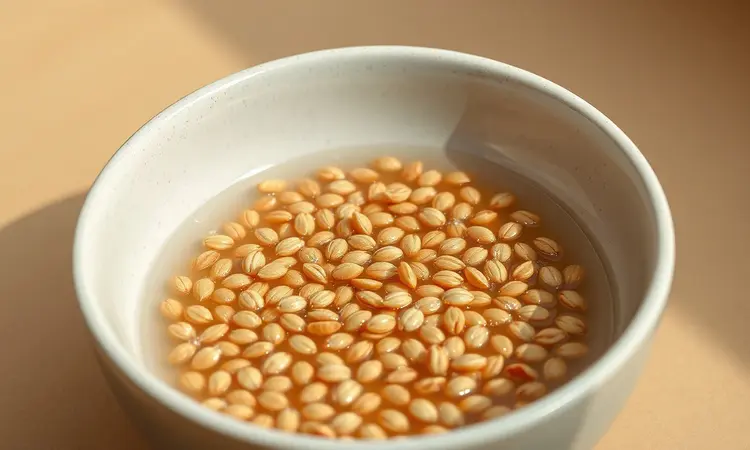
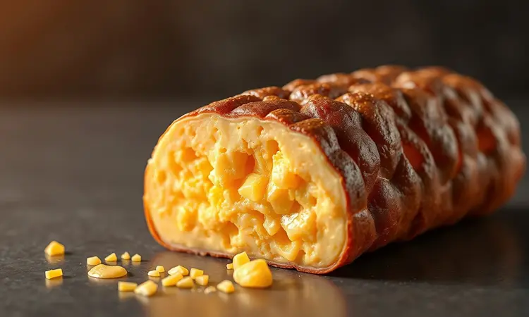
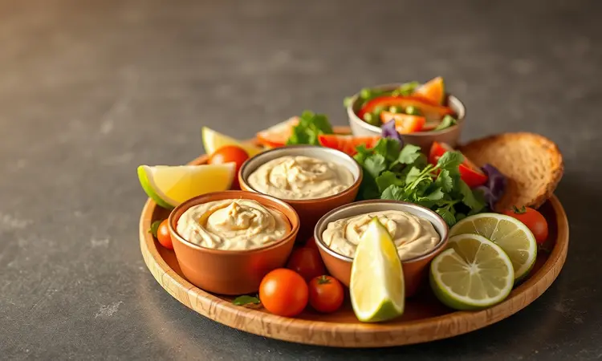

Você adora kibe, mas quer fugir da sujeira e das calorias da fritura por imersão? Você não está sozinho. Muitas pessoas buscam aquela textura perfeita, crocante por fora e macia por dentro, mas acabam com um prato seco ou que esfarela no prato.

Eu prometo que, com este guia, você vai dominar a técnica definitiva do kibe de forno na Airfryer, garantindo um resultado profissional em poucos minutos.

Vamos explorar desde a hidratação correta do trigo até os recheios mais suculentos para elevar o nível do seu cardápio.

<SummaryList products={frontmatter.top_products} />

## Por que fazer Kibe de Forno na Airfryer?

Imagine ter aquele crocante irresistível da fritura sem o óleo escorrendo no prato e sem aquele cheiro que impregna na cozinha.

A Airfryer faz essa mágica acontecer ao circular ar quente de forma intensa, criando uma casca dourada e perfeita enquanto mantém o interior suculento.

É como ter um chef particular que entrega consistência profissional em cada preparo, transformando seu kibe em uma experiência gourmet que impressiona sem exigir horas na cozinha.

Tudo isso enquanto reduz drasticamente as calorias e deixa sua cozinha limpa para receber os convidados.

### As Melhores Air Fryers para Receitas em Família

<ProductBox 
  title={frontmatter.top_products[0].title} 
  image={frontmatter.top_products[0].image} 
  link={frontmatter.top_products[0].link} 
/>

A beleza desta receita está em sua versatilidade: seja qual for o modelo que você tem em casa, o kibe de forno vai sair perfeito. Em 2023, várias air fryers se destacaram, mas a boa notícia é que a técnica funciona em todas elas.

Se você tem a Ninja Foodi DZ401 com seus 10 litros de capacidade, pode preparar uma fornada completa para a família toda. Com a Cosori TurboBlaze, aproveita o ótimo custo-benefício.

Se o silêncio é importante para você, a Philips Walita XLRi9270 realiza o trabalho quase sem fazer barulho. Quem tem pouco espaço na cozinha encontra na Midea Gourmet Fry uma companheira compacta e funcional.

O verdadeiro segredo não está no modelo, mas em como você prepara a massa.

## O Segredo do Trigo: Como Hidratar Corretamente

Este é o momento que separa o kibe memorável do simplesmente bom. Coloque o trigo para kibe em uma tigela com água e deixe-o de molho por pelo menos duas horas. Parece tempo demais?

É exatamente essa paciência que permite que cada grão absorva a água lentamente, ficando macio e pronto para abraçar os temperos. Após esse período, escorra bem o excesso de líquido e pressione levemente com as mãos para remover a umidade extra.

Esse cuidado simples evita que seu kibe fique empapado, garantindo aquela textura ideal que derrete na boca ao mesmo tempo em que mantém a estrutura perfeita.

## Ingredientes para um Kibe de Forno Imbatível

Para criar este prato que vai conquistar todos à mesa, você precisa de ingredientes simples mas escolhidos com carinho.

Comece com trigo para kibe bem hidratado, carne moída de qualidade, cebola, alho fresco, hortelã vibrante, sal marinho e pimenta do reino moída na hora. Um fio de azeite extra virgem para untar completa a lista.

### Escolhendo a Carne Ideal para a Massa

A carne é a alma do seu kibe. Imagine o patinho moído, magro mas cheio de sabor, entregando suculência a cada mordida. O coxão mole oferece uma maciez que derrete literalmente na boca.

Se seu paladar busca uma aventura, o cordeiro traz notas únicas que transformam o prato em uma experiência gastronômica.

O segredo está em usar uma carne bem moída que se misture perfeitamente com o trigo hidratado, criando um casamento de texturas onde você sente cada componente harmonizando no paladar.

## Passo a Passo: Preparando a Massa e Temperos

Com o trigo já macio após a hidratação, escorra bem e junte com a cebola picadinha, o alho amassado (quanto mais fresco, melhor), pimenta síria que traz aquele calor suave e um toque generoso de sal.

Agora vem a parte mais satisfatória: incorpore a carne escolhida e comece a amassar. Não tenha pressa aqui; massageie a mistura com as mãos até sentir que todos os ingredientes se fundiram em uma única massa homogênea e sedosa.

É nesse momento que você sente o kibe ganhando vida, pronto para receber seus toques pessoais.

## Sugestões de Recheios: Do Clássico ao Gourmet

Aqui é onde sua criatividade pode brilhar. Por que não começar com a combinação atemporal de queijo derretido e hortelã fresca? Ou ousar com carne seca desfiada abraçando cream cheese cremoso e azeitonas picadas?

Cada recheio conta uma história diferente, transformando o mesmo prato em múltiplas experiências.

### Recheio de Queijo e Requeijão Cremoso

Misture queijo muçarela ou minas frescal com requeijão até formar um creme homogêneo que promete derreter em camadas de sabor. Adicione um toque de ervas finas ou alho para dar profundidade.

Quando você morde o kibe e esse recheio cremoso envolve seu paladar, entende por que essa combinação virou clássico. É aquele momento que faz todos à mesa pararem para saborear.

### Opção de Recheio de Carne Moída com Hortelã

Refogue carne moída com cebola e alho até dourar, depois adicione sal, pimenta e uma pitada de cominho que traz leveza terrosa.

O toque mágico vem por último: hortelã fresca picada, cujo aroma se abre com o calor do recheio, criando um contraste refrescante que limpa o paladar entre uma mordida e outra.

Coloque essa mistura no centro dos kibes antes de levar para assar e prepare-se para ouvir elogios.

## Utensílios Necessários: Formas que Cabem na sua Fritadeira

<ProductBox 
  title={frontmatter.top_products[1].title} 
  image={frontmatter.top_products[1].image} 
  link={frontmatter.top_products[1].link} 
/>

A escolha certa aqui torna todo o processo mais prazeroso. Formas de silicone são suas melhores amigas: reutilizáveis, fáceis de limpar e flexíveis o suficiente para se adaptar ao cesto da sua Airfryer.

Existem modelos em formatos variados, desde retangulares que acomodam vários kibes até circulares que criam apresentações encantadoras. Importante verificar se o tamanho se adapta ao seu modelo específico, pois o sucesso está nos detalhes.

Formas descartáveis funcionam bem para receitas mais líquidas, enquanto kits com grelhas e espetos expandem suas possibilidades culinárias. Escolha pensando na frequência de uso e em como cada utensílio pode tornar seu momento na cozinha mais fluido e criativo.

## Como Assar na Airfryer: Tempo e Temperatura Ideal

Aqui está o timing perfeito que garante o crocante dourado sem secar o interior. Preaqueça sua Airfryer a 180°C por 5 minutos. Coloque os kibes já moldados (não os afine muito, um formato mais robusto mantém a suculência) e asse por 25 a 30 minutos.

Na metade do tempo, vire delicadamente cada um para que dourem uniformemente. Fique atento ao progresso, pois cada modelo tem suas particularidades.

O resultado final deve ter uma casca crocante que faz aquele som satisfatório ao cortar, revelando um interior macio e perfumado.

## Dicas de Ouro: Como evitar que o kibe esfarele

Além da hidratação perfeita do trigo que já dominamos, adicione uma colher de sopa de azeite ou mesmo um pouco de caldo de legumes à massa. Esse detalhe cria a liga que mantém tudo unido.

Ao moldar, use as mãos úmidas para evitar que a massa grude e forme cada kibe com cuidado, criando estruturas firmes que resistem ao calor intenso. Com esses pequenos gestos, você garante que cada peça mantenha sua integridade, do forno ao prato.

## O que servir com Kibe de Forno? (Melhores Acompanhamentos)

Imagine seu kibe saindo dourado da Airfryer acompanhado por uma salada tabule fresca, onde o sabor limpo do tomate e o toque cítrico do limão equilibram a riqueza da carne. Um molho de iogurte com hortelã oferece cremosidade refrescante.

Arroz com lentilhas traz textura e nutrição extra, enquanto legumes grelhados em tiras adicionam cor vibrante ao prato. Cada acompanhamento é escolhido para conversar com o kibe, criando uma sinfonia de sabores onde nada se sobrepõe, tudo se complementa.

## Posso congelar o Kibe na Airfryer?

Sim, e esta é uma das maiores vantagens desta receita. Prepare a massa normalmente, modele os kibes e coloque-os em uma bandeja forrada com papel manteiga, separando-os para não grudarem.

Leve ao congelador até ficarem firmes, depois transfira para um saco plástico ou recipiente hermético. Quando a vontade bater, não precisa descongelar: coloque diretamente na Airfryer pré-aquecida, adicionando apenas 5-7 minutos ao tempo normal de cozimento.

Ter kibes congelados prontos é como ter um tesouro escondido para aqueles dias onde a praticidade precisa andar de mãos dadas com o sabor.

## Conclusão

Seu percurso pela arte do kibe de forno na Airfryer chegou ao ponto onde técnica e paixão se encontram. Você descobriu que o segredo está não apenas nos ingredientes, mas no cuidado com cada etapa, desde a hidratação paciente do trigo até o timing preciso do assamento.

Mais do que uma receita, aprendeu a criar experiências: recheios que contam histórias, acompanhamentos que harmonizam e técnicas que transformam o simples em extraordinário.

Agora é sua vez de colocar as mãos na massa, sentir os aromas tomando conta da cozinha e colher os sorrisos à mesa. Porque comida feita com atenção não alimenta apenas o corpo, mas também o coração.

Prepare seu primeiro lote hoje e descubra como um prato tão tradicional pode se reinventar de maneira tão encantadora.