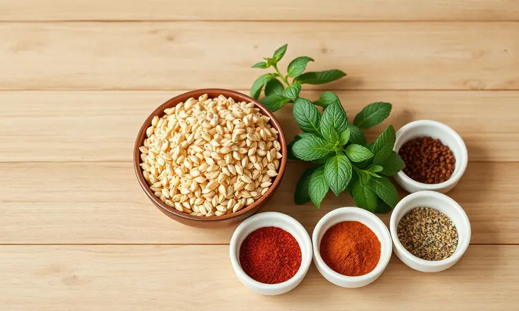
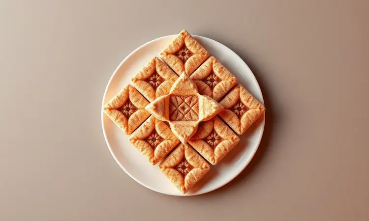
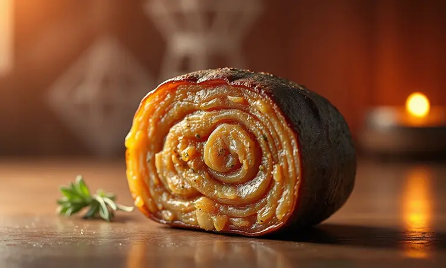

Preparar um kibe sequinho e saboroso pode parecer um desafio quando queremos fugir da fritura por imersão. A boa notícia é que, com a técnica correta, você consegue resultados profissionais usando apenas a circulação de ar quente.

Imagine seu kibe recebendo um abraço uniforme de calor que transforma cada lado igualmente crocante, sem aquelas partes mais queimadas que acontecem na fritura tradicional.

Neste guia, você vai descobrir a receita definitiva de kibe na Air Fryer, garantindo aquela casquinha irresistível por fora e um recheio que mantém toda sua suculência.

Vamos te ensinar desde a hidratação perfeita do trigo até os truques de temperatura que os chefs usam para evitar que a carne resseque. Prepare-se para transformar sua experiência na cozinha.

<SummaryList products={frontmatter.top_products} />

## Por que preparar Kibe na Air Fryer é a melhor escolha?

Quando você pensa em kibe, logo vem à mente aquela fritura tradicional com bastante óleo. Mas a Air Fryer oferece um caminho diferente, e é exatamente essa diferença que torna a experiência tão especial.

A circulação inteligente de ar quente cria um cozimento tão uniforme que cada pedacinho do seu kibe recebe atenção igual. O resultado? Uma casquinha crocante que se forma naturalmente, sem necessidade de excesso de óleo.

Isso significa que você está preparando um prato menos gorduroso, mas com todas as delícias do kibe tradicional intactas.

E a praticidade é outro grande diferencial. Enquanto na fritura você precisa monitorar constantemente, temendo que algo queime, aqui você pode confiar no processo. A máquina trabalha por você, garantindo eficiência com muito mais tranquilidade.

É sabor e saúde caminhando juntos.

## Ingredientes Essenciais para um Kibe de Respeito

Um kibe perfeito começa com escolhas inteligentes. Você vai precisar de: trigo para kibe, carne moída de boa qualidade, cebola, hortelã, pimenta síria, sal e azeite. Parece simples, mas cada ingrediente tem um papel crucial na construção do sabor e textura final.

Essa lista básica é seu ponto de partida, mas a verdadeira magia acontece quando você entende como preparar cada elemento. Ingredientes de qualidade só revelam seu potencial máximo quando tratados com cuidado.

### O Segredo da Hidratação: Como Preparar o Trigo Corretamente

Se você quer um kibe com textura ideal, não pode ignorar o trigo. A hidratação é o primeiro passo que determina tudo que vem depois.

Comece lavando o trigo em água corrente para remover qualquer impureza. Depois, coloque-o numa tigela e cubra com água filtrada, deixando de molho por cerca de 30 minutos.

Esse tempo de 'namoro' entre o trigo e a água não é apenas uma etapa técnica - é o momento onde o ingrediente absorve amor, ficando pronto para abraçar todos os temperos que você vai dar a ele.

Após esse período, escorra bem e esprema para retirar o excesso de líquido. O trigo agora está receptivo, mais maleável, e vai se integrar harmoniosamente com a carne e os temperos. Essa preparação cria a base perfeita para o sucesso da sua receita.

### Escolhendo a Carne e os Melhores Temperos Árabes

A carne é a alma do kibe. O tradicional é feito com carne bovina, mas você pode experimentar também com carne de cordeiro, que traz um sabor mais intenso e autêntico. Independente da escolha, priorize sempre qualidade - isso impacta diretamente na suculência final.

Os temperos árabes são onde a personalidade do prato realmente se revela. O cominho e a canela são imprescindíveis, criando aquela complexidade de sabor que define a culinária árabe.

A salsinha e hortelã trazem o frescor necessário, enquanto a cebola ralada e o alho intensificam cada nuance.

O equilíbrio entre carne e temperos é uma dança delicada. Quando bem executada, resulta numa experiência que vai além do simples 'comida gostosa' - torna-se uma memória sensorial.

Agora que você já conhece os ingredientes e como preparar them, vamos aplicar tudo na prática.

## Passo a Passo: Como Fazer Kibe "Frito" na Air Fryer

<ProductBox 
  title={frontmatter.top_products[0].title} 
  image={frontmatter.top_products[0].image} 
  link={frontmatter.top_products[0].link} 
/>

Com os ingredientes preparados, o momento da execução é onde tudo se concretiza. Fazer kibe na Air Fryer é uma experiência que combina técnica com simplicidade.

Comece com o trigo já hidratado - aquela 1 xícara que você cuidou com atenção. Misture com 300g a 600g de carne moída (aquela que escolheu com critério), cebola picada, hortelã, salsinha, sal e pimenta do reino. A massa deve se unir numa textura homogênea e maleável.

Modele em formato de bolinhas alongadas. Aqui você pode adicionar um elemento de surpresa: queijos como muçarela ou requeijão no centro transformam cada kibe numa pequena descoberta.

Pré-aqueça sua Air Fryer a 180°C por 5 minutos. Coloque os kibes na cesta, pincele com azeite de oliva - esse gesto simples vai garantir o dourado perfeito. Asse por 12 a 15 minutos, virando-os na metade do tempo para uniformidade.

Lembre-se que cada aparelho tem sua personalidade. O tempo pode variar, mas essa variação é sua oportunidade para ajustar fino e alcançar exatamente o ponto que você deseja. Sirva quente e permita que cada mordida seja uma celebração.

### Modelagem Ideal para Máxima Crocância

A forma dos seus kibes conversa diretamente com o resultado final. Para garantir aquela crocância exterior enquanto mantém a suculência interior, a modelagem precisa ser pensada.

Modele os kibes em formatos mais finos, com cerca de 1 a 1,5 cm de espessura. Essa dimensão permite que o calor circule eficientemente, criando uma casquinha uniforme sem comprometer o interior.

Pressione levemente para que mantenham a forma durante o cozimento - isso evite deformações que podem criar pontos mais queimados.

E um detalhe crucial: não sobrecarregue a cesta. Espaço entre os kibes significa espaço para o ar quente trabalhar. Quando cada unidade tem seu próprio 'território' na cesta, o resultado é uma textura perfeita em todos eles.

### Tempo e Temperatura: O Ajuste de Ouro para o Ponto Perfeito

Tempo e temperatura são o casamento que define o destino do seu kibe. Essa faixa de 180°C a 200°C é como encontrar a velocidade perfeita numa corrida - rápida enough para criar a casquinha, mas gentil enough para preservar toda a suculência dentro.

Pré-aqueça a 200°C e cozinhe por cerca de 20 minutos. Virar na metade do tempo não é apenas uma recomendação técnica - é um ritual de cuidado que garante que todos os lados recebam o mesmo abraço dourado.

Cada Air Fryer tem suas peculiaridades, como cada chef tem seu estilo. Os primeiros testes são sua fase de aprendizagem, onde você ajusta conforme necessário para descobrir o ponto perfeito para seu aparelho e seu gosto pessoal.

## Variação Prática: Kibe de Assadeira na Air Fryer

<ProductBox 
  title={frontmatter.top_products[1].title} 
  image={frontmatter.top_products[1].image} 
  link={frontmatter.top_products[1].link} 
/>

Se você ama a versão tradicional de kibe, mas busca ainda mais praticidade, o kibe de assadeira na Air Fryer é sua resposta. É a mesma delícia, apresentada numa forma que simplifica o processo.

Use os ingredientes básicos: trigo para kibe (hidratado com aquela atenção de 20 a 30 minutos), carne moída, cebola e hortelã, além dos temperos como sal e pimenta síria. A diferença está na montagem.

Modele o kibe num refratário ou diretamente na cesta da Air Fryer, criando camadas. Você pode adicionar recheios como queijo entre essas camadas, transformando cada porção numa experiência estratificada de sabor.

O cozimento varia de 16 a 20 minutos em temperatura alta. Essa abordagem garante crocância por fora e suculência por dentro, mesmo na versão de assadeira. Alguns modelos podem precisar ajustes no tempo, mas essa flexibilidade é parte da jornada.

A preparação é simples, mas o sabor brilha quando feito com ingredientes escolhidos com amor. Esta variação é prova que praticidade não significa abrir mão da qualidade - significa encontrar caminhos inteligentes para o mesmo resultado extraordinário.

## Como Fazer Kibe Recheado: Dicas de Recheios Irresistíveis

Um kibe recheado é uma declaração de amor à gastronomia. É onde você pode personalizar, surpreender e elevar ainda mais a experiência.

Para o recheio, o universo é vasto. Uma combinação clássica de carne moída com cebola picada, salsinha e temperos a gosto mantém a tradição enquanto adiciona complexidade.

O recheio de queijo é outra jornada - quando derrete, cria uma cremosidade que dialoga perfeito com a crocância exterior.

Para caminhos vegetarianos, pense em espinafre com ricota ou abóbora com queijo coalho. Cada opção traz sua própria narrativa de sabor.

A chave para o sucesso aqui é moderação. Não encher demais significa garantir que cada mordida equilibra crocância exterior com suculência interior, sem comprometer a estrutura. Experimente e descubra qual recheio conversa melhor com sua história pessoal.

## 5 Segredos de Especialista para o Kibe Não Ficar Seco

O medo de um kibe seco é real, mas esses segredos transformam esse risco em garantia de suculência:

1. Umedeça bem a massa - essa hidratação adicional cria uma reserva interna de moisture

2. Use carne de qualidade - a escolha da carne define o potencial de suculência

3. Evite assar por tempo excessivo - respeito ao tempo é respeito ao resultado

4. Deixe espaço entre os kibes - circulação de ar livre significa cozimento uniforme

5. Aplique azeite com cuidado - essa camada superficial protege enquanto doura

Essas cinco ações são seu mapa para garantir que cada kibe mantenha sua essência suculenta, independente do método de preparo.

### O Truque do Azeite para um Dourado Uniforme

<ProductBox 
  title={frontmatter.top_products[2].title} 
  image={frontmatter.top_products[2].image} 
  link={frontmatter.top_products[2].link} 
/>

O azeite no kibe da Air Fryer não é apenas um ingrediente - é um artista que trabalha na superfície. Aplicar uma camada leve antes de colocar os kibes na máquina é o movimento que garante dourado uniforme e crocância consistente, enquanto protege a suculência interior.

A maneira mais eficaz é pincelar ou borrifar diretamente. Isso permite que a gordura penetre e intensifique o sabor de forma controlada, sem excessos.

Adicionar azeite à massa pode não ser ideal - pode deixar o kibe mais úmido que necessário. Mas na superfície, ele cumpre seu papel perfeito: criar aquela casquinha dourada que é tanto visualmente apetitos quanto texturalmente satisfatório.

Optar por um azeite de qualidade eleva ainda mais a experiência, mas mesmo óleos mais comuns cumprem bem a função. Com essa simples ação, você transforma seus kibes numa celebração tanto para os olhos quanto para o paladar.

## FAQ - Dúvidas Frequentes sobre Kibe na Fritadeira Elétrica

Depois de todas essas informações, algumas dúvidas naturais podem surgir. Aqui respondemos às mais frequentes:

Kibe na fritadeira elétrica realmente é uma opção prática e saudável. O tempo de cozimento geralmente fica entre 20 a 25 minutos a 180°C, garantindo aquela combinação perfeita de crocância exterior e suculência interior.

### Posso colocar kibe congelado direto na Air Fryer?

Sim, absolutamente. Colocar kibe congelado diretamente na Air Fryer é uma das grandes vantagens desse método. Você economiza tempo no descongelamento e ainda consegue um resultado crocante por fora e suculento por dentro.

A temperatura ideal geralmente fica em torno de 180°C, com tempo de cozimento de 15 a 20 minutos dependendo do seu modelo. Virar na metade do tempo garante uniformidade. Essa técnica é perfeita para quem busca facilidade sem sacrificar qualidade.

### Qual a melhor forma de reaquecer o kibe sem endurecer?

Reaquecer kibe sem que ele endurece é sobre técnica gentil. No forno convencional, mantenha temperatura baixa (cerca de 150°C) por 10 a 15 minutos, cobrando com papel alumínio para proteger contra ressecamento.

Na Air Fryer, configure para 160°C e aqueça por aproximadamente 5 a 7 minutos. Essa abordagem respeita a textura original, mantendo o interior quentinho enquanto preserva ou até recupera a crocância exterior.

## Conclusão

A receita de kibe na Air Fryer é mais que uma alternativa à fritura tradicional - é uma reinvenção que mantém alma enquanto evolui forma.

Você reduz significativamente a quantidade de óleo, permitindo que o prato fique crocante por fora e suculento por dentro sem comprometer nenhum aspecto do sabor.

Esta abordagem é perfeita para quem busca opções mais leves, mas que ainda proporcionam prazer completo à mesa.

Cada etapa - da hidratação do trigo ao momento final na Air Fryer - é uma oportunidade de cuidado, de atenção, de transformação técnica em experiência sensorial.

Experimente essa delícia em sua casa. Surpreenda-se não apenas com a combinação de saúde e sabor, mas com a maneira como esse método convida você para uma relação mais íntima e consciente com sua comida.

O kibe na Air Fryer não é apenas uma receita - é uma declaração que qualidade e bem-estar podem coexistir numa única mordida.