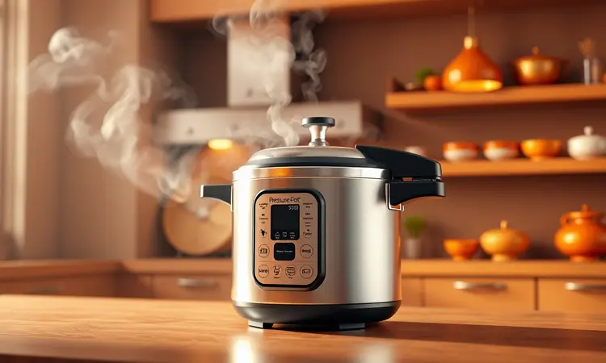

Preparar um lagarto recheado que fique suculento e macio é um desafio para muitos cozinheiros, mas é a escolha perfeita para um almoço de domingo inesquecível.

Você provavelmente já provou versões ressecadas ou sem tempero, mas saiba que o segredo está na técnica de corte e na escolha do recheio.

Neste guia definitivo, eu vou te ensinar não apenas a receita clássica com bacon e farofa, mas também variações gourmet e todos os truques para garantir que a carne derreta na boca. Prepare-se para dominar este prato sofisticado e prático ao mesmo tempo.

<SummaryList products={frontmatter.top_products} />

## O que é a Carne Lagarto e por que ela é ideal para Rechear?

A carne lagarto é um corte nobre que vem da parte traseira do boi, sendo conhecida por sua textura macia e sabor intenso.

Este corte possui uma quantidade moderada de gordura, o que a torna ideal para ser recheada, pois o sabor do recheio se incorpora bem à carne durante o cozimento.

Além disso, a lagarto é uma opção versátil que pode absorver diferentes temperos e marinadas, tornando-se uma excelente escolha para diversas receitas, como assados ou cozidos.

Sua capacidade de permanecer suculenta mesmo após longos períodos de cocção faz dela um favorito em muitas mesas.

## Como Escolher e Preparar a Peça de Lagarto Perfeita

Ao escolher o lagarto, imagine que você está selecionando o ingrediente principal para uma experiência culinária memorável. Opte por um corte com boa quantidade de gordura entremeada, pois ela é a garantia de suculência que vai fazer seus convidados pedirem a receita.

Não tenha pressa na preparação, tempere generosamente e considere deixar a carne marinando por algumas horas, ou até durante a noite, para que cada fibra absorva os sabores profundamente.

### Faca de Chef Profissional para Cortes Precisos

<ProductBox 
  title={frontmatter.top_products[0].title} 
  image={frontmatter.top_products[0].image} 
  link={frontmatter.top_products[0].link} 
/>

Investir em uma boa faca de chef não é sobre gastar dinheiro, é sobre economizar frustração. Quando você precisa fazer o corte preciso para criar aquela bolsa perfeita que vai abrigar o recheio, uma lâmina afiada e bem equilibrada faz toda diferença.

Procure por modelos com aço de qualidade, como VG-10, que mantêm o fio por mais tempo, e um cabo ergonômico que se adapte à sua mão.

O movimento natural de balanço facilitado por uma lâmina bem projetada transforma o que poderia ser uma tarefa tensa em um momento quase terapêutico na cozinha.

## Passo a Passo: Como Fazer o Corte em "Bolsa" ou "Manta"

A técnica do corte em bolsa é onde a mágica começa. Posicione o lagarto com a gordura voltada para cima e, com aquela faca afiada que você escolheu com cuidado, faça um corte cuidadoso em toda a extensão do comprimento.

O objetivo é criar uma abertura generosa sem atravessar para o outro lado, como se estivesse abrindo um livro especial onde cada página será preenchida com sabor.

Esse espaço que você está criando não é apenas físico, é o lugar onde a personalidade do seu prato vai nascer.

### Barbante Culinário para Amarração Perfeita

<ProductBox 
  title={frontmatter.top_products[1].title} 
  image={frontmatter.top_products[1].image} 
  link={frontmatter.top_products[1].link} 
/>

Depois de encher sua criação com os melhores ingredientes, vem o momento de dar a ela a forma que vai garantir apresentação e cozimento perfeitos.

O barbante culinário é seu melhor aliado aqui, não apenas porque suporta altas temperaturas sem soltar fiapos, mas porque ele transforma aquela peça recheada em uma obra compacta e elegante.

Esqueça barbantes comuns que podem comprometer a segurança, escolha um específico para culinária e sinta a satisfação de dar nós que vão segurar tudo no lugar, mantendo cada camada do recheio exatamente onde você planejou.

## 5 Sugestões de Recheios que Elevam o Sabor da Carne

Aqui é onde você deixa sua marca pessoal. O recheio é a assinatura do chef, a oportunidade de transformar um corte nobre em algo verdadeiramente único.

Cada opção abaixo representa uma experiência diferente, desde o conforto reconfortante dos sabores clássicos até a sofisticação que impressiona os paladares mais exigentes.

### 1. Clássico: Bacon, Calabresa e Cenoura

Para aquele almoço de domingo onde todos se reúnem em volta da mesa, essa combinação é pura nostalgia com um toque de crocância perfeita.

O bacon entrega aquele sabor profundo que abraça o paladar, enquanto a calabresa adiciona notas defumadas e levemente picantes que despertam os sentidos. A cenoura, cozida lentamente dentro da carne, libera um dulçor natural que equilibra tudo com sutileza.

É a receita que faz os olhos brilharem quando a travessa chega à mesa, prometendo memórias que vão além do sabor.

### 2. Gourmet: Tomate Seco, Queijo Coalho e Espinafre

Quando você quer criar um momento especial, seja para impressionar convidados ou simplesmente presentear sua família com algo extraordinário, essa combinação é a sua aliada.

O tomate seco, com sua intensidade concentrada, conversa perfeitamente com a cremosidade do queijo coalho que derrete em fios dourados. O espinafre, além de adicionar frescor, traz aquele toque de sofisticação que transforma um simples jantar em uma celebração.

Prepare-se para receber elogios que começam com o aroma que invade a casa muito antes do prato ser servido.

### 3. Caseiro: Farofa de Ovos com Ervas Finas

Existe algo profundamente reconfortante na textura crocante da farofa ao lado de uma carne suculenta. Quando você prepara essa versão com ovos e ervas finas, está criando não apenas um acompanhamento, mas uma experiência completa.

Imagine o toque caseiro da manteiga refogando cebola e alho, incorporado aos ovos cremosos e, finalmente, encontra a farinha de mandioca que absorve todos esses sabores. Finalizar com salsinha e cebolinha frescas é como assinar uma carta de amor à tradição culinária.

## Receita Definitiva: Lagarto Assado Recheado com Bacon e Farofa

Esta é a receita que une técnica e alma. Comece com o seu lagarto preparado com o corte em bolsa, recheie com uma mistura generosa de bacon em cubos e sua farofa preferida.

A mágica acontece quando, durante o assado, as gorduras do bacon banham a carne por dentro, enquanto a farofa absorve todos os sucos, criando uma textura que é crocante e úmida ao mesmo tempo.

### Assadeira Antiaderente para um Assado Uniforme

<ProductBox 
  title={frontmatter.top_products[2].title} 
  image={frontmatter.top_products[2].image} 
  link={frontmatter.top_products[2].link} 
/>

Você já passou pela frustração de preparar algo com tanto cuidado só para ver parte da carne grudar na assadeira? Com uma antiaderente de qualidade, essa preocupação desaparece.

Modelos com revestimento como Starflon Max não apenas previnem que a carne grude, mas garantem que o calor se distribua de maneira uniforme, permitindo que seu lagarto desenvolva aquela crosta dourada perfeita em todos os lados.

É o tipo de investimento que transforma a ansiedade do desenforme em confiança absoluta.

## Alternativa Rápida: Lagarto Recheado na Panela de Pressão

Para os dias em que o tempo é escasso mas o desejo por um jantar especial não, a panela de pressão é sua salvadora.

Ela consegue fazer o que normalmente levaria horas em apenas frações de tempo, mantendo a carne incrivelmente macia porque trabalha com vapor em alta pressão que penetra cada fibra.

O resultado é uma carne que desfia com o garfo, impregnada de todos os temperos, perfeita para quando a vontade bate mas o relógio não colabora.

### Panela de Pressão de Alta Qualidade

<ProductBox 
  title={frontmatter.top_products[3].title} 
  image={frontmatter.top_products[3].image} 
  link={frontmatter.top_products[3].link} 
/>

Ao escolher sua panela de pressão, pense em segurança e eficiência. Marcas como Tramontina oferecem modelos como a Vancouver, com sistema de fechamento que traz tranquilidade, ou a linha Solar em aço inox que distribui calor como nenhuma outra.

A Rochedo Clipso impressiona com seu fechamento seguro e revestimento que quase lava sozinho.

O que todas têm em comum é a capacidade de transformar ingredientes simples em refeições extraordinárias em minutos, devolvendo à sua rotina a possibilidade do especial mesmo nos dias mais corridos.

## 3 Segredos Infalíveis para o Lagarto não Ficar Duro

Esses três pilares são a diferença entre um prato esquecível e um memorável. Primeiro, não economize na qualidade da carne, procure por cortes com gordura entremeada que funcionam como um colchão natural durante o cozimento.

Segundo, tenha paciência com a marinada, permita que ácidos como vinagre ou limão trabalhem suavemente amaciando as proteínas por horas.

Terceiro e mais importante, respeite o tempo lento do cozimento, seja em forno baixo ou na panela, é essa paciência que transforma carne dura em experiência que derrete na boca.

## Melhores Acompanhamentos para Servir com Lagarto Recheado

O lagarto recheado é uma estrela que merece um elenco de apoio à altura. Um purê de batatas cremoso não apenas complementa, mas cria um contraste de texturas que é puro prazer.

Farofas, especialmente as caseiras, oferecem a crocância que faltava, enquanto saladas frescas equilibram com seu frescor.

E quando você serve com arroz à grega ou um risoto, está criando uma sinfonia onde cada elemento absorve os sucos da carne, garantindo que nenhuma gota desse sabor trabalhado com tanto carinho seja desperdiçada.

## Perguntas Frequentes sobre Lagarto Recheado (FAQ)

Quanto tempo leva para assar? Depende do tamanho, mas geralmente entre 1h e 1h30 em forno médio. A melhor forma de saber é usando um termômetro de carne, buscando temperatura interna de aproximadamente 60°C para ponto médio.

Posso congelar depois de pronto? Sim, mas recomendo congelar antes de assar, já recheado e amarrado. Quando for usar, deixe descongelar na geladeira por 24h antes de levar ao forno.

Qual é o melhor recheio para iniciantes? Comece com o clássico bacon e farofa, são ingredientes que perdoam pequenos erros e garantem um resultado seguro e delicioso.

Preciso furar a carne para marinar? Evite furar, pois isso permite que os sucos escapem durante o cozimento. Para uma marinada eficiente, deixe por mais tempo, permitindo que os sabores penetrem naturalmente.

## Conclusão

Dominar o lagarto recheado vai além de seguir uma receita, é sobre entender o ritmo da cozinha, respeitar os tempos da carne e, principalmente, colocar intenção em cada etapa.

Desde a escolha cuidadosa do corte até o momento em que você corta a primeira fatia e revela camadas perfeitas de sabor, cada decisão contribui para criar não apenas uma refeição, mas uma experiência compartilhada.

Lembre-se que os erros fazem parte do aprendizado, e que cada tentativa te aproxima da versão perfeita que vive no seu paladar.

Agora que você tem todas as ferramentas, desde as técnicas até os segredos emocionais, é hora de transformar sua cozinha no palco dessa criação.

O próximo domingo espera pela sua versão inesquecível do lagarto recheado, pronto para criar memórias tão saborosas quanto o prato em si. Mãos à obra, chef!