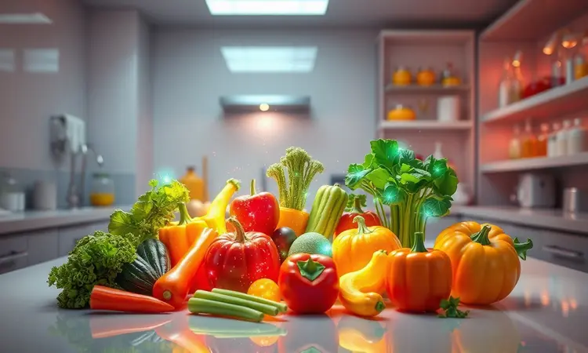
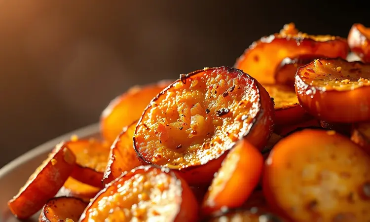
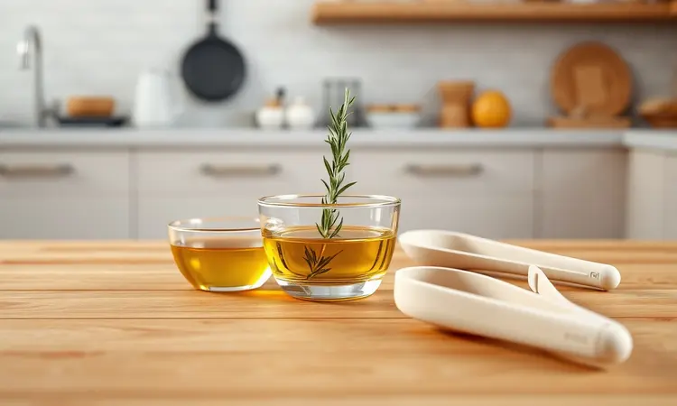
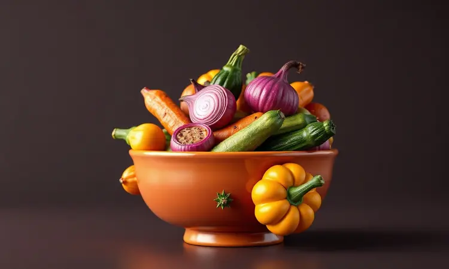

Você já experimentou aquela frustração de abrir a air fryer e encontrar legumes que parecem ter sofrido uma crise existencial? Alguns murchos e tristes, outros queimados por fora e ainda cruxinhos por dentro, como se resistissem ao calor.

Se isso já aconteceu com você, respire fundo: você está prestes a descobrir que a relação entre legumes e air fryer pode ser um verdadeiro romance culinário.

Aqui, você vai aprender não apenas tempos e temperaturas, mas os segredos que transformam uma simples abobrinha ou uma batata rústica em pequenas obras-primas crocantes e saborosas.

Prepare-se para dizer adeus aos legumes sem graça e abraçar um mundo onde cada vegetal revela seu potencial máximo.

<SummaryList products={frontmatter.top_products} />

## Por que cozinhar legumes na Air Fryer é a melhor opção?

Imagine conseguir aquele dourado perfeito, aquela crocância que faz barulho ao morder, sem precisar encher uma panela de óleo ou ficar vigiando o forno.

A air fryer conquistou seu espaço nas cozinhas justamente por entregar essa experiência: ela usa ar quente em movimento para envolver cada pedacinho de alimento, criando uma casquinha deliciosa enquanto preserva o interior macio e suculento.

Mas vai além da praticidade. O que realmente faz a diferença é como esse método respeita o sabor natural dos legumes.

Enquanto a fervura pode 'lavar' parte do sabor, e o óleo em excesso pode mascarar texturas, a air fryer realça cada nota, transformando uma simples cenoura em algo que você vai querer comer direto da cesta.

## Legumes na Air Fryer perdem nutrientes? O que diz a ciência

Aqui está uma revelação que vai aliviar sua consciência: pesquisas mostram que a air fryer pode ser mais gentil com os nutrientes do que métodos tradicionais.

Como o tempo de exposição ao calor é reduzido e não há imersão em gordura, vitaminas sensíveis como a C e algumas do complexo B têm mais chances de sobreviver ao processo.

Pense nisso como um cozimento acelerado e eficiente. Em vez de passar minutos na água fervente, seus legumes recebem calor intenso por períodos curtos, saindo não apenas saborosos, mas nutricionalmente ricos.

É o melhor dos dois mundos: praticidade sem sacrificar o que realmente importa para sua saúde.

## 5 Segredos para Legumes Crocantes (e nunca murchos)

Agora vamos ao que interessa: como garantir que seus legumes saiam sempre dignos de foto? Esses segredos são o que separa o amador do mestre da air fryer.

Primeiro, trate a umidade como inimiga número um. Após lavar, seque cada pedacinho com cuidado - legumes molhados viram legumes cozidos no vapor, não dourados.

Depois, pense na uniformidade como uma questão de justiça: cortar tudo no mesmo tamanho garante que todos terminem a jornada ao mesmo tempo, sem sobreviventes crus ou mártires carbonizados.

O terceiro segredo está no espaço. Não amontoe! Os legumes precisam respirar, e o ar precisa circular livremente entre eles. É como uma festa: todos precisam de espaço para dançar.

Quarto, o azeite não é vilão, mas deve ser usado com parcimônia - uma fina camada é suficiente para ativar a reação de Maillard que cria o dourado perfeito.

Por fim, abrace sua curiosidade. Nos primeiros testes, observe, mexa na metade do tempo, descubra como seus legumes preferidos se comportam. Cada air fryer tem sua personalidade, e essa descoberta faz parte da diversão.

## Utensílios Essenciais para Facilitar o Preparo

Alguns coadjuvantes podem transformar sua experiência de cozinheiro de air fryer de trabalhos para pura satisfação. Não são obrigatórios, mas quando você os conhece, percebe como facilitam o processo.

### Fritadeira Elétrica de Alta Performance

<ProductBox 
  title={frontmatter.top_products[0].title} 
  image={frontmatter.top_products[0].image} 
  link={frontmatter.top_products[0].link} 
/>

Se você está levando a sério essa jornada dos legumes crocantes, vale investir em um modelo que seja seu parceiro confiável.

Marcas como Philips e Britânia oferecem opções com espaço generoso e potência adequada (entre 1400W e 1700W) que garantem resultados consistentes.

Sim, elas ocupam espaço na bancada, mas pense no que você ganha em troca: versatilidade para assar, fritar e até desidratar, além da economia de óleo que se traduz em refeições mais leves e saudáveis.

É como ter um pequeno forno de convecção dedicado às suas criações mais crocantes.

### Pulverizador de Azeite (Spray)

<ProductBox 
  title={frontmatter.top_products[1].title} 
  image={frontmatter.top_products[1].image} 
  link={frontmatter.top_products[1].link} 
/>

Este é o seu controle remoto para a quantidade perfeita de gordura. Em vez de derramar azeite e torcer para não exagerar, o pulverizador permite uma aplicação tão uniforme quanto suave, garantindo que cada pedaço receba apenas o necessário para brilhar e dourar.

Escolha um modelo fácil de limpar (vidro ou aço inoxidável são ótimas opções) e descubra como essa simples ferramenta pode ser revolucionária. Você economiza calorias, evita desperdício e ainda consegue aquela distribuição perfeita que os chefs profissionais adoram.

### Pinça de Silicone

<ProductBox 
  title={frontmatter.top_products[2].title} 
  image={frontmatter.top_products[2].image} 
  link={frontmatter.top_products[2].link} 
/>

Retirar legumes quentes da air fryer com uma pinça comum é convite para queimaduras e frustração. A pinça de silicone, com suas pontas resistentes ao calor (até 230°C), muda completamente o jogo.

Além da segurança, ela protege a superfície antiaderente da sua air fryer de arranhões e permite virar os legumes com precisão cirúrgica na metade do cozimento.

Muitos modelos ainda têm sistema de travamento para armazenamento compacto - perfeito para cozinhas que precisam otimizar cada centímetro.

## Receita Master: Mix de Legumes Assados Coloridos

Esta receita é sua porta de entrada para o mundo dos legumes perfeitos na air fryer. Simples o suficiente para qualquer iniciante, mas deliciosa o bastante para impressionar convidados.

### Ingredientes e Seleção dos Vegetais

Comece escolhendo um arco-íris de texturas e sabores: pimentões vermelhos e amarelos para doçura, abobrinha para suculência, cenoura para terroso e brócolis para aquele toque herbáceo. A chave está na frescura - legumes firmes e vibrantes garantem resultados superiores.

Corte tudo em pedaços similares (cubos de 2-3cm funcionam bem) e reserve um momento para o ritual do tempero. Em uma tigela, misture seus legumes com azeite (uma colher de sopa para cada duas xícaras de legumes), sal marinho e ervas de sua preferência.

Alecrim e tomilho fresco são clássicos que nunca falham.

### Passo a Passo do Preparo Infalível

Pré-aqueça sua air fryer por 3-5 minutos a 200°C - esse passo inicial faz toda diferença na crocância final. Enquanto isso, aproveite para dar uma última misturada nos legumes temperados.

Espalhe os legumes em uma única camada na cesta. Não tente apressar o processo sobrecarregando; se necessário, faça em lotes. Programe 15 minutos a 200°C e, na marca dos 7-8 minutos, use sua pinça de silicone para sacudir e virar os legumes.

Essa pausa estratégica garante que todos os lados recebam amor igual do ar quente.

Quando o timer apitar, você terá diante de si um mix que parece saído de um restaurante gourmet: dourado por fora, macio por dentro, com cores que parecem mais vivas do que quando entraram.

## Tabela de Tempo e Temperatura por Tipo de Legume

Vamos tornar isso prático. Em vez de uma tabela seca, pense nisso como seu guia de referência rápida:

Legumes densos (batata, batata-doce, abóbora) adoram calor intenso: 200°C por 18-22 minutos, mexendo na metade. Eles precisam desse empurrão extra para desenvolver interior cremoso e exterior crocante.

Legumes de textura média (cenoura, pimentão, berinjela) encontram seu equilíbrio em 190°C por 12-16 minutos. Tempo suficiente para caramelizar seus açúcares naturais sem perder estrutura.

Legumes mais delicados (abobrinha, cogumelos, aspargos) pedem cuidado: 180°C por 8-12 minutos. Eles cozinham rápido, então fique de olho após os primeiros 6 minutos.

Lembre-se: o tamanho dos pedaços é seu principal controle. Pequenos cubos cozinham mais rápido que fatias grossas. Use esses tempos como ponto de partida e ajuste conforme conhece sua air fryer.

## Variações que Você Precisa Testar

Depois de dominar o básico, o mundo se abre para experimentações que transformam o simples em extraordinário. Aqui estão três que vão expandir seu repertório:

### Batata Rústica com Alecrim e Alho

Corte batatas com casca em gomos generosos. Em uma tigela, misture com azeite, sal grosso, alecrim fresco picado e dentes de alho levemente amassados (eles vão perfumar sem dominar).

25-30 minutos a 200°C, mexendo a cada 10 minutos, criam uma textura que é pura magia: interior cremoso como purê, exterior com crocância que faz barulho. O alho fica caramelizado e doce, perfeito para espalhar sobre as batatas.

### Brócolis e Couve-Flor Gratinados com Parmesão

Separe os floretes em tamanhos similares. Após um rápido pré-cozimento de 5-6 minutos na air fryer a 180°C, retire e polvilhe generosamente com parmesão ralado fino.

Volte por mais 4-5 minutos a 190°C, apenas até o queijo derreter e formar uma crosta dourada. O contraste é sublime: vegetais tenros sob uma camada de queijo perfumado que derrete na boca.

### Chips de Abobrinha e Cenoura Low Carb

Use um mandolin ou fatiador para criar rodelas finíssimas (2-3mm). Espalhe em uma única camada (isso é crucial), borrife levemente com azeite e tempere com sal marinho e pimenta do reino moída na hora.

10-12 minutos a 160°C produzem chips tão crocantes quanto as de batata, mas com uma leveza que permite devorar sem culpa. Experimente adicionar páprica defumada ou raspas de limão para variações surpreendentes.

## Erros Comuns: Por que seus legumes não ficam bons?

Vamos falar sobre os obstáculos que impedem seus legumes de brilharem. O primeiro é o corte desigual - quando pedaços grandes e pequenos dividem a mesma cesta, você cria uma situação onde alguns saem perfeitos enquanto outros estão carbonizados ou crus. A solução?

Paciência na preparação.

O segundo erro é relacionado ao azeite: muito deixa os legumes encharcados e pesados, pouco resulta em secura e falta de cor. A medida certa é aquela que apenas brilha a superfície sem formar poças.

Temperatura inadequada é outro vilão. Muito alta queima o exterior antes do interior cozinhar; muito baixa produz legumes cozidos, não assados. A maioria dos legumes floresce entre 180°C e 200°C - aprenda essa janela.

Por fim, a superlotação. Quando os legumes estão amontoados, eles cozinham no vapor uns dos outros, nunca desenvolvendo aquela crocância desejada. Respeite o espaço de cada um, mesmo que signifique fazer em lotes.

## Perguntas Frequentes (FAQ)

### Precisa pré-aquecer a air fryer para legumes?

Embora seu aparelho funcione sem pré-aquecimento, esses 3-5 minutos iniciais fazem uma diferença perceptível.

É como preaquecer um forno tradicional: cria um ambiente de calor constante desde o primeiro segundo, o que resulta em um início de cozimento mais uniforme e uma crocância mais consistente.

Se estiver com pressa, pode pular essa etapa, mas ajuste mentalmente o tempo - adicione 1-2 minutos ao total, pois os primeiros minutos serão usados para aquecer o ar ao redor dos alimentos.

### Posso usar papel manteiga ou papel alumínio?

Papel manteiga é seu aliado, especialmente para legumes que tendem a grudar ou liberar muita umidade. Ele permite circulação de ar enquanto protege a cesta, facilitando a limpeza posterior.

Corte para caber no fundo sem subir pelas laterais, o que bloquearia o fluxo de ar.

Papel alumínio exige mais cuidado. Use apenas para envolver legumes muito delicados ou que queira cozinhar no vapor dentro da air fryer (como batatas inteiras). Nunca cubra completamente a cesta com alumínio, pois isso impede a circulação que é a alma do processo.

## Conclusão

Dominar a arte dos legumes na air fryer é como aprender uma nova linguagem culinária. No início, há tentativas, ajustes, talvez algum desapontamento.

Mas com cada lote, você aprende os sussurros do seu aparelho, as preferências de cada vegetal, o ponto exato onde crocância encontra suculência.

O que começa como busca por praticidade transforma-se em uma relação de intimidade com seus alimentos. A batata que antes era apenas acompanhamento torna-se protagonista. O brócolis ganha status de iguaria. A abobrinha revela texturas que você nem imaginava.

Essa jornada vai além de economizar óleo ou tempo. É sobre redescobrir o prazer de preparar alimentos com atenção, sobre transformar ingredientes simples em pequenas celebrações diárias.

Cada cesta de legumes dourados que você retira é uma vitória não apenas culinária, mas também afetiva - a prova de que com as técnicas certas e um pouco de curiosidade, até os vegetais mais humildes podem se tornar extraordinários.

Agora é sua vez. Escolha seu legume favorito, lembre-se dos segredos que compartilhamos aqui e embarque na primeira de muitas experiências deliciosas. Sua air fryer está esperando para revelar todo o seu potencial - e seus legumes nunca mais serão os mesmos.