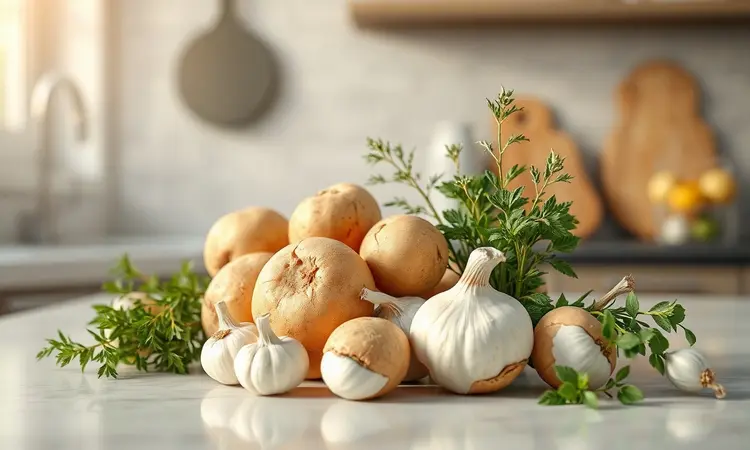
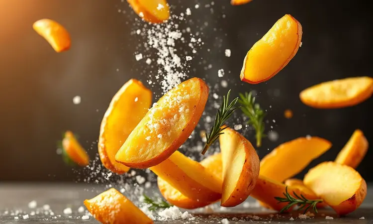
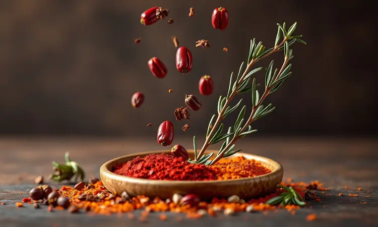
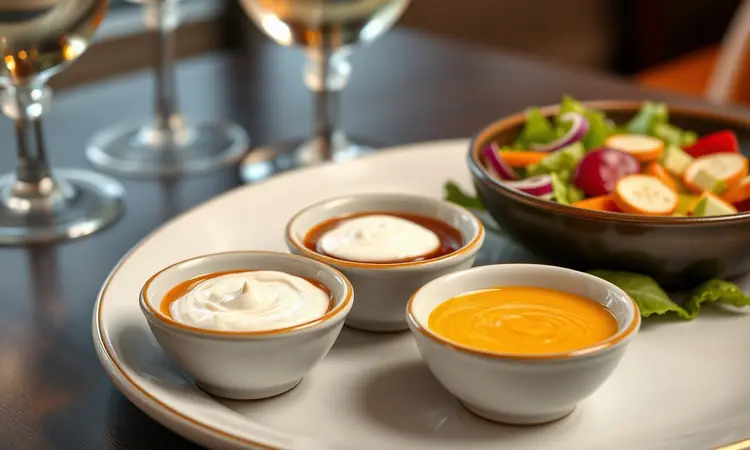

Imagine a frustração: você abre a airfryer esperando encontrar aquelas batatas douradas e crocantes acompanhando uma linguiça suculenta, mas o que vê são batatas murchas e uma carne ressecada. É como se a praticidade da fritadeira elétrica tivesse te pregado uma peça.

Mas não precisa ser assim. Existe uma ciência simples, quase uma mágica, para transformar esses dois ingredientes básicos em uma refeição que parece saída de um restaurante especializado em churrasco. E o melhor: sem virar refém do óleo ou perder horas na cozinha.

Prometo que, ao final deste guia, você não apenas saberá como evitar esses desastres, mas dominará técnicas que transformarão seu almoço em uma experiência que merece ser fotografada.

<SummaryList products={frontmatter.top_products} />

## Por que a linguiça com batata na airfryer é a melhor opção para o dia a dia?

A resposta está em como esse método resgata seu tempo sem roubar o prazer de comer bem. Enquanto métodos tradicionais te mantêm vigiando a panela, a airfryer oferece crocância por fora e suculência por dentro com um simples ajuste de botão.

Você elimina aquele banho de óleo que deixa tudo pesado e ainda reduz o tempo de preparo pela metade.

Para quem corre entre trabalho, filhos e compromissos, essa combinação de batatas macias absorvendo os temperos da linguiça não é apenas uma refeição; é uma solução inteligente.

Com poucos ingredientes e passos mínimos, você cria algo que parece ter exigido horas, quando na verdade foi apenas questão de minutos. É a magia de transformar o simples em especial.

## Ingredientes Essenciais e a Escolha da Linguiça Ideal (Calabresa vs. Toscana)

Tudo começa com a escolha certa, e aqui seu palado é quem manda. A linguiça calabresa traz aquele toque picante e intenso perfeito para dias em que você busca sabores que marcam presença.

Já a toscana, mais suave e aromática, oferece um sabor caseiro que remete àquelas refeições de infância. Ambas funcionam brilhantemente, mas pense nelas como personagens diferentes para a mesma história.

Enquanto isso, as batatas, cortadas em cubos ou rodelas, são a plateia perfeita: absorvem todos os sabores e garantem a textura que faz toda a diferença. Escolher bem esses dois elementos é como garantir que todos os atores estejam no seu melhor para o espetáculo.

## Passo a Passo Detalhado: Como Preparar Linguiça com Batata na Airfryer

Com os ingredientes em mãos, é hora da coreografia perfeita. Comece cortando as batatas em cubos e temperando-as como se estivesse preparando o cenário. Em seguida, acomode linguiças e batatas na cesta da sua airfryer sem amontoar, elas precisam de espaço para respirar.

Ajuste para 200°C e deixe a magia acontecer por cerca de 20 minutos, dando uma sacudida gentil na metade do tempo. Esse movimento simples é o segredo para garantir que cada pedaço receba seu momento de glória, saindo uniformemente dourado e irresistivelmente crocante.

### Preparação das Batatas: O Truque para a Crocância Máxima

O segredo para batatas que fazem barulho ao morder está em um ritual simples de preparação. Escolha variedades como Asterix ou Rosa, que têm a textura ideal. Corte em palitos ou cubos conforme sua preferência, mas depois mergulhe em água por pelo menos 30 minutos.

Essa etapa remove o excesso de amido que pode sabotar o crocante. Depois, seque cada pedaço com cuidado usando um pano limpo, a umidade é inimiga da crocância perfeita. Finalize com um fio de azeite e seus temperos favoritos.

Pense nisso como preparar um atleta para a competição: quanto melhor o aquecimento, melhor o desempenho.

### Configuração de Tempo e Temperatura: O Guia Definitivo

200°C por 15 a 20 minutos não são apenas números, são a fórmula para sucesso consistente. Essa temperatura é o ponto ideal onde a gordura da linguiça se derrete lentamente enquanto as batatas desenvolvem sua crosta dourada.

O tempo varia conforme a espessura dos ingredientes, mas a metade do caminho é seu momento de intervenção: uma sacudida na cessa garante que cada lado receba sua dose de calor.

Lembre-se que cada airfryer tem sua personalidade; algumas são um pouco mais apressadas, outras mais pacientes. Ficar de olho nesses minutos finais é como assistir o ouro se formar no forno.

## Melhores Modelos de Air Fryer para Resultados Perfeitos

<ProductBox 
  title={frontmatter.top_products[0].title} 
  image={frontmatter.top_products[0].image} 
  link={frontmatter.top_products[0].link} 
/>

Ter a ferramenta certa transforma o processo de cozinhar de obrigação em prazer.

O Electrolux Family Efficient (EAF50) com seus 5 litros e 1.700 watts é como ter um assistente culinário pessoal, painel intuitivo e 8 receitas pré-programadas que praticamente cozinham por você.

Para famílias menores, a Mondial Family AFN-40-BI oferece o equilíbrio perfeito entre desempenho e custo sem ocupar metade do balcão.

Quando a fome é grande ou as visitas chegam, o Philco Air Fryer Oven 12L PFR2200P combina as funções de airfryer e forno elétrico em um único aparelho que parece feito para festas.

Já o Arno Mega Digital AFD7, apesar de exigir mais espaço, compensa com uma versatilidade que faz você se perguntar como viveu tanto tempo sem ele. Escolher entre eles não é sobre qual é melhor, mas sobre qual se encaixa na sua vida e na sua cozinha.

## Acessórios Indispensáveis que Facilitam o Preparo e a Limpeza

<ProductBox 
  title={frontmatter.top_products[1].title} 
  image={frontmatter.top_products[1].image} 
  link={frontmatter.top_products[1].link} 
/>

Alguns pequenos investimentos transformam sua airfryer de eletrodoméstico em parceira culinária. Formas e bandejas antiaderentes são a diferença entre uma limpeza de cinco minutos e uma luta de meia hora contra resíduos grudados.

Cestos e divisores permitem que você cozinhe batatas e linguiça simultaneamente sem que os sabores se misturem, cada um mantém sua identidade.

Para quem adora variar, grelhas e espetos abrem um mundo de possibilidades além do básico. E o spray borrifador de óleo? Esse pequeno herói garante que cada pedaço receba exatamente o necessário, sem excessos que pesam no prato e na consciência.

Sim, esses itens representam um investimento adicional, mas a praticidade que trazem transforma o ato de cozinhar de tarefa em experiência.

## Variações de Temperos: Da Páprica Defumada ao Alecrim Fresco

Aqui é onde você coloca sua assinatura pessoal no prato. A páprica defumada não apenas adiciona cor, mas transporta o sabor direto para uma churrascaria com seu toque característico de fumaça.

O alecrim fresco, por outro lado, traz o frescor do jardim para sua cozinha, perfumando o ar enquanto tudo cozinha.

Quer surpreender? Um pitada de canela em pó realça os sabores de forma quase secreta, adicionando complexidade sem se anunciar. E por que não misturar tomilho ou manjericão para criar uma sinfonia de ervas que dança no paladar?

Cada tempero é uma oportunidade de contar uma história diferente com os mesmos ingredientes.

## Erros Fatais que Deixam a Linguiça Seca ou a Batata Crua

Alguns deslizes transformam o sonho do jantar perfeito em decepção. Cortar batatas muito grossas enquanto a linguiça está fina é como colocar corredores de diferentes categorias na mesma prova, um termina exausto enquanto o outro nem começou a suar.

Esquecer de pré-aquecer a airfryer é convidar a inconsistência para a festa; cada minuto conta quando se busca perfeição.

Usar pouco óleo ou temperos resulta em um prato que parece ter perdido sua alma, tudo textura sem personalidade. E o pecado capital? Superlotar a cesta. O ar quente precisa circular livremente, como respiração para o processo.

Quando você amontoa os ingredientes, sufoca essa possibilidade e recebe em troca batatas cruas e linguiças secas como lembrança.

## Sugestões de Acompanhamentos e Molhos para Servir

A linguiça com batata já é uma estrela, mas com o elenco certo vira produção premiada. Uma salada fresca de folhas verdes com limão e azeite não apenas adiciona cor ao prato, mas equilibra a riqueza da linguiça com frescor.

Arroz temperado com ervas finas funciona como base neutra que permite os sabores principais brilharem.

Nos molhos, o chimichurri traz a vibração argentina que parece feita sob medida para carnes. Já a combinação de mostarda e mel oferece doçura e pungência em harmonia perfeita.

Para os corações aventureiros, um molho barbecue com seu equilíbrio entre doce, defumado e picante fecha com chave de ouro. Cada acompanhamento é um convite para prolongar o prazer da refeição.

## Informação Nutricional: Uma Opção Mais Saudável que a Fritura

Aqui está a melhor parte: você pode desfrutar desse prazer sem a culpa pós-refeição. A airfryer trabalha com ar quente em alta velocidade, criando crocância com até 80% menos óleo que a fritura tradicional.

Isso significa menos gordura saturada circulando no seu organismo enquanto você saboreia cada mordida.

As batatas, longe do banho de óleo, preservam seus nutrientes naturais, potássio, vitamina C, fibras, que normalmente se perdem na fritura profunda. O resultado é um prato que satisfaz não apenas seu paladar, mas também sua consciência nutricional.

É a prova de que comida gostosa e saudável não são reinos separados, mas parceiros que podem coexistir perfeitamente.

## Perguntas Frequentes (FAQ)

Posso usar qualquer tipo de linguiça? Absolutamente, mas as linguiças com um pouco mais de gordura tendem a ficar mais suculentas na airfryer, já que a gordura ajuda a manter a umidade durante o cozimento.

Qual o melhor formato para cortar as batatas? Palitos, cubos ou rodelas, tudo funciona. A chave é manter os pedaços com tamanho similar para que cozinhem uniformemente. Cubos menores ficam mais crocantes, enquanto palitos oferecem aquela textura clássica que todos amam.

Como dar mais sabor às batatas? Temperar antes de cozinhar é fundamental. Alho em pó, páprica, alecrim seco ou suas ervas favoritas misturadas com um fio de azeite criam uma camada de sabor que se transforma em crosta durante o cozimento.

O tempo de 20 minutos é fixo? Funciona como uma diretriz geral, mas cada airfryer tem suas particularidades. Comece verificando na marca dos 15 minutos, se já estiverem douradas e a linguiça cozida, está pronto.

Se precisar de mais tempo, adicione em intervalos de 3-5 minutos até atingir a perfeição.

## Conclusão

Transformar linguiça com batata em uma refeição memorável na airfryer vai além de seguir uma receita, é sobre dominar uma filosofia culinária que respeita seus ingredientes enquanto respeita seu tempo.

Do momento em que você escolhe entre calabresa e toscana até o instante em que serve com o molho perfeito, cada decisão adiciona uma camada à experiência.

Lembre-se que a crocância das batatas começa no corte e no molho, que a suculência da linguiça depende do espaço na cesta, e que os temperos são sua voz pessoal nesse diálogo gastronômico.

Mais importante: essa não é apenas uma maneira mais rápida de cozinhar, mas uma maneira mais inteligente, onde saúde, sabor e praticidade finalmente se encontram na mesma mesa.

Agora é sua vez. Escolha sua linguiça, corte suas batatas, ajuste sua airfryer e prepare-se para receber elogios. Porque quando você entende a ciência por trás da simplicidade, cada refeição se transforma em celebração.