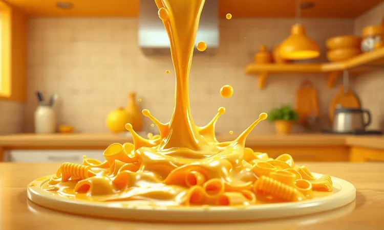

Imagine chegar em casa após um dia cansativo e, em vez de enfrentar uma cozinha bagunçada com panelas sujas, você conseguir preparar um prato reconfortante em minutos. É exatamente essa promessa que torna o macarrão na air fryer tão especial.

Não se trata apenas de praticidade, mas da possibilidade real de transformar ingredientes simples em refeições memoráveis sem o esforço tradicional.

Neste guia, você vai descobrir como dominar essa técnica, desde os segredos da textura perfeita até as ferramentas que fazem toda diferença.

<SummaryList products={frontmatter.top_products} />

## Afinal, é possível cozinhar macarrão na Air Fryer?

A resposta é um sim entusiástico, mas com uma ressalva importante. Ao contrário da fervura tradicional que envolve água, a air fryer trabalha com ar quente circulante, criando texturas diferentes que podem surpreender positivamente.

O segredo está em entender essa diferença e adaptar seu método. Quando você aceita que o resultado não será idêntico ao do fogão, mas pode ser igualmente delicioso (e às vezes até melhor), abre-se um mundo de possibilidades.

Pense nisso como aprender um novo dialeto culinário: uma vez que você domina as regras básicas, consegue criar maravilhas.

## Precisa cozinhar o macarrão na água antes de ir para a fritadeira?

Essa dúvida revela uma preocupação fundamental sobre a jornada culinária na air fryer. A verdade é que depende menos de uma regra rígida e mais do resultado que você busca.

Para massas instantâneas ou pré-cozidas, você pode ir direto ao eletrodoméstico e obter uma crocância satisfatória. Já o macarrão seco convencional pede um breve encontro com a água fervente primeiro.

Essa etapa curta de pré-cozimento garante que o interior fique macio enquanto o ar quente trabalha na camada externa, criando aquela combinação perfeita de suculência interior e superfície convidativa. É o equilíbrio que transforma o prático em excepcional.

## Receita de Macarrão Cremoso na Air Fryer em 15 Minutos

Aqui está onde a promessa se torna realidade concreta. Em apenas 15 minutos, você vai criar um macarrão que parece ter horas de preparo. A magia acontece quando a pressa encontra a técnica certa.

### Ingredientes Necessários para a Base Suculenta

Comece com 250g de macarrão penne ou fusilli, formatos que abraçam os molhos como velhos amigos. Escolha seu molho preferido, seja um tomate caseiro que remete à infância ou um pesto vibrante que desperta os sentidos.

Não subestime o poder dos temperos: sal, pimenta-do-reino e um punhado de ervas frescas transformam o simples em especial. Finalmente, o queijo ralado não é mero acabamento, mas a promessa da crocância dourada que todos nós amamos.

Esses ingredientes conversam entre si na air fryer, criando uma sinfonia de sabores.

### Passo a Passo: O Segredo da Montagem em Camadas

A montagem em camadas é o ritual que separa o bom do memorável. Imagine construir um prato como quem constrói confiança. Comece com o macarrão já cozido, que aguarda pacientemente sua transformação.

Em uma tigela, misture o molho escolhido, sentindo o aroma que começa a tomar forma. Agora, na forma da air fryer, inicie a coreografia: uma camada de massa, um véu de molho, talvez alguns vegetais para cor e textura.

Repita esse abraço de sabores, terminando com uma generosa cobertura de queijo que promete um gratinado perfeito. Essa estrutura cuidadosa garante que cada garfada seja uma experiência completa e não apenas uma mistura aleatória.

## Macarrão com Molho de Tomate Rústico: Versão Saudável e Rápida

Às vezes, a simplicidade é a mais sofisticada das escolhas. Esta versão resgata a essência da cozinha italiana enquanto abraça a praticidade moderna.

Os tomates frescos não são apenas ingredientes, mas convidados de honra que trazem doçura natural e nutrientes que alimentam corpo e alma.

A cebola e o alho dançam no refogado até liberarem seus aromas fundamentais, enquanto as ervas frescas adicionam notas que elevam o comum ao extraordinário.

O resultado é um prato que nutre sem pesar, que satisfaz sem culpa, e que prova que saudável e saboroso não são conceitos opostos, mas parceiros perfeitos.

## 5 Dicas de Especialista para o Macarrão não Ficar Seco ou Duro

1. **Cozinhe al dente antes**: O calor intenso da air fryer continua trabalhando mesmo após você desligá-la. Começar com a massa já próxima do ponto ideal evita que ela fique borrachuda.

2. **Abrace a gordura boa**: Um fio de azeite ou uma colher de manteiga após o cozimento não é excesso, é carinho. Essa camada protege a massa da desidratação e carrega os temperos.

3. **Temperos líquidos são aliados**: Caldos e molhos adicionam umidade enquanto infundem sabor. Eles são o segredo para um macarrão que é suculento por dentro.

4. **Mantenha o movimento**: Pausas para mexer garantem que cada pedaço receba a mesma atenção do ar quente, criando uniformidade sem pontos queimados.

5. **Cubra para proteger**: Nos primeiros minutos, uma cobertura de papel alumínio age como uma incubadora de vapor, criando o ambiente úmido perfeito para o cozimento inicial.

Essas dicas não são apenas técnicas, são gestos de cuidado que transformam o processo em ritual.

## Melhores Formatos de Massa para Usar na Air Fryer (Penne, Fusilli e outros)

A escolha do formato é como escolher o parceiro de dança certo. O penne, com seus tubos ocos, segura o molho em cada cavidade, garantindo que nenhuma mordida fique desamparada de sabor.

O fusilli, em suas elegantes espirais, oferece múltiplas superfícies para o ar quente trabalhar, criando texturas interessantes que divertem o paladar.

Massas recheadas como ravióli ou tortellini tornam-se pequenos pacotes de surpresa que mantêm seu segredo cremoso até o momento exato da mordida.

Cada formato traz sua personalidade para a air fryer, provando que a diversidade é o tempero não apenas da vida, mas também da cozinha prática.

## Utensílios Essenciais para Facilitar sua Receita

As ferramentas certas transformam o esforço em fluidez. Uma tigela ampla permite misturar os ingredientes sem a tensão de respingos, enquanto uma espátula de silicone torna a incorporação um gesto suave.

Mas o verdadeiro protagonista é o recipiente que vai direto à air fryer: precisa suportar o calor intenso sem trair sua confiança. Quando esses elementos se alinham, o processo culinário deixa de ser uma série de tarefas e se torna uma coreografia elegante.

### Melhores Modelos de Air Fryer com Cesto Antiaderente

<ProductBox 
  title={frontmatter.top_products[0].title} 
  image={frontmatter.top_products[0].image} 
  link={frontmatter.top_products[0].link} 
/>

Escolher sua air fryer é como escolher um parceiro de cozinha. O Cosori CP158-AF oferece uma relação qualidade-preço que acalma o bolso sem comprometer resultados.

Já a Philips Airfryer Série 2000 XL conversa com você através de sua interface intuitiva, eliminando a curva de aprendizado que às vezes atrapalha a criatividade.

Se sua família é numerosa ou você ama preparar porções generosas, a Oster OFRT520 com seus 4,6 litros é a amplitude que você precisa. Para quem busca economia inteligente, a Mondial AF-30-DI combina painel digital e cesto Durflon em um pacote acessível.

Esses modelos compartilham uma característica fundamental: o revestimento antiaderente que transforma a limpeza de uma obrigação cansativa em um gesto rápido, para que você possa focar no que realmente importa, que é cozinhar.

### Formas de Silicone Reutilizáveis para Air Fryer

<ProductBox 
  title={frontmatter.top_products[1].title} 
  image={frontmatter.top_products[1].image} 
  link={frontmatter.top_products[1].link} 
/>

Essas formas são os aliados silenciosos que elevam qualquer receita. Feitas de silicone de grau alimentício, elas resistem ao calor intenso enquanto protegem seus alimentos com sua superfície antiaderente gentil.

Imagine não precisar mais raspar resíduos teimosos do cesto, mas simplesmente lavar uma forma suave sob a torneira.

Além da praticidade óbvia, elas representam uma escolha consciente: sustentáveis onde as descartáveis criam lixo, econômicas onde outras opções exigem substituição constante.

Elas adaptam-se a bolos, tortas, muffins, carnes e legumes, provando que versatilidade não é apenas sobre quantidade de receitas, mas sobre qualidade de experiência.

### Travessas Refratárias de Vidro que Cabem na Fritadeira

<ProductBox 
  title={frontmatter.top_products[2].title} 
  image={frontmatter.top_products[2].image} 
  link={frontmatter.top_products[2].link} 
/>

O vidro na air fryer parece uma combinação improvável que funciona de maneira surpreendente. Quando você escolhe vidro temperado ou borossilicato, está escolhendo material que enfrenta altas temperaturas sem vacilar.

O segredo está na verificação simples: o recipiente não pode obstruir a dança do ar quente dentro do cesto. Essa circulação livre é o que garante que cada pedaço de macarrão receba atenção uniforme.

Apenas lembre-se de evitar mudanças bruscas de temperatura que estressam qualquer material. Com esse cuidado básico, essas travessas tornam-se janelas transparentes para seu prato em preparação, permitindo que você monitore o progresso sem interromper o processo.

## Erros Comuns ao Fazer Macarrão na Air Fryer e Como Evitá-los

Cada erro é uma lição disfarçada. Pular o pré-cozimento da massa tradicional é como tentar construir uma casa sem alicerce: o resultado pode ficar em pé, mas falta solidez.

Esquecer o azeite ou manteiga é negar à massa o abraço necessário para enfrentar o calor intenso sem ressecar. Colocar porções excessivas é criar uma multidão onde deveria haver espaço para cada elemento respirar e desenvolver seu potencial.

A distribuição uniforme na cesta não é mera estética, mas a garantia de que o calor circule como deve, concedendo a cada pedaço sua crocância merecida. Reconhecer esses pontos de atenção transforma tentativas em conquistas.

## Perguntas Frequentes (FAQ)

As dúvidas são sinais de curiosidade, não de incapacidade. Sim, alguns macarrões funcionam melhor que outros: enquanto penne e fusilli são aliados confiáveis, espaguetes finos podem resistir ao método.

O tempo de cozimento varia como varia o apetite: entre 180°C e 200°C por 10 a 15 minutos é um excelente ponto de partida, mas sua observação pessoal é o guia definitivo.

Verificar o ponto antes de servir não é falta de confiança na receita, mas respeito pelo processo e pelos ingredientes. Cada air fryer tem sua personalidade, e aprender a dela é parte da jornada.

## Conclusão

Quando você começou a ler este guia, talvez duvidasse que uma refeição reconfortante pudesse nascer de um eletrodoméstico associado à praticidade fria.

Agora você tem não apenas as receitas, mas o entendimento profundo de como transformar massa seca em 'comfort food' através de gestos simples e escolhas inteligentes.

A verdadeira versatilidade da air fryer não está na quantidade de pratos que pode preparar, mas na maneira como devolve seu tempo e energia.

Ela permite que o prazer de cozinhar coexista com a realidade acelerada dos dias modernos, provando que sabor e praticidade podem dançar juntos.

Seu próximo macarrão na air fryer não será apenas uma refeição rápida, mas uma declaração de que é possível alimentar corpo e alma sem sacrificar horas preciosas. Experimente, adapte, compartilhe.

A cozinha está esperando por você, e as possibilidades são tão infinitas quanto sua criatividade.