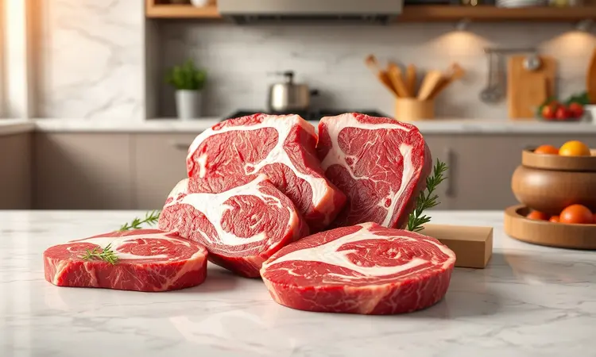
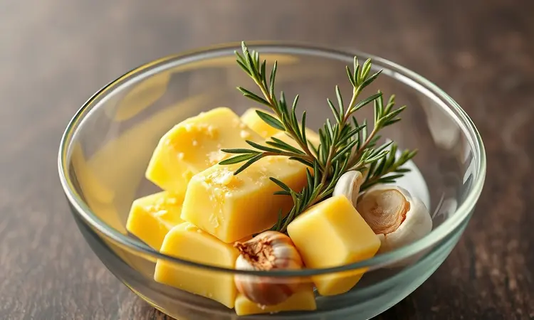
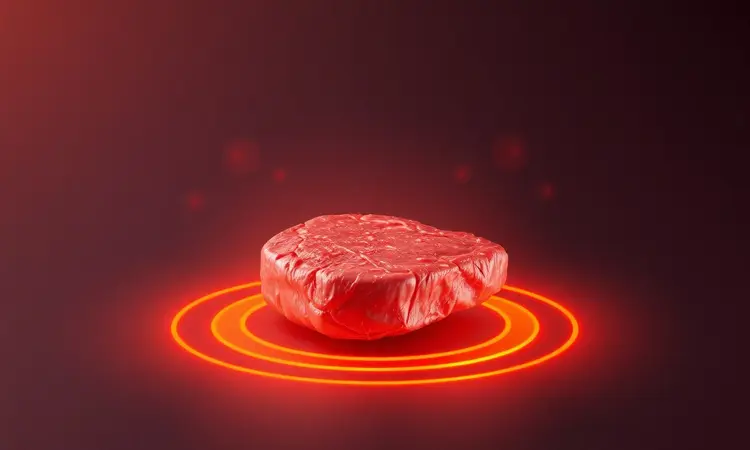
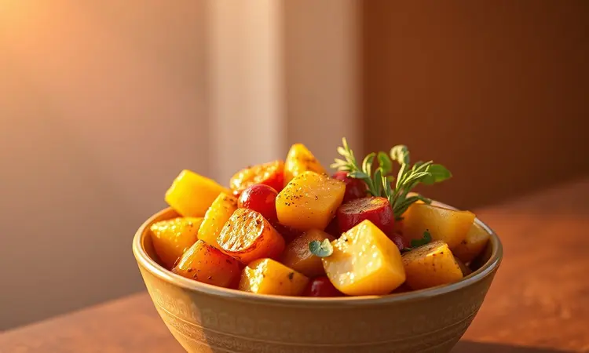

Se você acredita que uma maminha suculenta só nasce da churrasqueira ou do forno tradicional, prepare-se para um novo amanhecer culinário.

A airfryer guarda um segredo que transforma seu dia a dia: sim, é possível conseguir aquele resultado profissional, com carne macia e crocante por fora, sem a bagunça e o trabalho de métodos convencionais. E o melhor? Você está a alguns passos de dominar essa arte.

<SummaryList products={frontmatter.top_products} />

## Maminha na Airfryer: O Guia Definitivo para uma Carne Suculenta e Macia

Imagine abrir a airfryer e se deparar com uma maminha dourada por fora, perfumando toda a cozinha, e por dentro, tão suculenta que os sucos escorrem ao primeiro corte.

Essa magia não exige horas de preparo nem habilidades sobrenaturais, apenas um entendimento simples sobre como tempo e temperatura trabalham juntos para criar texturas perfeitas.

O que você vai encontrar aqui é mais que uma receita: é a liberdade de preparar um jantar digno de restaurante em uma terça-feira comum.

### Por que preparar maminha na airfryer vale a pena?

A resposta está na economia de tempo que se transforma em qualidade de vida. Enquanto uma churrasqueira demanda supervisão constante e um forno tradicional esquenta toda a cozinha, a airfryer trabalha por você, distribuindo calor com precisão cirúrgica.

O resultado é uma crosta irresistível que se forma naturalmente, sem banhos de óleo, e um interior que mantém a umidade presa entre as fibras da carne. A praticidade vai além do cozimento limpeza rápida significa mais tempo para saborear, menos tempo esfregando panelas.

Esse método transforma seu ritual culinário numa experiência quase mágica: você coloca a carne na cesta, ajusta tempo e temperatura, e quando o alarme toca, abre a porta para encontrar não apenas um prato, mas uma conquista pessoal.

### Como escolher a melhor peça de maminha para assar

O segredo começa antes mesmo de ligar a airfryer, nas mãos do açougueiro. Procure por aquela peça com gordura entremeada, aquelas finas linhas brancas que serpenteiam pela carne vermelha intensa.

É essa gordura que, durante o cozimento, vai derreter lentamente, banhando cada fibra muscular e garantindo a suculência que faz você fechar os olhos ao mastigar.

O peso ideal gira entre 1,5kg e 2,5kg peças menores podem secar rápido demais, enquanto as maiores podem não cozinhar uniformemente. Mas mais que números, confie na aparência: carne com cor vibrante, gordura firme e branca, e um aroma puro e limpo.

Quando encontrar aquela peça que parece prometer sabor só de olhar, você saberá que metade do trabalho já está feito.

## Ingredientes Necessários para a Maminha Perfeita

Você precisa de menos do que imagina para criar algo extraordinário. Comece com aproximadamente 1kg daquela maminha bem escolhida. Sal e pimenta são seus aliados fundamentais, mas não tenha medo de ser generoso.

Alho picado não é apenas tempero, é perfume que impregna a carne por dentro. Erbas como alecrim e tomilho trazem notas de jardim que contrastam com a riqueza da carne.

Um fio de azeite ajuda a criar aquela crosta dourada que estala nos dentes.

E se quiser elevar ainda mais o sabor, pense numa marinada simples: mostarda que acrescenta profundidade, molho shoyu que traz um toque umami, ou vinho tinto que amacia as fibras enquanto impregna sabor.

O segredo não está na quantidade de ingredientes, mas na intenção com que você os combina.

## Passo a Passo: Modo de Preparo Detalhado

Comece conversando com a carne, massageando o tempero em cada centímetro. Enquanto ela descansa absorvendo esses sabores, preaqueça sua airfryer a 200°C. Quando a temperatura estiver perfeita, coloque a maminha na cesta e deixe a mágica acontecer por 25 a 30 minutos.

A meio caminho, quando sua cozinha já estiver cheirando a festa, vire a carne para que cada lado receba seu momento dourado.

### O segredo do tempero: Manteiga, alho e ervas finas

Aqui vive uma das grandes revelações culinárias: manteiga derretida misturada com alho picado e um punhado de ervas finas não é apenas um tempero, é um abraço para a carne.

Essa combinação cria uma segunda pele sobre a maminha, uma camada protetora que sela os sucos internos enquanto forma uma crosta aromática que se desfaz na boca.

Aplique esta mistura generosamente, deixando que escorra pelas laterais, penetrando em cada dobra. O alho carameliza, as ervas liberam seus óleos essenciais, e a manteiga... ah, a manteiga faz o que sempre fez melhor: transforma o bom em sublime.

### Melhores modelos de Airfryer para assar carnes grandes

<ProductBox 
  title={frontmatter.top_products[0].title} 
  image={frontmatter.top_products[0].image} 
  link={frontmatter.top_products[0].link} 
/>

Se você realmente quer fazer da airfryer sua aliada para cortes maiores, alguns modelos entendem particularmente bem essa missão.

O Oster OFRT780, com seus 12 litros e função Rotisserie, gira a carne como um churrasqueiro profissional, garantindo cozimento uniforme em 360 graus.

Já o Mondial AFO-12L oferece o mesmo espaço generoso com múltiplas funções que transformam um eletrodoméstico numa estação culinária completa.

Para quem prefere o formato de forno, a Electrolux Air Fryer Oven EAF90 e a Philco PFR2200P trazem a praticidade de assar, gratinar e até dourar, tudo num único aparelho.

E se seu coração bate pelo churrasco, o WAP Barbecue Digital FW00962 foi feito pensando exatamente no sabor defumado que você ama. A escolha certa não é sobre qual tem mais botões, mas qual se adapta ao espaço da sua cozinha e aos sonhos do seu paladar.

## Guia de Tempo e Temperatura para cada Ponto da Carne

Aqui mora a ciência que serve à arte. Para quem gosta do contato íntimo com o sabor puro da carne, 15 a 18 minutos a 180°C entregam um mal passado que ainda sussurra sobre a vida.

Se seu equilíbrio preferido é aquele onde suculência e cozimento se abraçam, 18 a 22 minutos no mesmo calor criam o ponto perfeito. E para os amantes da tradição bem passada, 22 a 25 minutos garantem que cada fibra tenha recebido seu momento de transformação.

Independente do caminho escolhido, a pausa final antes de servir é não é opcional, é parte essencial do ritual.

### Como usar um termômetro de carne para garantir a maciez

<ProductBox 
  title={frontmatter.top_products[1].title} 
  image={frontmatter.top_products[1].image} 
  link={frontmatter.top_products[1].link} 
/>

Um termômetro de carne é o seu olho dentro da cozinha, a garantia de que a ciência está trabalhando a seu favor. Modelos digitais falam rápido, entregando a verdade térmica em segundos.

Insira a ponta no centro da carne, evitando ossos e bolsas de gordura que contam histórias diferentes.

Aqui estão os números que traduzem desejo em realidade: 50°C a 55°C para o rubor vibrante do mal passado, 69°C em diante para a segurança reconfortante do bem passado.

Quando o alarme do termômetro cantar a temperatura perfeita, resista ao impulso de cortar imediatamente.

Aqueles 5 a 10 minutos de descanso não são espera, são o momento onde a mágica final acontece os sucos que fugiram para as bordas durante o cozimento retornam, banhando cada fibra.

## O truque de mestre: Por que você deve deixar a carne descansar?

Cortar a carne imediatamente após sair da airfryer é como abrir um presente antes de terminar de embrulhá-lo. Durante o cozimento, os sucos fogem para as extremidades, fugindo do calor central.

Se você ataca com a faca nesse momento, esses preciosos líquidos escorrem pelo prato, deixando para trás apenas fibra seca.

Mas quando você tem paciência para aqueles 5 a 10 minutos de descanso, algo quase milagroso acontece. Os sucos, percebendo que o perigo térmico passou, retornam calmamente, redistribuindo-se por toda a carne.

É nesse intervalo silencioso que a maminha atinge sua plenitude de sabor, textura e suculência. Além disso, permite que a temperatura interna se estabilize, garantindo que cada fatia chegue à sua boca na condição perfeita.

Essa espera não é tempo perdido, é o ingrediente secreto que transforma comida em experiência.

## 5 Erros comuns que deixam a maminha dura na airfryer

O primeiro pecado é o excesso de zelo com a temperatura. Mais calor não significa melhor, apenas carne seca e fibrosa. O segundo, já mencionado, é a impaciência com o descanso cortar cedo é desperdiçar suculência.

O terceiro erro vem do medo de gordura, escolhendo peças muito magras que não tem como manter umidade durante o cozimento. O quarto está no tempero tímido, sem sal suficiente para realçar os sabores naturais da carne.

E o quinto, muitas vezes ignorado, é esquecer que a airfryer precisa de espaço para circular ar, amontoar a cesta impede o fluxo de ar que cria a crosta perfeita.

### A importância de uma faca afiada para o corte correto contra a fibra

<ProductBox 
  title={frontmatter.top_products[2].title} 
  image={frontmatter.top_products[2].image} 
  link={frontmatter.top_products[2].link} 
/>

Sua faca não é apenas uma ferramenta, é a ponte entre a obra de arte culinária e seu prazer pessoal. Uma lâmina afiada desliza através das fibras da carne, não as esmaga nem rasga.

Quando você corta contra a fibra (perpendicularmente às linhas longas da carne), está encurtando essas fibras musculares, garantindo que cada mordida seja um momento de derretimento, não de trabalho mastigatório.

O movimento limpo de uma faca bem afiada preserva os sucos dentro da carne, não os expulsa. E mais que eficiência culinária, há segurança: uma faca cega exige mais força, aumentando o risco de escorregar e acidentes.

Investir numa boa faca e mantê-la afiada não é luxo, é respeito pelos ingredientes que você escolheu e pelo tempo que dedicou à sua criação. É o gesto final que transforma preparo em apresentação.

## Melhores acompanhamentos para maminha assada

Uma maminha perfeita merece companhias que complementem sem competir. Arroz à grega é o abraço reconfortante, trazendo a textura macia que contrasta com a crocância da carne.

Legumes assados batatas, cenouras, abobrinhas caramelizadas pelo mesmo calor da airfryer não são apenas acompanhamento, são extensão do banquete, trazendo cores que cantam no prato.

Uma salada de folhas verdes com um molho leve de limão e azeite oferece o frescor necessário para limpar o paladar entre uma fatia e outra.

E para os que acreditam que a carne fala portunhol, o chimichurri argentino é a conversa perfeita: salsa, orégano, alho e vinagre criam uma sinfonia de sabores que dançam com a riqueza da maminha.

Cada acompanhamento não é apenas uma adição, é um capítulo da história que você está servindo.

## Perguntas Frequentes (FAQ) sobre Maminha na Airfryer

Quanto tempo realmente leva? Entre 20 e 30 minutos a 200°C, dependendo do ponto desejado e do tamanho da peça. Use os primeiros minutos para criar crosta, depois ajuste conforme precisar.

Preciso marinar? Não é obrigatório, mas algumas horas numa marinada simples transformam o sabor de dentro para fora, amaciando as fibras enquanto adicionam camadas de sabor.

Como conseguir aquela crosta perfeita? Um toque de azeite antes de assar e não abrir a airfryer nos primeiros 10 minutos são os segredos para desenvolver aquela casca dourada que estala nos dentes.

Posso usar congelada? Melhor não. Descongele completamente na geladeira antes, garantindo cozimento uniforme e evitando que o exterior queime enquanto o interior ainda está gelado.

E se não tiver termômetro? Use o teste do toque: carne macia ao pressionar (como a parte carnuda da mão abaixo do polegar) indica mal passado; firmeza média é ao ponto; mais resistente é bem passada. Mas considere um termômetro seu aliado infalível.

## Conclusão

O que começou como dúvida sobre um eletrodoméstico se transformou na descoberta de um novo território culinário. A airfryer não é apenas um atalho para dias apressados, é uma ferramenta que, quando compreendida, expande suas possibilidades na cozinha.

A maminha suculenta e macia que você imaginava reservada para feriados e visitas especiais agora mora no seu dia a dia, pronta para transformar terças-feiras comuns em pequenas celebrações.

Cada passo deste guia desde a escolha da peça no açougue até o momento de repouso antes de cortar não é apenas técnica, é parte de um ritual que reconecta você com o prazer simples de preparar comida de verdade.

Os tempos e temperaturas são mapas, mas seu paladar é a bússola. A próxima vez que pensar em maminha, não imagine apenas a carne, imagine o aroma que tomará sua cozinha, o som da crosta se partindo, o brilho dos sucos escorrendo.

E então, coloque a airfryer para trabalhar, porque uma refeição memorável não deveria esperar por ocasiões especiais. Ela deveria ser a ocasião.