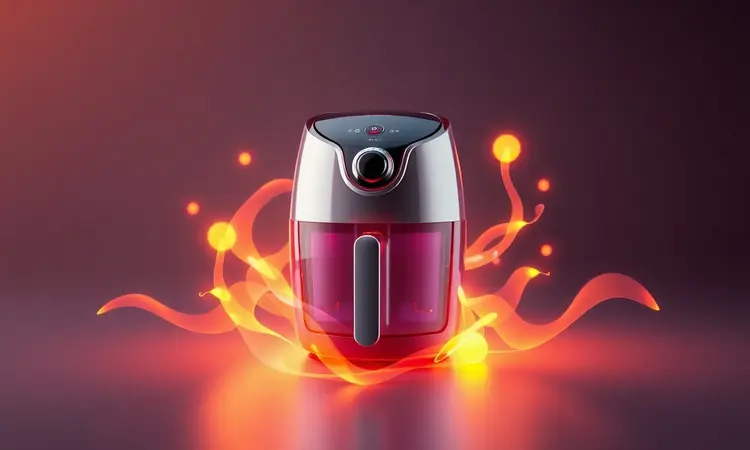
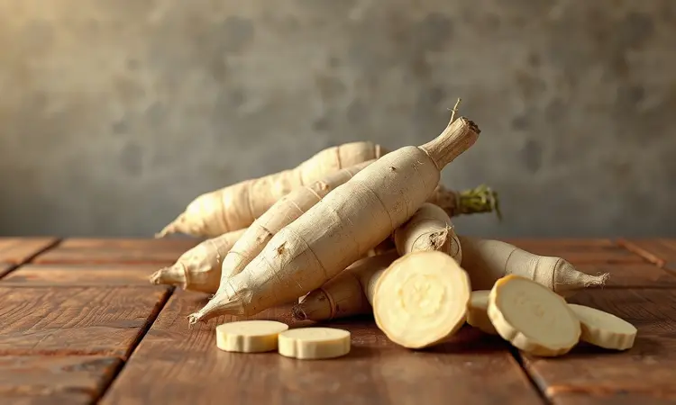
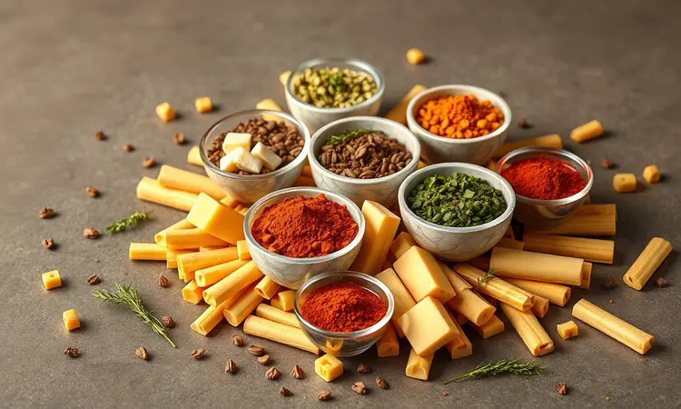
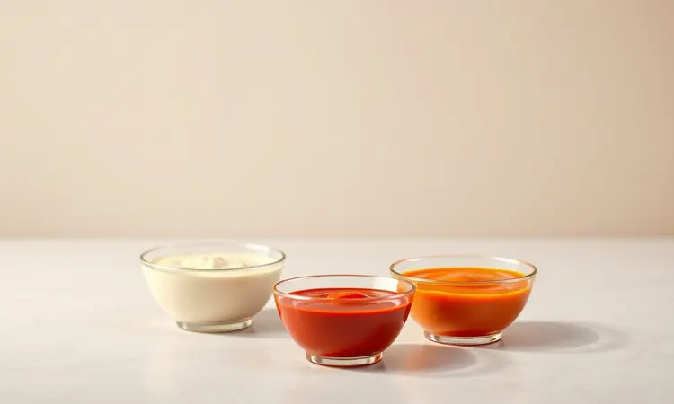

Você adora mandioca frita, mas quer evitar a sujeira do óleo e as calorias extras da fritura por imersão? Você não está sozinho.

Conseguir aquela textura perfeita, dourada por fora e derretendo por dentro, na fritadeira elétrica pode parecer um desafio, mas existe um método infalível.

Neste guia completo, vamos revelar os segredos para preparar a melhor mandioca (aipim ou macaxeira) na Air Fryer, desde a escolha do ingrediente até o truque do cozimento prévio que garante a crocância máxima. Prepare-se para elevar o nível dos seus petiscos saudáveis.

<SummaryList products={frontmatter.top_products} />

## Por que Fazer Mandioca na Air Fryer é a Melhor Opção?

Imagine satisfazer aquela vontade de um petisco crocante sem precisar encarar a sujeira do óleo quente nem a culpa depois. É exatamente isso que você ganha ao preparar mandioca na air fryer.

O método não apenas entrega uma textura sequinha e dourada, mas transforma o que antes era um 'pecado' culinário em uma escolha inteligente para o dia a dia. É praticidade que cabe na sua rotina e bem-estar que você sente no corpo.

### Benefícios para a Saúde: Menos Gordura, Mais Sabor

Você já percebeu como os fritos tradicionais deixam aquela sensação pesada? Com a air fryer, essa experiência muda completamente.

Usando apenas ar quente para criar o crocante perfeito, você reduz drasticamente a gordura enquanto preserva (ou até realça) o sabor natural da mandioca. E não se trata apenas de evitar o excesso de óleo.

A mandioca em si é uma fonte rica de fibras, vitaminas e minerais essenciais, que trabalham em conjunto para oferecer energia sustentável e nutrição de verdade.

O resultado é uma combinação que seu paladar e sua saúde agradecem: menos peso na consciência, mais prazer no momento.

## Como Escolher a Melhor Mandioca (Aipim ou Macaxeira)

A qualidade do seu prato final começa bem antes da air fryer ser ligada. A escolha certa da mandioca decide entre um resultado mediano e aquele que faz você fechar os olhos de satisfação.

Procure raízes com casca lisa, sem manchas escuras ou partes murchas, que são sinais claros de frescor. Ao cortá-la, a parte interna deve aparecer firme e uniforme.

Se você tem a opção entre aipim e macaxeira, pense no perfil de sabor que mais combina com você. O aipim traz uma maciez natural e um toque adocicado que derrete na boca, perfeito para quem busca conforto.

Já a macaxeira oferece textura mais firme, mantendo uma presença interessante em cada mordida. Independentemente da escolha, priorizar a frescura garante que cada pedaço fique irresistível depois do tempo na air fryer.

## O Segredo da Crocância: Precisa Cozinhar Antes de Fritar?

Aqui está o segredo que separa uma mandioca aceitável daquela que faz sucesso: o pré-cozimento. Cozinhar a mandioca parcialmente antes de levá-la à air fryer é como garantir um contrato com o sucesso.

Esse passo extra assegura que o interior fique macio e cremoso enquanto o exterior atinge a crocância dourada que você tanto deseja.

Para quem está com pressa, é possível pular essa etapa e usar a mandioca crua, mas os resultados tendem a ser menos previsíveis. Uma dica valiosa para qualquer método: corte os pedaços em tamanhos uniformes e deixe-os de molho em água por algumas horas.

Essa prática simples remove o excesso de amido, permitindo que o ar quente trabalhe com mais eficiência, criando aquela crocância que estala entre os dentes.

## Receita Passo a Passo: Mandioca Frita na Air Fryer Super Prática

Agora vamos transformar teoria em experiência prática. Cozinhe a mandioca até que ela esteja macia (mas ainda com firmeza), corte em pedaços generosos, tempere com seus favoritos e distribua na air fryer pré-aquecida a 200°C.

Em cerca de 20 minutos, mexendo na metade do tempo para garantir douração uniforme, você terá um petisco que rivaliza com qualquer fritura tradicional.

### Ingredientes e Utensílios Necessários

Reunir os elementos certos é metade do caminho andado. Além da mandioca fresca e firme que você já escolheu com cuidado, tenha à mão um bom azeite ou óleo vegetal de qualidade, que será responsável por dar aquele brilho e crocância perfeitos.

Os temperos são onde sua personalidade entra: sal, pimenta-do-reino, páprica (doce ou defumada), ou qualquer combinação que fale com seu paladar.

Quanto aos utensílios, uma faca afiada e uma tábua estável garantem cortes precisos, enquanto a própria air fryer se encarrega da mágica. Tudo pronto para começar.

### Melhores Modelos de Air Fryer para Receitas Crocantes

<ProductBox 
  title={frontmatter.top_products[0].title} 
  image={frontmatter.top_products[0].image} 
  link={frontmatter.top_products[0].link} 
/>

Se você está investindo nessa experiência ou quer otimizar a que já tem, conhecer os modelos certos faz toda diferença. Em 2023, algumas opções se destacaram pelo equilíbrio entre performance e praticidade.

A Philips Walita Série 3000 RI9252, com 1400W de potência e 4,1 litros de capacidade, oferece operação silenciosa e controles digitais intuitivos que praticamente adivinham o que você precisa.

Para quem busca design e funcionalidade, a Mondial AFN-40-BI, em aço inox com 3,5 litros, permite ajustes precisos de temperatura entre 80 e 200 graus, ideal para encontrar o ponto perfeito da mandioca.

Já o Oster OFRT590 traz versatilidade com suas 10 funções digitais e visor removível, facilitando o monitoramento do cozimento.

Cada uma dessas opções se adapta a diferentes necessidades de espaço e rotina, mas todas compartilham uma qualidade: entregam crocância que vale o investimento.

### Modo de Preparo Detalhado

Vamos aos detalhes que garantem a perfeição. Comece descascando a mandioca e cortando-a em pedaços uniformes de 5 a 7 cm, criando uma base consistente para o cozimento.

Cozinhe esses pedaços em água fervente por 10 a 15 minutos, até que estejam macios mas ainda com certa resistência ao garfo. Esse ponto é crucial: muito cozidos, desmancham; pouco cozidos, ficam duros depois.

Após escorrer e secar muito bem (a umidade é inimiga do crocante), tempere numa tigela com sal, pimenta e um fio generoso de azeite, massageando para que cada pedaço absorva o sabor.

Pré-aqueça sua air fryer a 200°C, distribua a mandioca em camada única na cesta e deixe trabalhar por 15 a 20 minutos. Na metade do tempo, dê uma boa sacudida ou vire os pedaços para garantir que todos os lados recebam o calor dourador. O resultado?

Pedaços quentes, dourados e prontos para derreter na boca.

## Variações de Sabor para Impressionar

Agora que você domina o básico, que tal personalizar sua mandioca para criar experiências únicas?

Os temperos são sua tela em branco: páprica defumada para um sabor profundo, alho em pó para um toque robusto, ou queijo parmesão ralado para aquele sabor irresistível que gruda nos dedos. Cada variação transforma o lanche em uma nova descoberta.

### Mandioca com Parmesão e Ervas Finas

Para uma experiência gourmet caseira, experimente a combinação de parmesão e ervas.

Após o cozimento prévio da mandioca, misture os pedaços ainda mornos com queijo parmesão ralado (a versão mais granulada funciona melhor) e uma seleção de ervas frescas como alecrim e tomilho.

O calor residual ajuda a derreter levemente o queijo, criando uma camada saborosa antes mesmo de entrar na air fryer. Quando assados, esses ingredientes se transformam numa crosta aromática que contrasta perfeitamente com o interior cremoso da mandioca.

Sirva como acompanhamento especial ou como o protagonista de um lanche sofisticado.

### Versão Picante com Páprica e Alho

Se você gosta de emoção no paladar, esta versão picante é para você.

Corte a mandioca pré-cozida em palitos ou cubos e envolva-os numa mistura generosa de alho picado (quanto mais fresco, melhor), páprica doce ou picante (ou ambas, para controle do ardor), sal marinho e um fio de azeite que ajudará a fixar os sabores.

Distribua numa única camada na air fryer a 180°C por aproximadamente 20 minutos, mexendo na metade do caminho. O resultado é uma mandioca que entrega camadas de sabor: primeiro o crocante, depois o picante do alho e da páprica, e finalmente a suavidade do interior.

Uma experiência completa em cada mordida.

## Acessórios que Facilitam o Preparo

<ProductBox 
  title={frontmatter.top_products[1].title} 
  image={frontmatter.top_products[1].image} 
  link={frontmatter.top_products[1].link} 
/>

Para elevar ainda mais sua experiência com a air fryer, alguns acessórios podem fazer diferença significativa. Formas e assadeiras específicas não apenas expandem as possibilidades (imagine uma torta de mandioca crocante), mas também garantem resultados mais uniformes.

Grelhas adicionais permitem cozinhar diferentes alimentos simultaneamente, otimizando tempo e energia, enquanto espetos são perfeitos para garantir que cada lado receba calor igualmente.

Um investimento particularmente útil para as receitas de mandioca é o spray borrifador de óleo, que permite aplicar uma camada fina e uniforme sem o risco de excessos que podem tornar os alimentos pesados.

Antes de adquirir qualquer acessório, verifique a compatibilidade com seu modelo específico de air fryer, especialmente no caso de cestos giratórios ou formas especiais.

Essas pequenas adições não apenas simplificam o processo, mas abrem um mundo de possibilidades culinárias que você nem imaginava.

## Dicas de Especialista: Por que minha mandioca ficou dura?

Se sua mandioca saiu da air fryer com textura de pedrinha, não desanime. Geralmente, o problema está no pré-cozimento insuficiente antes de ir para a fritadeira.

A mandioca precisa de tempo suficiente na água quente para amaciar suas fibras internas, criando aquele contraste perfeito: exterior crocante, interior que se desfaz.

Dois outros fatores importantes: o tamanho uniforme dos pedaços (desigualdade significa que alguns estarão prontos enquanto outros permanecem crus) e a quantidade de óleo.

Um fio generoso de azeite é suficiente para criar o dourado perfeito; excesso satura a superfície, impedindo o crocante. Com esses ajustes simples, sua próxima tentativa será aquela mandioca dos sonhos que você compartilha nas redes sociais.

## Melhores Molhos para Acompanhar sua Mandioca

Uma mandioca perfeita merece companhias à altura. O molho certo pode transformar um excelente petisco em uma experiência memorável.

Para um contraste cremoso e aromático, o aioli (essencialmente maionese de alho) é clássico por um motivo: sua textura sedosa abraça cada pedaço, realçando sem competir.

Quem busca calor controlado encontra no molho de pimenta um parceiro ideal, enquanto o barbecue oferece a doçura defumada que contrasta maravilhosamente com a neutralidade da mandioca.

Para momentos mais leves, um molho de iogurte natural com ervas frescas (hortelã, cebolinha, endro) traz frescor e complexidade. Mais do que acompanhamentos, esses molhos são convites para brincar com combinações até descobrir aquela que se torna sua assinatura pessoal.

## FAQ: Perguntas Frequentes sobre Mandioca na Air Fryer

As dúvidas mais comuns aparecem para todos, e ter respostas claras pode fazer a diferença entre o sucesso e a frustração.

### Posso congelar a mandioca já cozida para fritar depois?

Absolutamente. O congelamento inteligente pode ser seu maior aliado na praticidade.

Após cozinhar a mandioca até o ponto perfeito (maciez controlada, não desmanchando), deixe esfriar completamente em temperatura ambiente antes de armazenar em recipientes adequados para freezer.

Quando a vontade bater, descongele na geladeira algumas horas antes ou use a função descongelar do micro-ondas com cuidado. Tempere normalmente e siga para a air fryer. Você terá a mesma qualidade com a conveniência de ter parte do trabalho pré-feito.

### Qual a temperatura ideal para não queimar?

200°C é a temperatura mágica para a maioria das air fryers, criando o equilíbrio ideal entre tempo de cozimento e desenvolvimento do crocante.

Essa temperatura permite que o interior da mandioca amoleça completamente enquanto a superfície atinge aquele dourado perfeito sem escurecer demais. Não se esqueça da etapa fundamental: agitar ou virar os pedaços na metade do tempo de cozimento.

Essa simples ação redistribui o calor, garantindo que todos os lados recebam atenção igual, eliminando pontos queimados ou partes menos cozidas. Controle e consistência são seus melhores amigos aqui.

## Conclusão

A jornada pela mandioca perfeita na air fryer revela mais do que uma simples técnica culinária. Revela uma nova maneira de se relacionar com os alimentos que amamos, mantendo o prazer enquanto cultivamos hábitos mais conscientes.

Você descobriu que é possível ter aquela crocância que estala nos ouvidos e derrete na boca, sem a gordura excessiva, sem a sujeira complicada e, principalmente, sem a culpa que costumava acompanhar os petiscos fritos.

Desde a escolha cuidadosa da mandioca fresca até os toques finais de tempero, cada etapa é uma oportunidade para personalizar, experimentar e se surpreender.

Os acessórios certos ampliam suas possibilidades, as variações de sabor alimentam sua criatividade, e as dicas de especialista garantem que cada tentativa seja melhor que a anterior.

Mais do que uma receita, você agora tem um método confiável para transformar momentos simples em pequenas celebrações.

Experimente. Comece com a versão clássica, depois ouse com as variações, compartilhe com quem você ama. Porque comida boa é sobre conexão, prazer e cuidado.

E sua air fryer acaba de se tornar o portal para muito mais do que apenas mandioca crocante - ela é a porta para descobertas saborosas que combinam com a vida que você quer viver.