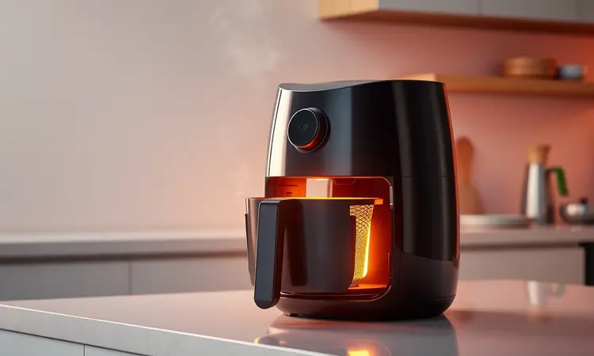
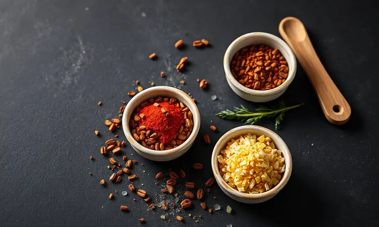
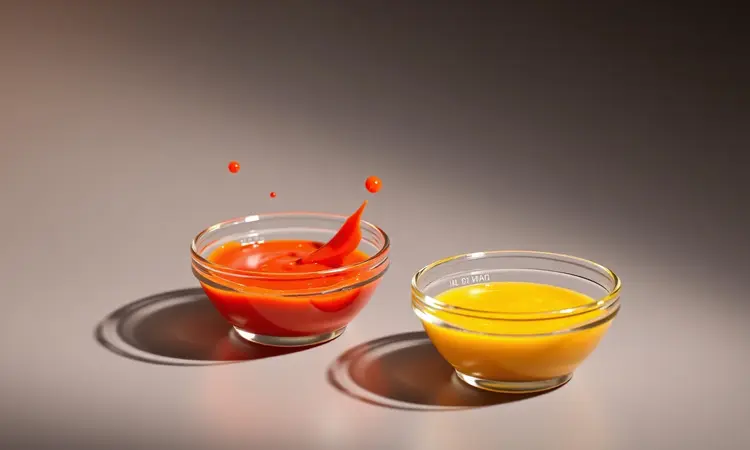

Já aconteceu com você de dedicar tempo preparando asinhas de frango e receber como troféu uma textura borrachuda ou, na tentativa de acertar o ponto, entregar algo mais parecido com um biscoito seco?

A promessa de crocância perfeita parece um segredo guardado a sete chaves pelos restaurantes. Mas a verdade é que existe uma técnica tão simples quanto transformadora.

O que vou compartilhar com você hoje não são apenas instruções, mas o caminho para conquistar aquela pele dourada que estala ao morder, suculenta por dentro e com uma crosta que faz os olhos fecharem de prazer.

Prepare-se para descobrir como uma airfryer pode ser sua melhor aliada nessa missão deliciosa.

<SummaryList products={frontmatter.top_products} />

## Por que fazer asinha de frango na airfryer é a melhor escolha?

Imagine conseguir o mesmo dourado perfeito de uma fritura, mas sem aquela sensação de peso no estômago depois. É exatamente isso que a airfryer oferece.

O aparelho trabalha como uma fornalha de ar quente que circula em alta velocidade, criando uma crosta incrível enquanto cozinha a carne por dentro de forma uniforme.

A praticidade é outro ponto forte: em vez de ficar vigiando uma panela com óleo quente, você simplesmente programa e pode cuidar de outros preparos. A limpeza? A maioria dos modelos tem cestos removíveis e antiaderentes que praticamente se limpam sozinhos.

É a combinação perfeita entre resultado de restaurante e comodidade de quem não quer complicações na cozinha.

## O segredo da pele ultra crocante: O truque do fermento químico

O fermento químico é o ingrediente secreto que faz a diferença entre uma pele aceitável e aquela que faz todo mundo pedir a receita.

Funciona assim: quando você mistura uma colher de chá (para cada quilo de frango) aos seus temperos secos, ele cria minúsculas bolhas de ar na superfície da pele durante o cozimento.

Essas bolhas se expandem no calor, formando uma rede de ar crocante que derrete na boca. É como dar ao seu frango uma leveza de tempurā com a crocância de um churrasco grelhado. Só não exagere na dose, ou o sabor pode ficar alterado.

## Ingredientes essenciais para um tempero marcante

O tempero é a identidade do seu prato. Comece com a dupla clássica: sal grosso moído na hora e pimenta-do-reino fresca, que abrem as portas do sabor. O alho, seja em pó para praticidade ou picado para intensidade, é imprescindível.

Agora imagine o toque de frescor que alecrim ou tomilho podem trazer, especialmente se forem frescos. Para criar aquela caramelização que faz a boca salivar, acrescente uma pitada generosa de açúcar mascavo ou mel.

Finalize com páprica defumada, que além de colorir com um tom terroso lindo, entrega um sabor que lembra churrasco. Misture tudo como se estivesse preparando um presente para seus convidados.

## Passo a passo: Como fazer asinha de frango na airfryer perfeita

Depois de temperar generosamente, pré-aqueça sua airfryer (isso é crucial). Organize as asinhas na cesta sem amontoar, deixe-as assar a 200°C por cerca de 25 a 30 minutos, e vire na metade do tempo para garantir um dourado uniforme.

### 1. Higienização e secagem (Passo crucial)

Todo resultado espetacular começa com um cuidado básico que muitos pulam. Lave as asinhas em água corrente e seque com papel toalha até que fiquem completamente sequinhas. Acredite, cada gota de umidade que você elimina agora se transforma em crocância depois.

É como preparar uma tela para a sua obra-prima: quanto mais limpa e seca, melhor a pintura adere.

### 2. Temperando para garantir sabor e textura

Aqui é onde a mágica acontece antes mesmo do cozimento. Após secar bem, envolva cada asinha na sua mistura de temperos com carinho. Se tiver tempo, deixe marinar por 30 minutos a uma hora na geladeira, especialmente se usar suco de limão, azeite e ervas frescas.

Esse tempo extra permite que os sabores se infiltrem na carne, garantindo que cada mordida seja uma explosão de sabor, não apenas uma camada superficial.

### 3. Tempo e temperatura: O ajuste ideal

O encontro perfeito entre tempo e temperatura é o que separa o dourado do queimado. Pré-aqueça sempre a 200°C (a maioria das airfryers tem essa função).

Os 25 a 30 minutos são uma referência, mas seus olhos são o melhor termômetro: procure por uma cor caramelizada uniforme. Virar na metade do tempo é não negociável, assim como evitar lotar a cesta. Se perceber que estão dourando rápido demais, reduza para 190°C.

## 4 Variações de molhos para acompanhar suas asinhas

O molho é o abraço final que transforma um ótimo prato em memorável.

Do clássico barbecue ao picante buffalo, passando pela elegância do mel e mostarda ou a sofisticação do alho e parmesão, cada opção oferece uma experiência diferente que complementa a crocância conquistada com tanto cuidado.

### Molho Buffalo clássico (Apimentado e viciante)

Derreta manteiga em fogo baixo e acrescente molho de pimenta na proporção que seu paladar aguenta. Um fio de vinagre branco equilibra a picância e corta a gordura.

A simplicidade é enganosa: esse molho tem o poder de transformar uma reunião casual em uma festa de sabores. Sirva com aipo fresco e molho ranch para o contraste perfeito.

### Molho de Mel e Mostarda

Imagine o doce suave do mel dançando com a acidez picante da mostarda. Misture partes iguais e ajuste até encontrar seu ponto ideal. Para uma versão cremosa que abraça o frango, acrescente uma colher de iogurte natural.

É a combinação que funciona tanto no almoço de domingo quanto no petisco da happy hour.

### Alho e Parmesão (Estilo Gourmet)

Depois de prontas, misture suas asinhas ainda quentes com azeite, alho fresco bem picado e uma chuva de parmesão ralado na hora.

O calor do frango derrete levemente o queijo e perfuma o alho, criando uma crosta aromática que faz qualquer um pensar que você tem um chef particular. Finalize com um fio de azeite trufado para o toque final.

## Melhores modelos de Airfryer para receitas crocantes

<ProductBox 
  title={frontmatter.top_products[0].title} 
  image={frontmatter.top_products[0].image} 
  link={frontmatter.top_products[0].link} 
/>

O equipamento certo pode ser a diferença entre tentar e conquistar. A Philips Walita é famosa pela tecnologia Rapid Air que circula calor como um tornado dourador.

Se seu ritmo é acelerado, modelos com mais de 1500W de potência aquecem quase instantaneamente, embora consumam mais energia. A Mondial oferece excelente custo-benefício com modelos como a Premium e AF-55i, que mantêm o sabor sem complicações.

A Oster impressiona com seu revestimento DiamondTech que faz a sujeira desgrudar sozinha, enquanto a Gourmia inclui visores transparentes para você acompanhar a transformação sem interromper o processo.

Escolha pensando no seu espaço, rotina e quantas pessoas costuma alimentar.

## Utensílios que facilitam o preparo na cozinha

<ProductBox 
  title={frontmatter.top_products[1].title} 
  image={frontmatter.top_products[1].image} 
  link={frontmatter.top_products[1].link} 
/>

Alguns acessórios transformam o preparo de uma tarefa em um ritual prazeroso. Formas de silicone antiaderentes são mágicas para evitar que pedaços fiquem presos e facilitam a limpeza depois da festa.

Forros descartáveis ou papel manteiga são seus aliados na guerra contra a gordura encrustada. Grelhas internas permitem preparar diferentes cortes simultaneamente, otimizando cada ciclo de cozimento.

E um borrifador de óleo garante aquela cobertura uniforme dourada sem deixar o prato pesado. Verifique sempre a compatibilidade com seu modelo específico.

## Termômetro digital para acertar o ponto do frango

<ProductBox 
  title={frontmatter.top_products[2].title} 
  image={frontmatter.top_products[2].image} 
  link={frontmatter.top_products[2].link} 
/>

A dúvida "Será que já está pronto?" desaparece com um simples aparelinho. Um termômetro digital com sonda é seu seguro contra o frango mal passado ou ressecado. Espete no ponto mais grosso da asinha (sem tocar o osso) e espere até marcar 75°C.

É a garantia científica de perfeição, eliminando adivinhações e cortes desnecessários que liberam os sucos preciosos. Alguns modelos demoram alguns segundos para estabilizar a leitura, mas a tranquilidade que oferecem vale cada segundo.

## Erros comuns que deixam a asinha murcha ou crua

Alguns pequenos deslizes podem roubar a crocância que você trabalhou tanto para conseguir. O primeiro é pular o pré-aquecimento, que faz as asinhas começarem a cozinhar na temperatura ideal desde o primeiro minuto.

Lotar a cesta é outro clássico: o ar precisa circular livremente para criar a crosta. Marinadas muito líquidas deixam a pele úmida em vez de crocante. E o maior pecado? Confiar apenas no tempo, sem verificar a temperatura interna com um termômetro.

Essas armadilhas são fáceis de evitar quando você sabe onde estão.

## Perguntas Frequentes (FAQ)

Algumas dúvidas aparecem com tanta frequência que merecem respostas claras e diretas, eliminando qualquer hesitação antes mesmo de começar.

### Posso fazer asinhas congeladas diretamente na airfryer?

Sim, e isso é uma das maiores vantagens para quem tem pouco tempo. O ar quente intenso consegue criar uma crosta crocante por fora enquanto descongela e cozinha por dentro.

Apenas aumente o tempo em 5 a 10 minutos, não sobrecarregue a cesta, e use seu termômetro para confirmar os 75°C internos. É a solução para quando a fome bate e o planejamento falhou.

### Como requentar as asinhas sem perder a crocância?

O micro-ondas é o inimigo da crocância, mas a airfryer é sua redentora. Pré-aqueça a 180°C por 5 minutos, espalhe as asinhas na cesta sem amontoar, e aqueça por 5 a 8 minutos, virando na metade.

O calor circulante revitaliza a textura quase como se estivessem saindo na hora, salvando sobras que em outros aparelhos virariam uma experiência decepcionante.

## Conclusão

Dominar a arte da asinha de frango na airfryer é como aprender uma dança onde cada passo tem sua importância.

Você começa com o cuidado da higienização e secagem, passa pela alquimia do tempero, respeita o ritmo do tempo e temperatura, e finaliza com os toques pessoais dos molhos.

O resultado não é apenas um petisco, mas uma experiência que reúne pessoas ao redor de algo feito com atenção. Cada dica compartilhada aqui foi testada para poupar você das frustrações e acelerar seu caminho até o sucesso.

Agora é com você: escolha suas asinhas, acenda sua airfryer e prepare-se para ouvir aquele estalar perfeito que vai fazer todos ao redor perguntarem: "Ensina como faz?" A sua jornada para se tornar a referência em asinhas crocantes acaba de começar, e todas as ferramentas estão em suas mãos.