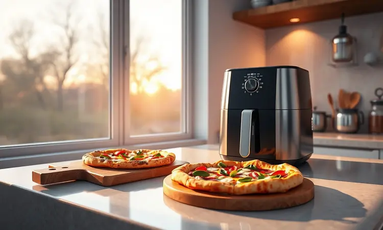
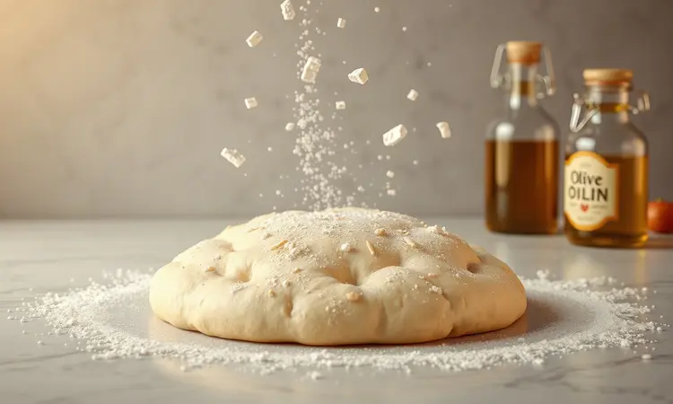
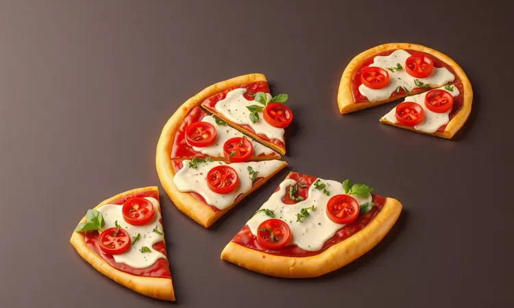

Você já desejou aquela pizza quentinha e crocante, mas desistiu só de pensar em pré-aquecer o forno ou esperar o delivery? Se você concorda que praticidade e sabor devem andar juntos, a pizza na air fryer é a solução que vai transformar suas noites.

Com este guia, você aprenderá a fazer uma pizza com massa caseira digna de pizzaria, mas com a velocidade da fritadeira elétrica. Vamos explorar desde a montagem inteligente para o recheio não voar até as combinações de sabores mais irresistíveis para o seu paladar.

<SummaryList products={frontmatter.top_products} />

## Por que a Pizza na Air Fryer é a Melhor Opção para Noites Corridas?

Imagine chegar em casa depois de um dia exaustivo, com aquela vontade de algo especial, mas sem energia para preparos elaborados. A air fryer entrega exatamente isso: uma pizza pronta em minutos que parece ter saído direto do forno a lenha.

O segredo está na circulação intensa de ar quente, que transforma sua massa em uma base dourada e crocante, com aquele barulhinho satisfatório ao morder.

Enquanto o forno convencional leva tempo só para aquecer, sua air fryer já está pronta para trabalhar, consumindo menos energia e oferecendo resultados consistentes. É a combinação perfeita para quem valoriza tempo sem abrir mão da qualidade.

## Escolhendo a Air Fryer Ideal para Pizzas e Massas

<ProductBox 
  title={frontmatter.top_products[0].title} 
  image={frontmatter.top_products[0].image} 
  link={frontmatter.top_products[0].link} 
/>

Nem toda air fryer é igual quando o assunto é pizza. Se você realmente quer transformar suas noites, modelos do tipo 'Air Fryer Oven' fazem toda diferença.

Eles combinam a agilidade da fritadeira elétrica com a versatilidade de um forno tradicional, permitindo que você faça pizzas maiores sem comprometer a crocância.

Capacidade também importa: procure modelos com mais de 10 litros se quiser assar mais de uma por vez ou preparar lanches para a família toda.

Algumas air fryers vêm com acessórios específicos que são verdadeiros facilitadores. A Typhur Dome 2, por exemplo, é conhecida por criar crostas que parecem ter passado horas em fornos profissionais.

Já se espaço na cozinha é seu maior desafio, opções como a Mondial Air Fryer 4L oferecem praticidade compacta. A escolha certa depende do equilíbrio entre suas necessidades culinárias e as dimensões do seu espaço.

## Receita de Massa de Pizza Rápida (Sem Descanso Longo)

Vamos direto ao ponto: você quer uma massa digna de pizzaria sem esperar horas de descanso? A solução está em uma combinação simples que transforma ingredientes básicos em magia.

Misture 2 xícaras de farinha, 1 colher de sopa de fermento, 1/2 colher de chá de sal e 1/2 xícara de água morna. Sove por alguns minutos até sentir a textura se unindo, modele com as mãos e está pronto para receber seu recheio favorito.

### Ingredientes Necessários para a Base e o Molho

Para sua base perfeita, concentre-se em farinha de trigo, água morna, fermento biológico, uma pitada de açúcar e sal. Essa combinação cria uma estrutura leve que se transforma em crocância dourada na air fryer. 

O molho é a alma da pizza. Comece com tomates pelados ou um bom molho de tomate como base, acrescente alho picado fino para profundidade de sabor, um fio generoso de azeite de oliva e os temperos clássicos: orégano e manjericão.

Essas camadas de sabor farão com que cada mordida conte uma história.

### Utensílios que Facilitam o Preparo

<ProductBox 
  title={frontmatter.top_products[1].title} 
  image={frontmatter.top_products[1].image} 
  link={frontmatter.top_products[1].link} 
/>

Alguns acessórios transformam a experiência de fazer pizza na air fryer de 'tentativa' em 'obra prima'.

Formas e assadeiras específicas para air fryer, especialmente as de silicone antiaderente, se adaptam perfeitamente à cesta e garantem que sua pizza deslize para fora sem drama.

Para quem busca a crocância máxima, uma pedra para pizza que caiba na sua air fryer pode ser um divisor de águas. Bandejas de silicone facilitam a limpeza, enquanto um simples spray borrifador de óleo oferece controle preciso sobre a hidratação da massa.

Protetores descartáveis preservam sua cesta, e kits completos de acessórios frequentemente reúnem todas essas soluções em um só pacote.

## Passo a Passo: Como Assar sem Deixar a Massa Crua

Comece pré-aquecendo sua air fryer por 3 a 5 minutos a 200°C. Enquanto o ar quente circula, prepare sua massa com os recheios escolhidos. A chave para evitar massa crua está na moderação: ingredientes em excesso criam umidade que impede o cozimento uniforme. 

Coloque sua pizza na cesta e ajuste o tempo para 8 a 10 minutos. Na metade do processo, dê uma rápida girada para garantir que cada centímetro receba o calor igualmente.

Quando você abrir a air fryer, encontrará uma massa dourada e crocante, com recheios perfeitamente integrados.

## Tempo e Temperatura: A Tabela Definitiva para Cada Tamanho

200°C é sua temperatura base mágica para qualquer pizza na air fryer. O que varia é o tempo:

- Pizza pequena (20 cm): 8 a 10 minutos

- Pizza média (25 cm): 10 a 12 minutos  

- Pizza grande (30 cm): 12 a 15 minutos

Cada modelo de air fryer tem sua personalidade. Use esses números como guia, mas confie nos seus sentidos: a cor dourada e o aroma irresistível são seus melhores indicadores de que está pronto.

## 5 Recheios Criativos para Experimentar Hoje

Sair da rotina pode ser mais simples do que parece. Que tal transformar sua pizza em uma tela para sabores inesperados? Aqui estão cinco caminhos que levam do familiar ao extraordinário.

### 1. Marguerita Clássica com Toque de Manjericão

Às vezes, a perfeição está na simplicidade. Uma massa fina, molho de tomate caseiro, muçarela generosa e folhas frescas de manjericão criam uma sinfonia de sabores que a air fryer transforma em minutos. O toque final?

Um fio de azeite extravirgem que brilha como ouro líquido sobre a crocância dourada.

### 2. Calabresa com Cebola Roxa e Orégano

Para quem busca personalidade marcante, a combinação de calabresa picante com a doçura suave da cebola roxa é um clássico que nunca decepciona. O orégano entrega aquele aroma que invade a cozinha e promete satisfação completa.

Ajuste seu tempo de cozimento para garantir que a massa abrace perfeitamente esses sabores intensos.

### 3. Frango com Catupiry e Milho

Cremoso, reconfortante e irresistivelmente saboroso. Frango desfiado misturado com catupiry cria uma textura que derrete na boca, enquanto o milho verde adiciona toques de doçura e cor.

Espalhe uniformemente sobre uma massa fina e deixe a air fryer trabalhar sua magia por 10 a 15 minutos em temperatura média.

### 4. Pizza Doce de Chocolate com Morango

Por que reservar a air fryer apenas para refeições salgadas? Uma base de massa tradicional recebe uma camada generosa de chocolate derretido e fatias de morango fresco. Na air fryer, a massa dourará enquanto os morangos se caramelizam levemente.

Sirva quente, talvez com uma bola de sorvete, e transforme sua sobremesa em memória afetiva.

### 5. Mini Pizzas Kids: Diversão Garantida

Transforme a cozinha em playground culinário. Mini pizzas na air fryer não são apenas rápidas (10 a 15 minutos), mas também uma experiência educativa.

Use pequenas massas ou até pão pita como base, ofereça uma variedade de coberturas coloridas e deixe as crianças criarem suas próprias combinações. É diversão que alimenta corpo e imaginação.

## Dicas de Especialista: Como Evitar que o Recheio 'Voe' com o Vento

<ProductBox 
  title={frontmatter.top_products[2].title} 
  image={frontmatter.top_products[2].image} 
  link={frontmatter.top_products[2].link} 
/>

Imagine abrir sua air fryer e encontrar recheios grudados nas paredes em vez de sobre sua pizza. Para evitar essa cena, comece não sobrecarregando a cesta. Uma camada de pizza por vez permite que o ar circule adequadamente.

Escolha queijos que derretem bem e corte vegetais e carnes em pedaços menores, ou melhor ainda, pré-cozinhe ingredientes mais úmidos.

Pressione levemente os recheios sobre a massa antes de cozinhar, como se estivesse aconchegando-os em seu lugar. Temperaturas muito altas podem criar turbulência, então ajuste conforme necessário.

Para ingredientes particularmente leves, uma tampa improvisada com papel alumínio nos primeiros minutos mantém tudo no lugar até a massa firmar.

## Erros Comuns ao Fazer Pizza na Fritadeira e Como Evitá-los

Pular o pré-aquecimento é como começar uma corrida com os pés amarrados. Esses minutos iniciais são essenciais para criar a crocância desde o primeiro contato com o calor.

Outro erro frequente é tratar a air fryer como um forno convencional, sobrecarregando-a com camadas e mais camadas de ingredientes. A circulação de ar precisa de espaço para trabalhar.

Ajuste seus tempos conforme a espessura da massa. Uma base mais grossa precisará de minutos extras, enquanto massas finas podem estar prontas mais rapidamente.

E nunca subestime o poder da observação: sua pizza lhe dirá quando está pronta através da cor, do aroma e da textura.

## Perguntas Frequentes (FAQ)

A air fryer realmente entrega crocância? Absolutamente sim. A circulação intensa de ar quente cria uma massa dourada e crocante que rivaliza com fornos tradicionais, mas em fração do tempo.

Quanto tempo realmente leva? Entre 10 e 15 minutos, dependendo da espessura da sua massa e da quantidade de recheio. É rápido o suficiente para satisfazer um desejo repentino.

E a limpeza? A maioria das air fryers tem partes removíveis que são seguras para lava-louças, transformando o pós-preparo em uma tarefa rápida e sem complicações.

## Conclusão

Fazer pizza na air fryer é mais do que uma solução prática para noites corridas. É uma maneira de reconectar com o prazer de preparar algo especial para você ou para quem você ama, sem as barreiras do tempo ou da complexidade.

A crocância que lembra pizzaria de bairro, a economia de energia que traz paz ao orçamento doméstico e a liberdade de criar combinações únicas transformam um eletrodoméstico em um aliado culinário.

Cada vez que você pré-aquece sua air fryer, está abrindo espaço não apenas para uma refeição rápida, mas para uma experiência gastronômica completa. Os erros se transformam em aprendizados, as tentativas em conquistas e as pizzas em memórias compartilhadas.

Comece com a Marguerita clássica, ouse com combinações inusitadas, envolva as crianças na cozinha. Sua air fryer está pronta para provar que qualidade e praticidade podem, sim, ocupar o mesmo espaço na sua vida.