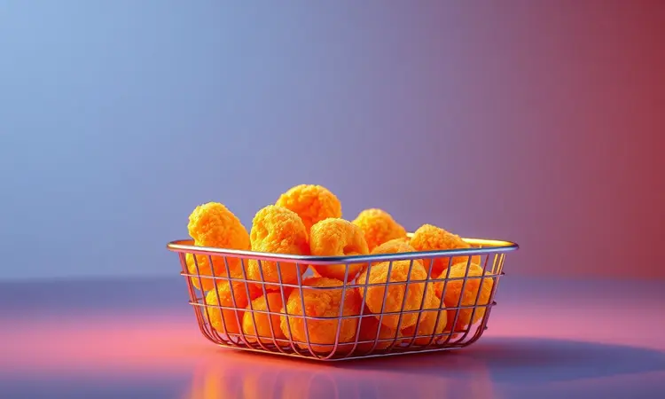
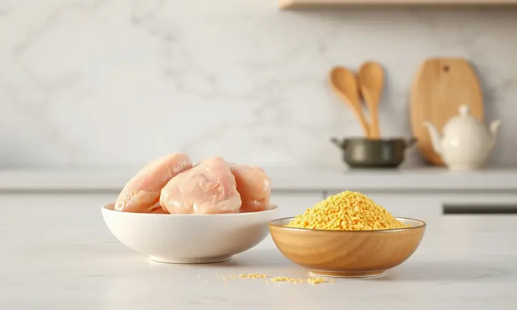
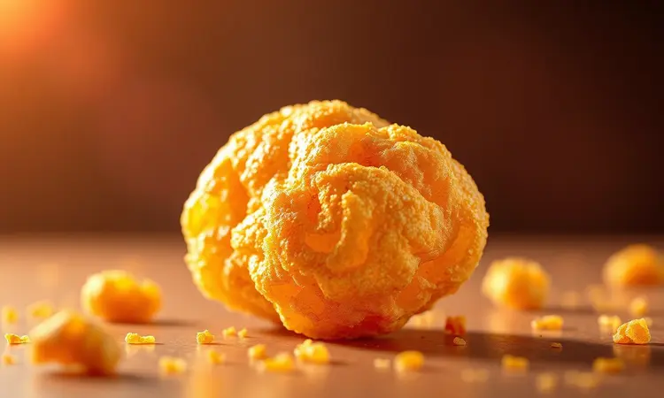
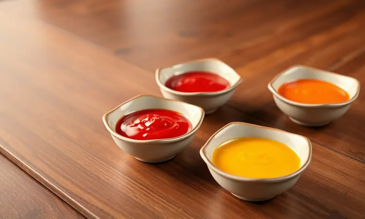

Você adora a praticidade dos nuggets, mas sempre se decepciona quando eles ficam murchos ou encharcados de óleo? Você não está sozinho, e a boa notícia é que a fritadeira elétrica é a ferramenta perfeita para resolver isso.

Neste guia, você vai aprender não apenas o tempo exato para preparar a versão congelada, mas também uma receita exclusiva de nuggets caseiros muito mais saudáveis.

Prepare-se para descobrir os segredos profissionais para garantir aquela crosta dourada e barulhenta por fora, mantendo a suculência por dentro.

<SummaryList products={frontmatter.top_products} />

## Por que preparar Nuggets na Airfryer é a melhor escolha?

Imagine abrir a airfryer e encontrar nuggets que parecem saídos de um comercial de TV, com aquela crocância que faz barulho a cada mordida. Esse é o resultado que você conquista quando utiliza ar quente em vez de óleo.

Além de reduzir até 80% da gordura dos fritos tradicionais, você economiza tempo, dinheiro e aquele trabalho chato de limpar respingos de óleo por toda a cozinha.

E o melhor: o método é tão versátil que permite experimentar desde os clássicos congelados até receitas personalizadas com temperos especiais.

## Como fazer Nuggets Congelados na Airfryer: Tempo e Temperatura

Para transformar aqueles nuggets do freezer em verdadeiras delícias crocantes, comece com um passo que muitos pulam: pré-aqueça sua airfryer a 200°C por 5 minutos.

Esse simples gesto faz toda diferença, criando um ambiente perfeito para selar os sucos e formar uma casquinha dourada. Distribua os nuggets na cesta, deixando espaço entre eles como se fossem convidados em uma festa que precisa de espaço para dançar.

Deixe por 10 a 15 minutos, dando uma sacudida suave na metade do tempo. Quando ouvir aquele som crocante ao tocá-los, saberá que está pronto para mergulhar no seu molho favorito.

## Receita de Nuggets de Frango Caseiro: Versão Saudável e Fit

Agora, se você quer algo que vá além do supermercado, preparar seus próprios nuggets em casa é uma experiência que combina sabor com a satisfação de saber exatamente o que sua família está comendo.

Vamos criar uma versão que mantém toda a crocância dos tradicionais, mas com ingredientes que você pode nomear sem precisar de um dicionário químico.

### Ingredientes para a massa e o empanado funcional

Para a base, comece com 500g de peito de frango moído, que garante suculência sem gordura desnecessária. Tempere com uma combinação que eu adoro: 1 colher de chá de sal, meia colher de pimenta-do-reino, 1 colher de chá de alho em pó e outra de cebola em pó.

Para o empanado saudável, use farinha de aveia ou panko integral, que criam uma camada crocante sem peso. Um segredo profissional: misture 2 colheres de queijo parmesão ralado na farinha de rosca. E não se esqueça de 2 ovos batidos para dar aquela liga perfeita.

### Passo a passo: Moldando e empanando para máxima aderência

Misture o frango com os temperos até sentir que tudo está incorporado uniformemente. Aqui vai uma dica valiosa: molhe levemente as mãos com água ao moldar os nuggets, isso evita que a massa grude.

Forme pedaços do tamanho de uma noz, garantindo que todos tenham espessura similar para cozinhar igualmente. Monte sua estação de empanamento com três recipientes rasos: farinha, ovos batidos e a mistura de farinha de rosca com parmesão.

Passe cada nugget primeiro na farinha (sacuda o excesso), depois no ovo e finalmente pressione na farinha de rosca até cobrir completamente. Essa camada tripla é o segredo para o empanado que não desgruda na airfryer.

## Melhores modelos de Airfryer para receitas crocantes

<ProductBox 
  title={frontmatter.top_products[0].title} 
  image={frontmatter.top_products[0].image} 
  link={frontmatter.top_products[0].link} 
/>

Antes de mergulhar nas técnicas, é justo falar sobre as ferramentas que fazem a mágica acontecer. A Philips Walita lidera com sua tecnologia Rapid Air que circula o calor como um abraço uniforme em volta dos alimentos, sendo a Série 2000 XL minha favorita para famílias.

A Oster também impressiona com modelos como a Fritadeira sem Óleo OFRT520, que combina potência com um design intuitivo que facilita a rotina na cozinha.

Independente da marca, procure capacidades a partir de 5 litros, que permitem preparar porções generosas sem precisar fazer várias levas.

## 5 Segredos de Especialista para Nuggets Extremamente Crocantes

Essas dicas são o que separa nuggets apenas cozidos daqueles que fazem você fechar os olhos de prazer ao primeiro pedaço.

### 1. O impacto do preaquecimento na textura final

Pense no pré-aquecimento como aquecer o forno antes de receber os convidados. Quando sua airfryer atinge 200°C antes dos nuggets entrarem, a superfície se sela instantaneamente, criando uma barreira que mantém os sucos presos dentro. O resultado?

Exterior que estala sob os dentes, interior que derrete na boca. Saltar essa etapa seria como tentar assar um bolo em forno frio, simplesmente não funciona da mesma forma.

### 2. A Regra de Ouro: Por que nunca empilhar os nuggets

Eu sei, a tentação de encher a cesta até a borda é grande, especialmente quando a fome aperta. Mas aqui está a verdade: nuggets amontoados são como pessoas em um elevador lotado, ninguém se mexe direito.

O ar quente precisa circular livremente em volta de cada pedaço para criar aquela crocância uniforme. Quando você os dispõe em uma única camada, é como dar a cada um seu próprio espaço pessoal para dourar perfeitamente.

### 3. O truque do pulverizador de azeite

<ProductBox 
  title={frontmatter.top_products[1].title} 
  image={frontmatter.top_products[1].image} 
  link={frontmatter.top_products[1].link} 
/>

Aqui está um acessório que custa pouco mas faz uma diferença enorme. Um borrifador de azeite permite aplicar uma finíssima camada de óleo apenas onde é necessário, como um artista dando pinceladas precisas.

Isso garante que cada pedacinho do empanado receba a quantidade ideal para dourar sem ficar oleoso. Procure modelos com jato contínuo em leque, que distribuem o azeite como uma leve névoa dourada sobre seus nuggets.

## Acessórios úteis para facilitar o preparo e a limpeza

<ProductBox 
  title={frontmatter.top_products[2].title} 
  image={frontmatter.top_products[2].image} 
  link={frontmatter.top_products[2].link} 
/>

Falando em acessórios, alguns itens transformam a experiência com a airfryer de uma tarefa para um prazer culinário.

Formas de silicone com divisórias são ideais para preparar nuggets caseiros sem grudar, enquanto grelhas elevadas permitem que a gordura escorra para baixo, deixando tudo ainda mais crocante. Meu favorito pessoal?

Um tapete antiaderente reutilizável que forra o cesto e se limpa com um pano úmido, economizando minutos preciosos após a refeição.

## Sugestões de Molhos Irresistíveis para Acompanhar

Um nugget crocante pede um molho que seja seu parceiro perfeito. Para uma experiência clássica, um barbecue caseiro com toque defumado complementa a crocância com doçura equilibrada.

Se prefere algo que surpreenda, experimente misturar iogurte natural com endro fresco e um fio de limão, criando frescor que corta a riqueza do frango.

Para noites especiais, um molho de mostarda com mel e uma pitada de pimenta caiena oferece aquele contraste doce-picante que faz você querer mergulhar mais um pedaço.

## Como requentar Nuggets na Airfryer sem perder a crocância

Já aconteceu de preparar nuggets demais e no dia seguinte eles perderam aquela magia? A airfryer tem a solução. Pré-aqueça a 180°C por 5 minutos e distribua os nuggets em uma única camada, como se fossem frescos.

Em 5 a 7 minutos, virando na metade do tempo, você terá pedaços que parecem saídos do primeiro cozimento. Esse método é tão eficiente que algumas pessoas preparam lotes extras só para aproveitar o requentamento perfeito.

## Perguntas Frequentes (FAQ)

### Preciso virar os nuggets na metade do tempo?

Essa é a diferença entre nuggets dourados de um lado e pálidos do outro. Virar na metade do tempo garante que o calor atinja todas as superfícies igualmente, criando uma crocância uniforme que agrada tanto os olhos quanto o paladar.

Pense nisso como assar marshmallows na fogueira, você precisa girar para conseguir aquele dourado perfeito em toda a volta.

### Posso fazer nuggets de vegetais com o mesmo método?

Absolutamente! Substitua o frango por uma mistura de brócolis, cenoura e batata-doce cozidos e triturados, acrescentando farinha de grão-de-bico para dar liga. O empanado e o processo são idênticos, resultando em opções vegetarianas que até carnívoros vão disputar.

## Conclusão

Da praticidade dos congelados ao orgulho dos caseiros, a airfryer transforma a simples tarefa de preparar nuggets em uma experiência culinária que une saúde, sabor e aquela satisfação única de ouvir o crocante perfeito ao morder.

Você agora tem não apenas tempos e temperaturas, mas os segredos profissionais que garantem sucesso desde a primeira tentativa. Lembre-se: o espaço entre os nuggets, o pré-aquecimento e o toque leve de azeite são os três pilares da crocância dourada.

Que tal começar hoje mesmo? Sua próxima leva de nuggets espera para ser a mais crocante, suculenta e memorável que você já preparou.