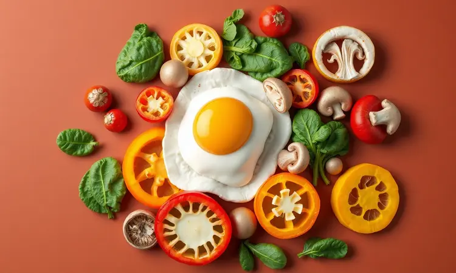
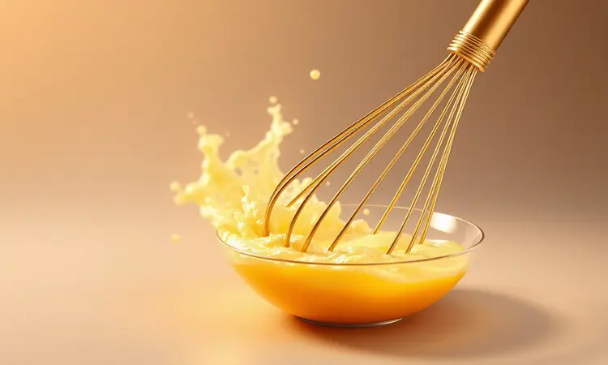

Você adora uma omelete fofinha, mas detesta aquela sensação de limpar gordura respingada em tudo? Ou talvez já tenha passado pela frustração de virar os ovos e ver seu café da manhã virar pedacinhos na frigideira?

A verdade é que preparar o prato perfeito não precisa ser um desafio digno de MasterChef.

Imagine acordar e, em minutos, ter uma refeição nutritiva, com aquela textura altíssima e cremosa que só vemos em hotéis, e o melhor: sem sujar panelas nem gastar minutos lavando tudo depois.

Essa é a transformação que uma fritadeira elétrica pode trazer para sua rotina.

Neste guia, vamos além da receita básica. Você vai descobrir como transformar ovos simples em uma experiência gastronômica, descobrindo os segredos dos chefs para textura, os recipientes que garantem o desenforme perfeito e variações que vão do clássico ao fit.

<SummaryList products={frontmatter.top_products} />

## Por que fazer omelete na Airfryer é a melhor escolha para sua rotina?

Vamos falar de verdade: sua manhã já é corrida o suficiente. Entre se arrumar, organizar as crianças e pensar no trabalho que vem pela frente, parar para cozinhar parece mais um obstáculo do que um prazer.

A Airfryer entra como sua aliada silenciosa na cozinha. Ela não apenas acelera o processo, sua omelete fica pronta enquanto você faz o café ou arruma a mesa, mas transforma completamente a experiência.

O calor que circula por todos os lados cria uma textura que você dificilmente conseguiria em uma frigideira comum: fofinha por dentro, com uma leve crocância nas bordas.

Mas o verdadeiro tesouro escondido aqui é a paz de espírito. Sem gordura saltando, sem aquela panela teimosa que exige esfregão e força. Você coloca os ingredientes, ajusta o tempo e temperatura, e pode focar em outras coisas.

Quando o apito toca, sua refeição está perfeita e a limpeza será apenas enxaguar um recipiente.

## Melhores recipientes: O que usar para a omelete não grudar?

<ProductBox 
  title={frontmatter.top_products[0].title} 
  image={frontmatter.top_products[0].image} 
  link={frontmatter.top_products[0].link} 
/>

Já aconteceu de você preparar uma omelete linda, cheia de expectativa, e na hora de desenformar... metade fica grudada no fundo? Essa frustração tem solução, e ela começa na escolha certa do recipiente.

Para quem valoriza praticidade acima de tudo, as formas de silicone são como um abraço para seus ovos. Flexíveis e antiaderentes por natureza, elas praticamente entregam a omelete na sua mão quando você vira. É aquela sensação de conseguir algo perfeito sem esforço.

Se você busca um cozimento impecável, onde cada centímetro fique igualmente dourado, o vidro temperado é seu melhor amigo. Ele distribui o calor com uma justiça que até as frigideiras mais caras invejariam. O resultado?

Uma omelete que parece ter saído diretamente de um programa de culinária na TV.

Formas de alumínio funcionam bem e são econômicas, enquanto tigelas de porcelana (desde que próprias para forno) dão aquele toque especial para quando quer impressionar alguém no café da manhã.

Independente da sua escolha, lembre-se do pequeno ritual que faz toda diferença: uma leve camada de azeite ou óleo antes de colocar a mistura. É como dar um tapinha nas costas da sua omelete, garantindo que ela sairá inteira e orgulhosa.

## Ingredientes base para uma omelete nutritiva e saborosa

Os ovos são o palco em branco onde você vai criar sua obra-prima matinal. Dois a três deles já formam uma base generosa, mas o verdadeiro segredo está no que você convida para essa festa.

Para nutrição que acorda seu corpo com energia verdadeira, pense em cores. Cebola roxa picadinha, tomates cereja cortados ao meio, tiras finas de pimentão amarelo, essas não são apenas decoração.

São fontes de vitaminas que transformam um simples prato em uma refeição completa.

O queijo é onde a mágica da cremosidade acontece. Um punhado de muçarela derretendo no meio cria veios de sabor que se espalham a cada garfada. Já o queijo feta traz aquela acidez que corta a riqueza dos ovos, equilibrando tudo perfeitamente.

Não subestime o poder dos temperos. Sal e pimenta são o básico, mas um punhado de salsinha fresca picada ou cebolinha verde não apenas embeleza, eles liberam aromas que preenchem a cozinha e anunciam que algo especial está por vir.

## Passo a passo: Como fazer omelete na Airfryer (O Segredo da Altura)

Vamos ao momento mágico. Pegue seus ovos e bata até que as claras e gemas se tornem uma só. Não seja tímido nessa etapa, cada movimento incorpora ar que se transformará em fofura depois.

Agora, a personalização. Queijo ralado, cubos de presunto, aqueles legumes que você picou, tudo vai para a tigela. Misture com carinho, visualizando já o resultado final.

Com o recipiente levemente untado, despeje sua criação. A altura que você busca começa aqui: não encha até a borda. Deixe espaço para que a omelete cresça, respirando dentro da Airfryer.

Ajuste para 160°C e respire fundo. Os próximos 10 a 12 minutos são de expectativa gostosa. A cada minuto, o ar quente circula, cozinha uniformemente, e aquela mistura líquida se transforma em uma estrutura sólida e convidativa.

A paciência é sua aliada. Quando o tempo acabar, abra com cuidado. Você verá uma obra de arte dourada, alta, pronta para ser saboreada.

## Tempo e Temperatura: Como evitar que a omelete fique seca?

O fantasma de toda omelete: abrir a Airfryer e encontrar algo que mais parece uma esponja seca. Esse desastre tem prevenção simples, e ela está no equilíbrio entre calor e tempo.

180°C é a temperatura doce. Quente o suficiente para criar aquela crosta externa deliciosa, mas gentil para que o interior permaneça úmido e cremoso. É como assar um bolo perfeito, precisa de calor consistente, não de um inferno momentâneo.

Os 8 a 10 minutos são uma referência, não uma lei. Sua Airfryer tem sua personalidade, assim como sua preferência por ponto. Uma omelete mais fina pode estar pronta mais rápido; uma recheada com vegetais suculentos pode precisar de uns minutos extras.

Comece com 8, dê uma espiada, e ajuste conforme necessário.

O verdadeiro segredo contra a secura, porém, está na sua tigela antes mesmo de ligar o aparelho. Uma colher de leite ou iogurte natural na mistura dos ovos age como um reservatório de umidade que se distribui durante o cozimento. E o queijo?

Além de sabor, ele derrete e lubrifica tudo por dentro.

## 5 Variações de recheios para transformar sua receita

A beleza da omelete está na sua versatilidade. Um dia você quer algo leve e refrescante, no outro deseja conforto que aquece a alma. Essas combinações são seus atalhos para experiências diferentes:

• Espinafre e queijo feta: o verde vibrante contrastando com a salinidade cremosa do feta
• Tomate seco com manjericão: um toque mediterrâneo que transporta sua manhã para a Itália
• Cogumelos salteados com cebola: a profundidade de sabor que transforma um simples café em refeição reconfortante
• Abobrinha ralada e queijo parmesão: leveza com aquele toque nutty que gruda no paladar
• Presunto com ervas finas: o clássico que nunca falha, especialmente para agradar a todos

### Omelete Fit: Opções Low Carb com vegetais

Para quem busca começar o dia com energia limpa, sem aquele pico de açúcar que deixa sonolento depois, a omelete fit é sua resposta. Aqui, os vegetais não são apenas acompanhamentos, são protagonistas.

Espinafre murcha levemente e libera sua doçura natural. Pimentões coloridos crujentes adicionam textura que diverte a boca. Cebola caramelizada no calor da Airfryer traz uma doçura que dispensa qualquer adição de açúcares.

O preparo mantém a simplicidade: bata os ovos, misture seus vegetais favoritos picados (quanto mais cores, melhor), e deixe a Airfryer fazer seu trabalho. O resultado é uma refeição que alimenta sem pesar, perfeita para quem tem uma manhã ativa pela frente.

### Omelete de Queijo e Presunto: O clássico irresistível

Algumas combinações são atemporais por uma razão simples: funcionam perfeitamente. Queijo e presunto unidos dentro de uma omelete fofinha é um desses casos onde a simplicidade brilha.

A mágica acontece na Airfryer de um jeito especial. Enquanto o queijo derrete e envolve os cubos de presunto em abraços cremosos, o calor circulante cria uma borda ligeiramente crocante que contrasta lindamente com o interior macio.

Em apenas 8 a 10 minutos a 180°C, você tem um café da manhã que parece ter exigido muito mais esforço. E o melhor: sem aquele cheio de gordura queimada que fica na cozinha, apenas o aroma convidativo de uma refeição bem feita.

## Truques de Chef para uma textura fofinha (Estilo Hotel)

Já se perguntou por que as omeletes de hotel têm aquela altura imponente e textura que quase derrete na boca? Os segredos são menos complicados do que parecem, e todos estão ao seu alcance.

O primeiro movimento é fundamental: bata os ovos com vigor. Um garfo ou batedor de arame incorpora ar que, durante o cozimento, expande e cria milhões de minúsculas bolhas de ar. É essa estrutura que dá a leveza característica.

Uma colher de leite ou creme de leite não é apenas líquido adicional, é um emulsionante natural que une gemas e claras em uma textura sedosa homogênea.

O tempero nessa fase também é crucial: sal e pimenta distribuídos uniformemente garantem que cada pedaço tenha sabor equilibrado.

Aqui está um truque pouco falado: pré-aqueça sua Airfryer por 2-3 minutos antes de colocar a mistura. Isso garante que o cozimento comece imediatamente, criando uma estrutura rápida que prende o ar dentro.

E moderação é chave. Por mais tentador que seja encher sua omelete com tudo que há na geladeira, espaço livre permite que o calor circule e cozinhe uniformemente, mantendo a fofura que você busca.

## Acessórios que facilitam a limpeza após o preparo

<ProductBox 
  title={frontmatter.top_products[1].title} 
  image={frontmatter.top_products[1].image} 
  link={frontmatter.top_products[1].link} 
/>

Vamos falar da parte que ninguém realmente ama, mas que faz toda diferença para manter a motivação de cozinhar dia após dia: a limpeza. A boa notícia é que com os parceiros certos, essa tarefa vira um processo rápido quase automático.

Para o desgaste normal, aqueles forros descartáveis de silicone ou papel próprio para Airfryer são como guarda-costas da sua cesta. Eles pegam respingos, migalhas e pequenos derramamentos, e quando acaba, você simplesmente descarta.

A sensação é de ter um ajudante invisível na cozinha.

Quando a gordura insiste em ficar, existem desengordurantes formulados especialmente para a tecnologia das fritadeiras elétricas. Eles quebram as moléculas de gordura sem agredir o revestimento antiaderente, quase como um spa de limpeza para seu aparelho.

Um acessório subestimado: luvas de silicone finas. Elas permitem que você lave as peças ainda mornas (mas não quentes), quando a gordura está mais maleável. É a diferença entre esfregar por minutos ou apenas passar uma esponja suavemente.

Esses pequenos investimentos não são sobre gastar mais, são sobre recuperar minutos do seu dia e manter sua relação com a Airfryer sempre prazerosa, sem o peso da manutenção trabalhosa.

## Erros comuns ao fazer ovos na Airfryer e como evitá-los

Todo aprendizado vem com seus tropeços, mas conhecer os erros mais comuns é como ter um mapa que mostra onde estão as pedras no caminho.

Pular o pré-aquecimento é como tentar assar um bolo em um forno frio, o exterior pode até cozinhar, mas o interior fica irregular. Esses 2-3 minutos iniciais são o tempo que o aparelho leva para criar o ambiente perfeito para seu sucesso.

Recipientes inadequados são convites para problemas. Plásticos que não suportam calor podem derreter não apenas estragando sua refeição, mas liberando substâncias que você não quer na sua comida.

Vidro ou silicone específico para altas temperaturas são sua aposta segura.

O excesso de zelo também atrapalha. Encher demais o recipiente impede que o ar quente circule livremente, criando bolsões crus e áreas supercozidas. Lembre-se: espaço vazio é seu aliado, não desperdício.

Por último, respeitar as combinações de tempo e temperatura indicadas no seu manual não é falta de criatividade, é entender a linguagem do seu aparelho. Cada Airfryer tem sua personalidade, e essas orientações são a tradução dela.

## Conclusão

Fazer omelete na Airfryer vai muito além de simplesmente cozinhar ovos. É sobre recuperar o prazer de começar o dia com uma refeição feita com carinho, sem que isso signifique passar meia hora na pia depois.

Você descobriu que a temperatura ideal (entre 160°C e 180°C) e o tempo médio (de 8 a 12 minutos) são apenas pontos de partida para sua criatividade.

Os recipientes certos, silicone para praticidade, vidro para perfeição, garantem que sua obra de arte saia intacta, pronta para ser admirada antes mesmo do primeiro garfo.

Os ingredientes transformam o básico em extraordinário, os truques de chef elevam o simples ao nível de restaurante, e os erros conhecidos deixam de ser ameaças para virar apenas lições aprendidas.

Agora é sua vez. Escolha seus ingredientes favoritos, siga esses passos e compartilhe o resultado. Prepare sua omelete perfeita, tire uma foto daquela altura impressionante, e descubra como algo tão simples pode trazer tanto prazer para sua rotina.