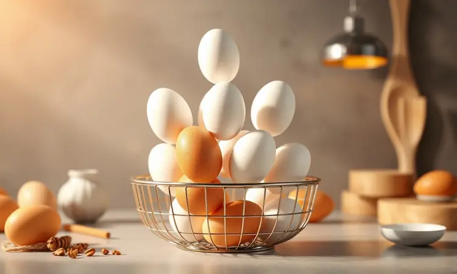
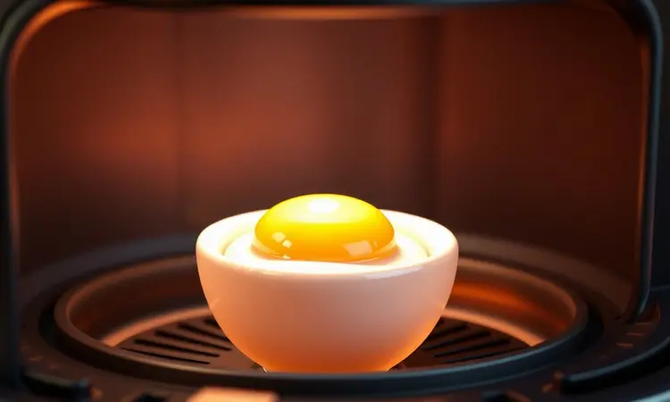

Você já pensou em desistir de fazer ovos porque a gema nunca fica no ponto desejado ou a sujeira da frigideira desanima? Fazer ovo na air fryer é a solução que vai transformar suas manhãs e otimizar sua dieta.

Imagine ter ovos cozidos, fritos ou mexidos com perfeição técnica, sem usar uma gota de óleo a mais e sem monitorar o fogão.

Neste guia, vou te mostrar o passo a passo exato, os tempos precisos para cada tipo de gema e os segredos práticos para você nunca mais errar a receita.

<SummaryList products={frontmatter.top_products} />

## Por que fazer ovo na air fryer? Vantagens além da praticidade

A verdadeira magia da air fryer não está apenas na rapidez. Ela te devolve o controle sobre sua alimentação. Você pode preparar ovos perfeitos enquanto se arruma para o trabalho, sem aquele nervosismo de deixar o fogão ligado. O resultado?

Uma gema no ponto exato que você escolheu, uma clara firminha e zero daquele óleo residual que pesa no estômago e demora para limpar.

É como ter um chef de precisão dentro da sua cozinha, garantindo que cada café da manhã seja uma experiência satisfeante, não uma tarefa frustrante.

## É seguro colocar ovo com casca na air fryer? Mitos e Verdades

Aquele temor de que o ovo vai explodir e fazer uma bagunça dentro do aparelho é comum, mas é um mito facilmente contornado.

Colocar ovo com casca na air fryer é seguro quando você segue um protocolo simples: basta fazer um pequeno furo na casca com um alfinete antes de cozinhar. Este detalhe permite que o vapor escape durante o processo, evitando qualquer pressão interna excessiva.

O calor intenso e circulante do aparelho cozinha o ovo de maneira uniforme, e você terá a certeza de que nada além de um ovo perfeito vai sair da cesta.

## Tabela de Tempo Definitiva: Como acertar o ponto do ovo cozido

Agora que você sabe que é seguro, vamos ao que interessa: como controlar o ponto da gema com a precisão de um relógio. Cozinhar ovos na Air Fryer elimina as estimativas nebulosas do fogão. Com esses tempos, você transforma desejo em resultado.

### Ovo com gema bem mole (6 a 8 minutos)

Para aquela gema que escorre delicadamente sobre uma torrada, o segredo está na brevidade. Pré-aqueça a air fryer a 150°C, coloque os ovos diretamente na cesta e programe de 6 a 8 minutos.

A magia acontece quando você interrompe o cozimento mergulhando os ovos em água fria após o tempo: a clara se firma, enquanto a gema permanece cremosa e líquida, perfeita para um momento de indulgência matinal.

### Ovo Mollet ou gema cremosa (9 a 10 minutos)

O ponto mollet é aquele equilíbrio sublime onde a gema é cremosa, mas não líquida, e a clara está completamente firme. Para alcançar essa textura, pré-aqueça a air fryer a 130°C por cerca de 3 minutos e cozinhe os ovos por 9 a 10 minutos.

O banho de água gelada final é crucial, garantindo que você tenha em suas mãos o ingrediente ideal para elevar uma simples salada ou compor um lanche sofisticado.

### Ovo cozido clássico com gema firme (12 a 15 minutos)

Quando você precisa de ovos cozidos para picar em uma salada, encaixar em um sanduíche ou simplesmente comer com uma pitada de sal, a firmeza total é essencial.

Ajuste a temperatura da air fryer para cerca de 120°C e cozinhe por 12 a 15 minutos, dependendo do tamanho dos ovos. O resultado é um ovo clássico, de descascar fácil após o choque térmico na água fria, pronto para qualquer uso prático e saboroso.

## Como fazer 'ovo frito' na air fryer sem usar óleo

Quer o visual e a satisfação de um ovo frito, mas sem o óleo pesando no prato ou a frigideira engordurada para limpar? A air fryer faz isso possível. Pré-aqueça o aparelho a 200°C por cerca de 3 minutos.

Quebre o ovo cuidadosamente em uma pequena tigela ou molde próprio (uma xícara de silicone funciona) e coloque na cesta. Em 6 a 8 minutos, você terá um "ovo frito" com a clara setada e a gema intacta.

A textura será diferente da tradicional (mais "cozida" do lado da clara), mas o sabor e a leveza compensam totalmente.

## Passo a passo para o ovo mexido perfeito e cremoso

Ovos mexidos na air fryer demandam uma pequena adaptação, mas o resultado mantém a cremosidade que você ama. O método tradicional com frigideira e fogo baixo é o caminho certo: comece batendo os ovos levemente em uma tigela com sal e suas ervas preferidas.

Em uma frigideira antiaderente aquecida, adicione uma colher de manteiga ou azeite e despeje os ovos. Mexa suavemente com uma espátula de silicone, puxando as bordas para o centro, até que eles estejam ligeiramente firmes, mas ainda úmidos e cremosos.

Sirva imediatamente para capturar essa textura perfeita.

## Utensílios que facilitam sua vida: O que pode ir na air fryer?

A escolha do utensílio certo pode transformar a experiência de um "experimento" para uma "rotina fluida".

Formas de silicone, recipientes de vidro ou metal resistentes ao calor não apenas protegem sua air fryer, mas garantem que o cozimento seja uniforme e a limpeza, instantânea.

### Ramequins de porcelana para ovos individuais

<ProductBox 
  title={frontmatter.top_products[0].title} 
  image={frontmatter.top_products[0].image} 
  link={frontmatter.top_products[0].link} 
/>

Esses pequenos recipientes elegantes são a solução para quem busca apresentação e praticidade. Com tamanhos entre 40ml e 250ml, eles são perfeitos para preparar ovos individuais diretamente na air fryer, podendo depois ser levados à mesa como um prato sofisticado.

A porcelana resiste bem às altas temperaturas e, na maioria dos casos, pode ser lavada na máquina, combinando durabilidade com facilidade.

### Formas de silicone antiaderentes para fritadeira

<ProductBox 
  title={frontmatter.top_products[1].title} 
  image={frontmatter.top_products[1].image} 
  link={frontmatter.top_products[1].link} 
/>

O silicone antiaderente é um aliado que quase elimina o trabalho de limpeza. Essas formas protegem o cesto da fritadeira de resíduos e prolongam a vida do aparelho.

Sua versatibilidade permite cozinhar desde ovos até pequenas porções de outros alimentos com um cozimento uniforme. Apenas certifique-se de que a forma está acomodada de modo a permitir a circulação de ar.

Elas são reutilizáveis, tornando seu processo mais sustentável e descomplicado.

### Pulverizador de azeite para finalização

<ProductBox 
  title={frontmatter.top_products[2].title} 
  image={frontmatter.top_products[2].image} 
  link={frontmatter.top_products[2].link} 
/>

Para uma finalização gourmet sem exageros, um pulverizador de azeite é seu melhor amigo. Ele aplica uma névoa fina e controlada de azeite (ou outros óleos) sobre seus ovos ou outros alimentos, garantindo sabor distribuído homogeneamente sem a gordura excessiva.

Escolha um modelo de vidro para evitar que odores antigos contaminem seu azeite fresco. Este pequeno utensílio oferece controle total sobre a ingestão de gorduras saudáveis, alinhando prazer e bem-estar.

## 5 Dicas de Ouro para o ovo não explodir e nem grudar

Com os utensílios ideais em mãos, algumas técnicas simples garantem que tudo funcione sem falhas. Primeiro, o furo na casca antes do cozimento é indispensável: ele libera a pressão interna e evita qualquer risco de explosão.

Segundo, um leve spray de óleo antiaderente no cesto ou no recipiente impede que os ovos grudem. Third, respeite a temperatura e o tempo sugeridos, ajustando apenas para ovos muito grandes ou muito pequenos.

Quarto, sempre pré-aqueça a air fryer para garantir um cozimento uniforme desde o início. E finalmente, deixe os ovos esfriar por alguns minutos após o cozimento: isso facilita o descasque e o manejo.

## Erros comuns: O que você NÃO deve fazer ao cozinhar ovos na air fryer

A praticidade pode levar a pequenos descuidos que comprometem o resultado. Nunca coloque ovos (principalmente com casca) na air fryer sem pré-aquecer: o cozimento desigual é garantido.

Não use recipientes inadequados ou simplesmente coloque os ovos direto no cesto sem proteção: derramamentos e bagunça serão sua recompensa. Não ignore os tempos sugeridos: ovos na air fryer secam rapidamente se deixados além do ponto.

E nunca se esqueça do antiaderente: a frustração de tentar desgrudar um ovo preso é real. Atenção a esses detalhes transforma tentativa em sucesso.

## Perguntas Frequentes (FAQ) sobre Ovos na Air Fryer

É possível cozinhar ovos com casca na air fryer? Sim, absolutamente. É um método seguro e eficiente quando você faz o pequeno furo na casca para liberar o vapor.

Qual o tempo ideal para 'fritar' ovos na air fryer? Para ovos fritos sem óleo, cerca de 6 a 8 minutos em temperatura média (200°C) costuma entregar a clara firme e a gema intacta.

Como evitar que ovos mexidos fiquem secos? O segredo está no método tradicional com frigideira e fogo baixo, e na interrupção do cozimento quando os ovos estão ainda cremosos. Uma pitada extra de manteiga ou azeite na mistura também ajuda na textura.

## Conclusão

Fazer ovos na air fryer é mais que uma técnica de cozinha; é uma liberação de tempo e uma conquista de qualidade.

Você substitui a incerteza do fogão pela precisão de um temporizador, troca a gordura residual pela leveza de um cozimento por aire, e transforma uma tarefa potencialmente frustrante em um ritual matinal satisfatório.

Com os tempos controlados, os utensílios adequados e as dicas simples que compartilhamos, você está equipado para produzir ovos cozidos, "fritos" ou mexidos no ponto exato que sua ocasião demanda. Experimente hoje.

Coloque um ovo na sua air fryer, ajuste o tempo para sua gema preferida, e descubra como a primeira refeição do dia pode ser, finalmente, perfeita.