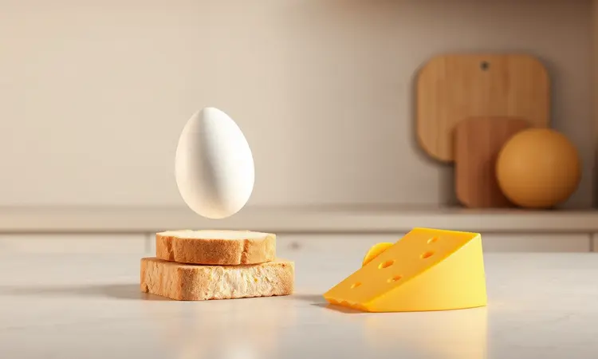
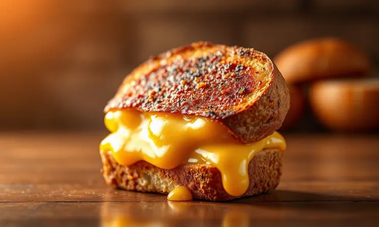
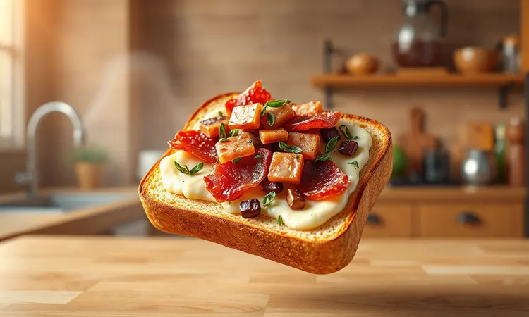

Você já desejou um café da manhã digno de padaria, mas sem ter que sujar várias panelas ou gastar muito tempo? O pão com ovo e queijo na Air Fryer é a solução definitiva para quem busca praticidade sem abrir mão do sabor e da textura crocante.

Neste guia, você vai aprender não apenas a receita básica, mas todos os truques para garantir que o pão fique dourado e a gema exatamente do jeito que você gosta, transformando sua rotina matinal com apenas alguns minutos de preparo.

<SummaryList products={frontmatter.top_products} />

## Por que o pão com ovo na Air Fryer virou febre na cozinha?

Imagine acordar e saber que em menos de 10 minutos terá na sua mesa um lanche com aquele crocante perfeito que até agora só encontrava em padarias de bairro. É essa promessa que transformou o pão com ovo na Air Fryer em um fenômeno.

A tecnologia da fritura a ar não apenas elimina a necessidade de óleo em excesso, mas cria uma textura impossível de reproduzir numa frigideira comum: o pão fica dourado por todos os lados, o queijo derrete de forma uniforme, e você não precisa ficar virando e rezando para não queimar um lado.

Para quem já cansou de café da manhã monótono, essa receita funciona como um atalho gourmet na rotina mais corrida.

## Ingredientes necessários para a receita perfeita

A beleza deste prato está justamente na simplicidade. Você precisa de fatias do seu pão preferido (o que tem na sua despensa já serve!), ovos frescos e aquele queijo que derrete facilmente.

O tempero básico é sal e pimenta, mas aqui está o segredo: essa receita é uma tela em branco para sua criatividade. Tem manjericão fresco na geladeira? Pode adicionar. Comprou tomates cereja que estão amadurecendo? São perfeitos aqui.

A magia começa quando você percebe que, com ingredientes que já tem em casa, pode criar algo que parece saído de um café especializado.

## Passo a passo: Como fazer pão com ovo na Air Fryer (Gema mole ou dura)

Agora vamos ao que realmente importa: colocar a mão na massa (ou melhor, no pão). Primeiro, pré-aqueça sua Air Fryer a 180°C. Enquanto ela esquenta, pegue uma fatia de pão e use um copo ou cortador para criar uma cavidade no centro.

O cuidado aqui é não furar completamente o pão, deixando uma base para o ovo não escorrer. Coloque o pão na cesta, quebre o ovo dentro da cavidade e tempere com sal e pimenta.

Aqui vem o controle total: para uma gema ainda cremosa, deixe por 6 a 8 minutos. Se você prefere a gema completamente cozida, aumente para 10 a 12 minutos. Nos últimos dois minutos, se quiser, adicione uma fatia de queijo por cima para derreter perfeitamente.

Ao retirar, você verá um espetáculo de texturas: o pão crocante, o queijo borbulhante e o ovo no ponto exato que você escolheu.

## Os melhores tipos de pão para usar na fritadeira elétrica

O tipo de pão que você escolhe vai determinar completamente a experiência final. Algunspo oferecem crocância intensa, outros mantêm a maciez interior por mais tempo. O segredo é entender qual combina com seu paladar.

### Pão francês: A clássica 'canoinha' crocante

Para quem busca aquela casquinha que estala ao ser mordida, o pão francês é imbatível. Na Air Fryer, ele alcança um nível de crocância que lembra um pão recém-saído do forno da padaria. A melhor parte?

O miolo macio cria um contraste perfeito com a superfície dourada, formando uma base ideal para segurar o ovo e o queijo sem ficar encharcado.

### Pão de forma: Praticidade e base perfeita para o queijo

Se seu objetivo é praticidade absoluta, o pão de forma é seu aliado. Sua textura uniforme e bordas retas fazem com que o ovo fique perfeitamente centralizado, sem risco de escorrer.

Na Air Fryer, ele fica com uma crostinha dourada por fora enquanto mantém toda a maciez por dentro, especialmente se você escolher a versão integral para um toque mais nutritivo.

## Dicas de ouro para evitar sujeira e não queimar o pão

Nada pior do que uma receita deliciosa que termina com uma limpeza demorada. Para evitar isso, comece sempre pré-aquecendo sua Air Fryer (isso evita que o pão fique úmido enquanto o aparelho esquente).

Use um papel manteiga cortado no tamanho da cesta ou, melhor ainda, invista em uma forma de silicone específica para Air Fryer.

### Use formas de silicone para facilitar a limpeza

<ProductBox 
  title={frontmatter.top_products[1].title} 
  image={frontmatter.top_products[1].image} 
  link={frontmatter.top_products[1].link} 
/>

Essa é uma daquelas dicas que parece pequena mas transforma completamente sua experiência na cozinha. As formas de silicone não apenas evitam que os alimentos grudem, mas também criam uma barreira que protege sua Air Fryer de respingos de gordura e queijo derretido.

A limpeza se resume a lavar a forma (que muitas vezes pode ir à máquina de lavar louça), enquanto a cesta principal permanece praticamente intacta.

## Variações deliciosas: Turbine seu pão com ovo

Agora que você domina a base, que tal transformar essa receita numa experiência gourmet? Aqui vão duas sugestões que vão fazer você se sentir um chef mesmo numa manhã de segunda-feira.

### Versão com bacon crocante e cebolinha

Comece colocando fatias de bacon na Air Fryer por 3-4 minutos até ficarem crocantes. Retire, pique em pedaços pequenos e reserve. Prepare seu pão com ovo normalmente e, nos últimos minutos de cozimento, espalhe o bacon picado por cima junto com cebolinha fresca.

O resultado é uma explosão de sabores: a gordura do bacon complementa a cremosidade do ovo, e a cebolinha traz o frescor que equilibra tudo.

### Versão Marguerita: Tomate cereja e manjericão

Para um lanche mais leve e fresco, corte tomates cereja ao meio e tempere com um fio de azeite, sal e pimenta. Coloque-os sobre o pão antes de adicionar o ovo. Use queijo mussarela para manter o tema italiano e finalize com folhas de manjericão fresco.

Na Air Fryer, os tomates caramelizam levemente, liberando sua doçura natural que se combina perfeitamente com o queijo derretido.

## Informação Nutricional: O poder do ovo no café da manhã

Além de ser delicioso, você está fazendo uma excelente escolha nutricional. Os ovos são considerados uma das melhores fontes de proteína completa, mantendo você saciado por mais tempo e fornecendo energia sustentada para começar o dia.

As vitaminas presentes, especialmente a D e B12, são essenciais para o bom funcionamento do sistema nervoso. A combinação com pães integrais ainda adiciona fibras, criando um equilíbrio perfeito entre prazer e nutrição.

## Como escolher sua Air Fryer (se ainda não tem uma)

Se você está começando nesse universo, saiba que não precisa investir em modelos caríssimos para obter bons resultados. Procure por aparelhos com controle preciso de temperatura (idealmente digital) e capacidade suficiente para sua família.

Marcas como Philips, Mondial e Oster oferecem excelentes opções em diferentes faixas de preço. O que realmente importa é a distribuição uniforme do ar quente, característica que garante que seu pão fique dourado igualmente por todos os lados.

## Perguntas Frequentes (FAQ)

### Quanto tempo o ovo leva para ficar com a gema mole na Air Fryer?

Em uma temperatura de 180°C, você precisará de aproximadamente 6 a 8 minutos para obter uma gema ainda cremosa. O truque está em conhecer seu aparelho: comece com 6 minutos, verifique a consistência e, se necessário, adicione mais um ou dois minutos.

A beleza da Air Fryer está justamente nesse controle visual que ela oferece a cada minuto.

### Posso usar pão congelado nesta receita?

Sim, e isso torna a receita ainda mais prática para manhãs corridas. Descongele o pão por alguns minutos em temperatura ambiente ou use a função de descongelamento do micro-ondas por 15-20 segundos.

Na Air Fryer, o pão congelado fica especialmente crocante porque a água evapora rapidamente, deixando apenas a textura dourada que você procura.

## Conclusão

Transformar seu café da manhã nunca foi tão acessível quanto com essa receita de pão com ovo e queijo na Air Fryer.

Mais do que uma simples combinação de ingredientes, você está dominando uma técnica que oferece controle total sobre como quer começar seu dia: crocância perfeita, ponto do ovo exato e a satisfação de criar algo especial com mínimo esforço.

O melhor de tudo é que essa receita funciona como um portal para sua criatividade culinária. Uma vez que você domina a base, pode adicionar os ingredientes que mais ama, transformando cada manhã numa pequena celebração gastronômica.

Experimente hoje mesmo e descubra como poucos minutos na cozinha podem elevar completamente sua rotina matinal.