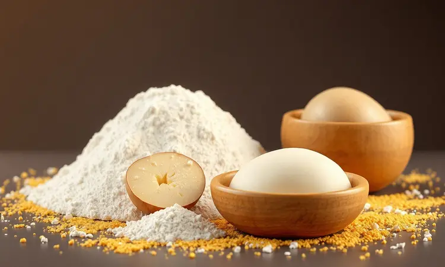
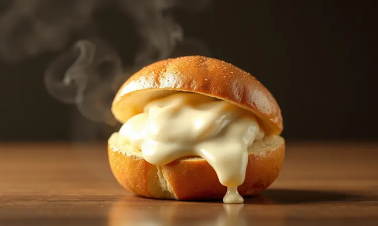
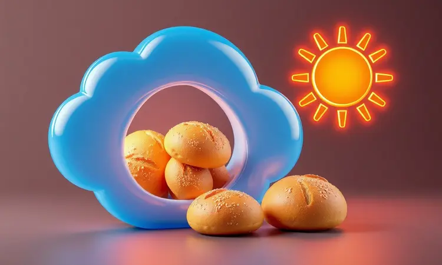

Você já desejou aquele pão de batata quentinho e fofinho, mas desistiu só de pensar no tempo de forno ou na sujeira da fritura? Você não está sozinho.

A boa notícia é que a airfryer é a ferramenta secreta para alcançar a textura perfeita: crocante por fora e incrivelmente macio por dentro, em muito menos tempo.

Neste guia completo, vou te ensinar não apenas a receita básica, mas todos os segredos para seu pão de batata na airfryer nunca mais ficar cru por dentro ou duro demais. Prepare-se para dominar essa receita que vai virar o lanche oficial da sua casa.

<SummaryList products={frontmatter.top_products} />

## Por que fazer Pão de Batata na Airfryer?

Imagine levar para mesa aquele cheirinho irresistível de pão fresquinho, mas sem passar horas na cozinha ou enfrentar uma montanha de louça para lavar. É exatamente isso que a airfryer oferece. 

Seu sistema de circulação de ar quente cria um ambiente perfeito onde cada pãozinho fica dourado em todo o lado, sem aqueles pontos crus ou partes molhadas que estragam a experiência. E o melhor: você usa praticamente zero óleo.

Isso significa saborear algo realmente gostoso sem aquele arrependimento depois, com o sabor verdadeiro dos ingredientes brilhando em cada mordida.

Falando em praticidade, enquanto o forno tradicional exige aquecimento prévio e vigilância constante, com a airfryer é colocar, programar e seguir com seu dia. Zero ansiedade.

Você sabe exatamente quando estará pronto, sem ficar espiando a cada 5 minutos com medo de queimar. Para quem tem rotina corrida ou simplesmente quer aproveitar mais o tempo livre, essa eficiência muda completamente o jogo.

## A Melhor Receita de Pão de Batata na Airfryer (Passo a Passo Tradicional)

<ProductBox 
  title={frontmatter.top_products[0].title} 
  image={frontmatter.top_products[0].image} 
  link={frontmatter.top_products[0].link} 
/>

Com essas vantagens em mente, vamos direto para a receita que conquistou nosso coração (e paladar). O segredo começa na escolha certa dos ingredientes, mas tem um detalhe que faz toda diferença: a batata.

Ela não é apenas um ingrediente, é a alma do pão, responsável por toda aquela maciez que derrete na boca.

Comece misturando os líquidos, leite morno e ovos, até formar uma base homogênea. A temperatura do leite é importante, pois ajuda a ativar o fermento que dará altura aos seus pães.

Em seguida, incorpore o purê de batata ainda morno, sentindo como a mistura ganha corpo e textura.

Agora, adicione a farinha aos poucos. Não tenha pressa. O objetivo é obter uma massa que desgrude das mãos, mas ainda seja macia ao toque. Quando ela atingir esse ponto, cubra com um pano e deixe descansar por cerca de 40 minutos.

É nesse momento mágico que o fermento trabalha, e você verá sua massa quase dobrar de tamanho, prometendo pães leves e aerados.

Por fim, modele os pães com as mãos levemente untadas, pincele com gema para aquele brilho dourado característico e leve à airfryer pré-aquecida a 180°C. Em apenas 10 minutos, sua cozinha estará perfumada com o aroma irresistível de pão fresquinho.

### Lista de Ingredientes Necessários

Para essa receita que rende aproximadamente 12 unidades, você precisará de:

- 500g de batatas cozidas e bem amassadas (escolha variedades mais farinhentas para melhor resultado)

- 250g de farinha de trigo

- 1 ovo inteiro

- 1 colher de sopa bem cheia de fermento biológico seco

- Sal a gosto (cerca de 1 colher de chá)

- 50g de queijo ralado (opcional, mas recomendado para sabor extra)

- Óleo apenas para untar a cesta

Se quiser experimentar um toque diferente, acrescente ervas como orégano ou salsinha desidratada. Elas complementam perfeitamente o sabor suave da batata.

### Equipamentos que Facilitam a Preparação

<ProductBox 
  title={frontmatter.top_products[1].title} 
  image={frontmatter.top_products[1].image} 
  link={frontmatter.top_products[1].link} 
/>

Felizmente, você não precisa de uma cozinha profissional para resultados incríveis. Além da própria airfryer (seu aliado principal), tenha à mão uma tigela grande para misturar tudo confortavelmente e um batedor para incorporar os ingredientes sem esforço.

Um investimento que vale cada centavo são as formas de silicone redondas ou alongadas. Elas se encaixam perfeitamente na cesta, são flexíveis e antiaderentes, a limpeza depois fica tão simples quanto enxaguar.

Só confirme as dimensões antes de comprar, pois algumas airfryers têm espaço mais limitado.

Não subestime a importância de um bom pincel de cozinha. Aplicar a gema uniformemente é o que garante aquele brilho dourado e profissional que faz todos perguntarem: "Onde você comprou?".

## Modo de Preparo Detalhado para um Resultado Profissional

Agora que você tem tudo organizado, vamos ao passo a passo que transforma ingredientes simples em memórias gustativas:

1. Cozinhe as batatas até ficarem tão macias que um garfo atravesse sem resistência. Amasse-as enquanto ainda estão quentes, o calor ajuda a criar uma textura mais homogênea.

2. Em uma tigela, misture as batatas amassadas com a farinha, açúcar (apenas uma pitada para ativar o fermento), o fermento em si e o sal. Adicione o leite morno aos poucos, observando a absorção.

3. Sove a massa por cerca de 5 minutos. Você não precisa de músculos de padeiro, basta trabalhá-la até ficar lisa e elástica.

4. Cubra com um pano úmido e deixe descansar por 30 minutos em local aquecido. Verá ela crescer e ficar cheia de bolhinhas de ar, sinal de que o fermento está ativo.

5. Modele os pãezinhos no tamanho que preferir. Pessoalmente, gosto de fazer unidades médias, perfeitas para um lanche individual.

6. Pré-aqueça sua airfryer por 3 minutos a 180°C. Esse passo faz diferença na crocância inicial.

7. Coloque os pães na cesta com espaço entre eles para o ar circular. Asse por 15 minutos, ou até que estejam dourados e fofinhos ao toque.

Sirva imediatamente, ainda quentinhos, e prepare-se para ver desaparecerem em segundos.

## Segredos para a Massa Ficar Super Fofinha e Leve

Se tem um segredo que separa um pão bom de um pão inesquecível, é a técnica na massa. E tudo começa com a batata: escolha variedades como asterix ou baroa, que têm textura mais farinhenta e criam um purê mais seco.

Se sua massa ficar muito úmida, adicione farinha aos poucos até sentir que desgruda das mãos.

O leite morno (não quente) é outro protagonista. Ele ativa o fermento sem matá-lo, garantindo que sua massa cresça de forma consistente.

Junte uma colher de manteiga derretida nessa mistura, a gordura cria pequenas bolsas de ar durante o cozimento, resultando em textura aveludada.

Falando em fermento, mexa-o com uma pitada de açúcar antes de adicionar à massa. Esse "despertar" faz toda diferença. Deixe a mistura descansar por 5 minutos e verá formar uma espuminha na superfície, sinal de que está pronta para trabalhar.

Por último, o ambiente de descanso. Se sua cozinha estiver fria, aqueça o forno no mínimo por 2 minutos, desligue e coloque a tigela lá dentro com a porta entreaberta. Esse microclima acelera o crescimento sem cozinhar a massa prematuramente.

## Variações Deliciosas: Do Recheado ao Fit

A beleza dessa receita está na sua versatilidade. Depois de dominar a versão clássica, que tal explorar sabores que transformam o simples pão de batata em atração principal?

### Pão de Batata Recheado com Catupiry ou Queijo

Quer surpreender visitas ou simplesmente mimar a família? O recheio cremoso é a resposta. Prepare a massa como de costume, mas ao modelar os pãezinhos, faça uma abertura no centro com o dedo.

Coloque uma colher generosa de catupiry, queijo cremoso ou até uma mistura de mussarela com requeijão.

Feche cuidadosamente, garantindo que o recheio fique completamente envolto. Pincele com gema e asse normalmente. O resultado? Ao morder, encontra primeiro a crosta dourada, depois a massa macia e, por fim, a explosão cremosa que derrete na boca.

Perfeito para festas ou aqueles dias que pedem um carinho extra.

### Versão Saudável: Pão de Batata-Doce Sem Glúten

Para quem busca opções mais leves ou tem restrições alimentares, substitua a batata comum por batata-doce cozida e amassada. Esse superalimento não só adiciona um sabor levemente adocicado, mas também é rico em fibras que dão saciedade.

Troque a farinha de trigo por farinha de arroz ou uma mistura sem glúten. A textura será um pouco diferente, mais úmida e densa, mas igualmente deliciosa. Adicione uma pitada de canela em pó para realçar o sabor naturalmente doce.

Na airfryer, asse a 170°C por 18 minutos. Essa temperatura mais baixa preserva a umidade da batata-doce, resultando em pães macios por dentro e com crocância perfeita por fora. Uma opção nutritiva que prova que saudável pode ser incrivelmente saboroso.

## Dicas de Ouro: Tempo e Temperatura Ideais na Fritadeira Sem Óleo

<ProductBox 
  title={frontmatter.top_products[2].title} 
  image={frontmatter.top_products[2].image} 
  link={frontmatter.top_products[2].link} 
/>

Cada airfryer tem sua personalidade, mas algumas diretrizes garantem sucesso sempre. Para pães de tamanho médio, trabalhe entre 160°C e 180°C. Comece pré-aquecendo por 3 a 5 minutos, esse simples passo cria o ambiente ideal para formação da crosta.

O tempo de cozimento varia conforme o tamanho: pãezinhos pequenos levam de 10 a 12 minutos, unidades médias entre 15 e 18 minutos, e os maiores podem precisar de 20 a 25 minutos.

Se notar que estão dourando rápido demais, mas ainda parecem crus por dentro, reduza para 150°C e cubra levemente com papel alumínio pelos últimos minutos.

A experiência é sua melhor aliada. Na primeira tentativa, verifique aos 10 minutos. Vire os pães se necessário para uniformizar o dourado. Com o tempo, você conhecerá sua airfryer tão bem que acertará no ponto sem nem precisar olhar.

## Como Congelar e Reaquecer para Manter o Sabor de Fresquinho

A vida moderna pede praticidade, e congelar é a solução para ter pão caseiro sempre disponível. Espere os pães esfriarem completamente, o vapor interno precisa se dissipar para não formar cristais de gelo que estragam a textura.

Embrulhe individualmente em papel filme, depois coloque todos em um saco de congelamento retirando o máximo de ar possível. Dessa forma, eles não grudam uns nos outros e mantêm a umidade perfeita por até 3 meses.

Para reaquecer, retire a quantidade desejada e deixe descongelar naturalmente por 30 minutos. Leve à airfryer a 180°C por 3 a 4 minutos, apenas para esquentar e recuperar a crocância.

O resultado será tão bom quanto no dia do preparo, com a vantagem de ter comida caseira em minutos.

## Erros Comuns que Você Deve Evitar ao Fazer Pão na Airfryer

Mesmo com a receita perfeita, alguns deslizes podem comprometer o resultado. O mais comum é pular o pré-aquecimento. Sem isso, os pães começam a cozinhar em temperatura instável, resultando em exterior queimado e interior cru.

Outro erro é lotar a cesta. O ar precisa circular livremente em torno de cada pão para criar aquela crosta uniforme. Se colocados muito próximos, ficam com laterais moles e superfície irregular.

Não untar a cesta também é fatal. Use um pincel para aplicar óleo vegetal ou spray culinário, não precisa ser muito, apenas uma camada fina que evita grudar e facilita a remoção.

Por último, abrir a airfryer a toda hora para verificar. Cada vez que você faz isso, perde temperatura e umidade, interferindo no processo de cocção. Confie no tempo indicado e só verifique quando faltarem 2 ou 3 minutos para terminar.

## Perguntas Frequentes (FAQ)

Posso pular o pré-aquecimento para ganhar tempo? Teoricamente sim, mas você notará diferença na crosta, que fica menos uniforme e crocante. São apenas 3 minutos que valem o investimento.

Meus pães estão dourando por fora mas crus por dentro. O que fazer? Reduza a temperatura para 150°C e asse por mais 5 a 7 minutos. Na próxima, faça unidades menores ou aumente o pré-aquecimento.

A massa pode ficar na geladeira para assar no dia seguinte? Perfeitamente! Cubra bem com filme plástico e deixe na parte menos fria. No dia seguinte, deixe em temperatura ambiente por 30 minutos antes de modelar e assar.

Posso usar fermento químico em vez de biológico? Pode, mas a textura será diferente, mais parecida com pão de queijo do que com pão de batata tradicional. O biológico cria aquela fofura característica que amamos.

## Conclusão

Dominar o pão de batata na airfryer é sobre muito mais que seguir uma receita. É sobre reconquistar o prazer de comer algo caseiro sem o trabalho que normalmente exige.

É sobre transformar ingredientes simples em momentos de conexão, aquela pausa para café da tarde que vira ritual, o lanche da escola que as crianças adoram, a receita que você compartilha orgulhoso com amigos.

Cada detalhe que aprendemos, desde a escolha da batata até o ponto exato de cozimento, soma-se para criar não apenas um pão, mas uma experiência.

A airfryer, nesse contexto, deixa de ser apenas um eletrodoméstico para se tornar sua aliada na busca por alimentação mais prática, saudável e prazerosa.

Agora você tem todos os segredos. O próximo passo é colocar a mão na massa, literalmente. Escolha sua variação favorita, ajuste os temperos ao seu gosto e prepare-se para se surpreender.

Sua primeira fornada pode não sair perfeita (raramente sai), mas a segunda já terá aque aroma e textura que farão todos perguntar: "Ensina para mim?", e essa será sua maior recompensa.