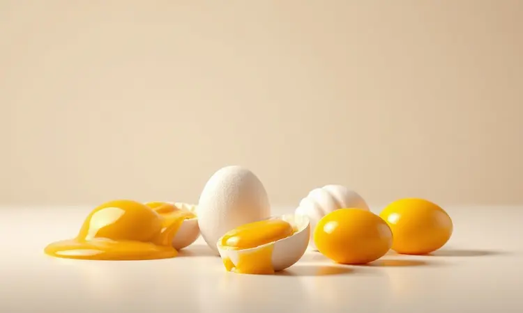
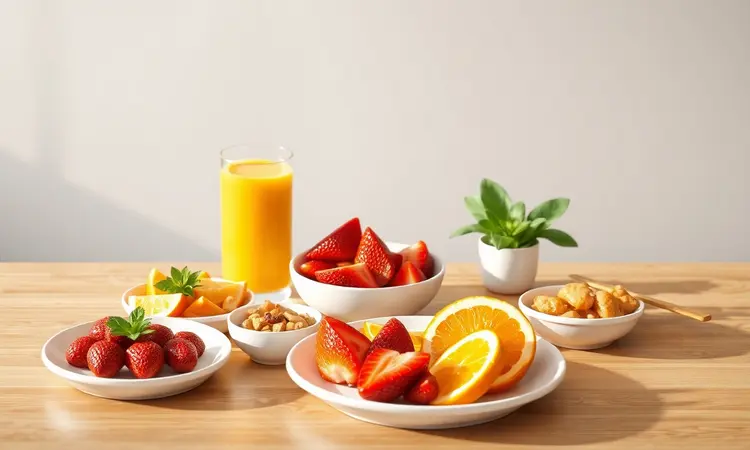

Já acordou com aquela vontade de um café da manhã de hotel, mas desistiu só de imaginar a frigideira suja e o óleo espalhado pelo fogão? O pão de forma com ovo na airfryer é a solução que transforma sonhos matinais em realidade sem complicação.

Em menos de dez minutos, você tem um pão dourado e crocante abraçando um ovo exatamente no ponto que você gosta. Vou te mostrar não só como dominar essa receita, mas como criar variações que vão fazer você se perguntar por que não descobriu isso antes.

<SummaryList products={frontmatter.top_products} />

## Por que o pão com ovo na Airfryer é o café da manhã definitivo?

Imagine acordar, colocar tudo em um único aparelho, tomar seu café e, quando voltar, encontrar seu café da manhã perfeito pronto.

É isso que a airfryer oferece: crocância que satisfaz sem necessitar de óleo excessivo, deixando seu pão dourado por fora enquanto o ovo cozinha exatamente como você prefere.

A praticidade vai além do tempo - é sobre abrir a gaveta da airfryer e encontrar uma cozinha limpa, sem panelas espalhadas, sem cheiro de fritura impregnado. Para dias corridos ou manhãs preguiçosas, essa combinação transforma obrigação em prazer.

## Receita de Pão de Forma com Ovo na Airfryer: Passo a Passo

Com poucos movimentos, você prepara uma refeição que parece ter saído de um café boutique. Corte o pão em fatias generosas, faça um círculo no centro, adicione o ovo com cuidado, tempere a gosto e deixe a mágica acontecer por 8 a 10 minutos. A simplicidade é o segredo.

### Ingredientes necessários

Tudo começa com o básico bem escolhido: fatias de pão de forma (integral para quem busca mais fibras, branco para quem quer extra crocância), ovos frescos e seus temperos favoritos.

Para elevar o sabor, tenha à mão sal, pimenta-do-reino moída na hora e, se quiser impressionar, um queijo de qualidade ou ervas frescas como cebolinha. Um fio de azeite extravirgem completa, mas opcional - a airfryer já garante a textura perfeita.

### Modo de Preparo: O segredo para o ovo não vazar

Aqui está o truque que transforma tentativa em sucesso: faça uma abertura no centro do pão usando um cortador de biscoitos redondo ou uma faca afiada, mas não retire completamente o círculo. Pressione levemente as bordas para criar uma espécie de ninho.

Quebre o ovo diretamente nesse espaço, garantindo que toda a clara esteja contida. Se quiser prevenir qualquer extravasamento, espalhe uma camada fina de manteiga amolecida nas bordas antes de colocar o ovo.

Pré-aqueça sua airfryer por dois minutos, coloque o pão na cesta e observe a transformação.

## Guia de Tempo e Temperatura: Acerte o ponto da gema

A beleza desse método está no controle: a 160°C por 8 a 10 minutos, você tem a receita clássica. Mas o verdadeiro domínio vem quando você personaliza essa combinação para seu paladar exato.

### Gema Mole (Estilo 'Ovo Mollet')

Para quem ama encontrar aquela gema que escorre ao primeiro garfada, perfeita para misturar com o pão: 120°C por 10 minutos. A clara fica firme enquanto a gema mantém sua cremosidade característica.

Dica de mestre: retire o pão um minuto antes do tempo final e deixe descansar na cesta ainda quente - o calor residual termina o cozimento sem endurecer a gema.

### Gema Cremosa

O ponto ideal para quem quer consistência sem perder o sabor: 150°C por 9 minutos. Assim você garante uma gema que mantém seu centro macio mas já cozida o suficiente para não escorrer incontrolavelmente.

É o equilíbrio perfeito entre textura e sabor, especialmente quando combinado com um pão levemente tostado nas bordas.

### Gema Totalmente Cozida

Quando a preferência é por uma gema firme e uniforme: 180°C por 8 a 10 minutos. Se notar que o pão está dourando muito rápido, cubra levemente com um pedaço de papel alumínio nos últimos minutos.

O resultado é um lanche onde cada mordida oferece crocância e sabor consistentes, perfeito para quem gosta de previsibilidade no prato.

## 3 Variações Incríveis para Turbinar seu Lanche

Depois de dominar o básico, o mundo de possibilidades se abre. Essas três variações mostram como ingredientes simples podem criar experiências completamente diferentes.

### 1. Versão Fit: Pão integral, clara de ovo e especiarias

Para quem acorda pensando em nutrição sem abrir mão do prazer: substitua o ovo inteiro pelas claras e escolha pão integral. As claras oferecem proteína magra enquanto o pão integral traz fibras que mantêm a saciedade.

Um toque de orégano, pimenta calabresa em flocos e uma pitada de alho em pó transformam o simples em sofisticado. Acorde com a sensação de estar cuidando do corpo enquanto saboreia algo genuinamente gostoso.

### 2. Estilo Croque Madame: Com queijo, presunto e orégano

Imagine um domingo de manhã com tempo para brunch em casa: sobre uma fatia de pão, uma camada de presunto de qualidade, queijo ementhal ou gruyère derretendo, e orégano fresco. Cubra com outra fatia e leve à airfryer. O toque final?

Um ovo frito por cima depois de pronto, cuja gema se torna molho natural. É celebração em forma de comida, sem precisar de habilidades culinárias especiais.

### 3. Opção Gourmet: Bacon crocante e queijo parmesão

<ProductBox 
  title={frontmatter.top_products[0].title} 
  image={frontmatter.top_products[0].image} 
  link={frontmatter.top_products[0].link} 
/>

Para dias que pedem indulgência consciente: prepare tiras de bacon na airfryer primeiro (200°C por 8-10 minutos até ficarem crocantes). Enquanto isso, prepare seu pão com uma base de molho de tomate caseiro ou até pesto.

Adicione o bacon pronto e uma generosa quantidade de parmesão ralado na hora. O contraste entre a gordura saborosa do bacon e o salgado intenso do queijo cria uma experiência que parece de restaurante, com a vantagem de comer de pijama.

## Dicas de Especialista para o Resultado Perfeito

A diferença entre bom e memorável está nos detalhes: pré-aqueça sua airfryer por 3 minutos - esse passo simples garante que o pão comece a dourar imediatamente, criando uma barreira crocante que segura o ovo.

Escolha fatias de pão com boa estrutura, nem muito finas (arriscam quebrar) nem muito grossas (demoram para dourar por dentro). Para evitar que grude, um borrifada de óleo na cesta ou o uso de papel manteiga perfurado faz milagres.

E o toque final: tempere o ovo depois de colocado no pão, não antes - assim os temperos não escorrem com a clara ainda líquida.

## Melhores Acessórios para facilitar sua receita na Airfryer

<ProductBox 
  title={frontmatter.top_products[1].title} 
  image={frontmatter.top_products[1].image} 
  link={frontmatter.top_products[1].link} 
/>

Alguns itens transformam a experiência de cozinhar na airfryer de funcional para prazerosa. Formas de silicone individuais são ideais para preparar vários pães com ovo ao mesmo tempo sem se grudarem.

Grelhas empilháveis permitem que você prepare o bacon crocante da variação gourmet enquanto o pão com ovo principal cozinha na grelha de baixo. Um borrifador de óleo de boa qualidade ajuda a aplicar a quantidade mínima necessária com controle preciso.

Esses investimentos pequenos retornam em conveniência diária e resultados consistentemente melhores.

## Melhores modelos de Airfryer para receitas rápidas

<ProductBox 
  title={frontmatter.top_products[2].title} 
  image={frontmatter.top_products[2].image} 
  link={frontmatter.top_products[2].link} 
/>

Se está pensando em adquirir ou atualizar seu equipamento, considere modelos que combinem capacidade com inteligência. O Ninja Foodi DZ401 com suas duas cestas independentes permite preparar ovo e acompanhamentos simultaneamente.

O Cosori Pro II impressiona com doze funções pré-programadas incluindo específicas para ovos. Para quem valoriza simplicidade, o Chefman TurboFry oferece operação intuitiva com resultados profissionais.

A escolha certa depende do seu espaço e rotina, mas qualquer um desses transformará suas manhãs.

## O que servir como acompanhamento? (Sugestão de Cardápio)

Seu pão com ovo pode ser tanto protagonista quanto parte de um ensemble. Para uma refeição leve, acompanhe com fatias de abacate temperadas com sal grosso e limão siciliano.

Se busca algo mais substancial, uma pequena salada de folhas verdes com tomates cereja e vinagrete balsâmico cria contraste perfeito.

Nos fins de semana, transforme em brunch completo com uma seleção de frutas da estação e um suco fresco de laranja ou abacaxi com hortelã. Cada combinação adiciona uma camada de frescor que complementa a riqueza do prato principal.

## Perguntas Frequentes (FAQ)

### Posso usar pão de sal em vez de pão de forma?

Absolutamente. O pão de sal traz uma crocância diferente e sabor mais pronunciado. Como é mais firme, recomendo umedecer levemente as bordas antes de fazer o buraco central para não ressecar demais durante o cozimento. O resultado é uma versão mais rústica e autêntica.

### Precisa preaquecer a Airfryer?

Não é obrigatório, mas faz diferença perceptível. Dois a três minutos de pré-aquecimento garantem que o pão comece a dourar imediatamente, criando uma crosta que ajuda a conter o ovo.

Se estiver com muita pressa, pode pular esta etapa e adicionar um minuto ao tempo total de cozimento.

## Conclusão

O pão de forma com ovo na airfryer é mais que uma receita rápida - é uma pequena revolução nas manhãs corridas.

Transforma o caos matinal em um momento de tranquilidade onde você coloca ingredientes simples em um aparelho e, minutos depois, encontra uma refeição completa que parece cuidadosamente preparada.

Vai além da praticidade: oferece a satisfação de comer algo quente e fresco sem o trabalho de limpar panelas, sem o cheiro de fritura que impregna a cozinha, sem a ansiedade de monitorar fogão.

Desde a versão básica até as variações gourmet, cada preparo é uma oportunidade de começar o dia com um pequeno prazer conquistado com facilidade. Experimente na próxima manhã e descubra como dez minutos podem transformar completamente sua relação com o café da manhã.