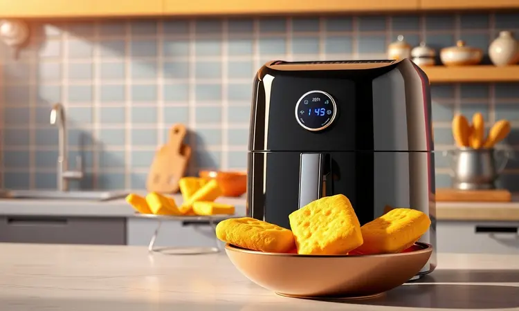
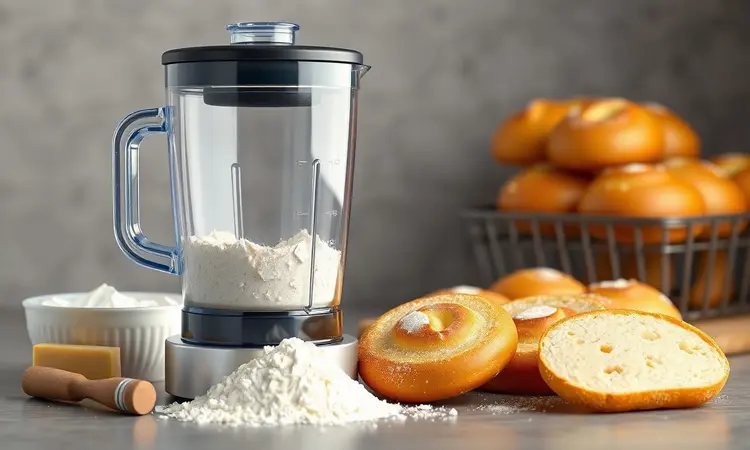
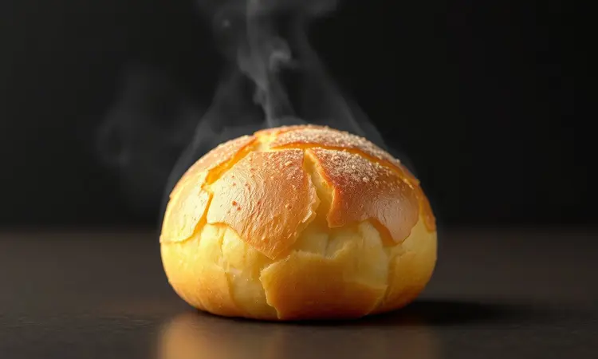
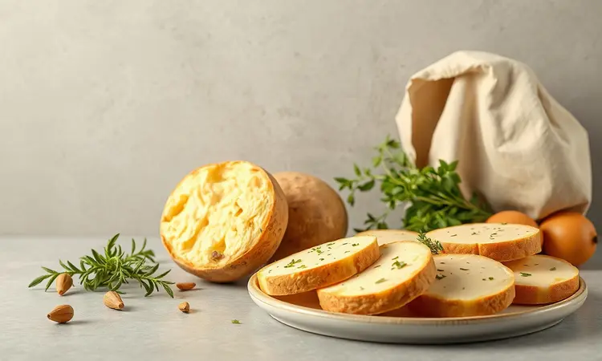

Imagine acordar com aquela vontade irresistível de pão de queijo, mas o forno tradicional parece um obstáculo monumental na sua rotina acelerada. Você não precisa abrir mão do sabor e da crocância que fazem esse lanche tão especial.

A airfryer transforma essa experiência, entregando resultados dignos das melhores padarias mineiras em minutos, sem a espera pelo pré-aquecimento ou a sujeira do óleo.

Neste guia, vou te mostrar como transformar sua fritadeira elétrica na ferramenta perfeita para criar pão de queijo em todas suas variações.

Desde a receita tradicional que homenageia Minas Gerais até versões práticas de liquidificador e inclusive opções para dietas restritivas, você vai dominar o tempo exato e evitar os erros que podem comprometer seu lanche.

<SummaryList products={frontmatter.top_products} />

## Por que Preparar Pão de Queijo na Airfryer é a Melhor Escolha?

Quando você pensa em pão de queijo perfeito, duas palavras surgem: crocância externa e maciez interna. A airfryer oferece esse equilíbrio sensorial como poucos métodos conseguem.

A circulação intensa de ar quente cria uma camada externa dourada e crisp, enquanto mantém a humidade interna que garante aquela textura macia e elástica que você adora.

A praticidade vai além do tempo reduzido. Você elimina a ansiedade de monitorar o forno, a sujeira do óleo e a limpeza pesada. Cada bolinha sai perfeita, sem necessidade de virar ou ajustar posições.

Para quem vive na corrida entre trabalho, família e compromissos, essa simplicidade transforma um desejo complexo em uma realidade imediata.

## Receita de Pão de Queijo Tradicional na Airfryer (Crocante e Macio)

Se a tradição mineira é sua paixão, essa receita preserva cada detalhe enquanto aproveita a tecnologia moderna. Você precisa de 250g de polvilho doce, 100ml de leite, 50ml de óleo, um ovo, 150g de queijo minas ou parmesão ralado e sal a gosto.

Comece aquecendo leite e óleo até o ponto de fervura. Em uma tigela, misture polvilho e sal antes de adicionar a combinação líquida quente. Essa etapa inicial é crucial para ativar o polvilho.

Depois, incorpore o ovo e o queijo até formar uma massa homogênea que permite modelar bolinhas com as mãos.

Na airfryer pré-aquecida a 180°C, distribua as bolinhas garantindo espaço entre elas para circulação adequada. Em aproximadamente 15 minutos, você terá pães de queijo com aquela crocância dourada que se abre para uma maciez interna irresistível.

A combinação perfeita para qualquer momento do dia.

## Pão de Queijo de Liquidificador: A Versão Prática para o Dia a Dia

Quando o tempo é seu maior desafio, o liquidificador oferece uma solução que mantém o sabor enquanto elimina etapas. Reúna polvilho, queijo, ovos e leite diretamente no aparelho. A mistura rápida cria uma massa homogênea e leve, perfeita para moldar sem complicações.

Essa versão reduz drasticamente a sujeira e os utensílios necessários. Você passa da vontade ao lanche pronto em um fluxo quase automático. A airfryer completa o processo entregando a mesma crocância externa e maciez interna que caracterizam o pão de queijo perfeito.

A flexibilidade é outro benefício. Você pode experimentar diferentes tipos de queijo, adaptar quantidades e criar variações pessoais sem medo de errar. Para dias corridos onde cada minuto conta, essa praticidade transforma um desejo em realidade sem stress.

## Receita Express: Pão de Queijo com Apenas 3 Ingredientes

Às vezes a vontade bate forte e você precisa de uma resposta imediata. Essa versão minimalista funciona com apenas três componentes: polvilho azedo, queijo ralado e um ovo. A simplicidade não compromete o resultado.

Misture os ingredientes até formar uma massa consistente. Modele pequenas bolinhas que ocupam harmoniosamente a cesta da airfryer.

A temperatura de 180°C por 10 a 15 minutos transforma essa combinação básica em pãezinhos que mantêm a crocância externa e a maciez interna essencial.

Para momentos onde a praticidade é prioridade máxima, essa receita elimina qualquer barreira. Você satisfaz seu desejo sem preparativos complexos ou tempo de espera extenso.

## Como Assar Pão de Queijo Congelado na Airfryer: Tempo e Temperatura Ideal

O congelado é a solução para quem quer planejar sem perder qualidade. Pré-aqueça sua airfryer a 200°C por aproximadamente 5 minutos. Essa etapa inicial garante que o calor penetre uniformemente desde o primeiro momento.

Distribua os pães de queijo congelados na cesta, mantendo espaço entre eles. A circulação do ar é fundamental para evitar pontos crus ou desigualdade no dourado. O tempo ideal varia entre 10 e 15 minutos dependendo do tamanho das bolinhas.

Na metade do processo, vire os pães para garantir que cada lado receba calor direto. O resultado será uma crocância uniforme que preserva a maciez interna mesmo partindo do estado congelado. Planejar se torna simples quando você sabe que pode ter qualidade instantânea.

## Dicas de Ouro para o Pão de Queijo Não Murchar

A frustração de ver seu pão de queijo perder volume após sair da airfryer tem solução. Aerar a massa começa misturando ingredientes secos antes de adicionar líquidos. Essa técnica incorpora ar que expande durante o cozimento.

Resistir à curiosidade de abrir a airfryer durante o processo é crucial. A variação brusca de temperatura compromete a expansão interna. Depois de pronto, permita que os pães esfriem em uma grade antes de armazenar.

O contato direto com superfícies pode criar humidade que reduz a crocância.

Esses detalhes simples garantem que cada bolinha mantenha seu volume e textura perfeita, desde o primeiro até o último momento de consumo.

## Variações Inclusivas: Pão de Queijo Vegano e Zero Lactose na Airfryer

Restrições dietárias não devem limitar experiências gastronômicas. Para versão vegana, substitua o queijo tradicional por alternativas veganas ou experimente purê de batata doce que oferece textura interessante.

Leites vegetais como amêndoas ou soja mantêm a humidade necessária.

A versão zero lactose utiliza queijos especiais disponíveis no mercado sem comprometer sabor. Ambas opções funcionam com polvilho azedo e doce, preservando aquela característica crocante externa e macia interna que define o pão de queijo.

Inclusão significa todos podem participar da mesma experiência sensorial, adaptando ingredientes sem perder qualidade emocional.

## Melhores Modelos de Airfryer para Receitas de Padaria

<ProductBox 
  title={frontmatter.top_products[0].title} 
  image={frontmatter.top_products[0].image} 
  link={frontmatter.top_products[0].link} 
/>

Selecionar o modelo ideal amplia seus resultados. O Philco Air Fry Oven PFR2200 4 em 1 com 1800W e capacidade de 12L funciona também como forno tradicional. Sua versatilidade e painel digital facilitam controle preciso para receitas específicas.

Para necessidades de espaço maior, o Britânia BFR22PG 6L oferece capacidade ampliada, mesmo requerendo ajustes no tempo devido ao tamanho do cesto.

Em formato compacto, o Cadence Pratic Fryer FRT515 com 3L satisfaz solteiros ou casais com desempenho consistente em porções menores.

Modelos da Philips como o Walita Viva Ri9217 destacam-se em eficiência e design, embora com faixa de preço superior. Cada escolha deve considerar sua rotina, espaço disponível e frequência de uso para maximizar benefícios.

## Acessórios que Facilitam o Preparo na Fritadeira Sem Óleo

<ProductBox 
  title={frontmatter.top_products[1].title} 
  image={frontmatter.top_products[1].image} 
  link={frontmatter.top_products[1].link} 
/>

Acessórios transformam sua airfryer em centro multifuncional. Formas e assadeiras em silicone ou metal permitem preparar bolos e tortas sem transferir para outros utensílios.

Grelhas e espetos asseguram que carnes e legumes recebem calor uniforme, mantendo suculência interna.

Separadores de alimentos são ideais para cozinhar múltiplos pratos simultaneamente sem misturar aromas ou humidades. A compatibilidade com seu modelo específico deve ser verificada, mas a versatilidade oferecida geralmente compensa essa verificação preliminar.

## Erros Comuns: Por que meu Pão de Queijo ficou Duro ou Cru?

Resultados imperfeitos geralmente têm causas identificáveis. Massa excessivamente seca cria textura dura porque falta humidade para expansão adequada. Cozimento insuficiente deixa o centro cru enquanto a parte externa parece completa.

Temperaturas muito elevadas douram rápido a superfície sem permitir que calor penetre no interior. O equilíbrio entre ingredientes, tempo e temperatura é a chave para crocância externa e maciez interna consistentes.

Pequenos ajustes podem transformar frustração em satisfação garantida.

## Perguntas Frequentes sobre Pão de Queijo na Airfryer (FAQ)

A temperatura ideal começa em 180°C pré-aquecida para garantir penetração uniforme do calor. O tempo varia entre 10 e 15 minutos dependendo do tamanho e quantidade.

Congelar a massa é possível moldando bolinhas antes de levar ao freezer. Na hora de assar, utilize diretamente do estado congelado sem descongelamento prévio para preservar textura. Essa técnica oferece planejamento sem perder qualidade momentânea.

## Conclusão

A airfryer transforma o pão de queijo de uma receita complexa em uma experiência simples e satisfatória. Você elimina a ansiedade do pré-aquecimento, a sujeira do óleo e a incerteza sobre resultados.

Cada bolinha sai com aquela crocância dourada que se abre para maciez interna perfeita, independente da receita escolhida.

Desde a tradição mineira até versões práticas de liquidificador ou inclusive opções para dietas restritivas, a tecnologia moderna preserva qualidade emocional enquanto amplia possibilidades.

Erros comuns têm soluções simples quando você compreende o equilíbrio entre ingredientes, tempo e temperatura.

Experimente começando pela receita que melhor se adapta à sua rotina. A satisfação de abrir sua airfryer e encontrar pães de queijo perfeitos em minutos redefine como você enxerga lanches rápidos.

Transforme vontade em realidade sem barreiras técnicas ou tempo excessivo.