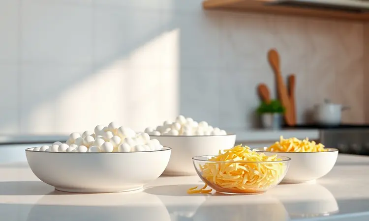
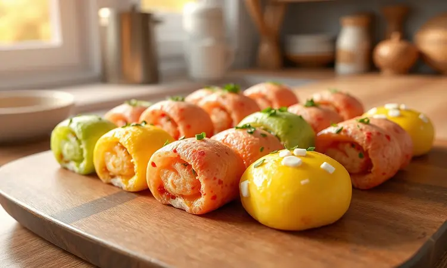
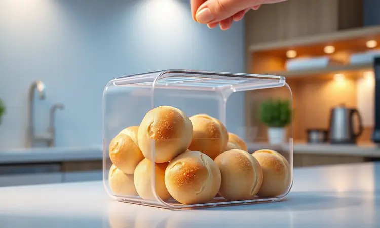

Imagine sair da cama e, em menos de 15 minutos, ter na sua mesa um pãezinho quentinho, crocante por fora e maciço por dentro, que não exige talento de confeiteiro nem horas de espera.

É exatamente essa magia que o pão de tapioca na airfryer entrega: a praticidade de um sanduíche com o sabor caseiro que lembra infância. E o melhor? Você pode adaptá-lo do jeitinho que seu paladar pedir, seja doce ou salgado, simples ou recheado.

<SummaryList products={frontmatter.top_products} />

## Por que o pão de tapioca na airfryer é o lanche perfeito?

O encanto começa pela ausência de glúten, que abre as portas para quem busca ou precisa de alternativas mais leves. Mas não se engane: isso não significa abrir mão do sabor ou da textura.

A airfryer trabalha seu feitiço criando uma camada exterior crocante que protege um interior incrivelmente macio, quase como um pão de queijo sem a gordura extra.

É aquele equilíbrio que satisfaz sem pesar, perfeito para aquela fome da tarde ou para começar o dia com energia.

## Ingredientes básicos para a massa perfeita

Tudo começa com apenas 3 amigos na cozinha: tapioca hidratada, uma pitada de sal e seus temperos favoritos. A beleza está na simplicidade.

A goma certa deve estar naquele ponto que os especialistas chamam de "ponto de modelagem": nem tão seca que esfarele, nem tão úmida que grude. É aqui que você pode começar a brincar. Queijo ralado? Ele não só dá sabor como ajuda naquela crocância irresistível.

Ervas finas? Trazem um aroma que invade a cozinha. Pimenta-do-reino? Acorda todos os sentidos. Esta é sua tela em branco.

## Passo a passo: Como fazer pão de tapioca na airfryer

Transformar esses poucos ingredientes em maravilha é mais simples do que parece. Misture a tapioca com água até alcançar aquele ponto maleável que mencionamos, adicione seus temperos, modele no formato que mais te agrada e entregue à airfryer pré-aquecida.

Em cerca de 10 minutos a 180°C, você testemunhará a transformação de massa branca em pão dourado. E sim, o cheiro será sua melhor recompensa.

### Preparando a massa e o ponto ideal

Pense na massa como uma argila que precisa de carinho. Ao misturar a tapioca com água, você não está apenas combinando ingredientes, está desenvolvendo a textura que definirá tudo. O segredo está na paciência: deixe ela descansar por alguns minutos após a mistura.

Este tempo permite que a goma absorva completamente a umidade, criando aquela consistência que desliza entre os dedos sem grudar. Quando atingir este ponto, é sinal de que está pronta para ser moldada na forma que seu coração mandar.

### Tempo e temperatura: O segredo da crocância

Aqui mora a ciência por trás da arte. Uma airfryer pré-aquecida a 200°C por 5 minutos cria o ambiente perfeito para que a crosta se forme rapidamente, selando a umidade interna. Depois, reduza para 180°C e deixe por 10 a 12 minutos, virando na metade do tempo.

Esta dança entre calor e tempo é o que transforma uma massa comum naquele pão que estala ao primeiro mordida. Se sua airfryer for daquelas mais potentes, fique de olho a partir do 8º minuto. Cada aparelho tem sua personalidade, e conhecer a sua é parte da diversão.

## Acessórios úteis para facilitar o preparo

<ProductBox 
  title={frontmatter.top_products[1].title} 
  image={frontmatter.top_products[1].image} 
  link={frontmatter.top_products[1].link} 
/>

Invista em formas de silicone. Elas não só garantem que seu pão saia inteiro como tornam a limpeza tão fácil que você quase não percebe que cozinhou. Forros descartáveis são outro aliado secreto para dias com ainda menos tempo.

E um borrifador de óleo, mesmo que você use apenas uma pitada, ajuda a distribuir uniformemente aquela fina camada que faz toda diferença no dourado final. Apenas confirme se seus acessórios se encaixam no cesto do seu modelo específico.

## Dicas de especialista para o pãozinho não ficar duro

A qualidade da goma define o jogo. Opte por uma mais fininha e de marca confiável. Após moldar seus pãezinhos, dê a eles mais 5 minutos de descanso antes de ir para o calor. Este passo parece pequeno, mas é ele que ativa completamente a umidade dentro da massa.

Na hora de assar, prefira temperaturas moderadas (180°C) por um pouco mais de tempo, em vez de altas temperaturas rápidas que podem secar o interior. E o truque final: depois de pronto, guarde em um recipiente fechado enquanto ainda morno.

O vapor que fica preso mantém a maciez por horas.

## Variações deliciosas: Pão de tapioca com queijo, ervas e recheios

Aqui é onde a brincadeira realmente começa. Queijo muçarela derretendo no centro? Uma explosão de sabor a cada mordida. Ervas frescas como alecrim ou manjericão misturadas na massa? Aroma que convida todos para a cozinha.

Para os mais ousados, experimente recheios de frango desfiado ou até mesmo uma versão doce com gotas de chocolate. Esta versatilidade significa que você pode ter um pão diferente para cada humor, cada dia, cada ocasião.

## Como congelar e reaquecer para manter o sabor

A vida corrida pede planejamento. Após seu pão esfriar completamente (paciência é fundamental aqui), embale individualmente em papel filme, pressionando para remover todo o ar. No freezer, ele se mantém perfeito por semanas.

Para reviver aquela experiência do primeiro dia, descongele na geladeira durante algumas horas ou use a função de descongelamento do micro-ondas por minutos. Então, entregue à airfryer por 5 a 7 minutos a 180°C.

A crocância retorna, o interior mantém sua maciez, e você tem a impressão de tê-lo feito naquele exato momento.

## Perguntas Frequentes sobre Pão de Tapioca (FAQ)

"Mas ele realmente não tem glúten?" Sim, a tapioca é naturalmente livre de glúten, tornando-se uma opção segura e saborosa para quem tem restrições. "Posso congelar sem perder qualidade?" Absolutamente, seguindo o método que descrevemos, você preserva textura e sabor.

"É nutritivo?" Como fonte de carboidratos de fácil digestão, é ideal para repor energia antes do exercício ou para um lanche que não vai pesar.

"Funciona com qualquer airfryer?" Desde os modelos mais básicos até os conectados mais modernos, todos são capazes desta mágica.

## Conclusão

O pão de tapioca na airfryer representa muito mais do que uma simples receita. Ele é a prova de que alimentação saudável pode ser prática, saborosa e adaptável à sua rotina.

Em menos tempo do que você gasta decidindo o que pedir no delivery, tem nas mãos um lanche caseiro, sem glúten e totalmente personalizável.

Cada pãozinho dourado que sai da sua airfryer carrega não apenas nutrientes, mas também a satisfação de ter criado algo com suas próprias mãos. Comece com a receita básica, experimente as variações, descubra seu ponto preferido.

Em breve, você não vai imaginar sua rotina sem este aliado dourado. Que tal começar agora mesmo?