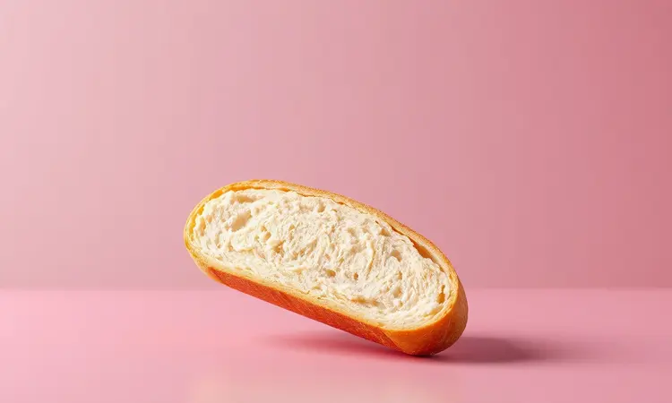
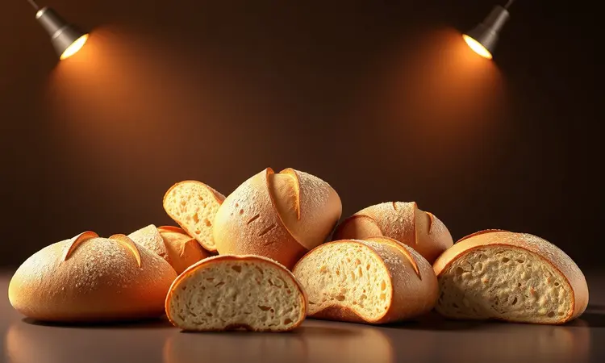

Você adora aquela sensação de pão fresco e crocante, mas fica frustrado quando o forno tradicional parece uma corrida contra o tempo? Não está sozinho.

A busca por praticidade na cozinha vai além de receitas rápidas: é sobre transformar momentos simples em experiências memoráveis. Prometemos que sua Air Fryer será a melhor companhia para pães frescos, recheados e até para ressuscitar aquela baguette dormida.

Este guia vai levar você da receita clássica do pão francês ao truque que devolve a crocância perdida em minutos. Prepare-se para um café da manhã que não apenas alimenta, mas também encanta.

<SummaryList products={frontmatter.top_products} />

## Por que Fazer Pão na Air Fryer é uma Escolha Inteligente?

Imagine sair de casa com o aroma de pão fresco ainda no ambiente, sem aquele processo longo de pré-aquecer o forno. A Air Fryer oferece essa praticidade que transforma rotinas. Mas ela vai além do tempo: é sobre textura.

Você sente o crocante perfeito na casca enquanto o interior mantém aquela maciez fofinha que tanto buscamos em um bom pão. Essa combinação cria resultados que parecem de padaria especializada.

E a versatilidadade? É onde sua criatividade encontra espaço. Você pode explorar desde o básico até elaborações gourmet, adaptando cada detalhe às suas preferências sem complicação.

Tudo isso culmina na facilidade de limpeza, que transforma o processo em algo agradável, sem aquela sensação de tarefa pesada após o momento de prazer.

Mas para aproveitar essas vantagens, você precisa de um aparelho adequado.

## Melhores Modelos de Air Fryer para Assar Pães e Bolos

<ProductBox 
  title={frontmatter.top_products[0].title} 
  image={frontmatter.top_products[0].image} 
  link={frontmatter.top_products[0].link} 
/>

Se você busca uma Air Fryer que também desempenhe como um forno versátil, alguns modelos se destacam. A Mallory Air Oven Unique 30L impressiona com capacidade de 30 litros e potência de 1800W, permitindo que você prepare múltiplas receitas simultaneamente.

A Oster Forno e Fryer Multifunções 25L combina essa versatilidade com desempenho robusto para diversas preparações.

Para espaços mais compactos, a Electrolux por Rita Lobo 12L Digital oferece funções específicas para bolos, ideal para quem valoriza praticidade sem sacrificar qualidade.

Embora esses modelos exijam pequenas adaptações de tempo e temperatura comparados aos fornos tradicionais, eles entregam resultados que transformam sua experiência na cozinha.

## Como Reviver Pão Francês Dormido na Air Fryer (Truque da Crocância)

Para ressuscitar seu pão francês dormido, basta aquecer sua Air Fryer a 180°C por 3 a 5 minutos. Em minutos, você recupera aquela crocância que parece recém-assada.

### O Segredo da Umidade: O Uso do Spray de Água ou Azeite

<ProductBox 
  title={frontmatter.top_products[1].title} 
  image={frontmatter.top_products[1].image} 
  link={frontmatter.top_products[1].link} 
/>

Manter umidade ideal na Air Fryer pode ser um desafio, mas o spray de azeite é uma solução eficiente. Ele realça sabor e textura, criando uma crocância irresistível. Importante: temperaturas acima de 180°C podem degradar o azeite, então atenção ao equilíbrio.

Por outro lado, água direta no aparelho deve ser evitada. O vapor excessivo pode danificar componentes e comprometer garantias. Portanto, enquanto o azeite é seu aliado, a água permanece fora dessa equação para garantir experiência duradoura.

## Receita de Pão Francês Caseiro na Air Fryer: Casca Crocante e Miolo Macio

Para criar seu pão francês caseiro, misture farinha, água, fermento e sal. Modele as bolinhas, permita crescimento por uma hora e asse na Air Fryer até o dourado perfeito. Resultado: casca que faz barulho ao partir e miolo que parece abraço.

### Utensílios Necessários: Formas e Acessórios Ideais

<ProductBox 
  title={frontmatter.top_products[2].title} 
  image={frontmatter.top_products[2].image} 
  link={frontmatter.top_products[2].link} 
/>

Equipe sua aventura com utensílios que facilitam o processo. Uma forma com bordas altas, especialmente de silicone antiaderente, simplifica limpeza. Papel manteiga ou forros similares evitam que a massa grude, oferecendo proteção adicional.

Espátulas e pinças de silicone protegem o revestimento da Air Fryer enquanto você manusea pães quentes. Medidores garantem precisão nas receitas, e uma balança digital ajuda aqueles que valorizam detalhes.

Um spray borrifador de óleo pode elevar a crocância, mas lembre: criatividade adapta-se aos recursos disponíveis.

### Ingredientes e Modo de Preparo Passo a Passo

Para sua base, você precisa de 500g de farinha de trigo, 300ml de água morna, 10g de sal, 10g de açúcar e 10g de fermento biológico seco. Misture farinha, açúcar e sal em uma tigela. Em outra, dissolva fermento na água morna e adicione à mistura principal.

Sove até homogeneidade, permita crescimento por aproximadamente uma hora.

Modele seu pão e posicione na cesta da Air Fryer por 20 a 25 minutos a 180°C, até o dourado aparecer. Sirva com aquela sensação de conquista que apenas pão feito por você oferece.

## Pão Recheado na Air Fryer: Uma Opção Cremosa para o Lanche

O pão recheado na Air Fryer é uma alternativa que transforma lanches em pequenas celebrações. Com crosta crocante exterior e recheio cremoso interior, ele combina ingredientes como queijos e embutidos para satisfazer paladar diverso.

### 5 Sugestões de Recheios Irresistíveis para Inovar

Inovar no recheio é seu caminho para experiências únicas. Experimente o clássico frango com catupiry, que equilibra suculência e cremosidade. Para um contraste perfeito, pão de queijo com goiabada une salgado e doce em harmonia.

Queijo feta com espinafre traz toque mediterrâneo. Chocolate derretido com morangos ou bananas oferece opção doce que parece sobremesa. Ricota com ervas finas cria lanche leve e saboroso para momentos de tranquilidade. Cada sugestão é um convite para explorar.

## Dicas de Especialista: Temperatura e Tempo Exatos para Não Errar

<ProductBox 
  title={frontmatter.top_products[3].title} 
  image={frontmatter.top_products[3].image} 
  link={frontmatter.top_products[3].link} 
/>

Ao assar pão na Air Fryer, temperatura ideal gira entre 160°C e 180°C, com tempo de 15 a 25 minutos dependendo do tipo e tamanho. Pré-aqueça o aparelho por 3 a 5 minutos antes de inserir o pão: isso garante crosta mais crocante e resultado uniforme.

Temperaturas excessivamente altas podem queimar superfície sem cozinhar interior, portanto equilíbrio é essencial. Não sobrecarregue a cesta: espaço permite circulação adequada de ar quente. Para pães integrais, considere aumentar tempo até 25 minutos.

Papel alumínio durante parte do cozimento protege dourado excessivo antes do interior estar pronto. Essas orientações são seu mapa para resultados consistentes.

## Erros Comuns que Deixam o Pão Duro ou Cru na Fritadeira

Fazer pão na Air Fryer é experiência gratificante, mas alguns erros podem comprometer resultados. Permitir crescimento insuficiente da massa antes de assar resulta em pão denso e mal cozido. Temperatura muito alta cria crosta queimada com interior ainda cru.

Excesso de farinha transforma massa em textura seca e dura. Seguir receitas com atenção e ajustar tempos conforme seu aparelho são passos que garantem sucesso.

## Perguntas Frequentes (FAQ) sobre Pães na Air Fryer

Fazer pão na Air Fryer gera curiosidades naturais. Sim, você pode assar diversos tipos, incluindo baguetes e pães de forma. Tempo e temperatura variam, mas geralmente 160ºC a 180ºC por 15 a 25 minutos funciona bem.

O pão sai tão crocante quanto no forno convencional? Pode ficar bastante crocante, dependendo da receita e pré-aquecimento adequado. Verifique sempre se o pão está completamente assado antes de retirar.

## Conclusão

Fazer pão na Air Fryer não é apenas técnica, é transformação de hábitos. Cada etapa, desde selecionar seu aparelho até explorar recheios criativos, representa oportunidade de criar momentos especiais na sua rotina.

Você economiza tempo, descomplica processos e ainda conquista texturas que parecem profissionais.

Esse guia é seu companheiro para explorar potencial completo dessa ferramenta. Comece com o pão francês revivido, experimente o caseiro e evolua para recheados que surpreendem.

Com atenção aos detalhes de temperatura e evitando erros comuns, sua Air Fryer se torna não apenas utilitário, mas parceira criativa na cozinha. Transforme seu próximo café da manhã em celebração que começa com aroma de pão fresco e termina com satisfação genuína.

O próximo passo é sua aventura pessoal: escolha uma receita, experimente e descubra como praticidade pode ser deliciosa.